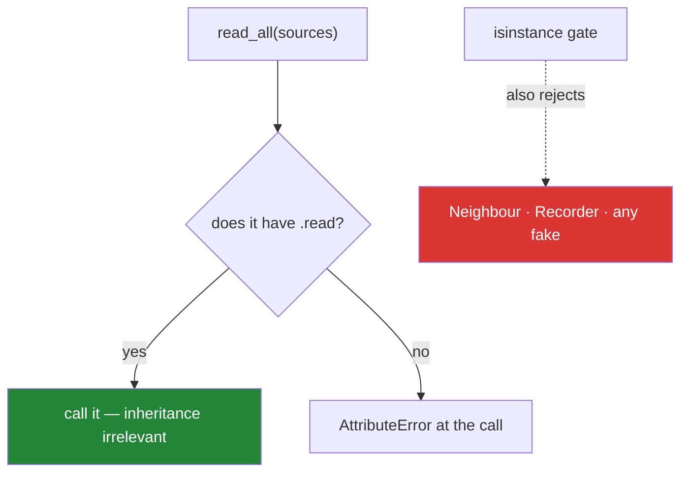

# 2.2 — Duck typing, and the `isinstance` check you did not need

## One-line answer

Python calls the method the object actually has, so anything with a `read` works whether or not it
inherits from your base class — which makes a test double a five-line class and makes most
`isinstance` checks a way of refusing objects that would have worked.

---

## The story

The person at the counter who reads recipes out has never asked anybody for identification.

They do not check whether you are on a list of approved recipe-senders. They do not ask which of the
three kinds you are. Somebody hands them something and says *"read me the recipe"*, and they either
can or they cannot.

When a neighbour who has never sent a recipe before turns up with a hand-written card, it works
immediately. Nobody had to add the neighbour to anything first.

```text
Monday    a photo of a page
Wednesday typed into a message
Friday    a link
Saturday  a hand-written card from next door
```

There is a version of this counter that checks first — *"are you one of our three registered
sources?"* — and it would have turned the neighbour away with a perfectly good recipe in their hand.
The check would not have made anything safer. It would only have made the counter narrower.

---

## The idea in plain language

Python does not check types when it calls a method. `source.read()` looks up `read` on whatever
object it was given and calls it. If the object has one, it works. If not, `AttributeError`.

That behaviour has a name: **duck typing** — if it walks like a duck and quacks like a duck, treat it
as a duck. The consequence is that a function taking "a recipe source" accepts anything with the
methods it calls, inheritance or not.

This is why [1.5](../01-inheritance/1.5-composition-over-inheritance.md)'s `CountingNotebook` worked:
it had a `note` method and nothing else about it mattered.

So what is `isinstance` for? Three honest uses, and one bad one.

**Honest 1 — dispatching on genuinely different kinds of input.** A function that accepts either a
`str` path or an open handle has to tell them apart, and there is no method that distinguishes them
usefully.

**Honest 2 — validating at a boundary.** `if not isinstance(title, str): raise TypeError(...)` at a
constructor ([Day 12, 3.2](../../../day-12-classes/parts/03-the-paper-object/3.2-validation-in-init.md)),
so bad data fails at the edge rather than three modules later.

**Honest 3 — asking the interface question rather than the class question.** `isinstance(x, Iterable)`
or `isinstance(x, Loadable)` where `Loadable` is a `Protocol`
([4.3](../04-abstraction/4.3-protocol-versus-abc.md)) asks "can it do this?" rather than "is it one of
mine?".

**The bad one — gating behaviour on a concrete class.** `if isinstance(source, PhotoSource): ...` is
the `elif` chain from [2.1](2.1-one-name-three-behaviours.md) in different clothes, and it refuses
objects that would have worked perfectly.

Two more things worth knowing now, because they change how the checks are written:

- **`isinstance` accepts a tuple**: `isinstance(x, (int, float))` is one call, not two, and it is the
  readable way to allow several types.
- **Never use `type(x) == SomeClass`.** That is `isinstance` with subclasses excluded, so it rejects
  a perfectly good subclass and breaks the substitution that inheritance exists for.

The trade-off duck typing makes is real and worth stating: the error moves from the call site to the
first missing method, and it happens at run time. That is the price, and the two things that buy it
back are a test suite and — from Day 19 — a type checker.

---

## Why Setu needs it

- **Every test in this project builds a fake instead of mocking.** A five-line class with the one
  method under test is possible only because nothing checks its ancestry — and Principle 5 means every
  test runs offline, so fakes are not optional.
- **[4.3](../04-abstraction/4.3-protocol-versus-abc.md) is duck typing with a name.** A `Protocol`
  writes down "anything with a `load` returning a list of `Paper`" so a type checker can verify it,
  without requiring inheritance.
- **Day 11's `iter_titles` takes a handle, not a path**
  ([Day 11, 4.2](../../../day-11-iterators-and-generators/parts/04-the-gate/4.2-the-streaming-reader.md)),
  and it is tested with `io.StringIO` — which is not a file, and works, because nothing asked.
- **Day 172's LangChain composes objects from several libraries.** Those objects do not share a base
  class; they share a shape, and that is the only reason the composition works at all.

---

## The mechanism

Anything with the method works:

```python
"""Three classes. One inherits, one does not, one is four lines long."""


class RecipeSource:
    def read(self):
        raise NotImplementedError


class PhotoSource(RecipeSource):
    def read(self):
        return ["flour", "water"]


class Neighbour:
    """Not a RecipeSource. Has a read. That is enough."""

    def read(self):
        return ["flour", "olive oil"]


class Recorder:
    """A test double: records that it was asked, returns nothing."""

    def __init__(self):
        self.calls = 0

    def read(self):
        self.calls += 1
        return []


def read_all(sources):
    """Take anything with a read(). Nothing here asks what class it is."""
    return [item for source in sources for item in source.read()]


recorder = Recorder()
print("ingredients:", read_all([PhotoSource(), Neighbour(), recorder]))
print("recorder was asked:", recorder.calls, "time(s)")
print()
print("is Neighbour a RecipeSource?", isinstance(Neighbour(), RecipeSource))
```

Run on Python 3.12.12 on 2026-09-01:

```
ingredients: ['flour', 'water', 'flour', 'olive oil']
recorder was asked: 1 time(s)

is Neighbour a RecipeSource? False
```

**Line by line:**

- `class Neighbour:` — **no base class at all**, and it goes through `read_all` with the others. That
  single fact is duck typing.
- `class Recorder:` — a test double in five lines, with no mocking library and no patching. This is
  the shape every fake in this project takes.
- `def read_all(sources):` — the parameter is named for what it needs, and **nothing in the body
  asks what anything is.** It calls `read` and uses what comes back.
- `[item for source in sources for item in source.read()]` — the flattening comprehension
  ([Day 9, 1.4](../../../day-09-comprehensions/parts/01-list-comprehensions/1.4-nested-comprehensions.md)).
  `Recorder` returns `[]`, which contributes nothing and raises nothing — the empty-list rule from
  [1.4](../01-inheritance/1.4-overriding-and-the-broken-promise.md) paying off.
- `isinstance(Neighbour(), RecipeSource)` is `False`, and the `Neighbour` worked anyway. **An
  `isinstance` gate in `read_all` would have rejected an object that did the job.**

The check that refuses good objects:

```python
"""The same function with a gate, and what it costs."""


class RecipeSource:
    def read(self):
        raise NotImplementedError


class PhotoSource(RecipeSource):
    def read(self):
        return ["flour", "water"]


class Neighbour:
    def read(self):
        return ["flour", "olive oil"]


def read_all_strict(sources):
    """Refuses anything that is not a RecipeSource."""
    out = []
    for source in sources:
        if not isinstance(source, RecipeSource):
            raise TypeError(f"not a RecipeSource: {type(source).__name__}")
        out.extend(source.read())
    return out


def read_all_open(sources):
    """Takes anything with a read()."""
    return [item for source in sources for item in source.read()]


print("open  :", read_all_open([PhotoSource(), Neighbour()]))
try:
    print("strict:", read_all_strict([PhotoSource(), Neighbour()]))
except TypeError as error:
    print("strict:", type(error).__name__, error)
```

Run on Python 3.12.12 on 2026-09-01:

```
open  : ['flour', 'water', 'flour', 'olive oil']
strict: TypeError not a RecipeSource: Neighbour
```

**Line by line:**

- `if not isinstance(source, RecipeSource): raise TypeError(...)` — the gate. It is not protecting
  anything: the object it rejects has the method and returns the right shape.
- `read_all_strict` fails **after** processing the first source, so `out` holds half the work and is
  discarded. A gate at the top of the loop over the whole list would at least fail before doing
  anything.
- `read_all_open` handles both with no gate and no error.
- The cost of the gate is not only the neighbour. **It is every test double**, so writing
  `read_all_strict` forces every test to build a real `RecipeSource` subclass or to patch.
- If you genuinely need to reject things, reject them for **not having the method** rather than for
  not having the ancestor — and [4.3](../04-abstraction/4.3-protocol-versus-abc.md) is how you write
  that down so a type checker can see it too.

What a missing method actually looks like:

```python
"""Duck typing's cost: the error arrives at the call, not at the door."""


class NoRead:
    def open(self):
        return "opened"


def read_all(sources):
    return [item for source in sources for item in source.read()]


try:
    read_all([NoRead()])
except AttributeError as error:
    print("AttributeError:", error)

print("checked first:", hasattr(NoRead(), "read"))
```

Run on Python 3.12.12 on 2026-09-01:

```
AttributeError: 'NoRead' object has no attribute 'read'
checked first: False
```

**Line by line:**

- `read_all([NoRead()])` raises `AttributeError` from inside the comprehension. The message names the
  class and the missing method, which is genuinely useful — it is the "not a RecipeSource" error with
  more information in it.
- **The failure is at the moment of use**, not at the moment the object was passed in. On a batch of
  a thousand, some are already processed. That is the real cost of duck typing.
- `hasattr(NoRead(), "read")` — the check you *could* write, and mostly should not: it is one more
  thing to keep in step with what the function actually calls, and it runs the lookup anyway
  ([Day 12, 2.2](../../../day-12-classes/parts/02-attribute-lookup/2.2-setting-attributes-from-outside.md)).
- The professional answer to this cost is not a check; it is a type checker at build time
  (Day 19) plus a test that runs the real function against every implementation
  ([1.4](../01-inheritance/1.4-overriding-and-the-broken-promise.md)).



---

## When it breaks

**`type(x) == Cls`, which rejects a subclass:**

```text
>>> class Base: pass
>>> class Child(Base): pass
>>> c = Child()
>>> type(c) == Base
False
>>> isinstance(c, Base)
True
```

**What it means.** `type(c) == Base` asks "is it exactly this class", so it says no to a perfectly
good subclass and undoes the substitution inheritance exists for. `isinstance` is nearly always what
was meant. The rare case where exactness matters — a serialiser that must not treat a subclass as its
base — deserves a comment saying so, because every reader will assume it is a mistake.

**The method that exists and does something else:**

```text
>>> class Envelope:
...     def read(self):
...         return "letter"
...
>>> def read_all(sources):
...     return [item for source in sources for item in source.read()]
...
>>> read_all([Envelope()])
['l', 'e', 't', 't', 'e', 'r']
```

**What it means.** Duck typing checks the *name*, not the meaning. An `Envelope` has a `read` that
returns a string, the comprehension iterates it character by character, and six single-letter
"ingredients" come back with no error at all. This is the genuine risk, and it is why
[2.3](2.3-liskov-in-plain-words.md) is about contracts rather than about signatures.

**A `hasattr` guard that made things worse:**

```text
>>> def read_all(sources):
...     out = []
...     for source in sources:
...         if hasattr(source, "read"):
...             out.extend(source.read())
...     return out
...
>>> class NoRead: pass
>>> read_all([NoRead()])
[]
```

**What it means.** The guard turned a loud `AttributeError` into an empty result. Now a
misconfigured source is silently skipped and the run reports success on zero rows —
[Day 11, 3.4](../../../day-11-iterators-and-generators/parts/03-lambda-and-map/3.4-reduce-any-and-all.md)'s
vacuous-truth failure in another costume. If you check, **raise**; do not skip.

**`isinstance` against a `Protocol` that is not runtime-checkable:**

```text
$ uv run python -c "
from typing import Protocol
class Loadable(Protocol):
    def read(self) -> list[str]: ...
class Duck:
    def read(self): return ['x']
print(isinstance(Duck(), Loadable))
"
Traceback (most recent call last):
  File "<string>", line 7, in <module>
    raise TypeError("Instance and class checks can only be used with"
TypeError: Instance and class checks can only be used with @runtime_checkable protocols
```

**What it means.** A `Protocol` is for *static* checking by default, and using it with `isinstance`
needs the `@runtime_checkable` decorator. Even then it checks only that the method names exist, not
their signatures. [4.3](../04-abstraction/4.3-protocol-versus-abc.md) covers both halves; the message
here is worth recognising because it appears the first time anybody tries this.

---

## In production

**The professional default is to take what you need and call it, and to reserve `isinstance` for
boundaries.** Inside a module, functions accept whatever has the methods they call. At the edge —
a constructor, a public entry point, a deserialiser — types are checked and bad input is rejected with
a message naming the value. That split gives you loud failures where the data arrives and flexible
plumbing everywhere else.

**What changes at scale is that the run-time failure gets expensive.** With ten million rows, an
`AttributeError` a third of the way through means a third of the work is done and the rest is not,
and the job has to be restarted. The answer is not to add checks at run time; it is to move the check
to build time with a type checker and a `Protocol`
([4.3](../04-abstraction/4.3-protocol-versus-abc.md)), which costs nothing at run time and catches
the missing method before anything is deployed.

**The failure that only appears in a mature codebase is the accidental match.** Two unrelated types
both have a `read`, one means "read the recipe" and the other means "read the file", and somebody
passes the wrong one. Duck typing sees a match; the program does something plausible and wrong. The
defence is naming methods for what they mean rather than for what they do — `load_papers` rather than
`read` — which makes an accidental match far less likely. That is a real design lever, and it costs
nothing.

**The review comment a senior engineer leaves.** On `if not isinstance(source, BaseLoader): raise`:
*"This rejects every test double we would want to write, and it is not protecting anything — the next
line calls `.load()`, which is the only thing we care about. Drop the check and add a `Protocol` so
the type checker enforces it before it ships. If you want a run-time guard at the public boundary,
put one there and say why in a comment."*

**The interview question.** *"What is duck typing?"* The answer that lands is behaviour plus
consequence: Python looks up the method on the object rather than checking its type, so anything with
the right methods works — which is what makes a five-line test double possible and what makes most
`isinstance` checks a way of refusing objects that would have worked. Adding that the cost is a
run-time `AttributeError` rather than a compile-time error, and that a `Protocol` plus a type checker
buys that back, shows you know the trade rather than just the term.

---

## Check yourself

```bash
uv run python -c "
class RecipeSource:
    def read(self): raise NotImplementedError
class PhotoSource(RecipeSource):
    def read(self): return ['flour', 'water']
class Neighbour:
    def read(self): return ['flour', 'olive oil']

def read_all(sources):
    return [i for s in sources for i in s.read()]

print('works for both     :', read_all([PhotoSource(), Neighbour()]))
print('is Neighbour a base?:', isinstance(Neighbour(), RecipeSource))
class NoRead: pass
try:
    read_all([NoRead()])
except AttributeError as e:
    print('missing method     :', e)
"
```

`Neighbour` is not a `RecipeSource` and works. Say what an `isinstance` gate in `read_all` would have
cost, and name one thing in your own tests it would have broken.

**Answer out loud, without scrolling up:**

> Say what Python checks when you call `obj.method()`. Then give one honest use of `isinstance` and
> one use that is really a disguised `if` chain.

---

**Next:** [2.3 — Liskov in plain words](2.3-liskov-in-plain-words.md), which is the rule that decides
whether two objects with the same methods are actually interchangeable.
