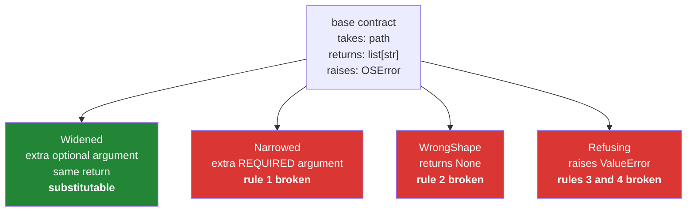

# 2.3 — Liskov in plain words: the substitution that must not surprise

## One-line answer

A subclass must be usable everywhere its base is, without the caller changing anything or being
surprised — so it may accept more and promise more, never less, and the moment it demands something
extra or refuses something the base allowed, the substitution has been broken.

---

## The story

The person who reads recipes goes on holiday and somebody covers for them.

The instruction is unchanged: *say "read me the recipe", get back a list of ingredients and a list of
steps.* Everybody who asks carries on asking exactly as before, because they were told the cover
would be seamless.

Three things happen that week.

On Tuesday the cover asks, before reading, *"what encoding is it in?"* Nobody asking has ever needed
to know that, and nobody has an answer, so nothing gets read.

On Wednesday the cover refuses a recipe on a photo, saying they only do typed ones. That recipe was
perfectly acceptable last week.

On Thursday somebody asks for a recipe and gets back a note saying *"couldn't read it"* rather than a
list. The person who asked prints the ingredients one per line and prints one line of apology.

None of the three is laziness. Each is a reasonable thing to do in isolation, and each one breaks the
promise that the cover was seamless. The people asking did not change; they should not have had to.

```text
Monday    a photo of a page   -> a list of ingredients, a list of steps
Wednesday typed into a message -> a list of ingredients, a list of steps
Friday    a link              -> a list of ingredients, a list of steps
```

---

## The idea in plain language

The rule has a formal name, the **Liskov substitution principle**, and a plain-language version that
is all you need:

> **Anywhere the base class works, a subclass must work too — without the caller knowing or caring
> which it got.**

That is stronger than "has the same method names"
([2.2](2.2-duck-typing-and-isinstance.md) gets you the names). It is about behaviour, and it breaks
down into four rules.

**1. Accept at least what the base accepts.** A subclass may take *more* — an extra optional
argument, a wider range of inputs — and never *less*. Adding a required parameter breaks every caller
written against the base ([1.4](../01-inheritance/1.4-overriding-and-the-broken-promise.md)).

**2. Return at most what the base promises.** If the base promises a list of strings, the subclass
returns a list of strings — or a *narrower* thing, like a non-empty list. Never a string, never
`None`, never a different shape.

**3. Raise no new kinds of exception.** If the base's `read` raises only `OSError`, a subclass that
raises `ValueError` breaks every `try` written around the base. Raising a *subclass* of the base's
exception is fine, because `except OSError:` still catches it — which is why Day 18 builds an
exception hierarchy.

**4. Do not weaken what the base guarantees.** If the base's `read` leaves the file closed
afterwards, so does the subclass. If the base's `save` is safe to call twice, so is the subclass's.
These are the promises nobody writes down, and they are the ones that break at three in the morning.

Rules 1 and 2 have a shorthand worth memorising: **be liberal in what you accept and conservative in
what you return.** A subclass may widen its input and must narrow its output, never the reverse.

There is a fifth thing, and it is the most common violation in practice: **a subclass that removes
capability.** The classic is a read-only view inheriting from a mutable collection and raising on
every write method. Every method exists, every signature matches, and the object cannot be substituted
anywhere, because half its inherited methods now throw. When you find yourself writing
`raise NotImplementedError` in an override, the hierarchy is upside down — and the fix is
composition ([1.5](../01-inheritance/1.5-composition-over-inheritance.md)).

---

## Why Setu needs it

- **[4.2](../04-abstraction/4.2-the-loader-family.md)'s loaders are used interchangeably in one loop.**
  If one of them needs an extra argument or returns `None` on failure, the loop's author has to learn
  about it, and the whole point of the family evaporates.
- **Day 18's exception hierarchy depends on rule 3.** `except SetuError:` around a provider call only
  works if every provider's errors are `SetuError` subclasses — a raw `ValueError` from one of them
  escapes every handler.
- **Day 216's agents are given tools that must be interchangeable.** A tool that silently returns
  `None` where the others return a result string produces an agent failure that reads like a model
  problem and is a contract problem.
- **`abc` enforces the shape and not the behaviour** ([4.1](../04-abstraction/4.1-abc-and-abstractmethod.md)).
  This document is the part `abc` cannot check, and the part a reviewer has to.

---

## The mechanism

Three substitutions, one of which is safe:

```python
"""One base contract, three subclasses, and what each does to a caller."""


class RecipeSource:
    """read(path) -> list[str]. Raises OSError if the source is unreachable."""

    def read(self, path):
        return ["flour", "water"]


class Widened(RecipeSource):
    """Accepts more: an optional argument the base never had. Safe."""

    def read(self, path, limit=None):
        result = ["flour", "water", "salt"]
        return result[:limit] if limit else result


class Narrowed(RecipeSource):
    """Demands more: a required argument. Breaks base callers."""

    def read(self, path, encoding):
        return ["flour"]


class Refusing(RecipeSource):
    """Refuses input the base accepted. Breaks base callers."""

    def read(self, path):
        if not path.endswith(".txt"):
            raise ValueError("only .txt")
        return ["flour"]


def caller(source):
    """Written against RecipeSource. Never changes."""
    return source.read("recipe.pdf")


for cls in (RecipeSource, Widened, Narrowed, Refusing):
    try:
        print(f"{cls.__name__:12} -> {caller(cls())!r}")
    except (TypeError, ValueError) as error:
        print(f"{cls.__name__:12} -> {type(error).__name__}: {error}")
```

Run on Python 3.12.12 on 2026-09-01:

```
RecipeSource -> ['flour', 'water']
Widened      -> ['flour', 'water', 'salt']
Narrowed     -> TypeError: Narrowed.read() missing 1 required positional argument: 'encoding'
Refusing     -> ValueError: only .txt
```

**Line by line:**

- The base's **docstring is the contract**: what it takes, what it returns, what it raises. Three
  facts, one line, and everything below is judged against it.
- `def caller(source):` — written once, against the base, and **never edited.** It is the stand-in for
  every piece of code in the program that uses a source.
- `Widened.read(self, path, limit=None)` — an extra parameter **with a default**, so `caller`'s
  one-argument call still works. This is rule 1 being obeyed: accept more, never less.
- `result[:limit] if limit else result` — a conditional expression
  ([Day 5, 2.5](../../../day-05-operators-and-conditionals/parts/02-conditionals/2.5-the-conditional-expression.md)).
  `Widened` also returns three items where the base returned two, which is fine: the contract says
  *a list of strings*, not *two strings*.
- `Narrowed` fails with `TypeError` — rule 1 broken. Note that the class imports cleanly and only
  fails when a base-written caller uses it, so a test suite that always passes `encoding` stays green.
- `Refusing` fails with `ValueError` — rules 3 and 4 broken at once. The signature matches, the return
  type matches, and it still cannot stand in, because it raises where the base did not.
- **Only `Widened` can be dropped into `caller` without anybody noticing**, which is the definition at
  the top of this document, demonstrated.

Rule 2, which fails without raising anything:

```python
"""Returning something narrower is fine. Returning something else is not."""


class RecipeSource:
    """read() -> list[str], possibly empty. Never None."""

    def read(self):
        return ["flour", "water"]


class Narrower(RecipeSource):
    """Returns a list that is always non-empty. Still a list[str]. Safe."""

    def read(self):
        return ["flour"]


class WrongShape(RecipeSource):
    """Returns None when there is nothing. Breaks every caller."""

    def read(self):
        return None


def caller(source):
    """Written against the contract: count the ingredients."""
    return len(source.read())


for cls in (RecipeSource, Narrower, WrongShape):
    try:
        print(f"{cls.__name__:12} -> {caller(cls())}")
    except TypeError as error:
        print(f"{cls.__name__:12} -> TypeError: {error}")
```

Run on Python 3.12.12 on 2026-09-01:

```
RecipeSource -> 2
Narrower     -> 1
WrongShape   -> TypeError: object of type 'NoneType' has no len()
```

**Line by line:**

- `Narrower` returns fewer items and is **still a list of strings**, so every caller works. Promising
  more than the base — "always non-empty" — is allowed, which is rule 2's "at most what the base
  promises" seen from the useful side.
- `WrongShape` returns `None`, and the failure lands in `caller` with a message about `NoneType`. **The
  traceback blames the caller**, which did nothing wrong, and this is the single most common Liskov
  violation in real code.
- `len(source.read())` — the caller's assumption, made explicit. Every caller has assumptions like
  this; the base's docstring is where they are supposed to be written down.
- The `except TypeError` here exists only to keep the demonstration in one block. In a real program
  this exception escapes to wherever `caller` was called from, which is further away still.

The violation that has every method and still cannot substitute:

```python
"""A subclass that removes capability. Everything matches; nothing works."""


class Notebook:
    """A list of entries you can add to."""

    def __init__(self):
        self.entries = []

    def note(self, text):
        self.entries.append(text)

    def clear(self):
        self.entries.clear()


class ReadOnlyNotebook(Notebook):
    """Same methods, and two of them refuse."""

    def note(self, text):
        raise NotImplementedError("read-only")

    def clear(self):
        raise NotImplementedError("read-only")


def record(notebook, items):
    """Written against Notebook."""
    for item in items:
        notebook.note(item)
    return len(notebook.entries)


print("normal   :", record(Notebook(), ["Monday", "Friday"]))
try:
    print("read-only:", record(ReadOnlyNotebook(), ["Monday"]))
except NotImplementedError as error:
    print("read-only: NotImplementedError:", error)
```

Run on Python 3.12.12 on 2026-09-01:

```
normal   : 2
read-only: NotImplementedError: read-only
```

**Line by line:**

- `class ReadOnlyNotebook(Notebook):` — the sentence "a read-only notebook is a notebook" sounds
  true and is false where it matters: **a notebook is a thing you can write in**, and this one is
  not.
- Every method exists with the right signature, so a type checker and an `isinstance` gate both pass
  it. Neither one can see the problem
  ([2.2](2.2-duck-typing-and-isinstance.md) is why).
- `raise NotImplementedError` inside an override — **the giveaway.** Whenever you write it in a
  subclass that is not an abstract base, the hierarchy has been built the wrong way up.
- `record` was written against `Notebook` and fails on the first item, having done nothing.
- The fix is composition: `ReadOnlyView` **holds** a notebook and exposes only reading. Then it is not
  a `Notebook`, nothing accepts it where one is required, and the failure moves from run time to the
  moment somebody tries to pass it
  ([1.5](../01-inheritance/1.5-composition-over-inheritance.md)).



---

## When it breaks

**The subclass that needs one more argument:**

```text
$ uv run python -c "
class Base:
    def load(self, path): return ['x']
class Narrow(Base):
    def load(self, path, encoding): return ['y']
b = Narrow()
b.load('p')
"
Traceback (most recent call last):
  File "<string>", line 7, in <module>
TypeError: Narrow.load() missing 1 required positional argument: 'encoding'
```

**What it means.** Rule 1. The extra thing the subclass needs belongs in its `__init__`, so the object
carries it and `load` keeps the shared signature — which is
[1.2](../01-inheritance/1.2-super-and-the-init-that-runs-twice.md)'s shape, and the reason a loader
takes its configuration at construction rather than at call.

**The `None` that surfaced somewhere else:**

```text
$ uv run python -c "
class Base:
    def read(self): return []
class Sometimes(Base):
    def read(self): return None
def summarise(sources): return sum(len(s.read()) for s in sources)
summarise([Base(), Sometimes()])
"
Traceback (most recent call last):
  File "<string>", line 7, in <module>
  File "<string>", line 6, in summarise
  File "<string>", line 6, in <genexpr>
TypeError: object of type 'NoneType' has no len()
```

**What it means.** Rule 2, and look where the traceback points: `summarise`, then a generator
expression, and never at `Sometimes`. The frame that caused it is not in the traceback at all,
because the method already returned. **A contract violation is always debugged from the wrong end**,
which is why the base's docstring and the shared test matter more here than anywhere else.

**A new exception type escaping an existing handler:**

```text
$ uv run python -c "
class Base:
    def load(self): raise OSError('unreachable')
class Odd(Base):
    def load(self): raise ValueError('bad format')
for s in [Base(), Odd()]:
    try: s.load()
    except OSError as e: print('handled:', e)
"
Traceback (most recent call last):
  File "<string>", line 7, in <module>
  File "<string>", line 5, in load
ValueError: bad format
handled: unreachable
```

**What it means.** Rule 3. The handler was written for the base's documented exception and the
subclass raises something outside it, so it escapes. The `handled: unreachable` line appears below
the traceback only because the shell flushes the two streams separately; the first source really was
processed before the second one killed the loop. The fix is an exception hierarchy: `class BadFormat(OSError)` is caught by the existing
handler and still says something more specific. Day 18 builds exactly that.

**The `NotImplementedError` in a concrete subclass:**

```text
$ grep -rn "raise NotImplementedError" src/setu/loaders/
src/setu/loaders/base.py:14:        raise NotImplementedError
src/setu/loaders/readonly.py:22:        raise NotImplementedError("read-only")
```

**What it means.** The first is fine — an abstract placeholder on a base class, which
[4.1](../04-abstraction/4.1-abc-and-abstractmethod.md) improves on. The second is a Liskov violation
in one line: a concrete class refusing a method it inherited. `grep` for this string in any codebase
and the hits outside base classes are a reliable list of hierarchies built upside down.

---

## In production

**The professional habit is that the base class documents the contract in four lines — takes,
returns, raises, guarantees — and every override is reviewed against those four lines rather than
against the signature.** A signature is checkable by a tool; the contract is not, so it has to be
legible. Teams that skip this discover the violations one production incident at a time.

**What changes at scale is that callers you have never seen depend on the contract.** With one caller
you can change both together. With a base class used by four teams, a subclass that raises a new
exception type breaks handlers in code you cannot find. That is why rule 3 in particular is worth
being strict about, and why every library with a plugin interface defines its own base exception and
insists that plugins raise only subclasses of it.

**The failure that only appears with real data is the guarantee nobody wrote down.** The base's
`load` happens to be safe to call twice, because it reads a file. A caching subclass is not, because
the second call returns a stale result — and nothing in any signature or docstring said "idempotent".
Six months later a retry is added at a completely different layer and the cache serves the pre-failure
result. The defence is to write the non-obvious guarantees into the base's docstring the first time
somebody relies on one.

**The review comment a senior engineer leaves.** On an override raising `NotImplementedError`:
*"If this class cannot do half of what its base promises, it is not that base. Hold one instead and
expose the three methods you support — then nothing can pass it where a full one is required, and
this fails at the call site instead of two layers in."*

**The interview question.** *"What is the Liskov substitution principle?"* The answer that lands
avoids the formal wording: a subclass has to work anywhere the base does, without the caller changing
or being surprised — so it may accept more and promise more, never less, and it may not raise
exceptions the base did not. Adding the concrete tell — a `raise NotImplementedError` in a concrete
subclass means the hierarchy is upside down and composition is the fix — turns a definition into
something you have applied.

---

## Check yourself

```bash
uv run python -c "
class Base:
    '''read(path) -> list[str]. Raises OSError if unreachable.'''
    def read(self, path): return ['flour', 'water']

class Widened(Base):
    def read(self, path, limit=None):
        r = ['flour', 'water', 'salt']
        return r[:limit] if limit else r

class Narrowed(Base):
    def read(self, path, encoding): return ['flour']

class WrongShape(Base):
    def read(self, path): return None

def caller(source): return len(source.read('recipe.pdf'))

for cls in (Base, Widened, Narrowed, WrongShape):
    try:
        print(f'{cls.__name__:12} -> {caller(cls())}')
    except TypeError as e:
        print(f'{cls.__name__:12} -> TypeError: {e}')
"
```

One subclass works and two do not. Say which rule each broken one breaks, and which of the two
failures would be harder to find in a large program.

**Answer out loud, without scrolling up:**

> Give the substitution rule in one sentence, then the shorthand about accepting and returning. Then
> say what a `raise NotImplementedError` in a concrete subclass tells you about the hierarchy.

---

**Next:** [3.1 — public, `_protected`, `__private`](../03-encapsulation/3.1-public-protected-private.md).
Section 2 was about what a class promises outward; section 3 is about what it keeps to itself.
