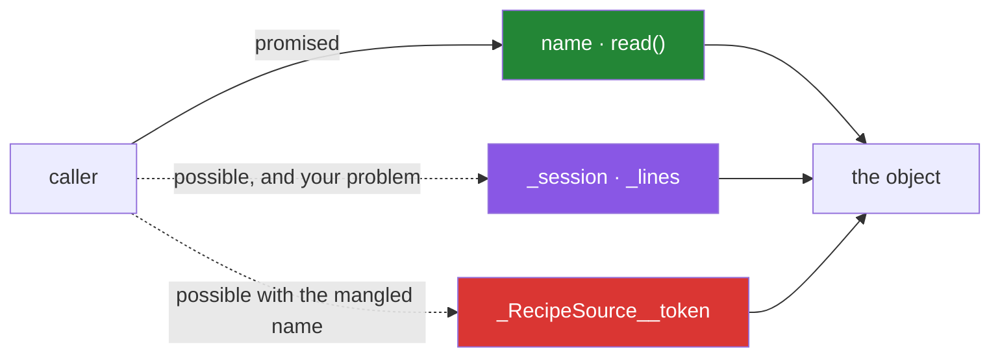

# 3.1 — Public, `_protected`, `__private`: the convention that is not a lock

## One-line answer

A leading underscore means "this is not part of what I promise" and nothing more — Python will let
anybody read it — so the underscore is a message to a person, and the only real protection is that
the person believed you.

---

## The story

The counter at the front of the recipe service has three things on it.

There is a **printed menu**, facing outwards. Anybody may read it, and if it changes, a notice goes
up first, because people have planned around it.

There is a **clipboard on a hook behind the counter**, facing in. It has the day's working notes —
which sources are slow this morning, who is covering the afternoon. Nothing stops a customer leaning
over and reading it. It is not locked away. It is simply not for them, and everybody understands
that: the notes change hourly, nobody announces it, and a customer who plans around what the
clipboard said on Tuesday has made a mistake nobody will apologise for.

And there is **a drawer with the till float in it**, which is closed. Not locked — it opens if you
pull it — but closed, and pulling it open is an unmistakable act rather than an accident.

```text
menu       facing out    anybody may read and rely on it
clipboard  facing in     readable, and not for you
drawer     closed        openable, and you will know you did it
```

Nobody has ever installed a lock. The arrangement works because the three levels are legible, and
because reaching past one of them is a decision rather than a slip.

---

## The idea in plain language

Python has the same three levels and the same absence of locks. The level is spelled in the name.

**No underscore — public.** `paper.title`. Part of what the class promises. Changing it is a breaking
change for everybody who uses the class, so it needs a deprecation, a version bump, or a note.

**One leading underscore — internal.** `loader._session`. The convention, and the whole of it, is:
*this is not part of the public promise; it may change without notice.* Python does nothing to
enforce it. You can read it, write it and delete it exactly as before. Its one mechanical effect is
that `from module import *` skips names starting with an underscore — and nobody should be writing
`import *` anyway.

**Two leading underscores — mangled.** `paper.__secret` gets rewritten by Python to
`paper._Paper__secret` ([3.2](3.2-name-mangling.md) is the mechanism). This is still not a lock; it
is a *renaming*, and its purpose is narrower than people think: it stops a subclass accidentally
colliding with a name the parent uses. It is not for keeping callers out.

Two words used loosely everywhere and worth pinning down here:

- **Encapsulation** is keeping the inside of an object separate from what it promises, so the inside
  can change without breaking anybody. It is a design property, not a language feature.
- **Interface** is what the object promises: the public names and what they do. Everything else is
  implementation.

The rule that follows is short: **the underscore is documentation.** Its audience is the person
reading your code, and it says "if you use this, you have accepted that I may delete it on Tuesday".
That is a real and useful thing to say. It is not, and was never meant to be, a security boundary —
so nothing in a Python object is safe from a determined caller, and designing as though it were is
a mistake.

Two smaller conventions that come with it:

- **A trailing underscore avoids a keyword clash**: `class_`, `id_`, `from_`. Nothing to do with
  privacy.
- **Dunder names** — `__init__`, `__eq__` — are neither private nor internal. The double underscores
  at *both* ends mean "the language calls this", and they are exempt from mangling.

---

## Why Setu needs it

- **[4.2](../04-abstraction/4.2-the-loader-family.md)'s loaders each hold a session or a client.**
  That collaborator is `_session`, not `session`, because swapping it is the loaders' business and
  no caller should be reaching for it.
- **[Day 11, 2.1](../../../day-11-iterators-and-generators/parts/02-generators/2.1-yield-the-function-that-pauses.md)
  already used the convention**, splitting a validating wrapper from a private `_read_rows` generator,
  and promised that this document would define it.
- **`Paper`'s public surface is what Day 240 still depends on**
  ([Day 12, 3.1](../../../day-12-classes/parts/03-the-paper-object/3.1-designing-paper.md)). Marking
  the rest internal is what makes it possible to change the inside without an audit.
- **Principle 11 is blast radius.** A field with no underscore can be read and written by anything in
  the program; one with an underscore has a smaller blast radius by agreement. That agreement is worth
  something even though it is not enforced.

---

## The mechanism

The three levels, and what Python actually does about each:

```python
"""Three names, three intentions, one level of enforcement: none."""


class RecipeSource:
    def __init__(self, name):
        self.name = name
        self._session = "a connection you should not touch"
        self.__token = "mangled, not hidden"

    def describe(self):
        return f"{self.name} using {self._session}"

    def token_length(self):
        return len(self.__token)


source = RecipeSource("Friday")

print("public   :", source.name)
print("internal :", source._session)
print("via method:", source.token_length())
print()
print("what it stores:", sorted(vars(source)))
```

Run on Python 3.12.12 on 2026-09-01:

```
public   : Friday
internal : a connection you should not touch
via method: 19
what it stores: ['_RecipeSource__token', '_session', 'name']
```

**Line by line:**

- `self.name` — no underscore, so it is the promise. Renaming it later breaks callers, and that is
  the point of the distinction.
- `self._session` — one underscore, and `source._session` **reads perfectly.** There is no error, no
  warning, and no difference in behaviour from `name`. The only thing that changed is what a reader
  understands.
- `self.__token` — two underscores, and look at the last line: the stored key is
  `_RecipeSource__token`, **not `__token`.** Python rewrote the name when the class body was compiled
  ([3.2](3.2-name-mangling.md)).
- `sorted(vars(source))` — the honest inventory
  ([Day 12, 2.1](../../../day-12-classes/parts/02-attribute-lookup/2.1-the-instance-dict.md)). Print
  this whenever you want to know what an object is really carrying, whatever the names suggest.
- `token_length` reads `self.__token` from *inside* the class, where the same rewriting applies, so it
  finds it. The mangling is consistent, not magic.

Nothing is protected, demonstrated:

```python
"""Every level is readable and writable from outside. The underscore is a message."""


class RecipeSource:
    def __init__(self):
        self._session = "the real session"
        self.__token = "secret"


source = RecipeSource()

print("read internal :", source._session)
source._session = "replaced from outside"
print("wrote internal:", source._session)

print()
try:
    print(source.__token)
except AttributeError as error:
    print("read mangled  : AttributeError:", error)

print("read mangled  :", source._RecipeSource__token)
source.__token = "not the same attribute"
print("what it stores:", sorted(vars(source)))
```

Run on Python 3.12.12 on 2026-09-01:

```
read internal : the real session
wrote internal: replaced from outside

read mangled  : AttributeError: 'RecipeSource' object has no attribute '__token'
read mangled  : secret
what it stores: ['_RecipeSource__token', '__token', '_session']
```

**Line by line:**

- `source._session` reads and then **writes**, from outside, with no complaint at all. Anybody
  claiming the underscore protects something can be shown these two lines.
- `source.__token` from outside raises — but not because it is private. It raises because **there is
  no attribute called `__token`**; the real one is `_RecipeSource__token`.
- `source._RecipeSource__token` prints `secret`. The mangled name is entirely readable once you know
  it, and knowing it takes one `print(vars(obj))`.
- `source.__token = "not the same attribute"` **creates a fourth attribute**, spelled `__token`,
  because mangling only happens to code written *inside* a class body
  ([3.2](3.2-name-mangling.md)). The object now carries two similarly-named things and the method that
  reads the mangled one is unaffected. This is a genuinely confusing situation and it is the reason to
  use two underscores rarely.
- The final inventory has three keys where the class set two. That line is the whole warning.

What encapsulation actually buys, when the convention is respected:

```python
"""The inside changed. The promise did not. Callers are unaffected."""


class RecipeSourceV1:
    def __init__(self, name):
        self.name = name
        self._lines = ["flour", "water"]

    def read(self):
        return list(self._lines)


class RecipeSourceV2:
    """Same public surface. Completely different inside."""

    def __init__(self, name):
        self.name = name
        self._raw = "flour\nwater"

    def read(self):
        return self._raw.splitlines()


def caller(source):
    """Uses only the public surface: name and read()."""
    return f"{source.name}: {', '.join(source.read())}"


print(caller(RecipeSourceV1("Friday")))
print(caller(RecipeSourceV2("Friday")))
```

Run on Python 3.12.12 on 2026-09-01:

```
Friday: flour, water
Friday: flour, water
```

**Line by line:**

- `_lines` became `_raw`, a list became a string, and **`caller` did not change.** That is
  encapsulation paying out, and it is the only reason the convention is worth following.
- `def read(self): return list(self._lines)` — returning a **copy**, so a caller cannot reach in
  through the returned list and mutate the object's own state
  ([Day 4, 2.3](../../../day-04-objects/parts/02-containers/2.3-aliasing-two-names-one-object.md)).
  Without the `list(...)`, `source.read().clear()` would empty the source.
- `self._raw.splitlines()` in V2 returns a fresh list anyway, so no copy is needed there. Two
  implementations, one contract, and each satisfies it its own way.
- `caller` touches `name` and `read` and nothing else. **Had it reached for `_lines`, V2 would have
  broken it** — which is precisely the outcome the underscore warned about.
- This is [2.3](../02-polymorphism/2.3-liskov-in-plain-words.md)'s contract idea applied to a single
  class over time rather than to two classes at once.



---

## When it breaks

**Reading somebody's internal, and the day it changes:**

```text
>>> class Source:
...     def __init__(self):
...         self._lines = ["flour", "water"]
...     def read(self):
...         return list(self._lines)
...
>>> len(Source()._lines)
2
```

**What it means.** It works, today, and there is no warning. When the library's next version stores
`_raw` as a string instead, this line becomes `AttributeError` — and the library's changelog will not
mention it, correctly, because the underscore said it was not a promise. **Every use of somebody
else's underscore name is a bet that they will not change it**, and it is worth writing a comment
saying so, because the person debugging the upgrade will need to know it was deliberate.

**Mangling that surprised a subclass:**

```text
$ uv run python -c "
class Base:
    def __init__(self): self.__secret = 'base'
    def base_sees(self): return self.__secret
class Child(Base):
    def __init__(self):
        super().__init__()
        self.__secret = 'child'
    def child_sees(self): return self.__secret
c = Child()
print(sorted(vars(c)))
print(c.base_sees(), c.child_sees())
"
['_Base__secret', '_Child__secret']
base child
```

**What it means.** Two attributes, not one. `Base.__secret` became `_Base__secret` and
`Child.__secret` became `_Child__secret`, so the child did **not** overwrite the parent's value and
each method sees its own. That is exactly what double underscores are for — and it is also why they
surprise people who expected an override. [3.2](3.2-name-mangling.md) is the full story.

**A single underscore used where a real boundary was needed:**

```text
>>> class Account:
...     def __init__(self):
...         self._balance = 100
...     def withdraw(self, amount):
...         if amount > self._balance:
...             raise ValueError("insufficient funds")
...         self._balance -= amount
...
>>> a = Account()
>>> a._balance = -5000
>>> a._balance
-5000
```

**What it means.** The invariant "balance is never negative" is enforced in `withdraw` and bypassed
by one assignment. Python cannot stop this, and no amount of underscores will. The lesson is not to
add more underscores; it is that **an invariant that must hold has to be checked wherever the value
can change** — which for a value that can be set from outside means either a `property` with a setter
(Day 15) or a design where the value cannot be set at all.

**`import *` and the one thing the underscore does mechanically:**

```text
>>> # in helpers.py: public_thing = 1 ; _internal_thing = 2
>>> from helpers import *
>>> public_thing
1
>>> _internal_thing
Traceback (most recent call last):
  File "<stdin>", line 1, in <module>
NameError: name '_internal_thing' is not defined
```

**What it means.** The single mechanical effect of a leading underscore at module level: `import *`
skips it. This is worth knowing and is not worth relying on, because `from x import *` is discouraged
everywhere and because `from helpers import _internal_thing` still works perfectly. Treat it as a
curiosity rather than as protection.

---

## In production

**The professional habit is that the public surface is small and deliberate, and everything else gets
an underscore on the day it is written.** Adding one later is a breaking change for anybody who
started using the name in the meantime, so the default for a new attribute or helper is
underscore-first, promoted to public only when somebody outside genuinely needs it and the team
agrees to keep it.

**What changes at scale is that the underscore becomes the only thing standing between you and an
unmanageable interface.** A module with forty public names has forty things that cannot be changed;
the same module with six public and thirty-four internal has six. That difference is the whole
difference between a library that can be improved and one that is frozen — and it is decided one
name at a time, when each one is written.

**The failure that only appears in a large project is somebody depending on your internals.** It
happens, it is nobody's fault in particular, and you find out when your refactor breaks their build.
The professional responses are to keep the internal surface genuinely internal (do not return objects
whose useful methods are all underscored), and to treat a widely-depended-on `_name` as a design
signal: if three teams need it, it wanted to be public, and the honest fix is to promote it with a
proper name rather than to keep pretending.

**The review comment a senior engineer leaves.** On `self.session = httpx.Client()` in a loader:
*"Underscore this. It is an implementation detail we will want to swap for a pooled client, and once
it is public somebody will reach for `loader.session.headers` and we will never be able to change
it. If callers genuinely need to configure the client, take it as a constructor argument instead —
then it is a seam rather than a leak."*

**The interview question.** *"Does Python have private attributes?"* The answer that lands is: no —
a single underscore is a convention meaning "not part of the promise" with no enforcement at all, and
a double underscore is name mangling, which renames the attribute to avoid subclass collisions rather
than to keep callers out. Adding that the underscore's real value is that it keeps the public surface
small enough to change, and that an invariant needing enforcement has to be enforced wherever the
value can be set, shows you know why the convention is worth following anyway.

---

## Check yourself

```bash
uv run python -c "
class RecipeSource:
    def __init__(self, name):
        self.name = name
        self._session = 'internal'
        self.__token = 'mangled'
    def token(self): return self.__token

s = RecipeSource('Friday')
print('stores       :', sorted(vars(s)))
print('public       :', s.name)
print('internal     :', s._session)
s._session = 'changed from outside'
print('written      :', s._session)
try:
    s.__token
except AttributeError as e:
    print('double under :', e)
print('mangled name :', s._RecipeSource__token)
"
```

Every one of the three levels was reachable from outside. Say which of them Python actually did
something to, and what that something was.

**Answer out loud, without scrolling up:**

> Give the three levels and what each one means to a reader. Then say what Python enforces about the
> single underscore, and what it actually does about the double one.

---

**Next:** [3.2 — name mangling, and the attribute that vanished](3.2-name-mangling.md), which is the
mechanism behind the `_RecipeSource__token` you just printed.
