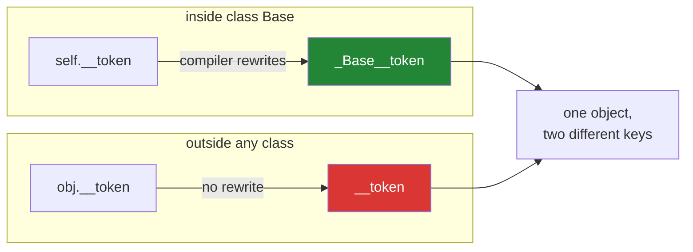

# 3.2 — Name mangling, and the attribute that vanished

## One-line answer

Inside a class body, a name starting with two underscores is silently rewritten to include the class
name, so `self.__token` in `Base` becomes `_Base__token` — which stops a subclass colliding with it
by accident, and is the entire purpose.

---

## The story

Two people work the recipe counter on different shifts and both keep working notes.

The morning person writes on a pad: *"today's code: 4471."* The afternoon person, arriving later,
writes on what they think is the same pad: *"today's code: 9903."*

If it really is one pad, the afternoon note wipes out the morning one, the morning person comes back
and reads the wrong code, and nobody can work out where the confusion came from — because both notes
look correct and both people did the obvious thing.

The fix the counter actually uses costs nothing. Each pad has a name printed at the top:

```text
MORNING PAD    today's code: 4471
AFTERNOON PAD  today's code: 9903
```

Now both people write "today's code" and the two notes cannot collide, because the pad's name is part
of where the note lives. Neither person has to know the other exists. Neither has to check first.

That is what name mangling does, and understanding it as *two pads* rather than as *a locked drawer*
is the difference between using it correctly and being baffled by it.

---

## The idea in plain language

**Name mangling** is a rewrite the compiler does. Any identifier inside a class body that begins with
**two underscores and does not end with two** is rewritten to `_ClassName__name`.

So inside `class Base`, this:

```
self.__token = "x"
```

is compiled as if you had written:

```
self._Base__token = "x"
```

Three details decide everything about how it behaves.

**It happens at compile time, based on the class the code is written in** — not the class of the
object at run time. Code inside `Base` always mangles to `_Base__`, even when `self` is a `Child`.

**It happens only inside a class body.** The same `obj.__token = "x"` written at module level, or in
a plain function, is not rewritten at all — which is why
[3.1](3.1-public-protected-private.md)'s last block ended up with two similarly-named attributes.

**Names with two underscores at both ends are exempt.** `__init__` and `__eq__` are untouched,
because the language calls them by those exact names.

The purpose is narrow and worth stating precisely: **it prevents accidental collisions between a
parent's internal names and a subclass's.** A base class that keeps `self.__cache` can be subclassed
by somebody who has never read it and also keeps `self.__cache`, and the two do not interfere. That is
the whole benefit, and it is a real one for a widely-subclassed base.

It is **not** privacy. `obj._Base__token` reads it from anywhere
([3.1](3.1-public-protected-private.md) demonstrated that), and `print(vars(obj))` reveals the mangled
name in one line.

The practical guidance most codebases settle on:

- **Use a single underscore** for anything internal. That covers ninety-nine per cent of cases and
  keeps subclassing and debugging straightforward.
- **Use two** only when you are writing a base class that will be widely subclassed by people you do
  not know, and only for a name whose collision would be a genuine bug.
- **Never use two to keep callers out.** It does not, and it makes debugging harder for everybody
  including you.

---

## Why Setu needs it

- **You will meet the mangled name before you meet the mangling.** `_BaseModel__fields_set` and
  friends appear in `vars()` output from Day 19's Pydantic models onwards, and without this document
  they look like corruption.
- **[3.3](3.3-the-invariant.md) argues for a single underscore in this project**, and the argument
  only makes sense once the alternative is understood rather than avoided.
- **[4.2](../04-abstraction/4.2-the-loader-family.md)'s `BaseLoader` is subclassed three times by
  you**, which is exactly the case where two underscores are *not* needed — you know all the
  subclasses, and the debugging cost outweighs a collision that cannot happen.
- **Day 15 adds `property`**, and a mangled name behind a property is the standard way libraries hide
  a backing field. Recognising `self.__value` behind `def value(self)` saves a lot of confusion there.

---

## The mechanism

The rewrite, made visible:

```python
"""What the compiler actually stored."""


class Base:
    def __init__(self):
        self.public = 1
        self._internal = 2
        self.__mangled = 3

    def reads_it(self):
        return self.__mangled


base = Base()

print("stored keys :", sorted(vars(base)))
print("from inside :", base.reads_it())
print("from outside:", base._Base__mangled)
print()
print("the code says '__mangled':", "__mangled" in Base.reads_it.__code__.co_names)
print("the bytecode looked for  :", [n for n in Base.reads_it.__code__.co_names])
```

Run on Python 3.12.12 on 2026-09-01:

```
stored keys : ['_Base__mangled', '_internal', 'public']
from inside : 3
from outside: 3

the code says '__mangled': False
the bytecode looked for  : ['_Base__mangled']
```

**Line by line:**

- `sorted(vars(base))` shows `_Base__mangled`. **The attribute called `__mangled` does not exist**;
  it never did, because the name was rewritten before the assignment ran.
- `base.reads_it()` works, because the method's body was compiled inside `Base` and so looks for the
  same rewritten name.
- `base._Base__mangled` reads it from outside. No error, no warning — the demonstration that this is
  renaming rather than protection.
- `Base.reads_it.__code__.co_names` — the names the compiled method actually looks up
  ([Day 10, 2.2](../../../day-10-functions/parts/02-scope/2.2-unboundlocalerror.md) used `co_varnames`
  the same way). It contains `_Base__mangled` and **not** `__mangled`, which is the rewrite caught in
  the act.
- Nothing here required a debugger or documentation. `vars()` plus `co_names` answers "what is this
  object really called" completely.

The collision it exists to prevent:

```python
"""Two classes, one obvious attribute name, no interference."""


class Base:
    def __init__(self):
        self.__secret = "base"
        self._shared = "base"

    def base_sees(self):
        return self.__secret, self._shared


class Child(Base):
    def __init__(self):
        super().__init__()
        self.__secret = "child"
        self._shared = "child"

    def child_sees(self):
        return self.__secret, self._shared


child = Child()

print("stored keys:", sorted(vars(child)))
print("base sees  :", child.base_sees())
print("child sees :", child.child_sees())
```

Run on Python 3.12.12 on 2026-09-01:

```
stored keys: ['_Base__secret', '_Child__secret', '_shared']
base sees  : ('base', 'child')
child sees : ('child', 'child')
```

**Line by line:**

- `self.__secret = "base"` inside `Base` stores `_Base__secret`; the identical line inside `Child`
  stores `_Child__secret`. **Two attributes, and neither class had to know about the other.**
- `self._shared` — one underscore, **no mangling**, so the child's assignment overwrote the parent's.
  One attribute, one value, and the parent's method now sees the child's value.
- `base_sees()` returns `('base', 'child')`. Read that pair carefully: the mangled name kept the
  parent's own value, and the single-underscore one did not. That contrast is the entire argument for
  two underscores in a widely-subclassed base.
- `child_sees()` returns `('child', 'child')`, because from inside `Child` both names resolve to the
  child's.
- Whether the `_shared` behaviour is a bug depends on intent. If `Base` needed its own working value,
  it was one — and it is exactly the kind of bug that takes a day to find, because the parent's code
  is correct and so is the child's.

Mangling only happens inside a class body:

```python
"""The same spelling, three places, two different attributes."""


class Base:
    def __init__(self):
        self.__token = "set inside the class"

    def inside(self):
        return self.__token


base = Base()

base.__token = "set from outside"

print("stored keys:", sorted(vars(base)))
print("inside sees:", base.inside())
print("outside sees:", base.__token)
```

Run on Python 3.12.12 on 2026-09-01:

```
stored keys: ['_Base__token', '__token']
inside sees: set inside the class
outside sees: set from outside
```

**Line by line:**

- `base.__token = "set from outside"` is written at module level, **so it is not rewritten** and it
  creates a genuinely new attribute called `__token`.
- The object now has two keys that look almost identical in a printout, holding different values.
- `base.inside()` returns the original, because the method was compiled inside the class and looks for
  `_Base__token`.
- `base.__token` from outside returns the new one, because outside code looks for exactly what it
  wrote.
- **Nothing raised, and the object is now confusing.** This is the concrete cost of two underscores,
  and it is why the guidance is to use them rarely rather than as a default.
- Note that this is [Day 12, 2.2](../../../day-12-classes/parts/02-attribute-lookup/2.2-setting-attributes-from-outside.md)'s
  silent-write problem with an extra layer: not only did the assignment create a new attribute, it
  created one whose name *looks* like an existing one.



---

## When it breaks

**The attribute that is not there:**

```text
$ uv run python -c "
class Recipe:
    def __init__(self): self.__private = 3
r = Recipe()
print(sorted(vars(r)))
r.__private
"
Traceback (most recent call last):
  File "<string>", line 6, in <module>
AttributeError: 'Recipe' object has no attribute '__private'
['_Recipe__private']
```

**What it means.** The traceback is literally true: there is no attribute with that name. The printed
inventory — which appears below the traceback only because the shell flushes the two streams
separately — is the answer, and it is the reason `print(vars(obj))` is the
first move whenever an attribute is missing. Note also that the "did you mean" suggestion
([Day 12, 2.2](../../../day-12-classes/parts/02-attribute-lookup/2.2-setting-attributes-from-outside.md))
does not appear here, because `_Recipe__private` is not a near-miss for `__private`.

**A subclass that meant to override and did not:**

```text
>>> class Base:
...     def __init__(self):
...         self.__limit = 10
...     def limit(self):
...         return self.__limit
...
>>> class Child(Base):
...     def __init__(self):
...         super().__init__()
...         self.__limit = 99
...
>>> Child().limit()
10
```

**What it means.** The child set what it believed was the parent's limit and set a different
attribute instead, so `limit()` still returns `10`. **This is the single most confusing consequence
of mangling**, and it is the same mechanism as the useful case in the second block — the difference
is entirely whether the collision was accidental (good) or intentional (now broken). A base class
whose subclasses are meant to change a value should use one underscore, or a proper parameter.

**Mangling inside a nested class:**

```text
>>> class Outer:
...     class Inner:
...         def __init__(self):
...             self.__x = 1
...
>>> sorted(vars(Outer.Inner()))
['_Inner__x']
```

**What it means.** The rewrite uses the **immediately enclosing class**, `Inner`, not `Outer.Inner`
and not `Outer`. So two nested classes with the same name in different modules produce the same
mangled prefix, and the guarantee is narrower than it looks. This rarely matters and is worth knowing
before it does.

**Leading underscores stripped from the class name:**

```text
>>> class _Hidden:
...     def __init__(self):
...         self.__x = 1
...
>>> sorted(vars(_Hidden()))
['_Hidden__x']
```

**What it means.** The class's own leading underscores are stripped before the prefix is built, so
`_Hidden` gives `_Hidden__x` rather than `__Hidden__x`. A small detail, and the reason it is here is
that guessing the mangled name is a thing you will do while debugging, and getting the rule slightly
wrong costs a confusing minute.

---

## In production

**The professional default is one underscore, and two only in a base class with unknown
subclasses.** Standard-library and framework authors use two for exactly that reason — a `BaseModel`
subclassed by thousands of people cannot afford a name collision — and application code almost never
has that problem. Reaching for two underscores in a class you and four colleagues maintain buys a
collision guarantee you did not need and costs everyone a debugging step.

**What changes when you are reading somebody else's library is that mangled names are a map.** A
`vars()` printout full of `_BaseModel__` prefixes tells you exactly which class in the hierarchy owns
each piece of state, which is genuinely useful when tracing behaviour through four levels of
inheritance. Recognising the prefix as "this belongs to that class" turns an unreadable dump into a
structured one.

**The failure that only appears in a subclass-heavy design is the intentional override that cannot
happen.** A framework's base class stores `self.__config`, a user subclasses it and sets
`self.__config` expecting to change the behaviour, and nothing happens — no error, no effect. The
library is not at fault and neither is the user; the interface simply never offered that. The lesson
for your own base classes is that **anything a subclass is meant to change gets one underscore or a
constructor parameter**, and only genuinely private working state gets two.

**The review comment a senior engineer leaves.** On `self.__cache = {}` in an application class:
*"One underscore is enough here. We know all three subclasses, there is no collision to prevent, and
the mangled name will make every `vars()` dump and every debugger session slightly worse. Save the
double for base classes we publish."*

**The interview question.** *"What do two leading underscores do?"* The answer that lands is: the
compiler rewrites the name inside the class body to `_ClassName__name`, so it is renaming rather than
privacy — the purpose is to stop a subclass colliding with a base's internal name, and the attribute
is still readable from outside through the mangled spelling. Adding that the rewrite happens only
inside a class body, so the same assignment from outside creates a second, differently-named
attribute, is the detail that shows you have debugged it.

---

## Check yourself

```bash
uv run python -c "
class Base:
    def __init__(self):
        self.__secret = 'base'
        self._shared = 'base'
    def base_sees(self): return self.__secret, self._shared

class Child(Base):
    def __init__(self):
        super().__init__()
        self.__secret = 'child'
        self._shared = 'child'
    def child_sees(self): return self.__secret, self._shared

c = Child()
print('stored keys:', sorted(vars(c)))
print('base sees  :', c.base_sees())
print('child sees :', c.child_sees())
"
```

`base_sees()` returns one value the child set and one it did not. Say which is which, and what the
difference between the two attribute names was.

**Answer out loud, without scrolling up:**

> Say what the compiler does to a name beginning with two underscores, and where that rewrite does
> and does not happen. Then say what the feature is actually for.

---

**Next:** [3.3 — the invariant, and why encapsulation is about state rather than secrecy](3.3-the-invariant.md),
which is what all of this was in aid of.
