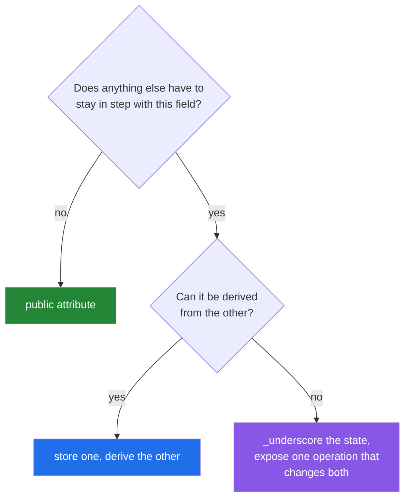

# 3.3 — The invariant: encapsulation is about state, not secrecy

## One-line answer

Encapsulation is worth doing because it keeps a rule true — the object's state stays consistent
because only the object changes it — and hiding a field is only useful when there is such a rule to
protect.

---

## The story

The recipe counter keeps a running tally of how many recipes it has read today, and a list of which
ones. At the end of the day both go on the board:

```text
Monday    a photo of a page
Wednesday typed into a message
Friday    a link

read today: 3
```

There is a rule nobody has ever written down and everybody follows: **the number equals the length of
the list.** Whenever a recipe is read, both the list and the number get updated, together, by the
person who read it.

Then somebody helpful, tidying up, notices a recipe on the list that was actually read yesterday. They
cross it off the list. They do not think to change the number, because the number is written in a
different place and it was already there.

Now the board says three and the list has two entries, and both look correct on their own. The
mismatch is invisible until somebody compares them, which might be next week, and there is no way to
tell afterwards which of the two is right.

The counter's fix is not a lock on the list. It is that **one person does both**: you tell them what
to cross off, and they cross it off and change the number. Nobody else touches either.

---

## The idea in plain language

An **invariant** is something that is true about an object for its whole life, and that its methods
are responsible for keeping true. "The count equals the length of the list" is one.
[Day 12, 3.2](../../../day-12-classes/parts/03-the-paper-object/3.2-validation-in-init.md) made a
`Paper` whose title is never empty — that is another.

Invariants are the reason to hide state. Not secrecy; **consistency.** If two fields have to agree,
then either one operation changes both, or they will drift.

That gives the working definition of encapsulation, which is more useful than the usual one:

> Keep the state that has a rule about it out of everybody's reach, and provide the operations that
> change it correctly.

Three practical consequences follow.

**Expose operations, not fields.** `counter.record("Friday")` changes both the list and the number
together. `counter.entries` and `counter.count` as public fields invite the tidying-up bug, and no
amount of care prevents it forever.

**Return copies, not the object's own containers.** A method returning `self._entries` hands out a
reference, and the caller can mutate the object's internals through it without touching the object
([Day 4, 2.3](../../../day-04-objects/parts/02-containers/2.3-aliasing-two-names-one-object.md)).
`return list(self._entries)` costs one call and closes it.

**A field with no rule about it does not need hiding.** `paper.title` is a value; nothing has to stay
in step with it. Making it `_title` and adding a getter buys nothing at all and adds a layer. This is
the mistake people make immediately after learning encapsulation, and it produces classes that are
all ceremony.

Two related things this document deliberately does not cover: `property`, which lets a public-looking
attribute run code on read and write, and read-only attributes, are Day 15's subject (`PY-17`). Today's
tools are a method and an underscore, and they are enough for the argument.

The single-underscore convention from [3.1](3.1-public-protected-private.md) is the right level for
this. It says "changing this directly will break a rule you cannot see", which is exactly the message.
Two underscores would add nothing, because the problem was never a subclass collision.

---

## Why Setu needs it

- **`Paper` has an invariant** — its title is non-empty and cleaned
  ([Day 12, 3.2](../../../day-12-classes/parts/03-the-paper-object/3.2-validation-in-init.md)) — and
  today's question is what stops somebody assigning `paper.title = ""` afterwards. Today's honest
  answer is "nothing, and here is why that is still worth thinking about"; Day 15 gives the tool.
- **[4.2](../04-abstraction/4.2-the-loader-family.md)'s loaders keep a session and a count.** If a
  caller can reset the count without closing the session, the two disagree and the retry budget is
  wrong.
- **Day 3's rate budget is an invariant** (Principle 5): requests used plus requests remaining equals
  the limit. A budget object that lets either be set independently cannot be trusted, which is a real
  cost rather than a stylistic one.
- **Day 23's agent memory and Day 192's graph state both have invariants** — a step count matching a
  history length, a checkpoint matching a version. Every one of those is this document at a larger
  scale.

---

## The mechanism

The rule, broken and kept:

```python
"""Two fields that must agree, exposed two ways."""


class OpenCounter:
    """Both fields public. The rule is a hope."""

    def __init__(self):
        self.entries = []
        self.count = 0

    def record(self, name):
        self.entries.append(name)
        self.count += 1


class ClosedCounter:
    """One operation changes both. The rule cannot be broken from outside."""

    def __init__(self):
        self._entries = []

    def record(self, name):
        self._entries.append(name)

    @property
    def count(self):
        return len(self._entries)

    def entries(self):
        return list(self._entries)


open_counter = OpenCounter()
for name in ["Monday", "Wednesday", "Friday"]:
    open_counter.record(name)

open_counter.entries.remove("Wednesday")

print("open  : count =", open_counter.count, "entries =", len(open_counter.entries))

closed = ClosedCounter()
for name in ["Monday", "Wednesday", "Friday"]:
    closed.record(name)

closed.entries().remove("Wednesday")

print("closed: count =", closed.count, "entries =", len(closed.entries()))
```

Run on Python 3.12.12 on 2026-09-01:

```
open  : count = 3 entries = 2
closed: count = 3 entries = 3
```

**Line by line:**

- `open_counter.entries.remove("Wednesday")` — one line from outside, and the two fields disagree. No
  error. The object is now inconsistent and will stay that way.
- `count = 3 entries = 2` — **the bug, printed.** Both numbers look plausible in isolation, which is
  what makes this expensive to find later.
- `ClosedCounter` stores **one** field, `_entries`, and derives the count from it. There is nothing to
  keep in step, because there is only one thing. **Deriving is better than synchronising**, and it is
  the first move to reach for whenever two fields have a rule between them.
- `@property def count(self)` — a method that reads like an attribute, so `closed.count` works without
  brackets. This is Day 15's subject (`PY-17`); it appears here because the alternative — a public
  `count` field — is the bug this block is about, and a `count()` method would read worse in the
  comparison. Treat the decorator as borrowed for one line.
- `def entries(self): return list(self._entries)` — **a copy.** The next line calls `.remove` on that
  copy, the copy is discarded, and the object is untouched: `entries = 3` on the closed row.
- Without the `list(...)`, the closed version would fail exactly like the open one — which is worth
  trying, because it shows that the underscore was never what protected anything. **The copy was.**

The invariant that needs an operation rather than a derivation:

```python
"""When two things genuinely must both be stored, one method changes both."""


class Budget:
    """Requests used and remaining, which must always sum to the limit."""

    def __init__(self, limit):
        self._limit = limit
        self._used = 0

    def spend(self, requests=1):
        if requests > self.remaining:
            raise ValueError(f"only {self.remaining} left, asked for {requests}")
        self._used += requests

    @property
    def used(self):
        return self._used

    @property
    def remaining(self):
        return self._limit - self._used


budget = Budget(5)
budget.spend(3)

print("used:", budget.used, "remaining:", budget.remaining, "sum:", budget.used + budget.remaining)

try:
    budget.spend(9)
except ValueError as error:
    print("refused:", error)

print("after refusal:", budget.used, budget.remaining)
```

Run on Python 3.12.12 on 2026-09-01:

```
used: 3 remaining: 2 sum: 5
refused: only 2 left, asked for 9
after refusal: 3 2
```

**Line by line:**

- `self._limit` and `self._used` are the only stored state; `remaining` is **derived**, so the sum is
  correct by construction rather than by discipline.
- `spend` is the single operation that changes state, and it **checks before it changes**. That
  ordering matters: checking after would leave `_used` past the limit for the duration of the failure.
- `raise ValueError(f"only {self.remaining} left, asked for {requests}")` — the message names both
  numbers ([Day 12, 3.2](../../../day-12-classes/parts/03-the-paper-object/3.2-validation-in-init.md)'s
  rule), so a caller reading a log knows what was available and what was wanted.
- `after refusal: 3 2` — **nothing changed.** An operation that refuses must leave the object exactly
  as it found it, which is the property that makes a failed call safe to retry
  ([Day 6, 3.2](../../../day-06-loops/parts/03-capped-retry/3.2-the-capped-retry-from-scratch.md)).
- This is Day 3's rate budget as an object (Principle 5), and it is the shape every later provider
  wrapper in this plan uses.

What does *not* need encapsulating:

```python
"""A field with no rule about it needs no ceremony."""


class Over:
    """Every field hidden behind a getter. Nothing is protected."""

    def __init__(self, title):
        self._title = title

    def get_title(self):
        return self._title

    def set_title(self, value):
        self._title = value


class Plain:
    """One public field, because there is no rule to keep."""

    def __init__(self, title):
        self.title = title


over = Over("The Kitchen Table")
plain = Plain("The Kitchen Table")

over.set_title("Weeknight Bread")
plain.title = "Weeknight Bread"

print("over :", over.get_title())
print("plain:", plain.title)
print()
print("over's surface :", [n for n in dir(over) if not n.startswith("_")])
print("plain's surface:", [n for n in dir(plain) if not n.startswith("_")])
```

Run on Python 3.12.12 on 2026-09-01:

```
over : Weeknight Bread
plain: Weeknight Bread

over's surface : ['get_title', 'set_title']
plain's surface: ['title']
```

**Line by line:**

- `get_title` and `set_title` do nothing except read and write. **They protect no invariant**, because
  there is not one: a title can be any string and nothing else has to change with it.
- Both versions end with the same value, so the extra two methods bought nothing at all.
- `over`'s public surface is two names where `plain`'s is one, and the two are *harder* to use: a
  caller has to remember which of them is which way round.
- **In a language with `property`, this pattern has no defence at all** — if a rule appears later, you
  add a property and the public name stays `title`, so callers do not change
  (Day 15). Writing getters "in case" is preparing for a migration that would not have been needed.
- The rule to take away: **hide state that has a rule; expose state that does not.**



---

## When it breaks

**The container handed out by reference:**

```text
$ uv run python -c "
class Counter:
    def __init__(self): self._entries = []
    def record(self, n): self._entries.append(n)
    def entries(self): return self._entries
c = Counter()
c.record('Monday')
c.entries().clear()
print('inside the object:', c._entries)
"
inside the object: []
```

**What it means.** `entries()` returned the object's own list, so `.clear()` on the result emptied
the object. The underscore did nothing, because nothing about the underscore stops a method handing
the list out. `return list(self._entries)` is the fix, and it is one call. For a large list where the
copy is too expensive, `tuple(self._entries)` or `types.MappingProxyType` for a dict gives a read-only
view instead.

**Two fields that drifted:**

```text
>>> class Counter:
...     def __init__(self):
...         self.entries = []
...         self.count = 0
...     def record(self, name):
...         self.entries.append(name)
...         self.count += 1
...
>>> c = Counter()
>>> c.record("Monday")
>>> c.record("Friday")
>>> c.entries.remove("Friday")
>>> c.count, len(c.entries)
(2, 1)
```

**What it means.** The class is correct and the caller is reasonable, and the object is now wrong.
Nothing in Python can prevent this while both fields are public. The lesson is not to add underscores
to both; it is to **stop storing the second field**, because a count is always derivable from a list.
Two stored things that must agree is a design decision to avoid where you can.

**Validation bypassed after construction:**

```text
>>> class Paper:
...     def __init__(self, title):
...         if not title.strip():
...             raise ValueError("empty title")
...         self.title = title
...
>>> p = Paper("The Kitchen Table")
>>> p.title = ""
>>> p.title
''
```

**What it means.** The constructor's rule held for one instant. Every later assignment skips it, and
`Paper` now has the invalid state its constructor exists to prevent. This is the real limit of
constructor validation
([Day 12, 3.2](../../../day-12-classes/parts/03-the-paper-object/3.2-validation-in-init.md)), and it
is why Day 15's `property` matters: a setter is the only place a rule can be enforced on assignment.
Until then, the honest position is that the invariant holds for objects nobody has reached into — and
saying so in the docstring is better than pretending.

**Getters and setters that hide a rule that is not there:**

```text
$ grep -c "def get_\|def set_" src/setu/paper.py
12
```

**What it means.** Twelve accessor methods on one class, and if none of them does anything but read
or write, they are twelve names on the public surface that a plain attribute would have done better.
In a language without `property` this would be defensive; in Python it is not, because a field can be
turned into a property later without changing a single call site. Count them, then check how many have
a line of logic in them — that is the number that should have existed.

---

## In production

**The professional habit is to start public and hide when a rule appears.** A field with no invariant
is public; the moment two fields have to agree, or a value has a range, the state goes behind an
underscore and an operation appears. Python is unusual in making this refactor cheap — `property`
means the public name survives — so there is no reason to pay for it in advance.

**What changes at scale is that the invariant is the thing you can actually test.** A class with a
documented rule can have a test that asserts it after every operation, which is far more valuable
than testing each method separately: build the object, perform a hundred random valid operations,
assert the rule still holds. That is a small amount of code that catches an entire category of bug,
and it is only possible because the rule was written down.

**The failure that only appears with concurrency is the invariant broken between two lines.** Two
fields updated in sequence are inconsistent for the instant between the two assignments, and another
thread reading at that instant sees an impossible state. Deriving one from the other removes the
window entirely; where both must be stored, the update needs a lock. Day 19's concurrency work returns
to this, and the design lever available today — store one thing, derive the rest — is the one that
avoids the problem rather than managing it.

**The review comment a senior engineer leaves.** On a class storing both `items` and `item_count`:
*"These two can disagree, and eventually they will — somebody will filter `items` in place and not
touch the count. Drop `item_count` and make it a property over `len(self._items)`. If profiling ever
says the `len` matters we can cache it, but not before."*

**The interview question.** *"What is encapsulation for?"* The answer that lands is not "hiding data";
it is keeping an invariant true — if two pieces of state must agree, only the object can be allowed to
change them, so the rule cannot be broken from outside. Adding that the first move is to *derive*
rather than to store both, that a method returning the object's own list is a hole the underscore does
not close, and that a field with no rule about it should just be public, shows you have designed with
it rather than recited it.

---

## Check yourself

```bash
uv run python -c "
class Open:
    def __init__(self):
        self.entries = []
        self.count = 0
    def record(self, n):
        self.entries.append(n)
        self.count += 1

class Closed:
    def __init__(self): self._entries = []
    def record(self, n): self._entries.append(n)
    def entries(self): return list(self._entries)
    def count(self): return len(self._entries)

o = Open()
for n in ['Monday', 'Wednesday', 'Friday']: o.record(n)
o.entries.remove('Wednesday')
print('open  : count =', o.count, 'entries =', len(o.entries))

c = Closed()
for n in ['Monday', 'Wednesday', 'Friday']: c.record(n)
c.entries().remove('Wednesday')
print('closed: count =', c.count(), 'entries =', len(c.entries()))
"
```

Now delete the `list(...)` from `Closed.entries` and run it again. Say which line was actually doing
the protecting.

**Answer out loud, without scrolling up:**

> Say what an invariant is and why it is the reason to hide state. Then name the two ways an object's
> internal list escapes, and the one-line fix for each.

---

**Next:** [4.1 — `abc.ABC` and `@abstractmethod`](../04-abstraction/4.1-abc-and-abstractmethod.md),
where a base class stops being a suggestion and starts refusing to be built.
