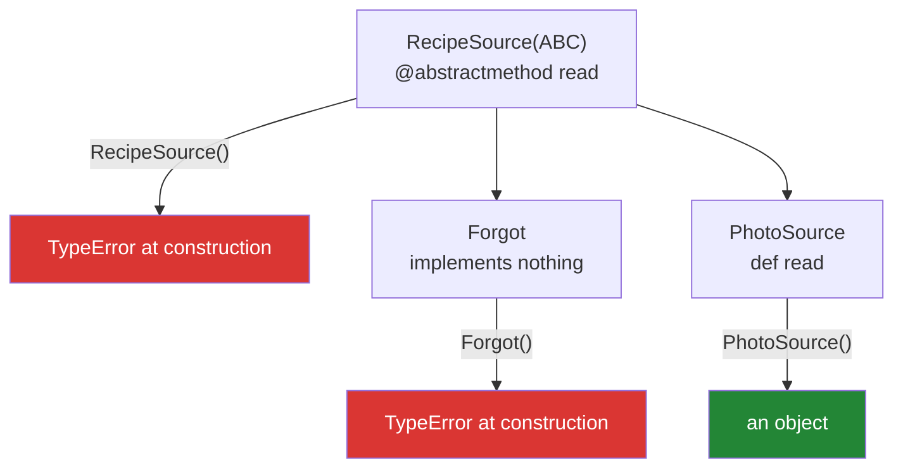

# 4.1 — `abc.ABC` and `@abstractmethod`: the class that refuses to be built

## One-line answer

Marking a method abstract makes Python refuse to create any object of a class that has not
implemented it — so a half-finished source fails the moment somebody tries to build one, rather than
half way through the batch.

---

## The story

The recipe counter takes on a fourth kind of source, and somebody starts the paperwork for it.

They fill in the name, the contact, and the box that says how the recipes arrive. They leave the box
that says *how to read one* empty, because they have not worked it out yet, and they file the form.

Two weeks later the batch runs. The first three sources read fine. The fourth reaches the front of the
queue, somebody looks at the form for the instruction, and there is nothing there. The batch stops
with a hundred and twelve recipes done and eighty-four to go, and the person who filed the form is on
holiday.

```text
Monday    a photo of a page   -> squint at the page
Wednesday typed into a message -> split the lines
Friday    a link              -> open it first
Sunday    a voice note        ->
```

The counter's fix is a stamp on the pigeonhole: **a form with that box empty does not get filed.** It
is refused at the desk, in front of the person who filled it in, while they can still say what goes in
the box. Nothing about the batch changes. The failure simply moves two weeks earlier and lands on
somebody who can do something about it.

---

## The idea in plain language

An **abstract base class** is a class that declares what its subclasses must provide and cannot itself
be instantiated. An **abstract method** is a method declared on it with no useful body, which every
concrete subclass has to implement.

Python's version is in the standard library, in the `abc` module — *Abstract Base Classes*:

```
from abc import ABC, abstractmethod

class BaseLoader(ABC):
    @abstractmethod
    def load(self):
        ...
```

Two pieces, and both are needed:

- **`ABC`** as a base class. It brings in the machinery that does the checking. (The older spelling is
  `metaclass=ABCMeta`; `ABC` is the same thing with a friendlier name.)
- **`@abstractmethod`** on each method that must be implemented. It marks the name; the machinery
  collects the marks.

What you get is one specific behaviour: **`SomeClass()` raises `TypeError` if any abstract method is
unimplemented** — for the base itself, and for any subclass that missed one. The check happens at
instantiation, so the failure is at the earliest moment somebody could have made a mistake with it.

Compare that with the placeholder used up to now:

```
def load(self):
    raise NotImplementedError
```

That also fails, and it fails **when the method is called**, which may be after a hundred and twelve
records ([2.1](../02-polymorphism/2.1-one-name-three-behaviours.md)'s failure section is exactly
this). Abstract methods move the failure from "somewhere in the batch" to "the line that built the
object".

Three details worth knowing before you use it:

- **The abstract method may have a body**, and a subclass can call it with `super()`. That is useful
  for a partial default: the base does the shared half, the subclass must still declare it.
- **`@abstractmethod` goes innermost** when stacked with other decorators —
  `@property` above `@abstractmethod`, not below. The wrong order fails at import with a message
  about `__isabstractmethod__`, which the failure section below shows in full.
- **It checks names, not behaviour.** A subclass with a `load` that returns nonsense satisfies `abc`
  completely. `abc` enforces [1.4](../01-inheritance/1.4-overriding-and-the-broken-promise.md)'s
  signature question halfway and [2.3](../02-polymorphism/2.3-liskov-in-plain-words.md)'s contract not
  at all.

---

## Why Setu needs it

- **The plan's example for `PY-15` is exactly this**: *an ABC that refuses to instantiate until
  `.load()` is implemented*. [4.2](4.2-the-loader-family.md) is where it gets built for real.
- **Every base class so far has had a `raise NotImplementedError` placeholder**
  ([1.5](../01-inheritance/1.5-composition-over-inheritance.md),
  [2.1](../02-polymorphism/2.1-one-name-three-behaviours.md)). This is the replacement, and the
  documents were written in that order on purpose.
- **Phase 2's deliverable includes a `Paper` class hierarchy.** A hierarchy whose base cannot be
  instantiated is a hierarchy where "the base leaked into the list" cannot happen.
- **Day 26's MCP servers and Day 22's LangGraph both hand you base classes to subclass**, and both
  use this mechanism. When one of them says `TypeError: Can't instantiate abstract class`, this is
  what happened.

---

## The mechanism

The refusal, at both levels:

```python
"""The base refuses. So does a subclass that forgot."""

from abc import ABC, abstractmethod


class RecipeSource(ABC):
    """Every source must say how to read one."""

    def __init__(self, name):
        self.name = name

    @abstractmethod
    def read(self):
        """Return a list of ingredient strings."""

    def describe(self):
        """Concrete: every subclass gets this for free."""
        return f"{self.name} ({type(self).__name__})"


class PhotoSource(RecipeSource):
    def read(self):
        return ["flour", "water"]


class Forgot(RecipeSource):
    """Implements nothing. Cannot be built."""


print("concrete works:", PhotoSource("Monday").describe(), PhotoSource("Monday").read())

for cls in (RecipeSource, Forgot):
    try:
        cls("x")
    except TypeError as error:
        print(f"{cls.__name__:14}: {error}")
```

Run on Python 3.12.12 on 2026-09-01:

```
concrete works: Monday (PhotoSource) ['flour', 'water']
RecipeSource  : Can't instantiate abstract class RecipeSource without an implementation for abstract method 'read'
Forgot        : Can't instantiate abstract class Forgot without an implementation for abstract method 'read'
```

**Line by line:**

- `class RecipeSource(ABC):` — inheriting from `ABC` is what turns the marks below into enforcement.
  Without it, `@abstractmethod` is decoration and everything instantiates fine.
- `@abstractmethod` above `def read` — one decorator, one line, and it is the whole declaration.
- The method's body is **just a docstring**. No `raise`, no `pass`, no `...` — the docstring is the
  body, and it is the right one because it is where the contract goes
  ([2.3](../02-polymorphism/2.3-liskov-in-plain-words.md)).
- `def describe(self):` — **not abstract**, so every subclass gets it. An abstract base is normally a
  mix: a few methods that must be provided and several that are shared.
- `class Forgot(RecipeSource):` with an empty body — it inherits the abstract mark, so it is abstract
  too. **Forgetting is the default**, which is the property that makes this useful.
- Both `TypeError` messages name the class **and the missing method**. Compare with
  [2.1](../02-polymorphism/2.1-one-name-three-behaviours.md)'s bare `NotImplementedError`, which names
  neither.
- Crucially, `cls("x")` is where it fails: **at construction**, before any batch has started.

Where the failure moves to:

```python
"""The same mistake, with a placeholder and with an abstract method."""

from abc import ABC, abstractmethod


class PlaceholderBase:
    def read(self):
        raise NotImplementedError


class AbstractBase(ABC):
    @abstractmethod
    def read(self): ...


class ForgotPlaceholder(PlaceholderBase):
    pass


class ForgotAbstract(AbstractBase):
    pass


def run_batch(builders):
    """Build them all, then read them all - the shape of a real job."""
    sources = [build() for build in builders]
    done = 0
    for source in sources:
        source.read()
        done += 1
    return done


print("with a placeholder:")
try:
    run_batch([ForgotPlaceholder, ForgotPlaceholder])
except NotImplementedError:
    print("  NotImplementedError - both objects were built first")

print("with an abstract method:")
try:
    run_batch([ForgotAbstract, ForgotAbstract])
except TypeError as error:
    print("  TypeError -", error)
```

Run on Python 3.12.12 on 2026-09-01:

```
with a placeholder:
  NotImplementedError - both objects were built first
with an abstract method:
  TypeError - Can't instantiate abstract class ForgotAbstract without an implementation for abstract method 'read'
```

**Line by line:**

- `def run_batch(builders):` — building first and reading second, which is what a real job does:
  construct everything from configuration, then process.
- With the placeholder, **both objects exist** before anything fails, and the failure is in the
  reading loop. In a job that writes as it goes, output has already been produced.
- With the abstract method, the failure is in the **first line** of `run_batch`, inside the
  comprehension, before `done` is even initialised.
- `@abstractmethod def read(self): ...` — the `...` here is `Ellipsis`, used as a "no body" marker.
  It is common in `Protocol` and abstract definitions
  ([4.3](4.3-protocol-versus-abc.md)); a docstring is better, because it carries the contract.
- The two messages are the argument for the whole document: one names nothing, the other names the
  class and the method.

A partial default, which is the pattern people miss:

```python
"""An abstract method with a body a subclass can call."""

from abc import ABC, abstractmethod


class RecipeSource(ABC):
    @abstractmethod
    def steps(self):
        """Every source must implement this. It may call super() for the shared half."""
        return ["write down where it came from"]


class PhotoSource(RecipeSource):
    def steps(self):
        return super().steps() + ["squint at the page"]


class LinkSource(RecipeSource):
    def steps(self):
        return ["open the link"]


for source in (PhotoSource(), LinkSource()):
    print(f"{type(source).__name__:14}", source.steps())
```

Run on Python 3.12.12 on 2026-09-01:

```
PhotoSource    ['write down where it came from', 'squint at the page']
LinkSource     ['open the link']
```

**Line by line:**

- The abstract method **has a real body** and is still abstract: `abc` looks at the mark, not at
  whether anything was written.
- `super().steps()` from `PhotoSource` runs it
  ([1.2](../01-inheritance/1.2-super-and-the-init-that-runs-twice.md)), so the shared half is written
  once and each subclass chooses whether to use it.
- `LinkSource` ignores it entirely, which is allowed. **The requirement is "you must declare this",
  not "you must call super"** — and if calling super is genuinely required, that is a contract for the
  docstring and a test, not something `abc` can enforce.
- This is the pattern for "there is a sensible default, and I still want you to think about it": a
  plain concrete method would let a subclass forget the question exists.



---

## When it breaks

**The base that refuses, which is the point:**

```text
$ uv run python -c "
from abc import ABC, abstractmethod
class BaseLoader(ABC):
    @abstractmethod
    def load(self): ...
BaseLoader()
"
Traceback (most recent call last):
  File "<string>", line 6, in <module>
TypeError: Can't instantiate abstract class BaseLoader without an implementation for abstract method 'load'
```

**What it means.** Working as designed. The message names the class and the method, so somebody who
has never seen the file knows what to write. Note that the class **imported fine** — abstractness is
checked when you build an instance, not when the module loads, so an abstract class can be imported,
subclassed and referenced freely.

**`@abstractmethod` with no `ABC` base:**

```text
$ uv run python -c "
from abc import abstractmethod
class BaseLoader:
    @abstractmethod
    def load(self): ...
class Forgot(BaseLoader): pass
f = Forgot()
print('built anyway:', f)
print('and calling it gives:', f.load())
"
built anyway: <__main__.Forgot object at 0x000001EE22F3A930>
and calling it gives: None
```

**What it means. The decorator did nothing.** Without `ABC` (or `metaclass=ABCMeta`) there is no
machinery to act on the mark, so the class instantiates, `load()` runs the empty body and returns
`None`, and the whole safety net was decoration. This is silent, it looks correct in the source, and
it is the most common mistake with `abc`. **If a class has `@abstractmethod`, check its base line.**

**The decorators stacked the wrong way:**

```text
$ uv run python -c "
from abc import ABC, abstractmethod
class Base(ABC):
    @abstractmethod
    @property
    def name(self): ...
"
  File "<string>", line 4, in Base
  File "<frozen abc>", line 24, in abstractmethod
AttributeError: attribute '__isabstractmethod__' of 'property' objects is not writable
```

**What it means.** `@abstractmethod` works by setting a flag on the object below it, and a `property`
object will not accept one — so this order fails at **class-creation time**, when the module is
imported. That is a good failure and a lucky one: the correct order is `@property` on top and
`@abstractmethod` directly above the `def`, and here Python refuses the wrong one outright rather
than silently producing a class that is not abstract. Read the message as "these two are the wrong way
round" and swap them.

**A subclass that implements the wrong name:**

```text
$ uv run python -c "
from abc import ABC, abstractmethod
class Base(ABC):
    @abstractmethod
    def load(self): ...
class Typo(Base):
    def laod(self): return ['x']
Typo()
"
Traceback (most recent call last):
  File "<string>", line 8, in <module>
TypeError: Can't instantiate abstract class Typo without an implementation for abstract method 'load'
```

**What it means.** This is the typo from
[1.4](../01-inheritance/1.4-overriding-and-the-broken-promise.md) — which was completely silent there
— caught at construction and named. **`abc` is the cheapest defence against a misspelled override**
that exists before a type checker arrives, and it is a genuine reason to prefer it over a
`NotImplementedError` placeholder.

---

## In production

**The professional shape is a small abstract base with one or two abstract methods and a few shared
concrete ones.** The abstract methods are the interface; the concrete ones are the shared plumbing
every implementation would otherwise repeat. Bases that grow past three or four abstract methods are
asking a lot of every implementer, and the usual fix is to split the interface so a subclass declares
only what it actually varies.

**What changes at scale is that the base class is a contract with people you will never meet.** A
plugin interface with an abstract `load` means every plugin author gets a `TypeError` naming the
missing method, at import-and-construct time in their own tests, rather than a `NotImplementedError`
from inside your batch job. That difference is worth a great deal of support time, and it is why every
serious plugin system in Python is built this way.

**The failure that only appears with real implementers is the contract `abc` cannot check.** It
guarantees the method exists and nothing else — not that it returns a list, not that it raises the
right exception, not that it is safe to call twice. A plugin whose `load` returns `None` satisfies
`abc` perfectly and breaks the pipeline
([2.3](../02-polymorphism/2.3-liskov-in-plain-words.md)). The professional answer is a documented
contract on the abstract method's docstring plus a **conformance test** the implementer can run
against their own class — which is
[1.4](../01-inheritance/1.4-overriding-and-the-broken-promise.md)'s parametrised test, published as
part of the interface.

**The review comment a senior engineer leaves.** On a base class with `raise NotImplementedError` in
three methods: *"Make these `@abstractmethod` and add `ABC` to the base. Same intent, and the failure
moves from the middle of a batch to the line that constructs the object — with a message that names
the missing method. Also check the base line: `@abstractmethod` without `ABC` is silently inert, which
is what we had in the retry module for a year."*

**The interview question.** *"What does `abc` give you over raising `NotImplementedError`?"* The
answer that lands is about *when*: `abc` refuses at instantiation, so a class missing a method cannot
be built at all, and the error names the class and the method — whereas the placeholder fails when
the method is called, which in a batch job is after work has already been done. Adding that it catches
a misspelled override, that it enforces names and not behaviour, and that `@abstractmethod` without an
`ABC` base is silently inert, covers the three things people actually get wrong.

---

## Check yourself

```bash
uv run python -c "
from abc import ABC, abstractmethod

class RecipeSource(ABC):
    def __init__(self, name): self.name = name
    @abstractmethod
    def read(self):
        '''Return a list of ingredient strings.'''
    def describe(self): return f'{self.name} ({type(self).__name__})'

class PhotoSource(RecipeSource):
    def read(self): return ['flour', 'water']

class Forgot(RecipeSource): pass

print('works:', PhotoSource('Monday').describe(), PhotoSource('Monday').read())
for cls in (RecipeSource, Forgot):
    try:
        cls('x')
    except TypeError as e:
        print(f'{cls.__name__:14}: {e}')
"
```

Now delete `ABC` from the base's brackets and run it again. Say what changes, and why that makes
checking the base line a habit worth having.

**Answer out loud, without scrolling up:**

> Say when an abstract class refuses to be instantiated and what the message tells you. Then name the
> two things `@abstractmethod` does not check.

---

**Next:** [4.2 — `BaseLoader` → `TextLoader`, `HTMLLoader`](4.2-the-loader-family.md), which is the
plan's own example and the day's build.
