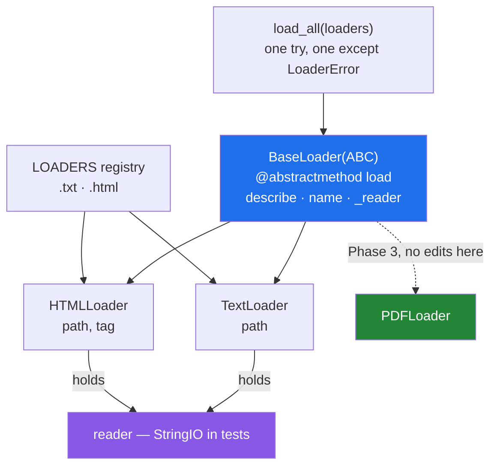

# 4.2 — `BaseLoader` → `TextLoader`, `HTMLLoader`: the loader family

## One-line answer

The day's build is one abstract base that fixes the contract, two or three concrete loaders that
each know one format, and a caller that loops over all of them without knowing which is which — and
every design decision in it came from an earlier part of this day.

---

## The story

The recipe counter finally writes the arrangement down, on one card pinned above the pigeonholes.

```text
EVERY SOURCE MUST SAY:
  how to read one       ->  a list of ingredients, and nothing else

EVERY SOURCE GETS:
  a name
  somewhere to note what it read
  a way to describe itself
```

Six lines. The top half is what each source has to provide; the bottom half is what the counter
provides to all of them. A new kind of source reads the card, writes the one thing, and is finished.

The three that exist:

```text
Monday    a photo of a page
Wednesday typed into a message
Friday    a link
```

The card is short on purpose. An earlier draft listed nine things every source had to provide and
nobody could face filling one in. The counter learned that the more it demands of a new source, the
fewer new sources there are.

---

## The idea in plain language

This part builds the plan's named example for `PY-14` and `PY-15` — `BaseLoader` → `PDFLoader`,
`HTMLLoader`, and an ABC that refuses to instantiate until `.load()` is implemented — as
`src/setu/loaders/`.

Every decision in it was made by an earlier part, and the point of this document is to see them
together:

| Decision | Made in |
|---|---|
| `BaseLoader` is abstract, so a half-written loader cannot be built | [4.1](4.1-abc-and-abstractmethod.md) |
| Exactly one abstract method, `load` | [4.1](4.1-abc-and-abstractmethod.md), *keep the base small* |
| `load` returns `list[Paper]`, always — empty, never `None` | [1.4](../01-inheritance/1.4-overriding-and-the-broken-promise.md) |
| Every loader raises only `LoaderError` and its subclasses | [2.3](../02-polymorphism/2.3-liskov-in-plain-words.md) |
| The extra a loader needs goes in `__init__`, not in `load` | [2.3](../02-polymorphism/2.3-liskov-in-plain-words.md) |
| The subclass calls `super().__init__(...)` first | [1.2](../01-inheritance/1.2-super-and-the-init-that-runs-twice.md) |
| The reader is *held*, not inherited, so a test can pass a fake | [1.5](../01-inheritance/1.5-composition-over-inheritance.md) |
| The held reader is `_reader` | [3.1](../03-encapsulation/3.1-public-protected-private.md) |
| The caller loops without an `isinstance` in sight | [2.1](../02-polymorphism/2.1-one-name-three-behaviours.md) |
| Loaders produce `Paper` objects, validated at construction | [Day 12, 3.2](../../../day-12-classes/parts/03-the-paper-object/3.2-validation-in-init.md) |

Two words for the shape. A **family** of classes shares one base and is used interchangeably. A
**registry** is the mapping from something in the data — a file extension, a configuration name — to
the class that handles it, and it is what turns "add a class" into "add a class and one line".

One thing to be clear about before building it: **the base holds the contract and almost no code.**
Every method that is not `load` is there because all three loaders would otherwise repeat it, and
there are only two of those. A base class that grows is the failure
[1.5](../01-inheritance/1.5-composition-over-inheritance.md) warns about.

---

## Why Setu needs it

- **It is Phase 2's deliverable, started.** *A `Paper` class hierarchy plus custom exceptions plus an
  async fetcher, tested* — this is the hierarchy, and Day 18 adds the exceptions and Day 19 the async
  fetcher.
- **Day 27 reads real datasets** and Day 162 loads a corpus for retrieval. Both are this shape with a
  real parser inside each loader, and both will add a format after the caller was written.
- **Principle 5 means every test runs offline.** The held reader is what makes that possible: a test
  passes a fake and no loader touches a disk or a network.
- **Principle 9 says data has provenance.** Each loader sets `source` on the papers it produces, so a
  `Paper` can always answer where it came from
  ([Day 12, 3.1](../../../day-12-classes/parts/03-the-paper-object/3.1-designing-paper.md)).

---

## The mechanism

The base — the contract, and nothing else. **The `TODO(me)` bodies are yours** (Principle 6):

```python
"""src/setu/loaders/base.py - what every loader must provide, and what they all get."""

from __future__ import annotations

from abc import ABC, abstractmethod

from setu.paper import Paper


class LoaderError(Exception):
    """Anything a loader raises is this or a subclass of it (part 2.3, rule 3)."""


class BaseLoader(ABC):
    """A source of Papers.

    Subclasses implement load(). Everything else is provided.

    The contract for load(), which abc cannot enforce (part 4.1):
        returns:  list[Paper], possibly empty. NEVER None.
        raises:   LoaderError, or a subclass of it. Nothing else.
        promises: calling it twice is safe and gives the same answer.
    """

    def __init__(self, name: str, reader) -> None:
        """Store the loader's name and the thing it reads with.

        `reader` is held rather than inherited (part 1.5) so a test can pass a
        fake and no loader ever touches a disk or a network by itself.
        """
        self.name = name
        self._reader = reader

    @abstractmethod
    def load(self) -> list[Paper]:
        """Return every Paper this source can produce. See the class docstring."""

    def describe(self) -> str:
        """Concrete: every loader gets this."""
        return f"{self.name} ({type(self).__name__})"
```

**Line by line:**

- `class LoaderError(Exception):` — declared **in the same file as the base**, because it is part of
  the contract: rule 3 of [2.3](../02-polymorphism/2.3-liskov-in-plain-words.md) says a subclass may
  not raise types the base did not, so the base has to name one. Day 18 builds this hierarchy
  properly; one class is enough today.
- `class BaseLoader(ABC):` — `ABC`, not a plain class, or the `@abstractmethod` below is inert
  ([4.1](4.1-abc-and-abstractmethod.md)).
- **The class docstring carries the contract**: returns, raises, promises. Three lines that `abc`
  cannot check and a reviewer can, and the only place the "safe to call twice" guarantee is written
  down.
- `def __init__(self, name: str, reader) -> None:` — `reader` has no annotation on purpose. Anything
  with the method the loaders call will do
  ([2.2](../02-polymorphism/2.2-duck-typing-and-isinstance.md)), and
  [4.3](4.3-protocol-versus-abc.md) is where that gets written down for a type checker.
- `self._reader` — one underscore
  ([3.1](../03-encapsulation/3.1-public-protected-private.md)): swapping it is the loaders' business.
- `@abstractmethod def load(self) -> list[Paper]:` — **one** abstract method. A new loader author has
  exactly one thing to write.
- `def describe(self):` — concrete, so every loader gets it. Two shared methods is the whole of the
  base's code, which is the point.

Two concrete loaders:

```python
"""src/setu/loaders/text.py and html.py - one format each, one method each."""

from __future__ import annotations

from setu.loaders.base import BaseLoader, LoaderError
from setu.paper import Paper


class TextLoader(BaseLoader):
    """One title per line, in a plain text file."""

    def __init__(self, name: str, reader, path: str) -> None:
        super().__init__(name, reader)
        self.path = path

    def load(self) -> list[Paper]:
        # TODO(me): read with self._reader, one Paper per non-empty line.
        # Return [] for an empty file - part 1.4 says why None is not an option.
        # Wrap anything the reader raises in LoaderError, or part 2.3's rule 3
        # is broken and the caller's handler misses it.
        raise NotImplementedError


class HTMLLoader(BaseLoader):
    """Titles inside <h2> tags. The parser is deliberately naive today."""

    def __init__(self, name: str, reader, path: str, tag: str = "h2") -> None:
        super().__init__(name, reader)
        self.path = path
        self.tag = tag

    def load(self) -> list[Paper]:
        # TODO(me): find the tag contents. Methods before regex - day 7 part 4.3
        # - and no html library today; Phase 3 is where a real parser arrives.
        # Same three rules as TextLoader: list, LoaderError, safe twice.
        raise NotImplementedError
```

**Line by line:**

- `def __init__(self, name, reader, path):` — **the extra each loader needs is a constructor
  argument**, not a parameter on `load`. That is
  [2.3](../02-polymorphism/2.3-liskov-in-plain-words.md)'s rule 1: `load()` keeps the shared
  no-argument signature, so the caller's loop never changes.
- `super().__init__(name, reader)` — **first line**
  ([1.2](../01-inheritance/1.2-super-and-the-init-that-runs-twice.md)), so `self.name` and
  `self._reader` exist before anything else runs.
- `tag: str = "h2"` — an *optional* extra with a default, which is
  [2.3](../02-polymorphism/2.3-liskov-in-plain-words.md)'s "accept more, never less" applied to a
  constructor.
- Both `load` methods have the **same signature** — `(self) -> list[Paper]` — which is what makes the
  caller's loop possible.
- The `TODO(me)` comments name three rules each and do none of them. The rule about wrapping the
  reader's exceptions is the one people skip, and it is the one that breaks the caller's `try`.
- `TextLoader` and `HTMLLoader` rather than the plan's `PDFLoader`: a PDF needs a library, and Module
  2 is still the language. The shape is identical, and Phase 3 can add `PDFLoader` without touching
  anything here — which is the property being demonstrated.

The caller, and the registry:

```python
"""src/setu/loaders/__init__.py - the caller's loop, and where a new format plugs in."""

from __future__ import annotations

from setu.loaders.base import BaseLoader, LoaderError
from setu.loaders.html import HTMLLoader
from setu.loaders.text import TextLoader
from setu.paper import Paper

LOADERS: dict[str, type[BaseLoader]] = {
    ".txt": TextLoader,
    ".html": HTMLLoader,
}


def load_all(loaders: list[BaseLoader]) -> tuple[list[Paper], list[str]]:
    """Load from every loader. Return the papers and the failures.

    Does not stop at the first failure: a bad source should not lose the good
    ones (day 12, part 3.2's bulk-loading rule).
    """
    papers: list[Paper] = []
    failures: list[str] = []
    for loader in loaders:
        try:
            papers.extend(loader.load())
        except LoaderError as error:
            failures.append(f"{loader.describe()}: {error}")
    return papers, failures
```

**Line by line:**

- `LOADERS: dict[str, type[BaseLoader]]` — the **registry**: extension to class. `type[BaseLoader]`
  means "the class itself, not an instance", which is the annotation for a dictionary of classes.
- Adding `".pdf": PDFLoader` is **one line**, and nothing else in this file changes. That single line
  is the difference between this design and a branch chain
  ([2.1](../02-polymorphism/2.1-one-name-three-behaviours.md)).
- `for loader in loaders:` with `loader.load()` inside — **no `isinstance`, no `if`, no knowledge of
  which class.** The loop was written before `HTMLLoader` existed and will not change when
  `PDFLoader` arrives.
- `except LoaderError as error:` — one handler for every loader, which works **only** because rule 3
  is obeyed. A loader that lets a raw `ValueError` escape breaks this line, and the `try` will not
  catch it.
- `papers.extend(loader.load())` — `extend` rather than `append`, so a loader returning `[]`
  contributes nothing and raises nothing
  ([1.4](../01-inheritance/1.4-overriding-and-the-broken-promise.md)'s empty-list rule paying off
  again).
- **Failures are collected, not raised.** One unreadable file does not lose the other four thousand
  papers, and the caller gets a list it can print or log. That is the bulk-loading shape from
  [Day 12, 3.2](../../../day-12-classes/parts/03-the-paper-object/3.2-validation-in-init.md)'s
  production section.

The tests, which are the deliverable:

```python
"""tests/test_loaders.py - the same assertions against every loader in the family."""

from __future__ import annotations

import io

import pytest

from setu.loaders import LOADERS, load_all
from setu.loaders.base import BaseLoader, LoaderError
from setu.paper import Paper


def make(cls, text):
    """Build any loader over an in-memory reader. No disk, no network."""
    # TODO(me): one line. io.StringIO(text) is the fake reader (part 1.5), and
    # this helper is why every test below is two lines long.
    raise NotImplementedError


@pytest.mark.parametrize("cls", list(LOADERS.values()))
def test_every_loader_returns_a_list_of_papers(cls) -> None:
    """Part 1.4: the contract, asserted against every member of the family."""
    # TODO(me): assert isinstance(result, list) and that every item is a Paper.
    # This test is what a new loader has to pass before it is added to LOADERS.
    raise NotImplementedError


@pytest.mark.parametrize("cls", list(LOADERS.values()))
def test_every_loader_returns_an_empty_list_for_empty_input(cls) -> None:
    """Never None - part 1.4's most common violation."""
    # TODO(me): assert result == [], not `assert not result`. The second passes
    # for None as well, which is the value this test exists to reject.
    raise NotImplementedError


@pytest.mark.parametrize("cls", list(LOADERS.values()))
def test_every_loader_raises_only_loader_error(cls) -> None:
    """Part 2.3, rule 3: the caller's one handler must catch everything."""
    # TODO(me): pass a reader that raises OSError, and assert pytest.raises
    # (LoaderError). A loader that lets the OSError through fails here.
    raise NotImplementedError


@pytest.mark.parametrize("cls", list(LOADERS.values()))
def test_every_loader_is_safe_to_call_twice(cls) -> None:
    """The promise in the base's docstring, made executable."""
    # TODO(me): call load() twice and assert the two results are equal. A loader
    # that consumes its reader passes the first call and fails the second -
    # day 11 part 1.3 is why.
    raise NotImplementedError


def test_base_loader_cannot_be_instantiated() -> None:
    """Part 4.1: the abstract base refuses."""
    # TODO(me): pytest.raises(TypeError). Then assert on the MESSAGE - it names
    # 'load', and that name is what tells a new loader author what to write.
    raise NotImplementedError


def test_load_all_keeps_the_good_papers_when_one_loader_fails() -> None:
    """One bad source must not lose the others."""
    # TODO(me): one working loader and one whose reader raises. Assert the
    # papers from the good one survive AND that failures has one entry naming
    # the bad loader.
    raise NotImplementedError
```

**Line by line:**

- `def make(cls, text):` — one helper, so every test is two lines. **Every loader takes the same
  constructor shape**, which is what makes a shared helper possible at all.
- `io.StringIO(text)` as the reader — the fake from
  [1.5](../01-inheritance/1.5-composition-over-inheritance.md), and the reason none of these tests
  touches a disk (Principle 5).
- `@pytest.mark.parametrize("cls", list(LOADERS.values()))` — **the same four tests run against every
  loader in the registry.** Adding `PDFLoader` to `LOADERS` automatically subjects it to all four,
  which is the mechanism that makes "adding a class" safe.
- `assert result == []` rather than `assert not result` — the comment says why, and it is the
  difference between a test that rejects `None` and one that accepts it.
- The `raises only LoaderError` test is the one people leave out, and it is the one that protects
  `load_all`'s single `except`.
- The `safe to call twice` test catches a loader that iterates its reader without resetting — the
  exhaustion bug from
  [Day 11, 1.3](../../../day-11-iterators-and-generators/parts/01-iterators/1.3-exhaustion.md),
  reappearing in a completely different context.
- `test_base_loader_cannot_be_instantiated` asserts on the **message**, not only the exception,
  because the message naming `load` is what makes the base self-documenting for the next author.



---

## When it breaks

**A loader added to the registry before it works:**

```text
$ uv run python -m pytest tests/test_loaders.py -q
E   TypeError: Can't instantiate abstract class PDFLoader without an implementation for abstract method 'load'
4 failed, 20 passed
```

**What it means.** The parametrised tests picked the new class up from `LOADERS` automatically and
all four failed at construction. That is the design working: a loader cannot reach the registry
without passing the family's contract tests, and the failure names the missing method
([4.1](4.1-abc-and-abstractmethod.md)).

**A loader that lets its own exception escape:**

```text
$ uv run python -c "
class LoaderError(Exception): pass
class Loader:
    def load(self): raise OSError('file gone')
loaders = [Loader()]
papers = []
for loader in loaders:
    try:
        papers.extend(loader.load())
    except LoaderError as error:
        papers.append(str(error))
print(papers)
"
Traceback (most recent call last):
  File "<string>", line 8, in <module>
  File "<string>", line 4, in load
OSError: file gone
```

**What it means.** The `except LoaderError` did not catch an `OSError`, so it escaped `load_all`
entirely and killed the batch. Rule 3 of
[2.3](../02-polymorphism/2.3-liskov-in-plain-words.md), broken by one loader, taking down a caller
that handles every documented failure correctly. The fix is inside the loader:
`raise LoaderError(...) from error`, which keeps the original as the cause.

**The loader that worked once:**

```text
$ uv run python -c "
import io
h = io.StringIO('The Kitchen Table\nWeeknight Bread\n')
first = [l.strip() for l in h]
second = [l.strip() for l in h]
print((first, second))
"
(['The Kitchen Table', 'Weeknight Bread'], [])
```

**What it means.** A loader holding an open handle and iterating it directly is consumed by the first
`load()` — [Day 11, 1.3](../../../day-11-iterators-and-generators/parts/01-iterators/1.3-exhaustion.md)'s
exhaustion, in a class. Everything passes in a test that calls `load()` once. The fix is either to
`seek(0)` at the start of `load`, or to hold a path and open inside `load` — and the choice is worth
making deliberately, because the second breaks the `StringIO` testing seam.

**A base class that grew:**

```text
$ grep -c "    def " src/setu/loaders/base.py
11
$ grep -c "    def " src/setu/loaders/text.py
2
```

**What it means.** Eleven methods on the base and two on the loader that uses it. Behaviour has been
pushed up one method at a time, each time two loaders shared something, and the base is now the
program. The signal is a base larger than its children
([1.5](../01-inheritance/1.5-composition-over-inheritance.md)), and the fix is to move the shared
behaviour into a held object or a plain function that the loaders call.

---

## In production

**The professional version of this is what every serious loader, driver and plugin system looks
like:** a small abstract base with one or two methods, a registry mapping data to classes, and a
caller that never mentions a concrete type. `pandas` readers, database drivers under the DB-API,
`importlib` loaders and LangChain's document loaders are all this shape, and recognising it is worth
more than any single one of them.

**What changes at scale is that the family is written by people who never meet.** Once the registry
is loaded from configuration or from entry points, a loader can arrive from another package
entirely — and then the contract, the base class docstring and the published conformance tests are
the entire interface. Shipping the parametrised tests **as part of the package** so a third-party
loader can run them against itself is what separates a plugin system that works from one that
generates support tickets.

**The failure that only appears with real data is a loader that is slow rather than wrong.** All four
satisfy the contract; one of them reads the whole file into memory where the others stream
([Day 11, 2.3](../../../day-11-iterators-and-generators/parts/02-generators/2.3-streaming-a-file.md)),
and the batch that worked on samples dies on the real export. Performance is part of the contract and
`abc` cannot express it, so it belongs in the base's docstring — *"load() must not hold the whole
source in memory"* — and in a memory test in the conformance suite.

**The review comment a senior engineer leaves.** On a new loader whose `load` takes an `encoding`
argument: *"`load()` has to keep the base's signature or `load_all` cannot call it — put `encoding`
in `__init__` with a default. And wrap the `UnicodeDecodeError`: right now it escapes our one
`except LoaderError` and takes the whole batch down for one bad file."*

**The interview question.** *"How would you design a system that loads from several sources?"* The
answer that lands describes the shape and the reasons: an abstract base fixing one method and the
contract, concrete classes holding whatever they read with rather than inheriting it, a registry so
adding a format is one line, and a caller that collects failures instead of stopping. Adding that the
same tests run against every implementation, and that the base's exception type is what lets the
caller have one handler, is the part that shows you have maintained one rather than drawn one.

---

## Check yourself

```bash
uv run python -c "
from abc import ABC, abstractmethod
import io

class LoaderError(Exception): pass

class BaseLoader(ABC):
    def __init__(self, name, reader): self.name = name; self._reader = reader
    @abstractmethod
    def load(self): ...
    def describe(self): return f'{self.name} ({type(self).__name__})'

class TextLoader(BaseLoader):
    def load(self):
        try:
            return [l.strip() for l in self._reader.read().splitlines() if l.strip()]
        except OSError as e:
            raise LoaderError(str(e)) from e

class Broken(BaseLoader): pass

t = TextLoader('Monday', io.StringIO('The Kitchen Table\n\nWeeknight Bread\n'))
print('describe :', t.describe())
print('load     :', t.load())
print('twice    :', t.load())
try:
    Broken('x', None)
except TypeError as e:
    print('broken   :', e)
"
```

The second `load()` returns an empty list. Say which rule in the base's docstring that breaks, and
which one-word change to `TextLoader.load` would fix it.

**Answer out loud, without scrolling up:**

> Name three decisions in this design and the earlier part that made each one. Then say what a new
> format costs — how many files, and how many existing lines change.

---

**Next:** [4.3 — `Protocol` versus ABC](4.3-protocol-versus-abc.md), the last document of the day and
the alternative to requiring inheritance at all.
