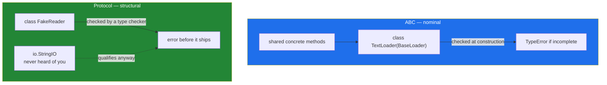

# 4.3 — `Protocol` versus ABC: when to require nothing at all

## One-line answer

An ABC says "inherit from me and I will check you at construction"; a `Protocol` says "have these
methods and a type checker will check you before it ships" — so an ABC is right when you own the
implementations, and a `Protocol` when you do not.

---

## The story

The recipe counter has two different arrangements with two different sets of people, and it took a
while to notice they were different.

For its **own three sources**, there is the pinned card and the pigeonholes: fill in the form, and a
form with an empty box is refused at the desk. The counter controls all three, the form is short, and
refusing one at the desk costs nothing.

For the **neighbour with the hand-written card**, there is no form and there never will be. Nobody is
going to ask a neighbour to register. The counter simply reads what it is given, and the only
question that matters is *can this be read out loud?*

```text
own sources      Monday · Wednesday · Friday   -> the form, refused if incomplete
anybody else     the neighbour's card          -> just needs to be readable
```

Both arrangements are right. Insisting the neighbour fill in a form would lose a good recipe; not
having a form for the three regular sources would mean discovering a missing instruction in the
middle of a batch.

---

## The idea in plain language

Python has both arrangements, and choosing between them is the last design decision of this day.

**An ABC** ([4.1](4.1-abc-and-abstractmethod.md)) is **nominal**: it works by name. A class is a
`BaseLoader` because it says `class TextLoader(BaseLoader)`. The check happens **at run time, at
construction**, and it is a hard refusal.

**A `Protocol`** is **structural**: it works by shape. A class satisfies `Loadable` if it has the
right methods, whether or not it has ever heard of `Loadable`. The check happens **at build time, by
a type checker**, and at run time nothing happens at all.

`Protocol` was added to the language by *PEP 544 — Protocols: Structural subtyping (static duck
typing)* (2017, <https://peps.python.org/pep-0544/>), and the parenthesis in that title is the whole
idea: duck typing ([2.2](../02-polymorphism/2.2-duck-typing-and-isinstance.md)) that a tool can check
before the program runs.

The trade, laid out:

| | ABC | `Protocol` |
|---|---|---|
| How a class qualifies | inherits from it | has the methods |
| When it is checked | run time, at construction | build time, by a type checker |
| Can a third party qualify without importing you? | no | yes |
| Can it provide shared code? | yes — concrete methods | no, it is a declaration |
| Failure if unmet | `TypeError` naming the method | a type-checker error, or nothing at run time |
| `isinstance` works? | always | only with `@runtime_checkable`, and only on names |

The rule that follows is short:

- **Use an ABC when you own the implementations and want to share code.**
  [4.2](4.2-the-loader-family.md)'s loaders are yours, and `BaseLoader` gives them `describe` and
  `__init__` for free.
- **Use a `Protocol` when you are describing something you accept from elsewhere.** The `reader`
  parameter in `BaseLoader.__init__` is `io.StringIO` in a test and an open file in production, and
  neither will ever inherit from anything of yours.

Two details that catch people:

- **`isinstance` against a `Protocol` needs `@runtime_checkable`**, and even then it checks only that
  the method *names* exist — not their parameters and not their return types
  ([2.2](../02-polymorphism/2.2-duck-typing-and-isinstance.md)'s last failure is the error you get
  without it).
- **A `Protocol` does nothing at run time.** Nothing is refused, nothing is enforced. Its value is
  entirely in the type checker, which this project adds on Day 19 — so until then a `Protocol` is
  documentation with a machine-readable shape, which is still worth having.

---

## Why Setu needs it

- **[4.2](4.2-the-loader-family.md)'s `reader` parameter has no annotation**, and that document said
  this one would fix it. `Reader` is a two-line `Protocol` and the annotation becomes honest.
- **Day 19 adds typing and Pydantic**, and this is the vocabulary that day assumes. Meeting
  `Protocol` here, next to the ABC it contrasts with, is what stops it being one more piece of
  `typing` syntax.
- **Day 26's MCP work talks to servers you did not write.** Describing "anything that responds to
  these calls" is a `Protocol`; demanding that somebody else's server inherit from your class is not
  an option.
- **Principle 5 means fakes everywhere.** A `Protocol` is how a fake is made legitimate to a type
  checker without inheriting from the real thing, which is the difference between a type checker that
  helps and one people switch off.

---

## The mechanism

The same requirement, both ways:

```python
"""One requirement — 'has a load' — declared nominally and structurally."""

from abc import ABC, abstractmethod
from typing import Protocol, runtime_checkable


class NominalLoader(ABC):
    """You qualify by inheriting."""

    @abstractmethod
    def load(self) -> list[str]: ...


@runtime_checkable
class StructuralLoader(Protocol):
    """You qualify by having the method."""

    def load(self) -> list[str]: ...


class Inherits(NominalLoader):
    def load(self) -> list[str]:
        return ["flour"]


class JustHasIt:
    """Never heard of either declaration."""

    def load(self) -> list[str]:
        return ["water"]


for obj in (Inherits(), JustHasIt()):
    name = type(obj).__name__
    print(
        f"{name:10} nominal={isinstance(obj, NominalLoader):<5} "
        f"structural={isinstance(obj, StructuralLoader)}"
    )
```

Run on Python 3.12.12 on 2026-09-01:

```
Inherits   nominal=1     structural=True
JustHasIt  nominal=0     structural=True
```

**Line by line:**

- `class NominalLoader(ABC):` with `@abstractmethod` — the arrangement from
  [4.1](4.1-abc-and-abstractmethod.md).
- `@runtime_checkable class StructuralLoader(Protocol):` — the decorator is what makes `isinstance`
  legal against it. Without it the `isinstance` calls below raise
  ([2.2](../02-polymorphism/2.2-duck-typing-and-isinstance.md)).
- `def load(self) -> list[str]: ...` in the `Protocol` — the body is `...` because **there is no
  body**. A `Protocol` declares a shape; it never implements anything.
- `class JustHasIt:` — no base class, no import of either declaration.
- `isinstance(obj, NominalLoader)` is `1` for `Inherits` and `0` for `JustHasIt`. The numbers are
  `True` and `False` formatted with `:<5`
  ([Day 4, 1.3](../../../day-04-objects/parts/01-objects/1.3-numbers-and-bool.md) — a bool *is* an
  int, which is why the width format prints digits).
- `isinstance(obj, StructuralLoader)` is `True` for **both**. `JustHasIt` qualifies without knowing
  the protocol exists, which is the whole difference.
- The nominal check is a fact about ancestry; the structural check is a fact about shape.

Where a `Protocol` is the only honest option:

```python
"""Describing something you did not write and cannot change."""

import io
from typing import Protocol


class Reader(Protocol):
    """Anything that can hand back its whole contents as text."""

    def read(self) -> str: ...


class FakeReader:
    """A test double. Inherits nothing."""

    def __init__(self, text: str) -> None:
        self._text = text

    def read(self) -> str:
        return self._text


def count_titles(reader: Reader) -> int:
    """Take anything readable. The annotation says exactly what is needed."""
    return len([line for line in reader.read().splitlines() if line.strip()])


print("StringIO :", count_titles(io.StringIO("The Kitchen Table\n\nWeeknight Bread\n")))
print("fake     :", count_titles(FakeReader("The Kitchen Table\n")))
```

Run on Python 3.12.12 on 2026-09-01:

```
StringIO : 2
fake     : 1
```

**Line by line:**

- `class Reader(Protocol):` with one method — **the annotation `BaseLoader.__init__` was missing**
  ([4.2](4.2-the-loader-family.md)). Two lines, and now `reader` has an honest type.
- `io.StringIO` satisfies it and belongs to the standard library, which will never inherit from
  anything of yours. **That is the case an ABC cannot cover.**
- `FakeReader` satisfies it too, so a type checker accepts the test double without any inheritance —
  which is exactly the point of
  [1.5](../01-inheritance/1.5-composition-over-inheritance.md)'s argument, now visible to a tool.
- `def count_titles(reader: Reader) -> int:` — the annotation is a *requirement*, and it is minimal:
  one method, not "a file". A parameter annotated `TextIO` would demand fifteen methods this function
  never calls, and would reject `FakeReader`.
- The body calls only `read()`. **The protocol should list exactly what the function calls and
  nothing more** — that is the discipline that makes protocols useful rather than another name for
  the concrete type.

The check that does not happen at run time:

```python
"""A Protocol enforces nothing while the program runs."""

from typing import Protocol


class Reader(Protocol):
    def read(self) -> str: ...


def count_titles(reader: Reader) -> int:
    return len(reader.read().splitlines())


class WrongShape:
    """Satisfies the NAME and not the contract: returns a list, not a string."""

    def read(self):
        return ["The Kitchen Table"]


class NoRead:
    pass


try:
    print("wrong shape:", count_titles(WrongShape()))
except AttributeError as error:
    print("wrong shape: AttributeError:", error)

try:
    count_titles(NoRead())
except AttributeError as error:
    print("no read    : AttributeError:", error)
```

Run on Python 3.12.12 on 2026-09-01:

```
wrong shape: AttributeError: 'list' object has no attribute 'splitlines'
no read    : AttributeError: 'NoRead' object has no attribute 'read'
```

**Line by line:**

- `WrongShape.read` returns a **list**, and the annotation said `str`. Nothing checked it, so the
  function ran and failed one line later on `.splitlines()`, which a list does not have.
- **The failure names `list`, not `WrongShape`.** The class that broke the contract is not in the
  message at all; the traceback blames the function that trusted it. That is exactly
  [2.3](../02-polymorphism/2.3-liskov-in-plain-words.md)'s "debugged from the wrong end".
- `NoRead` produces the ordinary `AttributeError` from
  [2.2](../02-polymorphism/2.2-duck-typing-and-isinstance.md). **The `Reader` annotation prevented
  neither call** and improved neither message.
- A type checker would have rejected both **before the program ran** — `WrongShape.read` returns
  `list[str]` where `str` was declared, and `NoRead` has no `read` at all. That rejection is the
  entire value of the `Protocol`, and this project does not have it until Day 19.
- Which is the honest summary of a `Protocol` today: better documentation, machine-readable, and
  enforcing nothing yet.



---

## When it breaks

**`isinstance` without `@runtime_checkable`:**

```text
$ uv run python -c "
from typing import Protocol
class Loadable(Protocol):
    def read(self) -> list[str]: ...
class Duck:
    def read(self): return ['x']
print(isinstance(Duck(), Loadable))
"
Traceback (most recent call last):
  File "<string>", line 7, in <module>
    raise TypeError("Instance and class checks can only be used with"
TypeError: Instance and class checks can only be used with @runtime_checkable protocols
```

**What it means.** A `Protocol` is for static checking by default, and the decorator is opt-in
because the run-time check is weak. Adding `@runtime_checkable` makes the line work — and the check
that follows is names only, so treat a `True` from it as "probably" rather than "yes".

**A runtime-checkable protocol that says yes to the wrong thing:**

```text
$ uv run python -c "
from typing import Protocol, runtime_checkable
@runtime_checkable
class Reader(Protocol):
    def read(self) -> str: ...
class Envelope:
    def read(self, size=-1): return 42
print(isinstance(Envelope(), Reader))
"
True
```

**What it means.** `Envelope.read` takes a different parameter list and returns an integer, and
`isinstance` says `True` because a method called `read` exists. **A run-time protocol check is a name
check.** Anything stronger needs a type checker, which is the point of the whole feature.

**Trying to put shared code in a `Protocol`:**

```text
$ uv run python -c "
from typing import Protocol
class Reader(Protocol):
    def read(self) -> str: ...
    def describe(self) -> str: return 'a reader'
class Duck:
    def read(self): return 'x'
print(Duck().describe())
"
Traceback (most recent call last):
  File "<string>", line 8, in <module>
AttributeError: 'Duck' object has no attribute 'describe'
```

**What it means.** A `Protocol` can *contain* a method body, and nothing inherits it unless a class
explicitly subclasses the protocol. `Duck` matched the shape and got no code, because structural
typing gives you a check and never an implementation. **If you need to share code, you need an ABC**
— that is the row in the table that decides most real cases.

**An ABC where a `Protocol` was needed:**

```text
$ uv run python -c "
from abc import ABC, abstractmethod
import io
class Reader(ABC):
    @abstractmethod
    def read(self) -> str: ...
def count(reader: Reader) -> int:
    return len(reader.read().splitlines())
print('works at run time:', count(io.StringIO('a\nb\n')))
print('but is it a Reader?', isinstance(io.StringIO(''), Reader))
"
works at run time: 2
but is it a Reader? False
```

**What it means.** The function works, because Python does not enforce annotations
([Day 10, 1.6](../../../day-10-functions/parts/01-the-signature/1.6-the-signature-is-the-contract.md)),
and the annotation is a **lie**: `io.StringIO` is not a `Reader` and never will be. A type checker
would reject every call. That is the shape of the mistake — an ABC used to describe something you
accept rather than something you build — and the fix is one word: `Protocol`.

---

## In production

**The professional split is: ABCs point inward, protocols point outward.** The types you implement
and want to share code between get an abstract base; the types you *accept* from callers, from the
standard library or from another package get a protocol. A codebase that follows this has base classes
only where it owns the family, and protocol declarations at every boundary — which is also exactly
where the interesting bugs are.

**What changes at scale is that a protocol lets a third party integrate without depending on you.**
Requiring a plugin to inherit from your base means a version dependency on your package; a protocol
means they write a class with the right methods and it works. Libraries that want an ecosystem
choose the second, and the ones that need to hand implementers a lot of shared machinery choose the
first. Both are defensible, and choosing accidentally is not.

**The failure that only appears once a type checker is in the build is the protocol that grew.** A
`Reader` protocol declaring one method is easy to satisfy; one declaring eleven — because somebody
added each method as they used it — is as demanding as a concrete class and rejects every fake. The
discipline is that a protocol lists exactly what its consumers call, and when two consumers call
different things, that is two protocols, not one bigger one.

**The review comment a senior engineer leaves.** On a parameter annotated with a concrete class:
*"`reader: TextIOWrapper` means the test cannot pass a `StringIO` and the caller cannot pass anything
in-memory. We call exactly one method on it — declare a two-line `Reader` protocol with `read()` and
annotate that. Same behaviour, and the type checker will actually be able to help."*

**The interview question.** *"When would you use a `Protocol` instead of an ABC?"* The answer that
lands is about ownership and timing: an ABC when you own the implementations and want to share code,
because it refuses an incomplete class at construction; a protocol when you are describing something
you accept from elsewhere, because a third party or the standard library will never inherit from you.
Adding that a protocol enforces nothing at run time, that `isinstance` against one needs
`@runtime_checkable` and checks names only, and that it is therefore worth exactly as much as your
type checker, is the version that shows you have shipped both.

---

## Check yourself

```bash
uv run python -c "
from abc import ABC, abstractmethod
from typing import Protocol, runtime_checkable

class NominalLoader(ABC):
    @abstractmethod
    def load(self) -> list[str]: ...

@runtime_checkable
class StructuralLoader(Protocol):
    def load(self) -> list[str]: ...

class Inherits(NominalLoader):
    def load(self): return ['flour']

class JustHasIt:
    def load(self): return ['water']

for obj in (Inherits(), JustHasIt()):
    n = type(obj).__name__
    print(f'{n:10} nominal={isinstance(obj, NominalLoader)!s:<6} structural={isinstance(obj, StructuralLoader)}')
"
```

`JustHasIt` fails the nominal check and passes the structural one. Say which of the two you would use
for [4.2](4.2-the-loader-family.md)'s `reader` parameter, and why the other one cannot work there.

**Answer out loud, without scrolling up:**

> Say how a class qualifies for an ABC and how it qualifies for a `Protocol`, and when each is
> checked. Then say what a `Protocol` does at run time, and what that means for this project today.

---

**Next:** that is the last document of Day 13. Back to the hub —
[`../../LESSON.md`](../../LESSON.md) §4 — to build `src/setu/loaders/` and the tests that hold every
member of the family to the same contract.
