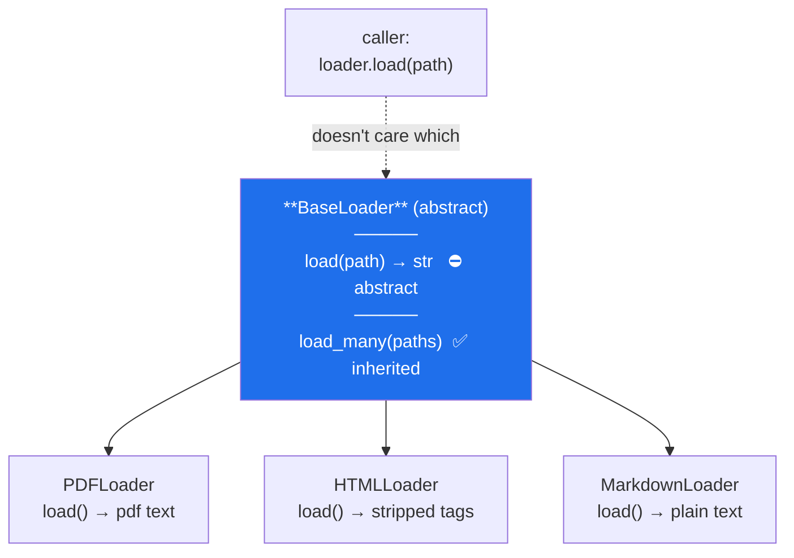

# Day 13 — Inheritance, polymorphism, encapsulation, abstraction

**Phase 2 · Module 2** · IDs: **PY-14** (inheritance, polymorphism), **PY-15** (encapsulation, abstraction)

> **Yesterday:** `Paper` became a class.
> **Today:** the loader hierarchy — one interface, three implementations. It is the shape of every
> document loader you will meet on Day 163, and of every LangChain `BaseRetriever` on Day 177.
> **Tomorrow:** decorators.

```bash
./m start 13 && ./m scaffold 13
```

**Time:** 100 minutes. **Request budget:** 0 model calls.

---

## §1 The story

Here is the problem inheritance actually solves, stated as code you will write on Day 163:

```python
for path in corpus:
    if path.suffix == ".pdf":
        text = parse_pdf(path)
    elif path.suffix == ".html":
        text = parse_html(path)
    elif path.suffix == ".md":
        text = parse_markdown(path)
    # ... and this grows forever
```

Every new format edits this function. The knowledge of "how do I read a PDF" is scattered across the
codebase instead of living next to PDFs.

The fix is **polymorphism**: define one shape — *"a loader has a `.load(path)` that returns text"* —
and let each format bring its own implementation. The calling code becomes:

```python
text = loader.load(path)
```

and never changes again.



Two ways to get there, and Python supports both:

- **Duck typing.** Any object with a `.load(path)` method works. No base class needed. *"If it walks
  like a duck…"* This is what Python does natively and it is often enough.
- **Abstract base class (ABC).** Declare `load` abstract; any subclass that forgets it **cannot be
  instantiated**. The error arrives at construction, not at the moment of use, three hours into a
  batch job.

This project uses ABCs for anything with more than one implementation, for that one reason: *fail at
construction, not at use.* The rest — `__init__`, encapsulation, `super()` — is machinery in service
of that.

---

## §2 Setup — run this

```bash
mkdir -p days/day-13/lab
touch days/day-13/lab/inheritance.py
touch src/setu/loaders.py
touch tests/test_loaders.py
```

`abc` is standard library. No new packages.

---

## §3 PY-14 — inheritance and polymorphism

`days/day-13/lab/inheritance.py`:

```python
"""PY-14 / PY-15: inheritance, super(), MRO, polymorphism, and ABCs."""

from __future__ import annotations

from abc import ABC, abstractmethod


class Source:
    def __init__(self, name: str) -> None:
        self.name = name
        self.reads = 0

    def read(self) -> str:
        self.reads += 1
        return f"[{self.name}]"

    def describe(self) -> str:
        return f"{type(self).__name__}({self.name})"


class CachedSource(Source):
    def __init__(self, name: str, *, cache_size: int = 8) -> None:
        super().__init__(name)              # run the parent's __init__ FIRST
        self.cache_size = cache_size
        self._cache: dict[str, str] = {}

    def read(self) -> str:                  # OVERRIDE
        if self.name in self._cache:
            return self._cache[self.name]
        value = super().read()              # call the parent's version, then extend it
        self._cache[self.name] = value
        return value


def inheritance_basics() -> None:
    plain, cached = Source("a"), CachedSource("b", cache_size=2)
    print(f"\n{plain.describe()=}")
    print(f"{cached.describe()=}   <- describe() was inherited, not rewritten")

    cached.read(); cached.read(); cached.read()
    print(f"{cached.reads=}   <- 1, not 3: the override short-circuited")

    print(f"\n{isinstance(cached, Source)=}   <- a CachedSource IS a Source")
    print(f"{issubclass(CachedSource, Source)=}")
    print(f"{[c.__name__ for c in CachedSource.__mro__]=}")


def polymorphism() -> None:
    class Noisy(Source):
        def read(self) -> str:
            return super().read().upper()

    sources = [Source("x"), CachedSource("y"), Noisy("z")]
    print(f"\n{[s.read() for s in sources]=}   <- same call, three behaviours")
    print(f"{[s.describe() for s in sources]=}   <- type(self) resolves per instance")


def duck_typing() -> None:
    class NotASourceAtAll:
        def read(self) -> str:
            return "[duck]"

    things = [Source("a"), NotASourceAtAll()]
    print(f"\n{[t.read() for t in things]=}   <- no shared base class needed")


def abstraction() -> None:
    class Loader(ABC):
        @abstractmethod
        def load(self, path: str) -> str: ...

        def load_many(self, paths: list[str]) -> list[str]:
            return [self.load(p) for p in paths]   # concrete, built on the abstract one

    class Good(Loader):
        def load(self, path: str) -> str:
            return f"content of {path}"

    class Forgetful(Loader):
        pass

    print(f"\n{Good().load_many(['a', 'b'])=}")
    try:
        Forgetful()
    except TypeError as exc:
        print(f"  refused at construction: {exc}")


if __name__ == "__main__":
    inheritance_basics()
    polymorphism()
    duck_typing()
    abstraction()
```

**Line by line:**

- `class CachedSource(Source):` — the parent goes in the brackets. `CachedSource` gets every attribute
  and method of `Source` for free.
- `super().__init__(name)` — runs the parent's initialiser. **Call it first**, before your own setup,
  so the object is fully formed before you extend it. Forgetting `super().__init__()` is the single
  most common inheritance bug: `self.name` then does not exist and you get an `AttributeError` from
  an inherited method that looks innocent.
- `def read(self)` in the child — an **override**. Same name, same signature, different behaviour.
- `super().read()` inside the override — *"do what the parent does, then add to it."* Overriding does
  not have to mean replacing.
- `cached.reads == 1` after three calls — the override intercepted two of them. Proof that the child's
  method genuinely replaced the parent's for that instance.
- `type(self).__name__` in the inherited `describe()` — resolves to the **actual** class of the
  instance, not to `Source`. This is why `describe` needed writing only once.
- `CachedSource.__mro__` — the **method resolution order**: the ordered list of classes Python searches
  when looking up an attribute. Read it aloud; it explains every "which method actually ran?" question.
- `isinstance(cached, Source)` is `True` — a `CachedSource` **is a** `Source`. If that sentence sounds
  wrong for your classes, you wanted composition, not inheritance.
- `NotASourceAtAll` works in the same list — **duck typing**. No base class, no registration. Python
  cares about the method, not the ancestry.
- `class Loader(ABC)` with `@abstractmethod` — `Forgetful()` raises `TypeError` **at construction**.
  That is the whole value: the error arrives when the object is made, not three hours later when
  something finally calls `.load()`.
- `def load(self, path: str) -> str: ...` — the `...` (Ellipsis) is the idiomatic empty body for an
  abstract method. `pass` also works; `...` reads as "deliberately nothing".
- `load_many` calls `self.load(...)` — a **concrete method built on an abstract one**. The base class
  gets to define shared behaviour without knowing any format. This is the template-method pattern and
  it is most of what a good ABC is for.

---

## §4 Build brief — `src/setu/loaders.py`

The loader hierarchy. Day 163 swaps the bodies for real parsers; the interface does not change.

```python
"""Document loaders. One interface, several formats. Day 163 makes them real."""

from __future__ import annotations

from abc import ABC, abstractmethod
from pathlib import Path

from setu.textutils import normalise_whitespace


class UnsupportedFormat(ValueError):
    """Raised when no registered loader handles a path's suffix."""


class BaseLoader(ABC):
    """Base for every document loader. Subclasses implement _parse only."""

    suffixes: tuple[str, ...] = ()

    @abstractmethod
    def _parse(self, raw: str) -> str:
        """Format-specific parsing. Subclasses MUST implement this."""

    def load(self, path: Path) -> str:
        """TODO(me): read the file, delegate to _parse, normalise whitespace, return.

        - raise FileNotFoundError if the path does not exist
        - raise UnsupportedFormat if path.suffix is not in self.suffixes
        - read as UTF-8 (Day 16 explains encoding properly)
        """
        raise NotImplementedError

    def load_many(self, paths: list[Path]) -> list[str]:
        """TODO(me): load each path. Concrete - do NOT override this in subclasses."""
        raise NotImplementedError


class TextLoader(BaseLoader):
    suffixes = (".txt",)

    def _parse(self, raw: str) -> str:
        """TODO(me): plain text needs no parsing."""
        raise NotImplementedError


class MarkdownLoader(BaseLoader):
    suffixes = (".md", ".markdown")

    def _parse(self, raw: str) -> str:
        """TODO(me): strip leading '#' from headings and '- ' from bullets. No regex needed."""
        raise NotImplementedError


class HTMLLoader(BaseLoader):
    suffixes = (".html", ".htm")

    def _parse(self, raw: str) -> str:
        """TODO(me): remove everything between < and >, deliberately naively.

        Day 163 replaces this with a real parser and you will compare. Note in your
        commit message one input this gets wrong.
        """
        raise NotImplementedError


def loader_for(path: Path) -> BaseLoader:
    """TODO(me): return the right loader for path.suffix, else raise UnsupportedFormat.

    Build the suffix -> loader mapping from BaseLoader.__subclasses__() rather than
    hard-coding it, so adding a loader class is the ONLY change needed.
    """
    raise NotImplementedError
```

- `suffixes` as a **class attribute** — a tuple, so it is immutable and safe to share (Day 12's trap
  does not apply to immutables).
- `_parse` abstract, `load` concrete — subclasses supply only what differs. Reading, validating and
  normalising happen once, in the base.
- `loader_for` using `__subclasses__()` — the registry builds itself. Adding `PDFLoader` on Day 163
  requires writing the class and nothing else. That is the payoff of the whole design.

---

## §5 The eval that must be able to fail

`tests/test_loaders.py`:

```python
import pytest

from setu.loaders import (
    BaseLoader,
    HTMLLoader,
    MarkdownLoader,
    TextLoader,
    UnsupportedFormat,
    loader_for,
)


def write(tmp_path, name: str, content: str):
    path = tmp_path / name
    path.write_text(content, encoding="utf-8")
    return path


def test_base_loader_cannot_be_instantiated():
    with pytest.raises(TypeError):
        BaseLoader()


def test_incomplete_subclass_cannot_be_instantiated():
    class Forgetful(BaseLoader):
        suffixes = (".x",)

    with pytest.raises(TypeError):
        Forgetful()


def test_text_loader_normalises_whitespace(tmp_path):
    path = write(tmp_path, "a.txt", "  hello   world \n\n")
    assert TextLoader().load(path) == "hello world"


def test_markdown_strips_syntax(tmp_path):
    path = write(tmp_path, "a.md", "# Title\n\n- one\n- two\n")
    assert MarkdownLoader().load(path) == "Title one two"


def test_html_strips_tags(tmp_path):
    path = write(tmp_path, "a.html", "<h1>Hi</h1><p>there</p>")
    assert HTMLLoader().load(path) == "Hi there"


def test_wrong_suffix_is_rejected(tmp_path):
    path = write(tmp_path, "a.html", "x")
    with pytest.raises(UnsupportedFormat):
        TextLoader().load(path)


def test_missing_file_raises(tmp_path):
    with pytest.raises(FileNotFoundError):
        TextLoader().load(tmp_path / "nope.txt")


def test_load_many_is_inherited_not_overridden():
    for cls in (TextLoader, MarkdownLoader, HTMLLoader):
        assert "load_many" not in vars(cls), f"{cls.__name__} overrode load_many"


def test_load_many_returns_one_result_per_path(tmp_path):
    paths = [write(tmp_path, f"{i}.txt", f"doc {i}") for i in range(3)]
    assert TextLoader().load_many(paths) == ["doc 0", "doc 1", "doc 2"]


@pytest.mark.parametrize(
    ("name", "expected"),
    [("a.txt", TextLoader), ("a.md", MarkdownLoader), ("a.htm", HTMLLoader)],
)
def test_loader_for_dispatches(tmp_path, name, expected):
    assert isinstance(loader_for(tmp_path / name), expected)


def test_loader_for_rejects_unknown_suffix(tmp_path):
    with pytest.raises(UnsupportedFormat):
        loader_for(tmp_path / "a.pdf")


def test_a_new_loader_needs_no_registry_edit(tmp_path):
    class JSONLoader(BaseLoader):
        suffixes = (".json",)

        def _parse(self, raw: str) -> str:
            return raw

    assert isinstance(loader_for(tmp_path / "a.json"), JSONLoader)
```

**Line by line:**

- `test_base_loader_cannot_be_instantiated` / `test_incomplete_subclass_...` — the ABC's entire
  promise, asserted. Remove `@abstractmethod` and both go green when they should not — so run them
  once with it removed to see the guard disappear.
- `test_load_many_is_inherited_not_overridden` — `vars(cls)` is the class's **own** namespace,
  excluding inherited names. This asserts a *design* rule, not a behaviour: shared logic stays in the
  base. It will still be enforcing that on Day 163.
- `test_a_new_loader_needs_no_registry_edit` — **the day's real assessment.** It defines a brand-new
  loader inside the test and expects `loader_for` to find it. A hard-coded `{".txt": TextLoader, ...}`
  dict passes every other test and fails this one.
- `test_wrong_suffix_is_rejected` — a `.html` file handed to `TextLoader` must refuse rather than
  quietly returning tag soup.

```bash
uv run python -m pytest tests/test_loaders.py -v
```

---

## §6 Request budget

| Resource | Spent today |
|---|---|
| LLM calls | **0** |

---

## §7 Traps

- **Forgetting `super().__init__()`.** The parent's attributes never exist; the error surfaces far away.
- **Calling `super().__init__()` last.** Call it first, then extend.
- **Inheriting for code reuse when there is no "is-a".** A `Report` is not a `Paper` just because it
  shares three fields. Use composition.
- **Deep hierarchies.** Two levels is usually plenty. Three is a smell.
- **Overriding a concrete base method in every subclass.** If they all override it, it did not belong
  in the base.
- **A mutable class attribute in the base.** Every subclass shares it. Day 12's trap, inherited.
- **`type(x) == Source` instead of `isinstance`.** Exact-type checks defeat polymorphism.
- **An ABC with no abstract methods.** It is just a class with extra ceremony.
- **Trusting a naive HTML stripper.** It will be wrong. Know how before Day 163.

---

## §8 Verify before you code

Written **2026-08-21**:

- <https://docs.python.org/3/library/abc.html> — `ABC`, `abstractmethod`, and why the check happens
  at instantiation.
- <https://docs.python.org/3/tutorial/classes.html#inheritance> — `super()` and multiple inheritance.
- <https://docs.python.org/3/library/stdtypes.html#class.__subclasses__> — what `__subclasses__()`
  does and does not see (only classes already imported).

---

## §9 Say it in an interview

> "The pattern I reach for is an abstract base with one abstract method and the shared work concrete
> on the base — so a new format means writing one small class and nothing else. The reason it's an
> ABC rather than duck typing is failure timing: a subclass that forgets the method can't be
> instantiated, so you find out at construction instead of three hours into a batch job. And the
> dispatch function builds its registry from `__subclasses__()` rather than a hard-coded dict, which
> I have a test for — it defines a brand-new loader inside the test and asserts dispatch finds it. A
> hard-coded mapping passes everything else and fails that one."

---

## §10 Done when

Tick [`CHECKLIST.md`](CHECKLIST.md), then `./m check && ./m done 13`.
