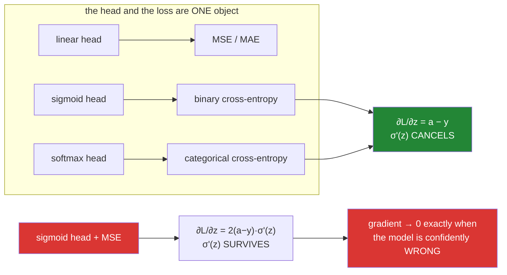

# Day 130 — Losses, and the head they belong to

**Phase 15 · Module 15** · ID: **DL-08** (MSE, MAE, BCE, categorical cross-entropy)

> **Yesterday:** activations, and the derivative that decides whether depth works.
> **Today:** the other end of the network. The loss is not a scoring rule you bolt on at the end —
> **it and the output activation are one object**, and today's result is the reason: with sigmoid + BCE
> the `σ'(z)` factor **cancels out of the gradient**, and with sigmoid + MSE it does not. That single
> cancellation is why a network that starts confidently wrong escapes in 2 epochs instead of never.
> **Tomorrow:** optimisers, and what to do with the gradient once you trust it.

```bash
./m start 130 && ./m scaffold 130
```

**Time:** 2 hours. **Request budget:** 0 model calls.

---

## §1 The story

Every loss so far in this phase has been MSE, because MSE was the one you already had from Day 92.
That was fine for regression and quietly wrong for everything else, and today is where the debt comes
due.

The usual explanation for "use cross-entropy for classification" is that it is the maximum-likelihood
loss for a Bernoulli variable. True, and useless at 2am. **The operational reason is about the
gradient**, and it is visible in one line of algebra:



**Yesterday's villain reappears as a factor in the gradient.** Day 129 established that `σ'(z)` collapses
to nearly zero once `|z|` is large. Put a sigmoid head on an MSE loss and that factor multiplies your
gradient, so a unit that is saturated *and wrong* — the worst possible state — produces almost no
gradient. Cross-entropy is built so the factor cancels.

The measurement: for a target of `1` and a logit of `−10`, the model is as wrong as it can be.
**BCE's gradient is `−1.000`. MSE's is `−9.08e-05`.** A ratio of **11,014**.

Three more things today has to settle.

**The loss you pick decides which statistic you are estimating.** MSE's optimal constant is the
**mean**; MAE's is the **median**. On `[1, 2, 3, 4, 100]` those are `22.0` and `3.0`. That is not a
robustness tip, it is what the two losses *are*.

**The naive formula is a numerical trap, and the obvious defence is worse.** `log(sigmoid(z))` at
`z = −800` gives `-inf` unclipped. Clip the sigmoid first — the thing everyone does — and you get
`-500.0`, for both `−800` and `−1000`. **Silently wrong, no error.** The fused form is exact, and it is
why every framework ships `BCEWithLogitsLoss` / `from_logits=True`.

**Loss values are not comparable across losses.** An MSE of `0.0008` and a BCE of `0.0016` say nothing
about which model is better. Day 128's rule is the only way through: **compare each loss to its own
baseline**, and today derives what that baseline is for each of the four.

---

## §2 Setup — run this

```bash
mkdir -p days/day-130/lab
touch days/day-130/lab/losses.py
```

No new packages. `np.logaddexp` does the heavy lifting for the stable forms; `src/setu/nn.py` grows,
and Day 128's `baseline_loss` gets extended rather than replaced.

---

## §3 DL-08 — four losses and the head each belongs to

`days/day-130/lab/losses.py`:

```python
"""DL-08: MSE, MAE, BCE, categorical cross-entropy — and why the head is part of the loss."""

from __future__ import annotations

import numpy as np

from setu.arrays import make_rng


def sigmoid(z):
    return 1.0 / (1.0 + np.exp(-np.clip(z, -500, 500)))


def sigmoid_prime(z):
    s = sigmoid(z)
    return s * (1 - s)


def softmax(z):
    shifted = np.exp(z - z.max(axis=-1, keepdims=True))
    return shifted / shifted.sum(axis=-1, keepdims=True)


def the_two_families() -> None:
    print("\n  a loss answers: 'how wrong is this prediction?' — but the ANSWER depends")
    print("  on what the output is allowed to be.")
    print(f"\n  {'head':<16} {'output range':<16} {'loss':<28} {'estimates'}")
    for head, span, loss, estimates in (
        ("linear", "(-inf, inf)", "MSE", "the conditional MEAN"),
        ("linear", "(-inf, inf)", "MAE", "the conditional MEDIAN"),
        ("sigmoid", "(0, 1)", "binary cross-entropy", "P(y=1 | x)"),
        ("softmax", "simplex", "categorical cross-entropy", "P(class k | x)"),
    ):
        print(f"  {head:<16} {span:<16} {loss:<28} {estimates}")

    print("\n  🚨 The pairing is not a convention. A sigmoid head with MSE is a legal")
    print("     program that trains badly; a linear head with cross-entropy takes the")
    print("     log of a negative number. The head and the loss are ONE decision.")
    print("\n  ⚠️ Note that MSE and MAE differ in WHAT THEY ESTIMATE, not merely in how")
    print("     harshly they punish. That is the next function.")


def mse_finds_the_mean_mae_finds_the_median() -> None:
    grid = np.linspace(-10, 110, 120_001)
    print("\n  what CONSTANT minimises each loss?")
    print(f"\n  {'data':<14} {'mean':>9} {'median':>9} {'argmin MSE':>12} {'argmin MAE':>12}")
    for label, data in (("[1..5]", np.array([1.0, 2, 3, 4, 5])),
                        ("one outlier", np.array([1.0, 2, 3, 4, 100]))):
        best_mse = grid[((grid[:, None] - data) ** 2).mean(axis=1).argmin()]
        best_mae = grid[np.abs(grid[:, None] - data).mean(axis=1).argmin()]
        print(f"  {label:<14} {data.mean():>9.3f} {np.median(data):>9.3f} "
              f"{best_mse:>12.3f} {best_mae:>12.3f}")

    print("\n  ✅ MSE's optimum IS the mean; MAE's IS the median. One outlier moves the")
    print("     mean from 3 to 22 and leaves the median at 3.")

    errors = np.array([0.1, 1.0, 10.0, 100.0])
    print(f"\n  {'error':>10} {'d(MSE)/de':>12} {'d(MAE)/de':>12}")
    for e in errors:
        print(f"  {e:>10} {2 * e:>12.1f} {np.sign(e):>12.1f}")

    print("\n  🚨 MSE's gradient GROWS with the error, so the single worst row dominates")
    print("     the update. MAE's is constant, so every row gets one vote.")
    print("\n  ✅ 'MSE is sensitive to outliers' is the consequence. The CAUSE is that the")
    print("     gradient is proportional to the error, and that is worth knowing because")
    print("     it also explains why MSE converges faster when there are no outliers.")
    print("\n  ⚠️ MAE's gradient is undefined at exactly 0 and discontinuous across it.")
    print("     That is the price, and it is why Huber exists — out of scope today.")


def why_cross_entropy_for_classification() -> None:
    print("\n  target y = 1. Sweep the LOGIT z from confidently wrong to confidently right.")
    print(f"\n  {'z':>7} {'sigmoid(z)':>12} {'MSE ∂L/∂z':>14} {'BCE ∂L/∂z':>14} {'ratio':>12}")
    for z in (-10.0, -6.0, -3.0, 0.0, 3.0):
        a = sigmoid(z)
        mse = 2 * (a - 1.0) * sigmoid_prime(z)
        bce = a - 1.0
        print(f"  {z:>7.1f} {a:>12.3e} {mse:>14.3e} {bce:>14.3e} {abs(bce / mse):>12.1f}")

    print("\n  🚨 READ THE TOP ROW. At z = −10 the model says 'almost certainly class 0'")
    print("     and the truth is class 1. It is as wrong as it is possible to be.")
    print("     MSE's gradient there is −9.08e-05. BCE's is −1.000. A ratio of 11,014.")
    print("\n  MSE's gradient is LARGEST when the model is uncertain (z = 0) and vanishes")
    print("  at both extremes — including the wrong extreme. That is exactly backwards.")
    print("\n  ✅ BCE's gradient is bounded by 1 and reaches it precisely when the model is")
    print("     confidently wrong. The size of the update tracks the size of the mistake.")


def the_sigma_prime_cancels() -> None:
    print("\n  WHY does BCE behave that way? One line of algebra, then a numerical check.")
    print("\n    a = σ(z)")
    print("    L = −[ y·log(a) + (1−y)·log(1−a) ]")
    print("\n    ∂L/∂a = −y/a + (1−y)/(1−a) = (a − y) / [a(1−a)]")
    print("    ∂a/∂z = σ'(z) = a(1−a)")
    print("\n    ∂L/∂z = ∂L/∂a · ∂a/∂z = (a − y)/[a(1−a)] · a(1−a) = a − y")

    print("\n  🚨 THE a(1−a) CANCELS. That term IS σ'(z) — yesterday's vanishing factor —")
    print("     and cross-entropy is built with a matching denominator so it divides out.")
    print("     It is not a lucky simplification; it is the design.")

    z = np.array([-4.0, -1.0, 0.0, 2.0, 5.0])
    y = np.array([1.0, 0.0, 1.0, 0.0, 1.0])

    def loss_of(logits):
        a = np.clip(sigmoid(logits), 1e-12, 1 - 1e-12)
        return -(y * np.log(a) + (1 - y) * np.log(1 - a))

    epsilon = 1e-6
    numeric = (loss_of(z + epsilon) - loss_of(z - epsilon)) / (2 * epsilon)
    analytic = sigmoid(z) - y

    print(f"\n  {'z':>7} {'y':>5} {'numeric ∂L/∂z':>16} {'(a − y)':>12}")
    for i in range(len(z)):
        print(f"  {z[i]:>7.1f} {y[i]:>5.0f} {numeric[i]:>16.8f} {analytic[i]:>12.8f}")
    print(f"\n  max |numeric − (a − y)| = {np.abs(numeric - analytic).max():.2e}")

    print("\n  ✅ Day 127's gradient check, applied to a loss instead of a layer. The")
    print("     simplification is exact, which means you can implement `a − y` directly")
    print("     and skip computing σ'(z) at the output layer entirely.")


def the_saturation_cliff() -> None:
    print("\n  same network, same seed, same learning rate. Only the LOSS differs, and")
    print("  the output bias starts progressively more saturated.")

    def train(loss_name, start_bias, *, epochs=3000, rate=0.5):
        rng = make_rng(0)
        x = rng.normal(0, 1, (400, 8))
        y = (x[:, :1] > 0).astype(float)
        w1 = rng.normal(0, np.sqrt(2 / 8), (8, 16))
        b1 = np.zeros(16)
        w2 = rng.normal(0, np.sqrt(2 / 16), (16, 1))
        b2 = np.array([float(start_bias)])

        history = []
        for _ in range(epochs):
            z1 = x @ w1 + b1
            a1 = np.maximum(0, z1)
            z2 = a1 @ w2 + b2
            a2 = sigmoid(z2)

            if loss_name == "mse":
                history.append(((a2 - y) ** 2).mean())
                delta = 2 * (a2 - y) / y.size * sigmoid_prime(z2)
            else:
                clipped = np.clip(a2, 1e-12, 1 - 1e-12)
                history.append(
                    -(y * np.log(clipped) + (1 - y) * np.log(1 - clipped)).mean())
                delta = (a2 - y) / y.size

            grad_w2 = a1.T @ delta
            grad_b2 = delta.sum(axis=0)
            delta1 = (delta @ w2.T) * (z1 > 0)
            w1 -= rate * (x.T @ delta1)
            b1 -= rate * delta1.sum(axis=0)
            w2 -= rate * grad_w2
            b2 -= rate * grad_b2

        z1 = x @ w1 + b1
        final = sigmoid(np.maximum(0, z1) @ w2 + b2)
        return history, ((final > 0.5) == (y > 0.5)).mean()

    def epochs_to_halve(history):
        target = history[0] * 0.5
        found = next((i for i, v in enumerate(history) if v < target), None)
        return "never" if found is None else str(found)

    print(f"\n  {'start bias':>11} {'MSE acc':>10} {'MSE halve@':>12} "
          f"{'BCE acc':>10} {'BCE halve@':>12}")
    for start_bias in (0, -4, -8, -12, -16, -20, -30):
        mse_history, mse_accuracy = train("mse", start_bias)
        bce_history, bce_accuracy = train("bce", start_bias)
        print(f"  {start_bias:>11} {mse_accuracy:>10.1%} {epochs_to_halve(mse_history):>12} "
              f"{bce_accuracy:>10.1%} {epochs_to_halve(bce_history):>12}")

    print("\n  🚨 MSE degrades, then falls off a CLIFF between −8 and −12. At −8 it needs")
    print("     210 epochs to halve its loss; at −12 it never does, and it finishes at")
    print("     48.8% accuracy — the majority-class baseline. It never recovers.")
    print("\n  ✅ BCE's column is FLAT: 2 to 5 epochs regardless of how saturated the start")
    print("     is. That is the cancellation, visible as behaviour. σ'(z) is not in the")
    print("     gradient, so the saturation cannot slow it down.")
    print("\n  ⚠️ Be honest about the −4 and −8 rows: MSE gets to 100% too. It is SLOWER,")
    print("     not broken, until it is. 'MSE never works for classification' is false;")
    print("     'MSE's escape time depends on saturation and BCE's does not' is the claim.")


def log_sigmoid_three_ways() -> None:
    print("\n  BCE needs log(σ(z)). Three implementations, one of which is a trap.")
    print(f"\n  {'z':>9} {'naive':>22} {'clipped σ then log':>22} {'fused':>14}")
    for z in (-30.0, -500.0, -800.0, -1000.0):
        with np.errstate(all="ignore"):
            naive = np.log(1.0 / (1.0 + np.exp(-z)))
            clipped = np.log(sigmoid(z))
        fused = -np.logaddexp(0.0, -z)
        print(f"  {z:>9.1f} {str(naive):>22} {str(clipped):>22} {fused:>14.4f}")

    print("\n  🚨 The middle column is the dangerous one. Clipping the sigmoid to avoid")
    print("     log(0) is what everyone reaches for, and it returns −500.0 for BOTH −800")
    print("     and −1000. The loss is WRONG, the gradient is wrong, and NOTHING RAISES.")
    print("\n  The left column at least fails loudly: −inf loss, NaN everywhere after.")
    print("\n  ✅ log σ(z) = −log(1 + e^(−z)) = −logaddexp(0, −z), which is exact at every")
    print("     magnitude because logaddexp factors out the larger term before exponentiating.")
    print("     Same trick as Day 126's softmax, same reason.")
    print("\n  ⚠️ THIS is what `BCEWithLogitsLoss` and `from_logits=True` are for. They are")
    print("     not conveniences — they exist because the two-step version is unfixable")
    print("     once the sigmoid has already rounded to 0 or 1.")


def softmax_and_categorical_cross_entropy() -> None:
    rng = make_rng(0)
    logits = rng.normal(0, 2, (4, 5))
    targets = np.zeros((4, 5))
    targets[np.arange(4), [0, 2, 4, 1]] = 1.0

    def loss_of(z):
        return -(targets * np.log(np.clip(softmax(z), 1e-15, 1.0))).sum(axis=-1).mean()

    numeric = np.zeros_like(logits)
    flat = logits.reshape(-1)
    flat_numeric = numeric.reshape(-1)
    for i in range(flat.size):
        original = flat[i]
        flat[i] = original + 1e-6
        up = loss_of(logits)
        flat[i] = original - 1e-6
        down = loss_of(logits)
        flat[i] = original
        flat_numeric[i] = (up - down) / 2e-6

    analytic = (softmax(logits) - targets) / len(logits)

    print("\n  the multi-class case: softmax head + categorical cross-entropy.")
    print(f"\n    L = −Σ_k y_k · log(p_k)   where p = softmax(z)")
    print(f"    ∂L/∂z = p − y              — the SAME cancellation, k classes wide")
    print(f"\n  max |numeric − (p − y)/n| = {np.abs(numeric - analytic).max():.3e}")

    print(f"\n  {'row':>5} {'true class':>12} {'p(true)':>10} {'loss':>10}")
    probabilities = softmax(logits)
    for i, true_class in enumerate([0, 2, 4, 1]):
        p = probabilities[i, true_class]
        print(f"  {i:>5} {true_class:>12} {p:>10.4f} {-np.log(p):>10.4f}")

    print("\n  ✅ Only the TRUE class's probability appears in the loss. The others matter")
    print("     only through the softmax denominator, which is what couples them.")
    print("\n  🚨 A one-hot target means the sum is a lookup: −log(p[true]). Implementing it")
    print("     as an actual sum over a one-hot matrix wastes k−1 multiplications by zero")
    print("     per row, which is why frameworks have a separate `sparse` version.")
    print("\n  ⚠️ Never softmax twice. A head that already applies softmax, followed by a")
    print("     loss with from_logits=True, is a silent bug — the second softmax flattens")
    print("     the distribution and the model trains to a worse optimum with no error.")


def every_loss_needs_its_own_baseline() -> None:
    print("\n  Day 128's rule, extended: what does the best CONSTANT predictor score")
    print("  under each loss? Without this, a loss value is not a result.")

    y = np.array([1.0, 1, 1, 0, 0, 1, 1, 0, 1, 1])
    rate = y.mean()
    constant = np.full_like(y, rate)
    bce = -(y * np.log(constant) + (1 - y) * np.log(1 - constant)).mean()
    entropy = -(rate * np.log(rate) + (1 - rate) * np.log(1 - rate))

    print(f"\n  binary targets, base rate p = {rate}")
    print(f"    BCE of the constant predictor : {bce:.6f}")
    print(f"    entropy H(p)                  : {entropy:.6f}")
    print(f"    identical                     : {np.isclose(bce, entropy)}")

    values = np.array([1.0, 2, 3, 4, 100])
    print(f"\n  regression targets {values.tolist()}")
    print(f"    MSE baseline = variance                : {values.var():.4f}")
    print(f"    MAE baseline = mean |y − median|       : "
          f"{np.abs(values - np.median(values)).mean():.4f}")
    print(f"    (using the MEAN instead would give      "
          f"{np.abs(values - values.mean()).mean():.4f} — worse)")

    print("\n  ✅ The BCE baseline IS the entropy of the label distribution. That is not a")
    print("     coincidence: cross-entropy minus entropy is the KL divergence, so the")
    print("     entropy is the loss you cannot get below without information.")

    rng = make_rng(3)
    labels = (rng.random((2000, 1)) < 0.02).astype(float)
    positive_rate = labels.mean()
    weight = (1 - positive_rate) / positive_rate

    print(f"\n  now an IMBALANCED problem: positive rate {positive_rate:.3%}")
    print(f"    accuracy of always predicting 0 : {1 - positive_rate:.3%}  <- looks superb")
    print(f"    pos_weight that balances it     : {weight:.1f}")

    print("\n  🚨 97.75% accuracy from a model that has never predicted a positive. Day 100")
    print("     said this about metrics; it is just as true of the LOSS, which is what the")
    print("     gradient actually follows.")
    print("\n  ⚠️ And the trap of the day: an MSE of 0.0008 and a BCE of 0.0016 are NOT")
    print("     comparable. Different losses live on different scales. The only honest")
    print("     comparison is each loss against ITS OWN baseline.")


if __name__ == "__main__":
    the_two_families()
    mse_finds_the_mean_mae_finds_the_median()
    why_cross_entropy_for_classification()
    the_sigma_prime_cancels()
    the_saturation_cliff()
    log_sigmoid_three_ways()
    softmax_and_categorical_cross_entropy()
    every_loss_needs_its_own_baseline()
```

**Line by line:**

- `the_two_families` — the `estimates` column is the point. **MSE and MAE differ in what they estimate**,
  not in how harshly they punish, and that reframes "robustness" as a consequence rather than a feature.
- `mse_finds_the_mean_mae_finds_the_median` — `22.0` versus `3.0` on the same five numbers. And the
  gradient table gives the cause: **MSE's gradient grows with the error so the worst row dominates**,
  MAE's is constant so every row gets one vote.
- `why_cross_entropy_for_classification` — the top row is the day. At `z = −10` with `y = 1` the model
  is maximally wrong and **MSE's gradient is `−9.08e-05` against BCE's `−1.000`, a ratio of 11,014.**
  MSE's gradient peaks at *uncertainty* and vanishes at both extremes, **including the wrong extreme.**
- `the_sigma_prime_cancels` — `∂L/∂a = (a−y)/[a(1−a)]` and `∂a/∂z = a(1−a)`, so the two cancel and
  `∂L/∂z = a − y`. **`a(1−a)` is `σ'(z)`** — yesterday's vanishing factor — and cross-entropy is built
  with a matching denominator on purpose. Verified to `2.6e-10` by Day 127's central difference.
- `the_saturation_cliff` — MSE **falls off a cliff between −8 and −12**: 210 epochs to halve at −8,
  never at −12, finishing at the 48.8% majority baseline. BCE is **flat at 2–5 epochs** no matter how
  saturated the start. And the honesty note matters: at −4 and −8 MSE still reaches 100%, so the claim
  is about *escape time depending on saturation*, not about MSE being unusable.
- `log_sigmoid_three_ways` — the middle column is the trap. **Clipping the sigmoid returns `−500.0` for
  both `−800` and `−1000`**: wrong loss, wrong gradient, nothing raised. The naive version at least
  fails loudly with `-inf`. `−logaddexp(0, −z)` is exact everywhere.
- `softmax_and_categorical_cross_entropy` — **the same cancellation, `k` classes wide**: `∂L/∂z = p − y`,
  verified to `3.8e-10`. And the two traps: a one-hot sum is really a lookup, and **softmaxing twice is
  silent**.
- `every_loss_needs_its_own_baseline` — **the BCE baseline is exactly the entropy `H(p)`**, because
  cross-entropy minus entropy is the KL divergence. The MAE baseline uses the **median**, not the mean.
  And the closing trap: **loss values are not comparable across losses.**

---

## §4 Build brief

Extend `src/setu/nn.py`:

```python
LOSSES = {"mse", "mae", "bce", "categorical_crossentropy"}
LOSS_HEADS = {"mse": "identity", "mae": "identity",
              "bce": "sigmoid", "categorical_crossentropy": "softmax"}


def loss_and_gradient(prediction, target, *, loss: str, from_logits: bool = False,
                      sample_weight=None) -> dict:
    """TODO(me): the value AND ∂L/∂(prediction or logit), together. PURE.

    {"loss": float, "gradient": ndarray, "wrt": "logits" | "activations"}
    - value and gradient come back TOGETHER because every caller needs both and
      computing them separately means the forward pass runs twice
    - when from_logits is True the gradient is ∂L/∂z and MUST use the cancelled
      form (a − y) for bce/categorical_crossentropy — not σ'(z) times anything —
      and 'wrt' must say 'logits' so a caller cannot apply σ'(z) again
    - mae's gradient at exactly 0 is undefined; return 0 there and say so in the
      docstring, because np.sign already does this and silence hides it
    - sample_weight multiplies per row BEFORE the mean; raise DataError if its
      length does not match
    - raise DataError on an unknown loss, listing LOSSES
    - raise DataError if prediction and target shapes differ, naming both
    """
    raise NotImplementedError


def bce_with_logits(logits, target, *, pos_weight: float | None = None) -> dict:
    """TODO(me): §3.6 — the fused, numerically exact form.

    {"loss": float, "gradient": ndarray}
    - use −logaddexp(0, −z) for log σ(z) and −logaddexp(0, z) for log(1−σ(z));
      NEVER compute sigmoid then log
    - the docstring must record that clipping the sigmoid instead returns −500.0
      for both z=−800 and z=−1000 — silently wrong, nothing raised (§3.6)
    - must be exact at |z| = 800; there is a test
    - pos_weight scales the positive term only (§3.8's imbalance case)
    - raise DataError on a non-finite logit, naming how many
    """
    raise NotImplementedError


def categorical_cross_entropy(logits, target, *, from_logits: bool = True) -> dict:
    """TODO(me): §3.7 — softmax + CCE, with the same cancellation.

    {"loss": float, "gradient": ndarray}
    - gradient is (softmax(z) − y) / n when from_logits; derive it, do not guess
    - reuse Day 126's stable softmax; do not reimplement the max-subtraction
    - the docstring must warn that applying softmax in the HEAD and again here is
      a silent bug that trains to a worse optimum with no error (§3.7)
    - accept one-hot targets; raise DataError if any row does not sum to 1,
      naming the row index — a target that is not a distribution is a data bug
      and it will otherwise train quietly
    """
    raise NotImplementedError


def baseline_loss(y, *, loss: str = "mse") -> float:
    """TODO(me): EXTEND Day 128's function to all four losses. PURE.

    - mse  -> variance (the mean is optimal)
    - mae  -> mean |y − median| (the MEDIAN is optimal, not the mean; using the
              mean gives a larger number and a wrong baseline — §3.8)
    - bce  -> the entropy H(p) of the base rate; the docstring must say WHY they
              are equal (cross-entropy − entropy = KL divergence)
    - categorical_crossentropy -> the entropy of the class distribution
    - keep Day 128's contract: this is the number a training curve is read against
    - raise DataError on an empty y
    """
    raise NotImplementedError


def assert_head_matches_loss(*, head: str, loss: str) -> None:
    """TODO(me): the pairing guard. Raise DataError on a mismatch.

    - LOSS_HEADS holds the intended pairing
    - a sigmoid head with 'mse' must raise, and the message must say that the
      σ'(z) factor survives so the gradient dies exactly when the model is
      confidently wrong (§3.3) — 'mismatched head' alone teaches nothing
    - an identity head with 'bce' must raise: log of a negative number
    - this is the third guard in the phase, after Day 127's assert_gradients_checked
      and Day 128's assert_beats_baseline
    """
    raise NotImplementedError


def class_weights(y, *, scheme: str = "balanced") -> dict:
    """TODO(me): §3.8 — weights that stop the majority class owning the gradient.

    {"weights": {label: float}, "pos_weight": float, "base_rate": float, "note": str}
    - 'balanced' gives weight n / (k · count_k), the standard definition; state it
    - pos_weight for the binary case is (1 − p) / p
    - the note must say that reweighting changes WHAT IS OPTIMISED, so the loss is
      no longer comparable to an unweighted run or to baseline_loss
    - raise DataError if any class has zero examples, naming it
    """
    raise NotImplementedError


def compare_losses(x, y, *, losses: list[str], start_bias: float, epochs: int,
                   learning_rate: float, seed: int) -> dict:
    """TODO(me): §3.5's table — one network, one seed, N losses.

    {name: {"final_loss", "baseline", "accuracy", "epochs_to_halve": int | None}}
    - epochs_to_halve is None when the loss never halves; that None is the finding,
      so do not substitute the epoch cap for it
    - every loss must get identical initial weights, or this measures the seed
      (Day 128 §3.3)
    - accuracy is reported alongside because the loss VALUES are not comparable
      across losses (§3.8) and accuracy is
    - raise DataError on fewer than 2 losses — this function exists to contrast
    """
    raise NotImplementedError


def assert_loss_is_finite(*, result: dict) -> None:
    """TODO(me): raise DataError on a non-finite loss or gradient.

    - the message must name the two usual causes: log(0) from an unclipped
      probability, and an unfused sigmoid-then-log at a large negative logit (§3.6)
    - a NaN loss poisons every parameter on the next update, so catching it at the
      loss is the last cheap place to catch it at all
    """
    raise NotImplementedError
```

- `loss_and_gradient` returning **`wrt`** is the correctness affordance: a caller that receives a
  logit-space gradient and then multiplies by `σ'(z)` has silently reintroduced the factor
  cross-entropy exists to cancel. The field makes that unwriteable.
- `bce_with_logits` being **exact at `|z| = 800`** is the test that separates it from the clipped
  version, which returns `−500.0` and raises nothing.
- `baseline_loss` for MAE using the **median** is easy to get wrong, and the wrong version produces a
  baseline that is too large — so a bad model looks like it beat it.
- `compare_losses` returning **`None`** rather than the epoch cap for `epochs_to_halve` matters: "never
  halved" and "halved on the last epoch" are different findings.

---

## §5 The eval that must be able to fail

Add to `tests/test_nn.py`:

```python
from setu.nn import (
    LOSSES,
    LOSS_HEADS,
    assert_head_matches_loss,
    assert_loss_is_finite,
    baseline_loss,
    bce_with_logits,
    categorical_cross_entropy,
    class_weights,
    compare_losses,
    loss_and_gradient,
)


def _sigmoid(z):
    return 1.0 / (1.0 + np.exp(-np.clip(z, -500, 500)))


def test_mse_is_minimised_by_the_mean():
    y = np.array([[1.0], [2], [3], [4], [100]])
    grid = np.linspace(-10, 110, 12_001)
    best = grid[[((c - y) ** 2).mean() for c in grid].index(
        min(((c - y) ** 2).mean() for c in grid))]
    assert best == pytest.approx(y.mean(), abs=0.02)


def test_mae_is_minimised_by_the_median():
    """Not the mean. That is what MAE IS, not a robustness tip."""
    y = np.array([[1.0], [2], [3], [4], [100]])
    grid = np.linspace(-10, 110, 12_001)
    scores = [np.abs(c - y).mean() for c in grid]
    assert grid[scores.index(min(scores))] == pytest.approx(np.median(y), abs=0.02)


def test_the_mse_gradient_grows_with_the_error_and_mae_does_not():
    for error in (1.0, 10.0, 100.0):
        prediction = np.array([[error]])
        target = np.array([[0.0]])
        mse = loss_and_gradient(prediction, target, loss="mse")["gradient"]
        mae = loss_and_gradient(prediction, target, loss="mae")["gradient"]
        assert abs(float(mse)) == pytest.approx(2 * error)
        assert abs(float(mae)) == pytest.approx(1.0)


def test_the_mae_gradient_at_zero_is_zero_and_documented():
    result = loss_and_gradient(np.array([[3.0]]), np.array([[3.0]]), loss="mae")
    assert float(result["gradient"]) == 0.0
    assert "undefined" in loss_and_gradient.__doc__.lower()


def test_the_bce_gradient_is_exactly_prediction_minus_target():
    """The cancellation, checked numerically. Day 127's technique on a loss."""
    z = np.array([[-4.0], [-1.0], [0.0], [2.0], [5.0]])
    y = np.array([[1.0], [0.0], [1.0], [0.0], [1.0]])

    def loss_of(logits):
        a = np.clip(_sigmoid(logits), 1e-12, 1 - 1e-12)
        return float(-(y * np.log(a) + (1 - y) * np.log(1 - a)).mean())

    epsilon = 1e-6
    numeric = np.zeros_like(z)
    for i in range(z.size):
        flat = z.reshape(-1)
        original = flat[i]
        flat[i] = original + epsilon
        up = loss_of(z)
        flat[i] = original - epsilon
        down = loss_of(z)
        flat[i] = original
        numeric.reshape(-1)[i] = (up - down) / (2 * epsilon)

    analytic = bce_with_logits(z, y)["gradient"]
    assert np.allclose(analytic, numeric, atol=1e-7)


def test_the_gradient_is_worst_exactly_when_the_model_is_confidently_wrong():
    """MSE's is smallest there. That is the whole argument."""
    z = np.array([[-10.0]])
    y = np.array([[1.0]])
    bce = abs(float(bce_with_logits(z, y)["gradient"]))
    a = _sigmoid(z)
    mse = abs(float(2 * (a - y) * (a * (1 - a))))
    assert bce == pytest.approx(1.0, abs=1e-3)
    assert mse < 1e-4
    assert bce / mse > 1000


def test_the_logit_gradient_is_reported_as_logit_space():
    """A caller that multiplies by sigma' again undoes the cancellation."""
    result = loss_and_gradient(np.array([[0.5]]), np.array([[1.0]]),
                               loss="bce", from_logits=True)
    assert result["wrt"] == "logits"


def test_bce_with_logits_is_exact_at_extreme_magnitudes():
    """The clipped version returns -500.0 here and raises nothing."""
    z = np.array([[-800.0]])
    y = np.array([[1.0]])
    assert bce_with_logits(z, y)["loss"] == pytest.approx(800.0, rel=1e-9)


def test_the_clipped_form_would_have_been_wrong():
    """Pin the trap so nobody 'simplifies' the implementation back into it."""
    z = -800.0
    clipped = np.log(_sigmoid(np.array([z])))
    assert clipped == pytest.approx(-500.0)
    assert bce_with_logits(np.array([[z]]), np.array([[1.0]]))["loss"] > 700


def test_the_fused_docstring_records_the_silent_failure():
    text = bce_with_logits.__doc__.lower()
    assert "-500" in text or "−500" in text
    assert "silent" in text or "nothing rais" in text


def test_a_non_finite_logit_raises():
    with pytest.raises(DataError):
        bce_with_logits(np.array([[np.inf]]), np.array([[1.0]]))


def test_pos_weight_scales_only_the_positive_term():
    z = np.array([[0.0], [0.0]])
    plain = bce_with_logits(z, np.array([[1.0], [0.0]]))["loss"]
    weighted = bce_with_logits(z, np.array([[1.0], [0.0]]), pos_weight=3.0)["loss"]
    assert weighted == pytest.approx(plain * 2.0, rel=1e-9)


def test_the_categorical_gradient_is_probabilities_minus_target():
    rng = make_rng(0)
    logits = rng.normal(0, 2, (4, 5))
    target = np.zeros((4, 5))
    target[np.arange(4), [0, 2, 4, 1]] = 1.0

    def loss_of(z):
        shifted = np.exp(z - z.max(axis=-1, keepdims=True))
        p = shifted / shifted.sum(axis=-1, keepdims=True)
        return float(-(target * np.log(np.clip(p, 1e-15, 1.0))).sum(axis=-1).mean())

    numeric = np.zeros_like(logits)
    for i in range(logits.size):
        flat = logits.reshape(-1)
        original = flat[i]
        flat[i] = original + 1e-6
        up = loss_of(logits)
        flat[i] = original - 1e-6
        down = loss_of(logits)
        flat[i] = original
        numeric.reshape(-1)[i] = (up - down) / 2e-6

    assert np.allclose(categorical_cross_entropy(logits, target)["gradient"],
                       numeric, atol=1e-7)


def test_a_target_row_that_is_not_a_distribution_is_refused():
    """A target that does not sum to 1 trains quietly and wrongly."""
    logits = np.zeros((2, 3))
    target = np.array([[1.0, 0.0, 0.0], [1.0, 1.0, 0.0]])
    with pytest.raises(DataError) as info:
        categorical_cross_entropy(logits, target)
    assert "1" in str(info.value)


def test_the_categorical_docstring_warns_about_double_softmax():
    text = categorical_cross_entropy.__doc__.lower()
    assert "softmax" in text
    assert "silent" in text or "twice" in text or "again" in text


def test_the_bce_baseline_is_the_entropy():
    """Cross-entropy minus entropy is the KL divergence — hence equality."""
    y = np.array([[1.0], [1], [1], [0], [0], [1], [1], [0], [1], [1]])
    p = y.mean()
    entropy = -(p * np.log(p) + (1 - p) * np.log(1 - p))
    assert baseline_loss(y, loss="bce") == pytest.approx(entropy)


def test_the_mae_baseline_uses_the_median_not_the_mean():
    """The mean gives a LARGER baseline, so a bad model looks like it beat it."""
    y = np.array([[1.0], [2], [3], [4], [100]])
    assert baseline_loss(y, loss="mae") == pytest.approx(
        np.abs(y - np.median(y)).mean())
    assert baseline_loss(y, loss="mae") < np.abs(y - y.mean()).mean()


def test_the_mse_baseline_is_the_variance():
    y = np.array([[1.0], [2], [3], [4], [100]])
    assert baseline_loss(y, loss="mse") == pytest.approx(y.var())


def test_the_baseline_docstring_explains_the_entropy_equality():
    text = baseline_loss.__doc__.lower()
    assert "kl" in text or "divergence" in text


def test_a_sigmoid_head_with_mse_is_refused_with_the_reason():
    with pytest.raises(DataError) as info:
        assert_head_matches_loss(head="sigmoid", loss="mse")
    message = str(info.value).lower()
    assert "confidently wrong" in message or "saturat" in message


def test_an_identity_head_with_bce_is_refused():
    with pytest.raises(DataError):
        assert_head_matches_loss(head="identity", loss="bce")


def test_every_intended_pairing_is_allowed():
    for loss, head in LOSS_HEADS.items():
        assert_head_matches_loss(head=head, loss=loss)


def test_every_loss_has_a_head():
    assert set(LOSS_HEADS) == LOSSES


def test_balanced_weights_equalise_the_classes():
    y = np.concatenate([np.zeros(90), np.ones(10)]).reshape(-1, 1)
    result = class_weights(y)
    assert result["pos_weight"] == pytest.approx(9.0)
    assert result["weights"][1.0] > result["weights"][0.0]


def test_the_weight_note_says_the_loss_is_no_longer_comparable():
    note = class_weights(
        np.concatenate([np.zeros(90), np.ones(10)]).reshape(-1, 1))["note"].lower()
    assert "comparable" in note or "baseline" in note


def test_a_missing_class_is_named():
    with pytest.raises(DataError):
        class_weights(np.zeros((10, 1)))


def test_bce_escapes_a_saturated_start_and_mse_does_not():
    """Today's real assessment: the cliff at -12."""
    rng = make_rng(0)
    x = rng.normal(0, 1, (400, 8))
    y = (x[:, :1] > 0).astype(float)

    results = compare_losses(x, y, losses=["mse", "bce"], start_bias=-12.0,
                             epochs=3000, learning_rate=0.5, seed=0)

    assert results["mse"]["epochs_to_halve"] is None
    assert results["bce"]["epochs_to_halve"] is not None
    assert results["bce"]["epochs_to_halve"] < 20
    assert results["bce"]["accuracy"] > 0.9
    assert results["mse"]["accuracy"] < 0.6


def test_mse_is_slower_not_broken_at_a_mild_start():
    """Be honest: at -8 MSE still gets there. The claim is about escape time."""
    rng = make_rng(0)
    x = rng.normal(0, 1, (400, 8))
    y = (x[:, :1] > 0).astype(float)
    results = compare_losses(x, y, losses=["mse", "bce"], start_bias=-8.0,
                             epochs=3000, learning_rate=0.5, seed=0)
    assert results["mse"]["accuracy"] > 0.9
    assert results["mse"]["epochs_to_halve"] > 10 * results["bce"]["epochs_to_halve"]


def test_one_loss_is_not_a_comparison():
    with pytest.raises(DataError):
        compare_losses(np.zeros((4, 2)), np.zeros((4, 1)), losses=["mse"],
                       start_bias=0.0, epochs=10, learning_rate=0.1, seed=0)


def test_a_nan_loss_is_refused_with_its_two_causes():
    with pytest.raises(DataError) as info:
        assert_loss_is_finite(result={"loss": float("nan"),
                                      "gradient": np.zeros((2, 1))})
    message = str(info.value).lower()
    assert "log" in message


def test_a_finite_loss_passes():
    assert_loss_is_finite(result={"loss": 0.3, "gradient": np.zeros((2, 1))})
```

**Line by line:**

- `test_bce_escapes_a_saturated_start_and_mse_does_not` — **today's real assessment**, and it asserts
  `epochs_to_halve is None` for MSE. A test that pins a *failure* is the only way to keep the finding.
- `test_mse_is_slower_not_broken_at_a_mild_start` — the honesty test. At `−8` MSE reaches 100% too, so
  the claim under test is **escape time**, not capability. Without this test the day overclaims.
- `test_the_bce_gradient_is_exactly_prediction_minus_target` — Day 127's central difference pointed at
  a loss instead of a layer. **The cancellation is verified, not asserted.**
- `test_bce_with_logits_is_exact_at_extreme_magnitudes` with `test_the_clipped_form_would_have_been_wrong`
  — the pair pins the trap. One asserts the right answer at `z = −800`; the other asserts that the
  *obvious* implementation returns `−500.0`, so nobody refactors back into it.
- `test_the_logit_gradient_is_reported_as_logit_space` — the `wrt` field exists so a caller cannot
  multiply by `σ'(z)` again and silently undo the whole design.
- `test_the_mae_baseline_uses_the_median_not_the_mean` — the wrong version gives a **larger** baseline,
  which means a bad model appears to beat it. Day 128's rule fails quietly if the baseline is wrong.
- `test_a_target_row_that_is_not_a_distribution_is_refused` — a two-hot target trains without
  complaint and converges somewhere meaningless.
- `test_every_loss_has_a_head` — a set-equality check, so adding a loss without deciding its head
  cannot pass CI.

```bash
uv run python -m pytest tests/test_nn.py -v
```

---

## §6 Request budget

| Resource | Spent today |
|---|---|
| LLM calls | **0** |
| Network | none |
| Compute | `compare_losses` trains 2 networks × 3,000 epochs per call, and the tests call it twice. A few seconds. |

---

## §7 Traps

- **A sigmoid head with MSE.** The `σ'(z)` factor survives and the gradient dies where you need it.
- **Reading MSE's small gradient as "nearly converged".** It is also what "confidently wrong" looks like.
- **Clipping the sigmoid instead of fusing.** `−500.0` for every logit past `−500`, silently.
- **Computing `sigmoid` then `log`.** Unfixable once the sigmoid has rounded to 0 or 1.
- **Softmaxing in the head and again in the loss.** Trains to a worse optimum, raises nothing.
- **Comparing an MSE value to a BCE value.** Different scales; compare each to its own baseline.
- **Using the mean for the MAE baseline.** Too large, so a bad model looks good.
- **Forgetting that MAE estimates the median.** If you wanted the mean, MAE is the wrong loss.
- **Accuracy on an imbalanced problem.** 97.75% here from a model that never predicts a positive.
- **Reweighting and then comparing to the unweighted baseline.** You changed what is optimised.
- **A target row that does not sum to 1.** Trains quietly toward nonsense.
- **Applying `σ'(z)` to a gradient that is already in logit space.** Undoes the cancellation.

---

## §8 Verify before you code

Checked **2026-08-22**:

- <https://numpy.org/doc/stable/reference/generated/numpy.logaddexp.html> — the function §3.6 is built
  on; read what it guarantees about overflow.
- <https://pytorch.org/docs/stable/generated/torch.nn.BCEWithLogitsLoss.html> — the fused loss, and the
  `pos_weight` argument §4 mirrors. Its own docs explain the stability argument.
- <https://pytorch.org/docs/stable/generated/torch.nn.CrossEntropyLoss.html> — note it expects **raw
  logits** and applies log-softmax itself, which is §3.7's double-softmax trap in the wild.
- <https://keras.io/api/losses/probabilistic_losses/> — compare `from_logits=True` against §4's
  `from_logits` flag.
- <https://scikit-learn.org/stable/modules/generated/sklearn.metrics.log_loss.html> — the same loss as
  a metric, with an `eps` parameter that is exactly the clipping §3.6 warns about.

---

## §9 Say it in an interview

> "The loss and the output activation are one decision, not two, and the reason is the gradient. If you
> put a sigmoid head on an MSE loss, the chain rule leaves a sigma-prime factor in the gradient — and
> sigma-prime is nearly zero when the logit is large, which includes the case where the model is
> confidently wrong. I measured it: target 1, logit −10, so the model is as wrong as it can be. MSE's
> gradient is 9e-05, BCE's is 1.0. That's a ratio of about eleven thousand, and it's backwards — MSE
> updates hardest when the model is *uncertain*. Cross-entropy is constructed so that factor cancels:
> the derivative of the loss with respect to the activation has a(1−a) in the denominator, sigma-prime
> is a(1−a), so they divide out and you're left with just prediction minus target. I checked that
> numerically against a central difference. You can see it as behaviour, too — same network, same seed,
> only the loss different, starting from a saturated output bias. BCE halves its loss in two to five
> epochs no matter how saturated the start is. MSE takes 210 epochs at bias −8, and at −12 it never
> recovers at all and ends at the majority-class baseline. I'd be careful not to overclaim: at mild
> saturation MSE still gets to 100%, so the honest statement is that BCE's escape time is independent
> of saturation and MSE's isn't. The other thing I'd raise in review is numerical: never compute
> sigmoid then log. At a logit of −800 the naive version is −inf, and the fix people reach for —
> clipping the sigmoid — returns −500 for both −800 and −1000. It's silently wrong with no error. The
> fused form using logaddexp is exact, and that's what BCEWithLogitsLoss is for."

---

## §10 Done when

Tick [`CHECKLIST.md`](CHECKLIST.md), then `./m check && ./m done 130`.
