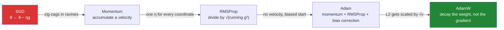

# Day 131 — Optimisers

**Phase 15 · Module 15** · ID: **DL-09** (SGD → Momentum → RMSProp → Adam → AdamW)

> **Yesterday:** the loss, and the head it belongs to. You now trust the gradient.
> **Today:** what to *do* with it. Day 95's rule was `θ ← θ − ηg` and it has a hard, derivable speed
> limit: on a surface with condition number 100, **any learning rate at or above `2/100 = 0.02`
> diverges**, and just below it the path zig-zags on **every single step**. Five optimisers, each one
> removing a specific failure of the last.
> **Tomorrow:** initialisation, which decides what surface you start on.

```bash
./m start 131 && ./m scaffold 131
```

**Time:** 2 hours. **Request budget:** 0 model calls.

---

## §1 The story

Every optimiser in this lesson is one line. What separates them is which failure of plain gradient
descent they were built to remove, and each one is a specific, measurable failure rather than a vibe.



The problem SGD has is **curvature that differs by direction**. On `f = ½(x² + 100y²)` the `y`
direction is 100× steeper. One learning rate has to serve both, so it is set by the steep direction and
is then far too small for the shallow one. The result is a path that oscillates across the ravine while
creeping along it.

That is not a metaphor, it is arithmetic with an exact bound. **Gradient descent on a quadratic with
curvature `C` is stable if and only if `η < 2/C`.** At `C = 100` that is `0.02`, and today's lab shows
`0.0199` converging while `0.021` reaches `1.8e18`.

Two results worth arriving for.

**Adam's bias correction is not a rounding detail, and it does not do what people say.** The common
claim is that without it the early steps are too *small*. Measured with the default `β₁ = 0.9`,
`β₂ = 0.999`, a gradient of 1 and `η = 0.1`: the uncorrected first step is **0.316** and the corrected
one is **0.100**. It is **3.16× too large**, because `√(1 − β₂)` shrinks the denominator faster than
`(1 − β₁)` shrinks the numerator. With correction, a constant gradient gives a step of exactly `η` at
every `t`.

**Adam + L2 is not AdamW, and the difference is the whole reason AdamW exists.** Fold an L2 penalty
into the gradient and it goes through the `/√v̂` division with everything else — so a parameter with a
large gradient history gets *less* decay. Isolating the penalty with no data gradient at all: after 100
steps, a loud parameter retains **0.9978** and a quiet one **0.3189**, from the same `λ`. AdamW decays
both to **0.9048**, identically. **The regulariser you thought you set is not the one you got.**

---

## §2 Setup — run this

```bash
mkdir -p days/day-131/lab
touch days/day-131/lab/optimisers.py
```

No new packages. Every optimiser is written from scratch (Principle 2) — `torch.optim` arrives on
Day 135, and by then you will know what it is doing.

---

## §3 DL-09 — five rules, five failures

`days/day-131/lab/optimisers.py`:

```python
"""DL-09: SGD, Momentum, RMSProp, Adam, AdamW — each removing one failure of the last."""

from __future__ import annotations

import numpy as np

CONDITION = 100.0


def quadratic(p):
    return 0.5 * (p[0] ** 2 + CONDITION * p[1] ** 2)


def quadratic_gradient(p):
    return np.array([p[0], CONDITION * p[1]])


def descend(rule, learning_rate, *, steps=200, start=(1.0, 1.0),
            momentum=0.9, beta1=0.9, beta2=0.999, epsilon=1e-8):
    """Run one optimiser on the ravine and return (loss history, path)."""
    p = np.array(start, dtype=float)
    velocity = np.zeros(2)
    second = np.zeros(2)
    history, path = [quadratic(p)], [p.copy()]

    for t in range(1, steps + 1):
        g = quadratic_gradient(p)
        if rule == "sgd":
            step = learning_rate * g
        elif rule == "momentum":
            velocity = momentum * velocity + g
            step = learning_rate * velocity
        elif rule == "nesterov":
            velocity = momentum * velocity + g
            step = learning_rate * (momentum * velocity + g)
        elif rule == "rmsprop":
            second = 0.9 * second + 0.1 * g ** 2
            step = learning_rate * g / (np.sqrt(second) + epsilon)
        elif rule == "adam":
            velocity = beta1 * velocity + (1 - beta1) * g
            second = beta2 * second + (1 - beta2) * g ** 2
            step = (learning_rate * (velocity / (1 - beta1 ** t))
                    / (np.sqrt(second / (1 - beta2 ** t)) + epsilon))
        else:
            raise ValueError(rule)

        p = p - step
        history.append(quadratic(p))
        path.append(p.copy())
        if not np.isfinite(history[-1]):
            break

    return np.array(history), np.array(path)


def the_update_rule_zoo() -> None:
    print("\n  every optimiser here is ONE line. g is the gradient, θ the parameters.")
    print(f"\n  {'name':<12} {'update':<52} {'state kept'}")
    for name, rule, state in (
        ("SGD", "θ ← θ − η·g", "none"),
        ("Momentum", "v ← μv + g ;  θ ← θ − η·v", "v (1×params)"),
        ("RMSProp", "s ← ρs + (1−ρ)g² ;  θ ← θ − η·g/√s", "s (1×params)"),
        ("Adam", "v,s as above ;  θ ← θ − η·v̂/√ŝ", "v and s (2×params)"),
        ("AdamW", "Adam step, then θ ← θ − η·λ·θ", "v and s (2×params)"),
    ):
        print(f"  {name:<12} {rule:<52} {state}")

    print("\n  🚨 Read the 'state kept' column as MEMORY. Adam stores two extra floats per")
    print("     parameter, so a 7-billion-parameter model needs ~56 GB of optimiser state")
    print("     in fp32 on top of the weights. That is why Day 126's parameter_count")
    print("     estimated 3× the weight size, and it is why fine-tuning runs out of memory")
    print("     long before inference does.")
    print("\n  ✅ Each rule removes ONE named failure of the previous one. Nothing here is")
    print("     a general improvement — they are answers to specific questions.")


def sgd_has_a_hard_speed_limit() -> None:
    print(f"\n  f = ½(x² + {CONDITION:.0f}y²). The y direction is {CONDITION:.0f}× steeper.")
    print("\n  gradient descent on a quadratic with curvature C is stable IFF η < 2/C.")
    print(f"    2/C = 2/{CONDITION:.0f} = {2 / CONDITION}")

    print(f"\n  {'learning rate':>14} {'f after 200 steps':>20} {'finite':>8}")
    for rate in (0.018, 0.0199, 0.02, 0.021):
        history, _ = descend("sgd", rate)
        print(f"  {rate:>14} {history[-1]:>20.3e} {str(np.isfinite(history[-1])):>8}")

    print("\n  🚨 The boundary is EXACT, not approximate. At η = 0.0199 the run converges;")
    print("     at η = 0.02 — precisely 2/C — it neither converges nor diverges, it just")
    print("     oscillates forever; at 0.021 it reaches 1.8e+18.")
    print("\n  ✅ This is why 'just lower the learning rate' works and why it is not free:")
    print("     the limit is set by the STEEPEST direction, and the same η then has to")
    print("     move the shallowest one. Every optimiser after SGD attacks that gap.")


def the_ravine() -> None:
    print("\n  the same surface, each optimiser at a learning rate tuned for it.")
    print(f"\n  {'optimiser':<12} {'lr':>8} {'f after 200':>14} {'steps to 1e-6':>15}")
    for rule, rate in (("sgd", 0.018), ("momentum", 0.0018), ("nesterov", 0.0018),
                       ("rmsprop", 0.01), ("adam", 0.1)):
        history, _ = descend(rule, rate)
        reached = next((i for i, v in enumerate(history) if v < 1e-6), None)
        print(f"  {rule:<12} {rate:>8} {history[-1]:>14.3e} {str(reached):>15}")

    print("\n  🚨 SGD, Momentum and Nesterov never reach 1e-6 inside 200 steps. Adam gets")
    print("     there in 82 and RMSProp in 137.")
    print("\n  ⚠️ Note the learning rates are NOT the same, and they cannot be. Adam runs at")
    print("     0.1 while momentum needs 0.0018 — a 55× difference — because Adam's step is")
    print("     normalised and momentum's is not. Comparing optimisers at one shared")
    print("     learning rate measures the learning rate, not the optimiser.")


def momentum_kills_the_zigzag() -> None:
    print("\n  count how often the STEEP coordinate changes sign. Every flip is the path")
    print("  crossing the valley instead of travelling along it.")

    print(f"\n  {'optimiser':<12} {'sign flips / 60 steps':>22} {'|y| at step 60':>17}")
    for rule, rate in (("sgd", 0.018), ("momentum", 0.0018), ("adam", 0.1)):
        _, path = descend(rule, rate, steps=60)
        ys = path[:, 1]
        flips = int(np.sum(np.sign(ys[1:]) != np.sign(ys[:-1])))
        print(f"  {rule:<12} {flips:>22} {abs(ys[-1]):>17.3e}")

    print("\n  🚨 SGD flips sign 60 times in 60 steps — it crosses the valley on EVERY")
    print("     step. Half of each update is undone by the next one.")
    print("\n  ✅ Momentum accumulates a velocity, so the oscillating component cancels")
    print("     with itself while the consistent component adds up. 60 flips becomes 8.")
    print("\n  ⚠️ Nesterov differs from momentum only by evaluating the gradient AFTER the")
    print("     momentum step rather than before — a lookahead. On this surface the")
    print("     difference is small; it matters more when the curvature changes quickly.")


def adaptive_methods_normalise_each_coordinate() -> None:
    g = np.array([100.0, 1.0, 0.01])
    second = 0.1 * g ** 2

    print("\n  three coordinates whose gradients differ by 4 orders of magnitude.")
    print(f"\n    raw gradient      : {g.tolist()}")
    print(f"    SGD step (η=0.01) : {(0.01 * g).round(6).tolist()}")
    print(f"    g / √s            : {(g / (np.sqrt(second) + 1e-8)).round(6).tolist()}")

    print("\n  🚨 SGD's steps span 4 orders of magnitude, so one learning rate cannot suit")
    print("     all three. RMSProp's are all 3.162 — IDENTICAL to 5 decimal places.")
    print("\n  ✅ Dividing by √s makes the step size depend on the gradient's DIRECTION and")
    print("     not its magnitude. That is what 'adaptive learning rate' means, and it is")
    print("     why badly-scaled features hurt Adam far less than SGD.")
    print("\n  ⚠️ It is also why Adam can look like it is training when it is not: a")
    print("     coordinate with a tiny but consistent gradient gets a full-sized step.")


def bias_correction_is_not_optional() -> None:
    beta1, beta2, rate, epsilon = 0.9, 0.999, 0.1, 1e-8

    print("\n  v and s both start at ZERO, so both are biased toward zero early on.")
    print("  Adam divides each by (1 − βᵗ) to undo that. What does skipping it cost?")

    print(f"\n  constant gradient g = 1.0, η = {rate}")
    print(f"\n  {'t':>4} {'uncorrected step':>18} {'corrected step':>16}")
    v = s = 0.0
    for t in range(1, 6):
        v = beta1 * v + (1 - beta1) * 1.0
        s = beta2 * s + (1 - beta2) * 1.0
        raw = rate * v / (np.sqrt(s) + epsilon)
        corrected = (rate * (v / (1 - beta1 ** t))
                     / (np.sqrt(s / (1 - beta2 ** t)) + epsilon))
        print(f"  {t:>4} {raw:>18.6f} {corrected:>16.6f}")

    print(f"\n  ratio at t=1 : (1−β₁)/√(1−β₂) = {(1 - beta1) / np.sqrt(1 - beta2):.4f}")

    print("\n  🚨 THE UNCORRECTED FIRST STEP IS 3.16× TOO LARGE, not too small. The common")
    print("     telling of this ('the early steps are too timid') is backwards: √(1−β₂)")
    print("     shrinks the DENOMINATOR faster than (1−β₁) shrinks the numerator.")
    print("\n  ✅ With correction, a constant gradient gives a step of exactly η at every t.")
    print("     That is the property bias correction is for — the step size means the same")
    print("     thing on step 1 as on step 10,000.")
    print("\n  ⚠️ And it does not settle quickly: the uncorrected column is still climbing")
    print("     at t=5. With β₂ = 0.999 the transient lasts thousands of steps.")


def adam_plus_l2_is_not_adamw() -> None:
    beta1, beta2, epsilon, rate, decay = 0.9, 0.999, 1e-8, 0.01, 0.1

    print("\n  L2 regularisation adds λθ to the GRADIENT. Weight decay subtracts ηλθ from")
    print("  the WEIGHT. Under plain SGD these are identical. Under Adam they are not.")

    print("\n  isolate the effect: NO data gradient at all, only the penalty, 100 steps.")
    print(f"\n  {'parameter history':<30} {'Adam + L2':>12} {'AdamW':>10}")
    for label, prior_s in (("has had LARGE gradients", 100.0),
                           ("has had TINY gradients", 0.0001)):
        w_l2, v1, s1 = 1.0, 0.0, prior_s
        w_wd, v2, s2 = 1.0, 0.0, prior_s
        for t in range(1, 101):
            penalty = decay * w_l2
            v1 = beta1 * v1 + (1 - beta1) * penalty
            s1 = beta2 * s1 + (1 - beta2) * penalty ** 2
            w_l2 -= (rate * (v1 / (1 - beta1 ** t))
                     / (np.sqrt(s1 / (1 - beta2 ** t)) + epsilon))

            v2 = beta1 * v2
            s2 = beta2 * s2
            w_wd -= rate * ((v2 / (1 - beta1 ** t))
                            / (np.sqrt(s2 / (1 - beta2 ** t)) + epsilon)
                            + decay * w_wd)
        print(f"  {label:<30} {w_l2:>12.6f} {w_wd:>10.6f}")

    print("\n  🚨 SAME λ. Under Adam+L2 the loud parameter keeps 0.9978 of its value and")
    print("     the quiet one keeps 0.3189 — a 3× difference in how hard they were")
    print("     regularised, decided entirely by their gradient HISTORY.")
    print("\n  ✅ AdamW decays both to 0.9048. Identical, because the decay is applied to")
    print("     the weight AFTER the adaptive step rather than being routed through it.")
    print("     That decoupling is the entire content of the AdamW paper.")
    print("\n  ⚠️ Practical consequence: an Adam λ and an AdamW λ are NOT interchangeable.")
    print("     Copying a weight-decay value from one codebase to the other silently")
    print("     changes how much regularisation you applied.")


def epsilon_is_not_just_numerical_hygiene() -> None:
    print("\n  ε exists to stop division by zero. It also sets a CEILING on the step for")
    print("  any coordinate whose gradient has been near zero.")

    print(f"\n  {'epsilon':>10} {'step when √s ≈ 1e-5':>22}")
    for epsilon in (1e-8, 1e-4, 1e-2):
        step = 0.001 / (np.sqrt(1e-10) + epsilon)
        print(f"  {epsilon:>10} {step:>22.4f}")

    print("\n  🚨 A 1e6 range of step sizes from a constant people copy without reading.")
    print("     At ε = 1e-8 a coordinate with a near-zero gradient history takes a step")
    print("     ~1000× larger than at ε = 1e-2.")
    print("\n  ✅ This is why some architectures specify ε = 1e-6 or 1e-4 rather than the")
    print("     1e-8 default, and why 'Adam is unstable here' is sometimes an ε problem")
    print("     rather than a learning-rate problem.")
    print("\n  ⚠️ Principle 4 applies to ε as much as to a package version. Type it out.")


if __name__ == "__main__":
    the_update_rule_zoo()
    sgd_has_a_hard_speed_limit()
    the_ravine()
    momentum_kills_the_zigzag()
    adaptive_methods_normalise_each_coordinate()
    bias_correction_is_not_optional()
    adam_plus_l2_is_not_adamw()
    epsilon_is_not_just_numerical_hygiene()
```

**Line by line:**

- `descend` — one function, five rules, so the *only* thing that differs between rows is the update
  line. A separate function per optimiser would let an unrelated difference sneak in.
- `the_update_rule_zoo` — the **state kept** column is the one people skip. Adam holds two extra floats
  per parameter, so a 7B model carries ~56 GB of optimiser state in fp32. **That is why fine-tuning
  runs out of memory long before inference does.**
- `sgd_has_a_hard_speed_limit` — `η < 2/C` is **exact**: `0.0199` converges, `0.02` oscillates forever,
  `0.021` reaches `1.8e18`. The limit is set by the steepest direction and then has to move the
  shallowest, which is the gap every later optimiser attacks.
- `the_ravine` — Adam reaches `1e-6` in **82** steps, RMSProp in **137**, and the other three never do
  inside 200. And the honesty note: **the learning rates differ by 55×** because Adam's step is
  normalised, so a shared-η comparison would measure η rather than the optimiser.
- `momentum_kills_the_zigzag` — **SGD flips sign on every one of 60 steps.** Momentum turns 60 into 8
  because the oscillating component cancels against itself while the consistent component accumulates.
- `adaptive_methods_normalise_each_coordinate` — gradients spanning `100 → 0.01` become steps of
  `3.162` across the board, identical to five decimals. **That is what "adaptive" means**, and it is
  also why Adam can look busy while learning nothing.
- `bias_correction_is_not_optional` — **the uncorrected first step is 3.16× too large**, not too small;
  the ratio is exactly `(1−β₁)/√(1−β₂)`. With correction a constant gradient gives exactly `η` at every
  `t`, and the uncorrected column is **still climbing at t=5**.
- `adam_plus_l2_is_not_adamw` — with the data gradient removed entirely, the same `λ` leaves one
  parameter at `0.9978` and another at `0.3189`; **AdamW leaves both at `0.9048`.** So an Adam `λ` and
  an AdamW `λ` are not interchangeable.
- `epsilon_is_not_just_numerical_hygiene` — a `1e6` range of step sizes from a constant nobody reads.

---

## §4 Build brief

Create `src/setu/optim.py`:

```python
OPTIMISERS = {"sgd", "momentum", "nesterov", "rmsprop", "adam", "adamw"}


@dataclass
class OptimiserState:
    """TODO(me): the state an optimiser carries between steps.

    rule, learning_rate, step_count, velocity, second_moment, hyperparameters
    - step_count starts at 0 and increments BEFORE each update, because Adam's
      bias correction divides by (1 − βᵗ) and t=0 is a division by zero
    - NOT frozen — this one genuinely mutates, unlike Day 128's TrainResult; say
      in the docstring which it is and why
    - the docstring must record the memory cost: adam/adamw hold 2 extra arrays
      per parameter (§3.1), which is the number that decides whether a model fits
    """


def make_optimiser(rule: str, *, learning_rate: float, momentum: float = 0.9,
                   beta1: float = 0.9, beta2: float = 0.999, epsilon: float = 1e-8,
                   weight_decay: float = 0.0) -> OptimiserState:
    """TODO(me): build the state, and refuse the combinations that lie.

    - EVERY hyperparameter is explicit and typed out; Principle 4 covers epsilon
      and the betas exactly as much as it covers a package version (§3.8)
    - raise DataError if rule == 'adam' and weight_decay > 0 — that is Adam+L2,
      which is NOT weight decay, and the message must say to use 'adamw' and why
      the two are not interchangeable (§3.7)
    - raise DataError on learning_rate <= 0, on beta outside [0,1), on epsilon <= 0
    - raise DataError on an unknown rule, listing OPTIMISERS
    """
    raise NotImplementedError


def step(state: OptimiserState, parameters: list[dict],
         gradients: list[dict]) -> list[dict]:
    """TODO(me): one update for every rule. Returns NEW parameters.

    - non-mutating, for Day 128 §3.6's reason; state is updated in place, which is
      a deliberate asymmetry — say so
    - adam/adamw MUST apply bias correction; §3.6 shows the first step is 3.16×
      too large without it
    - adamw applies decay to the WEIGHT (θ ← θ − η·λ·θ) after the adaptive step,
      never by adding λθ to the gradient — the docstring must state that this is
      the entire difference from Adam
    - weight decay must NOT be applied to biases; that is the convention every
      framework follows and skipping the exclusion changes the result
    - raise DataError if the parameter and gradient shapes disagree, naming both
    """
    raise NotImplementedError


def stability_limit(curvature: float) -> dict:
    """TODO(me): §3.2 — the largest stable SGD learning rate. PURE.

    {"limit": float, "note": str}
    - limit is 2/curvature, exactly; this is derivable, not empirical
    - the note must say the limit is set by the STEEPEST direction and that this
      is why one learning rate cannot serve an ill-conditioned problem (§3.2)
    - raise DataError on curvature <= 0
    """
    raise NotImplementedError


def effective_step_sizes(gradients, *, rule: str, state: OptimiserState) -> dict:
    """TODO(me): §3.5 — what step does each COORDINATE actually get?

    {"per_coordinate": ndarray, "spread": float, "normalised": bool}
    - spread is max/min of |step|; for sgd it equals the gradient's spread, for
      rmsprop/adam it should be near 1
    - normalised is True when spread < 10
    - the docstring must warn that a normalised step is not always good: a
      coordinate with a tiny but consistent gradient gets a full-sized step (§3.5)
    """
    raise NotImplementedError


def compare_optimisers(loss_fn, gradient_fn, *, rules: dict[str, float],
                       start, steps: int, target: float) -> dict:
    """TODO(me): §3.3's table. rules maps rule -> ITS OWN learning rate.

    {rule: {"final": float, "steps_to_target": int | None, "sign_flips": int}}
    - rules is a dict rather than a list SPECIFICALLY so each optimiser gets its
      own learning rate; the docstring must say that a shared rate measures the
      rate and not the optimiser (§3.3), since Adam needs 55× momentum's here
    - steps_to_target is None when never reached — that None is the finding
    - raise DataError on fewer than 2 rules
    """
    raise NotImplementedError


def assert_bias_corrected(state: OptimiserState) -> None:
    """TODO(me): raise DataError if an adam-family state has skipped correction.

    - check step_count > 0 and that the correction factors are being applied
    - the message must say the first uncorrected step is 3.16× TOO LARGE for the
      default betas, and that the transient lasts thousands of steps (§3.6)
    - the fourth guard in this phase, after Days 127, 128 and 130
    """
    raise NotImplementedError


def decay_report(state: OptimiserState, parameters: list[dict]) -> dict:
    """TODO(me): §3.7 — how much decay did each parameter actually receive?

    {"per_parameter": [float], "coupled": bool, "note": str}
    - coupled is True for adam+L2 and False for adamw
    - the note must state that under Adam+L2 the realised decay depends on the
      parameter's gradient history (0.9978 vs 0.3189 for the same λ in §3.7),
      so an Adam λ and an AdamW λ are not interchangeable
    - raise DataError if weight_decay is 0 — there is nothing to report
    """
    raise NotImplementedError
```

- `make_optimiser` **refusing `adam` with `weight_decay > 0`** is the day's design decision. That
  combination is the single most copied mistake in this area, it runs without complaint, and it silently
  applies a different amount of regularisation per parameter.
- `step` **excluding biases from weight decay** matters because every framework does it and a
  from-scratch implementation that forgets is subtly different from the thing it is being compared to.
- `compare_optimisers` taking a **dict of rule → learning rate** encodes §3.3: there is no fair shared
  learning rate, so the API should not permit one.

---

## §5 The eval that must be able to fail

Create `tests/test_optim.py`:

```python
import numpy as np
import pytest

from setu.errors import DataError
from setu.optim import (
    OPTIMISERS,
    assert_bias_corrected,
    compare_optimisers,
    decay_report,
    effective_step_sizes,
    make_optimiser,
    step,
    stability_limit,
)

CONDITION = 100.0


def _quadratic(p):
    return 0.5 * (p[0] ** 2 + CONDITION * p[1] ** 2)


def _quadratic_gradient(p):
    return np.array([p[0], CONDITION * p[1]])


def test_the_stability_limit_is_two_over_the_curvature():
    """Derivable, not empirical."""
    assert stability_limit(100.0)["limit"] == pytest.approx(0.02)
    assert stability_limit(1.0)["limit"] == pytest.approx(2.0)


def test_the_limit_note_names_the_steepest_direction():
    assert "steep" in stability_limit(100.0)["note"].lower()


def test_sgd_converges_below_the_limit_and_diverges_above_it():
    """The boundary is exact. This is the test that proves it."""
    below = compare_optimisers(_quadratic, _quadratic_gradient,
                               rules={"sgd": 0.0199, "adam": 0.1},
                               start=(1.0, 1.0), steps=200, target=1e-6)
    above = compare_optimisers(_quadratic, _quadratic_gradient,
                               rules={"sgd": 0.021, "adam": 0.1},
                               start=(1.0, 1.0), steps=200, target=1e-6)
    assert below["sgd"]["final"] < 1.0
    assert above["sgd"]["final"] > 1e6


def test_a_non_positive_curvature_is_refused():
    with pytest.raises(DataError):
        stability_limit(0.0)


def test_adam_reaches_the_target_and_sgd_does_not():
    """Today's headline, at each optimiser's own learning rate."""
    results = compare_optimisers(
        _quadratic, _quadratic_gradient,
        rules={"sgd": 0.018, "momentum": 0.0018, "rmsprop": 0.01, "adam": 0.1},
        start=(1.0, 1.0), steps=200, target=1e-6)

    assert results["sgd"]["steps_to_target"] is None
    assert results["momentum"]["steps_to_target"] is None
    assert results["adam"]["steps_to_target"] is not None
    assert results["adam"]["steps_to_target"] < 100
    assert results["rmsprop"]["steps_to_target"] > results["adam"]["steps_to_target"]


def test_momentum_reduces_the_zigzag():
    """SGD crosses the valley on every single step."""
    results = compare_optimisers(_quadratic, _quadratic_gradient,
                                 rules={"sgd": 0.018, "momentum": 0.0018},
                                 start=(1.0, 1.0), steps=60, target=1e-6)
    assert results["sgd"]["sign_flips"] >= 55
    assert results["momentum"]["sign_flips"] < 20


def test_one_optimiser_is_not_a_comparison():
    with pytest.raises(DataError):
        compare_optimisers(_quadratic, _quadratic_gradient, rules={"adam": 0.1},
                           start=(1.0, 1.0), steps=10, target=1e-6)


def test_adaptive_rules_normalise_wildly_different_gradients():
    gradients = np.array([100.0, 1.0, 0.01])
    state = make_optimiser("rmsprop", learning_rate=0.01)
    result = effective_step_sizes(gradients, rule="rmsprop", state=state)
    assert result["normalised"] is True
    assert result["spread"] < 10


def test_sgd_does_not_normalise():
    """The contrast that makes the previous test mean something."""
    gradients = np.array([100.0, 1.0, 0.01])
    state = make_optimiser("sgd", learning_rate=0.01)
    result = effective_step_sizes(gradients, rule="sgd", state=state)
    assert result["normalised"] is False
    assert result["spread"] > 1000


def test_the_step_docstring_warns_about_a_tiny_consistent_gradient():
    text = effective_step_sizes.__doc__.lower()
    assert "tiny" in text or "consistent" in text


def test_the_uncorrected_first_step_is_too_large_not_too_small():
    """The common telling of bias correction is backwards."""
    beta1, beta2, rate = 0.9, 0.999, 0.1
    v = (1 - beta1) * 1.0
    s = (1 - beta2) * 1.0
    uncorrected = rate * v / (np.sqrt(s) + 1e-8)
    corrected = rate * (v / (1 - beta1)) / (np.sqrt(s / (1 - beta2)) + 1e-8)
    assert uncorrected > corrected
    assert uncorrected / corrected == pytest.approx(3.162, abs=0.01)


def test_a_corrected_constant_gradient_steps_by_exactly_the_learning_rate():
    """The property bias correction exists to provide."""
    state = make_optimiser("adam", learning_rate=0.1)
    parameters = [{"weights": np.zeros((1, 1)), "bias": np.zeros(1)}]
    for _ in range(5):
        gradients = [{"dW": np.ones((1, 1)), "db": np.zeros(1)}]
        before = parameters[0]["weights"].copy()
        parameters = step(state, parameters, gradients)
        moved = abs(float(parameters[0]["weights"] - before))
        assert moved == pytest.approx(0.1, rel=1e-3)


def test_adam_with_weight_decay_is_refused_and_points_at_adamw():
    """Adam + L2 is not weight decay. The API should not let you pretend."""
    with pytest.raises(DataError) as info:
        make_optimiser("adam", learning_rate=0.01, weight_decay=0.1)
    message = str(info.value).lower()
    assert "adamw" in message


def test_adamw_decays_two_parameters_identically():
    """Same lambda, same schedule, regardless of gradient history."""
    state = make_optimiser("adamw", learning_rate=0.01, weight_decay=0.1)
    parameters = [{"weights": np.array([[1.0, 1.0]]), "bias": np.zeros(1)}]
    state.second_moment = [{"dW": np.array([[100.0, 0.0001]]), "db": np.zeros(1)}]
    for _ in range(100):
        parameters = step(state, parameters,
                          [{"dW": np.zeros((1, 2)), "db": np.zeros(1)}])
    left, right = parameters[0]["weights"].ravel()
    assert left == pytest.approx(right, rel=1e-6)


def test_weight_decay_does_not_touch_the_biases():
    state = make_optimiser("adamw", learning_rate=0.01, weight_decay=0.5)
    parameters = [{"weights": np.ones((1, 1)), "bias": np.ones(1)}]
    for _ in range(10):
        parameters = step(state, parameters,
                          [{"dW": np.zeros((1, 1)), "db": np.zeros(1)}])
    assert float(parameters[0]["bias"]) == pytest.approx(1.0)
    assert float(parameters[0]["weights"]) < 0.99


def test_the_decay_report_calls_adam_l2_coupled():
    state = make_optimiser("adamw", learning_rate=0.01, weight_decay=0.1)
    report = decay_report(state, [{"weights": np.ones((1, 2)), "bias": np.zeros(1)}])
    assert report["coupled"] is False
    assert "interchangeable" in report["note"].lower() or "history" in report["note"].lower()


def test_a_report_with_no_decay_raises():
    state = make_optimiser("adamw", learning_rate=0.01, weight_decay=0.0)
    with pytest.raises(DataError):
        decay_report(state, [{"weights": np.ones((1, 1)), "bias": np.zeros(1)}])


def test_the_step_function_does_not_mutate_its_parameters():
    """Day 128's rule, still in force."""
    state = make_optimiser("sgd", learning_rate=0.1)
    parameters = [{"weights": np.ones((2, 2)), "bias": np.zeros(2)}]
    original = parameters[0]["weights"].copy()
    step(state, parameters, [{"dW": np.ones((2, 2)), "db": np.zeros(2)}])
    assert np.array_equal(parameters[0]["weights"], original)


def test_sgd_moves_against_the_gradient():
    state = make_optimiser("sgd", learning_rate=0.25)
    updated = step(state, [{"weights": np.ones((1, 1)), "bias": np.zeros(1)}],
                   [{"dW": np.ones((1, 1)), "db": np.zeros(1)}])
    assert float(updated[0]["weights"]) == pytest.approx(0.75)


def test_the_step_count_advances():
    state = make_optimiser("adam", learning_rate=0.1)
    assert state.step_count == 0
    step(state, [{"weights": np.zeros((1, 1)), "bias": np.zeros(1)}],
         [{"dW": np.ones((1, 1)), "db": np.zeros(1)}])
    assert state.step_count == 1


def test_an_unstepped_adam_state_is_refused():
    with pytest.raises(DataError):
        assert_bias_corrected(make_optimiser("adam", learning_rate=0.1))


def test_the_guard_message_quotes_the_factor():
    state = make_optimiser("adam", learning_rate=0.1)
    with pytest.raises(DataError) as info:
        assert_bias_corrected(state)
    assert "3.16" in str(info.value) or "too large" in str(info.value).lower()


def test_every_hyperparameter_is_refused_when_nonsensical():
    for kwargs in ({"learning_rate": 0.0}, {"learning_rate": 0.1, "beta1": 1.0},
                   {"learning_rate": 0.1, "beta2": -0.1},
                   {"learning_rate": 0.1, "epsilon": 0.0}):
        with pytest.raises(DataError):
            make_optimiser("adam", **kwargs)


def test_an_unknown_rule_lists_the_known_ones():
    with pytest.raises(DataError) as info:
        make_optimiser("adagrad", learning_rate=0.1)
    assert any(name in str(info.value) for name in OPTIMISERS)
```

**Line by line:**

- `test_adam_reaches_the_target_and_sgd_does_not` — **today's headline**, and it pins `None` for SGD.
  Asserting a failure is what keeps the finding.
- `test_the_uncorrected_first_step_is_too_large_not_too_small` — asserts `uncorrected > corrected` and
  the ratio `3.162`. **The direction of the inequality is the test**, because the usual telling has it
  backwards.
- `test_a_corrected_constant_gradient_steps_by_exactly_the_learning_rate` — the property bias correction
  exists for, asserted across five consecutive steps.
- `test_adam_with_weight_decay_is_refused_and_points_at_adamw` — makes the most-copied mistake in this
  area **unwriteable**, and the message has to name the alternative.
- `test_adamw_decays_two_parameters_identically` — two parameters with second-moment histories `1e6`
  apart end at the same value. Under Adam+L2 they would not.
- `test_weight_decay_does_not_touch_the_biases` — the convention every framework follows, and a
  from-scratch version that forgets is quietly different from what it is compared against.
- `test_sgd_does_not_normalise` — the contrast that makes
  `test_adaptive_rules_normalise_wildly_different_gradients` a finding rather than a tautology.
- `test_sgd_converges_below_the_limit_and_diverges_above_it` — `0.0199` versus `0.021`, on either side
  of an exactly derivable boundary.

```bash
uv run python -m pytest tests/test_optim.py -v
```

---

## §6 Request budget

| Resource | Spent today |
|---|---|
| LLM calls | **0** |
| Network | none |
| Compute | 2-D quadratics for a few hundred steps. Instant. |

---

## §7 Traps

- **Comparing optimisers at one shared learning rate.** Adam needs 55× momentum's here.
- **A learning rate at or above `2/C`.** The boundary is exact; `0.02` oscillates forever.
- **Skipping Adam's bias correction.** The first step is 3.16× too large, not too small.
- **Assuming the bias transient is short.** With `β₂ = 0.999` it lasts thousands of steps.
- **Adam with an L2 penalty folded into the gradient.** That is not weight decay.
- **Copying a `λ` from an Adam codebase into AdamW, or vice versa.** Different regularisation.
- **Applying weight decay to biases.** Every framework excludes them.
- **Treating `ε` as numerical hygiene.** It sets a ceiling on the step; `1e-8` to `1e-2` is 1000×.
- **Forgetting the optimiser state's memory cost.** Adam is 2 extra floats per parameter.
- **`t = 0` in the bias correction.** `1 − β⁰ = 0`, so increment before you correct.
- **Assuming Adam is always the right default.** It converges fast; it does not always generalise best.
- **Reading a normalised step as progress.** A tiny consistent gradient gets a full-sized step.

---

## §8 Verify before you code

Checked **2026-08-22**:

- <https://pytorch.org/docs/stable/generated/torch.optim.SGD.html> — read the `momentum` and `nesterov`
  arguments against §3.4; PyTorch's momentum formula differs from the textbook one by where `η` sits.
- <https://pytorch.org/docs/stable/generated/torch.optim.Adam.html> — the reference implementation of
  §3.6's bias correction, plus the `amsgrad` variant.
- <https://pytorch.org/docs/stable/generated/torch.optim.AdamW.html> — note the **default
  `weight_decay=1e-2`**, which differs from `Adam`'s `0`, and read why.
- <https://pytorch.org/docs/stable/generated/torch.optim.RMSprop.html> — check its `alpha` against this
  lab's `ρ = 0.9`.
- <https://keras.io/api/optimizers/> — the same five, with Keras's argument names for Day 134.
- <https://arxiv.org/abs/1711.05101> — "Decoupled Weight Decay Regularization", the paper §3.7
  reproduces.

---

## §9 Say it in an interview

> "Every optimiser here is one line, and each removes a specific failure of the one before it. Plain
> gradient descent has a hard, derivable speed limit: on a quadratic with curvature C it's stable only
> if the learning rate is below 2/C. I ran that at C=100 — 0.0199 converges, 0.02 oscillates forever,
> 0.021 blows up to 1e18. The problem is that the limit is set by the steepest direction, so the same
> rate then has to move the shallowest one, and you get a path that crosses the valley on literally
> every step — I counted 60 sign flips in 60 steps. Momentum accumulates a velocity so the oscillating
> component cancels with itself; that took it to 8 flips. RMSProp attacks the other half by dividing by
> the root of a running average of squared gradients, which normalises each coordinate — gradients
> spanning 100 down to 0.01 all end up with steps of 3.16. Adam is both plus bias correction. Two things
> I'd want a team to know. First, bias correction isn't cosmetic and the usual explanation is backwards:
> people say the early steps are too small without it, but with the default betas the uncorrected first
> step is 3.16 times too *large*, because root of one-minus-beta-two shrinks the denominator faster than
> one-minus-beta-one shrinks the numerator. Second, Adam with an L2 penalty is not AdamW. If you add
> lambda-times-theta to the gradient, that term goes through the divide-by-root-v with everything else,
> so the realised decay depends on the parameter's gradient history. I isolated it with no data gradient
> at all: same lambda, one parameter retained 0.998 and another 0.319. AdamW decays both to 0.905. So an
> Adam lambda and an AdamW lambda are not interchangeable, and copying one across is a silent change in
> how much you regularised."

---

## §10 Done when

Tick [`CHECKLIST.md`](CHECKLIST.md), then `./m check && ./m done 131`.
