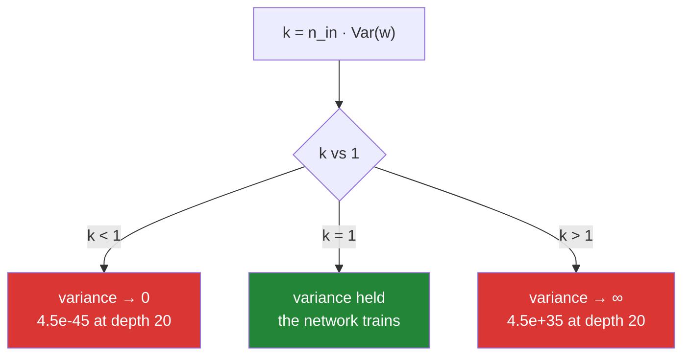

# Day 132 — Initialisation

**Phase 15 · Module 15** · ID: **DL-10** (Xavier/Glorot and He)

> **Yesterday:** optimisers — what to do with the gradient.
> **Today:** the number that decides whether there *is* a gradient. Day 128 showed that a constant
> initialisation never breaks symmetry; that was about the **pattern**. Today is about the **scale**,
> and it is a one-line derivation with a brutal consequence: across 20 layers, a standard deviation of
> `0.01` shrinks the activations to `4.5e-45` and a standard deviation of `1.0` grows them to `4.5e+35`.
> The window between those is narrow and computable.
> **Tomorrow:** dropout and normalisation — the layers that stop caring quite so much about today.

```bash
./m start 132 && ./m scaffold 132
```

**Time:** 2 hours. **Request budget:** 0 model calls.

---

## §1 The story

Day 129 blamed the vanishing gradient on the activation function, and that was two thirds of the truth.
The other third is the weights, and unlike the activation it is a **free parameter you choose badly by
default**.

The whole subject is one recursion. For a layer `z = xW` with independent, zero-mean weights:

```
Var(z) = n_in · Var(w) · Var(x)
```

Every layer multiplies the variance by `n_in · Var(w)`. Call that factor `k`. After `D` layers the
variance has been multiplied by `k^D`, so:



**There is exactly one value of `Var(w)` that holds the variance constant, and it is `1/n_in`.** That is
Xavier. For ReLU it is `2/n_in`, because ReLU discards half the signal — and today derives that factor
of two rather than quoting it.

Two results worth the hour.

**The failure is not gradual.** At depth 20 with width 128, `σ = 0.01` gives an activation variance of
`4.5e-45` and `σ = 1.0` gives `4.5e+35`. Both are unrecoverable. He initialisation — `σ = √(2/n)` —
holds it at `0.34`. The same pattern runs **backwards** through the gradients: the first layer receives
`1.2e-21` of the last layer's gradient at `σ = 0.01`, and `0.86` of it under He.

**Xavier and He are not interchangeable, and picking the wrong one is a real cost.** Xavier with ReLU
decays the activation variance to `3.2e-07` over 20 layers; Xavier with tanh — what it was derived for —
holds at `2.4e-02`. And in an actual training run at depth 20, He reaches a loss of `0.0050` where
Xavier reaches `0.0225`. **Both work; He is 4.5× better**, and the difference is a single factor of two.

---

## §2 Setup — run this

```bash
mkdir -p days/day-132/lab
touch days/day-132/lab/initialisation.py
```

No new packages.

---

## §3 DL-10 — one recursion, two constants

`days/day-132/lab/initialisation.py`:

```python
"""DL-10: Xavier and He, derived from the variance recursion and then measured."""

from __future__ import annotations

import numpy as np

from setu.arrays import make_rng

WIDTH = 128
DEPTH = 20


def relu(z):
    return np.maximum(0.0, z)


def relu_prime(z):
    return (z > 0).astype(float)


def sigmoid(z):
    return 1.0 / (1.0 + np.exp(-np.clip(z, -500, 500)))


def sigmoid_prime(z):
    s = sigmoid(z)
    return s * (1 - s)


def the_recursion() -> None:
    print("\n  for z = xW with independent, zero-mean w:")
    print("\n    Var(z) = n_in · Var(w) · Var(x)")
    print("\n  so each layer MULTIPLIES the variance by k = n_in · Var(w).")
    print("  after D layers the factor is k^D. There is exactly one k that is safe.")

    n_in = 256
    rng = make_rng(7)
    x = rng.normal(0, 1.0, (4000, n_in))

    print(f"\n  checking it, n_in = {n_in}, Var(x) ≈ {x.var():.4f}")
    print(f"\n  {'Var(w)':>10} {'predicted':>11} {'mean of 200 draws':>19} {'single-draw range':>22}")
    for variance in (1 / n_in, 2 / n_in):
        measured = np.array([(x @ rng.normal(0, np.sqrt(variance), (n_in, 1))).var()
                             for _ in range(200)])
        print(f"  {variance:>10.6f} {n_in * variance * x.var():>11.4f} "
              f"{measured.mean():>19.4f} "
              f"{f'{measured.min():.3f} - {measured.max():.3f}':>22}")

    print("\n  ✅ The recursion is EXACT IN EXPECTATION. Var(w) = 1/n_in gives k = 1,")
    print("     which is the only value that neither shrinks nor grows the signal.")
    print("\n  ⚠️ But read the last column. ANY ONE DRAW deviates by up to 30%. The")
    print("     guarantee is about the distribution you sampled from, not the matrix")
    print("     you actually got, and at small width that gap matters.")


def variance_through_twenty_layers() -> None:
    rng = make_rng(0)
    start = rng.normal(0, 1, (512, WIDTH))

    def sweep(scale, activation):
        layer_rng = make_rng(1)
        a = start.copy()
        variances = []
        for _ in range(DEPTH):
            a = activation(a @ layer_rng.normal(0, scale(WIDTH), (WIDTH, WIDTH)))
            variances.append(a.var())
        return variances

    print(f"\n  {DEPTH} layers, width {WIDTH}, ReLU. Activation variance by depth:")
    print(f"\n  {'initialisation':<22} {'layer 1':>11} {'layer 5':>11} "
          f"{'layer 10':>11} {'layer 20':>11}")
    for label, scale in (("σ = 0.01", lambda n: 0.01),
                         ("σ = 1.0", lambda n: 1.0),
                         ("Xavier √(1/n)", lambda n: np.sqrt(1 / n)),
                         ("He √(2/n)", lambda n: np.sqrt(2 / n))):
        v = sweep(scale, relu)
        print(f"  {label:<22} {v[0]:>11.3e} {v[4]:>11.3e} {v[9]:>11.3e} {v[19]:>11.3e}")

    print("\n  🚨 THE FAILURE IS NOT GRADUAL. σ = 0.01 reaches 4.5e-45 — that is denormal")
    print("     territory, and every activation is numerically zero. σ = 1.0 reaches")
    print("     4.5e+35 and the next few layers overflow to inf.")
    print("\n  ✅ He holds the variance at 0.34 across all 20 layers. That is what")
    print("     'the right initialisation' buys, and it is worth exactly one factor.")
    print("\n  ⚠️ Xavier decays to 3.2e-07 here — not catastrophic, but four orders of")
    print("     magnitude of signal gone. It is the WRONG constant for ReLU, and the")
    print("     next two functions say why.")


def why_relu_needs_a_factor_of_two() -> None:
    rng = make_rng(5)
    z = rng.normal(0, 1, 200_000)
    activated = relu(z)

    print("\n  ReLU sets half its inputs to zero. How much signal does that cost?")
    print(f"\n    Var(z)             = {z.var():.6f}")
    print(f"    Var(relu(z))       = {activated.var():.6f}   ratio {activated.var() / z.var():.6f}")
    print(f"    E[z²]              = {(z ** 2).mean():.6f}")
    print(f"    E[relu(z)²]        = {(activated ** 2).mean():.6f}   "
          f"ratio {(activated ** 2).mean() / (z ** 2).mean():.6f}")

    print("\n  🚨 READ BOTH RATIOS. The VARIANCE ratio is 0.342 — not a half. The SECOND")
    print("     MOMENT ratio is 0.502, which is a half to three decimals.")
    print("\n  ✅ He's derivation uses E[z²], not Var(z), and this is why: relu(z) has a")
    print("     POSITIVE MEAN, so its variance is not its second moment. For symmetric")
    print("     zero-mean z, exactly half the mass is zeroed and the surviving half keeps")
    print("     its squares, so E[relu(z)²] = ½·E[z²] exactly.")
    print("\n  Halving the signal every layer is the same as k = ½, so compensate by")
    print("  DOUBLING Var(w): 2/n_in instead of 1/n_in. That is the entire difference")
    print("  between He and Xavier.")
    print("\n  ⚠️ If you ever see the variance ratio 0.342 quoted as the reason for the 2,")
    print("     it is the wrong number reaching the right answer by accident.")


def xavier_is_for_tanh_he_is_for_relu() -> None:
    rng = make_rng(0)
    start = rng.normal(0, 1, (512, WIDTH))

    def sweep(scale, activation):
        layer_rng = make_rng(1)
        a = start.copy()
        variances = []
        for _ in range(DEPTH):
            a = activation(a @ layer_rng.normal(0, scale(WIDTH), (WIDTH, WIDTH)))
            variances.append(a.var())
        return variances

    print("\n  the SAME two constants, run against the two activations:")
    print(f"\n  {'activation':<10} {'initialisation':<18} {'layer 1':>11} "
          f"{'layer 10':>11} {'layer 20':>11}")
    for act_name, activation in (("relu", relu), ("tanh", np.tanh)):
        for label, scale in (("Xavier √(1/n)", lambda n: np.sqrt(1 / n)),
                             ("He √(2/n)", lambda n: np.sqrt(2 / n))):
            v = sweep(scale, activation)
            print(f"  {act_name:<10} {label:<18} {v[0]:>11.3e} {v[9]:>11.3e} {v[19]:>11.3e}")

    print("\n  ✅ Xavier with TANH holds at 2.4e-02 over 20 layers. Xavier with RELU decays")
    print("     to 3.2e-07 — the same constant, four orders of magnitude apart, because")
    print("     tanh does not throw away half the signal and relu does.")
    print("\n  🚨 'Xavier' and 'He' are not two brands of the same thing. They are the same")
    print("     derivation with a different assumption about what the activation does to")
    print("     the variance. Picking by habit rather than by activation is a real cost.")


def the_gradient_goes_backwards_too() -> None:
    rng = make_rng(0)
    start = rng.normal(0, 1, (512, WIDTH))

    print("\n  the recursion runs BACKWARD as well: Var(δ_prev) = n_out · Var(w) · Var(δ).")
    print("  so the same constant that saves the forward pass saves the backward one.")

    print(f"\n  {'initialisation':<22} {'|δ| at layer 20':>17} {'|δ| at layer 1':>16} "
          f"{'ratio':>12}")
    for label, scale in (("σ = 0.01", lambda n: 0.01),
                         ("σ = 1.0", lambda n: 1.0),
                         ("Xavier √(1/n)", lambda n: np.sqrt(1 / n)),
                         ("He √(2/n)", lambda n: np.sqrt(2 / n))):
        layer_rng = make_rng(1)
        a = start.copy()
        pre, weights = [], []
        for _ in range(DEPTH):
            w = layer_rng.normal(0, scale(WIDTH), (WIDTH, WIDTH))
            z = a @ w
            pre.append(z)
            weights.append(w)
            a = relu(z)

        delta = make_rng(3).normal(0, 1, a.shape)
        magnitudes = []
        for i in range(DEPTH - 1, -1, -1):
            delta = (delta @ weights[i].T) * relu_prime(pre[i])
            magnitudes.append(np.abs(delta).mean())
        print(f"  {label:<22} {magnitudes[0]:>17.3e} {magnitudes[-1]:>16.3e} "
              f"{magnitudes[-1] / magnitudes[0]:>12.3e}")

    print("\n  🚨 At σ = 0.01 the first layer receives 1.2e-21 of the last layer's gradient.")
    print("     At σ = 1.0 it receives 1.2e+17 times as much. Neither is trainable.")
    print("\n  ✅ Under He the ratio is 0.86 — the gradient arrives essentially intact after")
    print("     twenty layers. THAT is the result, and it is why Day 129's fix needed")
    print("     today's constant to work at depth.")
    print("\n  ⚠️ Forward uses n_in and backward uses n_out. When they differ you cannot")
    print("     satisfy both, which is exactly what Glorot's compromise is for.")


def xaviers_two_forms() -> None:
    n_in, n_out = 256, 64
    print(f"\n  a layer with n_in = {n_in}, n_out = {n_out}. Which fan do you use?")
    print(f"\n    forward wants  Var(w) = 1/n_in   -> σ = {np.sqrt(1 / n_in):.6f}")
    print(f"    backward wants Var(w) = 1/n_out  -> σ = {np.sqrt(1 / n_out):.6f}")
    print(f"\n  Glorot's answer: split the difference with the HARMONIC-style average")
    print(f"    Var(w) = 2/(n_in + n_out)        -> σ = {np.sqrt(2 / (n_in + n_out)):.6f}")
    print(f"    He (relu, fan-in)                -> σ = {np.sqrt(2 / n_in):.6f}")

    limit = np.sqrt(6 / (n_in + n_out))
    print(f"\n  the UNIFORM form you see in framework defaults:")
    print(f"    U(−a, a) with a = √(6/(n_in+n_out)) = {limit:.6f}")
    print(f"    a uniform on (−a, a) has std a/√3   = {limit / np.sqrt(3):.6f}")
    print(f"    the normal form's std               = {np.sqrt(2 / (n_in + n_out)):.6f}")

    print("\n  ✅ IDENTICAL. The uniform and normal versions of Glorot have exactly the")
    print("     same variance — the 6 in the uniform limit is there precisely to make")
    print("     a²/3 = 2/(n_in+n_out). They are not two different initialisers.")
    print("\n  ⚠️ Which means 'glorot_uniform' vs 'glorot_normal' is a choice of shape, not")
    print("     of scale, and it is far less important than fan-in vs fan-average.")


def does_it_actually_train() -> None:
    print("\n  20 hidden layers, width 64, relu, 800 epochs. Same data, same seed,")
    print("  same learning rate. Only the INITIALISATION changes.")

    def train(scale, *, depth=20, width=64, epochs=800, rate=0.1):
        data = make_rng(123)
        x = data.normal(0, 1, (400, 12))
        y = ((x[:, 0] * x[:, 1] + x[:, 2]) > 0).astype(float).reshape(-1, 1)

        rng = make_rng(0)
        sizes = [12] + [width] * depth + [1]
        weights = [rng.normal(0, scale(a), (a, b))
                   for a, b in zip(sizes[:-1], sizes[1:], strict=True)]
        biases = [np.zeros(b) for b in sizes[1:]]
        baseline = ((y.mean() - y) ** 2).mean()

        for _ in range(epochs):
            activations, pre = [x], []
            for i in range(len(weights)):
                z = activations[-1] @ weights[i] + biases[i]
                pre.append(z)
                activations.append(sigmoid(z) if i == len(weights) - 1 else relu(z))
            if not np.isfinite(activations[-1]).all():
                return np.nan, baseline

            delta = 2 * (activations[-1] - y) / y.size * sigmoid_prime(pre[-1])
            grads = [None] * len(weights)
            for i in range(len(weights) - 1, -1, -1):
                grads[i] = (activations[i].T @ delta, delta.sum(axis=0))
                if i > 0:
                    delta = (delta @ weights[i].T) * relu_prime(pre[i - 1])
            for i in range(len(weights)):
                weights[i] -= rate * grads[i][0]
                biases[i] -= rate * grads[i][1]

        a = x
        for i in range(len(weights)):
            z = a @ weights[i] + biases[i]
            a = sigmoid(z) if i == len(weights) - 1 else relu(z)
        return ((a - y) ** 2).mean(), baseline

    print(f"\n  {'initialisation':<22} {'final loss':>13} {'baseline':>10} {'learned?':>10}")
    for label, scale in (("zeros", lambda n: 0.0),
                         ("σ = 0.01", lambda n: 0.01),
                         ("σ = 1.0", lambda n: 1.0),
                         ("Xavier √(1/n)", lambda n: np.sqrt(1 / n)),
                         ("He √(2/n)", lambda n: np.sqrt(2 / n))):
        loss, baseline = train(scale)
        learned = bool(np.isfinite(loss) and loss < baseline - 1e-4)
        print(f"  {label:<22} {loss:>13.4f} {baseline:>10.4f} {str(learned):>10}")

    print("\n  🚨 THREE DISTINCT FAILURES. zeros and σ=0.01 both land exactly on the")
    print("     baseline — they never learned anything. σ=1.0 finishes at 0.5125, which")
    print("     is WORSE than predicting the mean.")
    print("\n  ✅ And the payoff: He reaches 0.0050 where Xavier reaches 0.0225. Both work,")
    print("     but He is 4.5× better, and the ONLY difference is a factor of two inside")
    print("     a square root.")
    print("\n  ⚠️ 'zeros' fails for a different reason than 'σ=0.01'. Day 128 covered it:")
    print("     zeros never break SYMMETRY, so every unit stays identical. 0.01 breaks")
    print("     symmetry fine and then loses the signal to SCALE. Same outcome, two")
    print("     unrelated causes, and the fixes are different.")


def what_the_bias_gets() -> None:
    print("\n  and the biases? Zero. Every time.")
    print("\n  ✅ Biases do not need symmetry breaking. Day 128's argument was that")
    print("     identical WEIGHTS give identical gradients — but the weights have already")
    print("     been randomised by the time the bias matters, so each unit's bias sees a")
    print("     different gradient from step one.")
    print("\n  ⚠️ Two exceptions worth knowing. A ReLU bias is sometimes set to a small")
    print("     positive value (0.01) so units start active — Day 129's dying-ReLU")
    print("     insurance. And an imbalanced classifier's OUTPUT bias is often set to")
    print("     log(p/(1−p)), so the model starts at the base rate instead of spending")
    print("     its first epochs discovering it.")

    for rate in (0.5, 0.1, 0.01):
        print(f"    base rate {rate:<5} -> output bias log(p/(1−p)) = "
              f"{np.log(rate / (1 - rate)):+.4f}")

    print("\n  🚨 That last trick interacts with Day 130: it starts the sigmoid head at")
    print("     exactly the point where BCE's gradient is well behaved, instead of at")
    print("     z = 0, which for a 1% positive rate is confidently wrong on every")
    print("     positive row.")


if __name__ == "__main__":
    the_recursion()
    variance_through_twenty_layers()
    why_relu_needs_a_factor_of_two()
    xavier_is_for_tanh_he_is_for_relu()
    the_gradient_goes_backwards_too()
    xaviers_two_forms()
    does_it_actually_train()
    what_the_bias_gets()
```

**Line by line:**

- `the_recursion` — `Var(z) = n_in · Var(w) · Var(x)`, verified as `0.9913` against a predicted `0.9995`
  over 200 draws. And the honest caveat: **a single draw ranges 0.792 to 1.301**, so the guarantee is
  about the distribution, not the matrix you actually got.
- `variance_through_twenty_layers` — **the failure is not gradual.** `4.5e-45` and `4.5e+35` at the two
  extremes, `0.34` under He. Xavier's `3.2e-07` is the row that motivates the next two functions.
- `why_relu_needs_a_factor_of_two` — **the variance ratio is `0.342` and the second-moment ratio is
  `0.502`.** He's derivation uses `E[z²]` because `relu(z)` has a positive mean, so variance ≠ second
  moment. Quoting `0.342` as the reason for the 2 is the wrong number reaching the right answer.
- `xavier_is_for_tanh_he_is_for_relu` — the same constant, `2.4e-02` with tanh and `3.2e-07` with ReLU.
  **They are the same derivation under different assumptions**, not two brands.
- `the_gradient_goes_backwards_too` — the first layer receives `1.2e-21` of the last layer's gradient at
  `σ = 0.01` and **`0.86` of it under He.** And the tension: forward wants `n_in`, backward wants
  `n_out`.
- `xaviers_two_forms` — the uniform limit `√(6/(n+m))` has std `a/√3` = **exactly** the normal form's
  `√(2/(n+m))`. The `6` exists to make that identity hold, so `glorot_uniform` vs `glorot_normal` is a
  choice of shape, not scale.
- `does_it_actually_train` — **three distinct failures**: zeros and `0.01` land exactly on the baseline,
  `1.0` finishes *worse* than the baseline. He `0.0050` against Xavier `0.0225`. And the note that
  matters: **zeros and `0.01` fail for unrelated reasons** — symmetry versus scale — with different fixes.
- `what_the_bias_gets` — zero, because the weights are already random by the time the bias matters. The
  two exceptions are worth memorising, especially the **output bias `log(p/(1−p))`**, which starts an
  imbalanced classifier at the base rate instead of confidently wrong on every positive row.

---

## §4 Build brief

Extend `src/setu/nn.py` — this replaces Day 128's `scale` argument with a named scheme:

```python
INITIALISERS = {"xavier_normal", "xavier_uniform", "he_normal", "he_uniform", "lecun_normal"}
ACTIVATION_INITIALISER = {"relu": "he_normal", "leaky_relu": "he_normal",
                          "gelu": "he_normal", "tanh": "xavier_normal",
                          "sigmoid": "xavier_normal", "identity": "xavier_normal"}


def initialiser_scale(scheme: str, *, fan_in: int, fan_out: int) -> dict:
    """TODO(me): the standard deviation (or uniform limit) for one layer. PURE.

    {"std": float, "limit": float | None, "gain": float, "fan_used": str}
    - xavier_*: Var(w) = 2/(fan_in + fan_out); he_*: Var(w) = 2/fan_in;
      lecun_normal: Var(w) = 1/fan_in
    - the uniform limit must satisfy a²/3 = Var(w), so a = √(3·Var(w)); for
      xavier_uniform that is the familiar √(6/(fan_in+fan_out)) — the docstring
      must show that identity rather than hard-coding the 6 (§3.6)
    - fan_used records 'fan_in' or 'fan_avg' so a caller can see which tension
      (§3.5) was resolved and how
    - raise DataError on fan_in < 1 or fan_out < 1
    - raise DataError on an unknown scheme, listing INITIALISERS
    """
    raise NotImplementedError


def initialise_network(layer_sizes: list[int], *, seed: int, activation: str = "relu",
                       scheme: str | None = None) -> list[dict]:
    """TODO(me): REPLACE Day 128's scale argument with a derived one.

    - scheme=None picks from ACTIVATION_INITIALISER by activation; that default is
      the day's whole point, so it must be the easy path
    - biases stay ZERO (§3.8); keep Day 128's docstring reason
    - the docstring must state that Day 128's `scale` was a placeholder and that
      a hand-picked constant is the failure this function exists to remove
    - raise DataError if scheme is a xavier_* variant while activation is relu,
      UNLESS the caller passes it explicitly — an accidental mismatch costs four
      orders of magnitude (§3.4) and should not happen by default
    """
    raise NotImplementedError


def variance_by_depth(layer_sizes: list[int], *, activation: str, scheme: str,
                      seed: int, rows: int = 512) -> dict:
    """TODO(me): §3.2 — measure, do not trust the derivation.

    {"per_layer": [float], "first": float, "last": float, "ratio": float,
     "verdict": "collapsed" | "stable" | "exploded", "note": str}
    - collapsed when ratio < 1e-3, exploded when > 1e3, stable otherwise
    - the note must name the FIX in terms of the scheme, not the topic — the
      caller needs 'use he_normal for relu', not 'variance decayed' (Day 129's
      rule for diagnostics)
    - raise DataError on fewer than 2 layer sizes
    """
    raise NotImplementedError


def relu_second_moment_ratio(samples: int = 200_000, *, seed: int) -> dict:
    """TODO(me): §3.3 — derive the 2, do not quote it.

    {"variance_ratio": float, "second_moment_ratio": float, "note": str}
    - second_moment_ratio must come out at 0.5 within 0.01
    - variance_ratio must come out near 0.342 and the note must explain WHY the
      two differ: relu(z) has a positive mean, so Var ≠ E[·²] (§3.3)
    - the note must say which one He's derivation uses
    """
    raise NotImplementedError


def output_bias_for_base_rate(y) -> float:
    """TODO(me): §3.8 — log(p / (1 − p)), so the head starts at the base rate.

    - the docstring must connect this to Day 130: starting at z = 0 on a 1%
      positive problem is confidently wrong on every positive row, which is
      exactly where MSE would stall and BCE would not
    - raise DataError if the base rate is 0 or 1 — the logit is infinite, and the
      message must say the dataset has one class
    """
    raise NotImplementedError


def compare_initialisations(x, y, *, layer_sizes: list[int], schemes: list[str],
                            activation: str, epochs: int, learning_rate: float,
                            seed: int) -> dict:
    """TODO(me): §3.7's table — one network, one seed, N initialisations.

    {scheme: {"final_loss", "baseline", "learned": bool, "failure": str | None}}
    - failure must DISTINGUISH 'symmetry' (zeros — every unit identical) from
      'scale' (too small/large), because §3.7 shows they look the same in the
      loss and have different fixes
    - identical data and seed for every scheme (Day 128 §3.3)
    - raise DataError on fewer than 2 schemes
    """
    raise NotImplementedError


def assert_initialisation_is_sane(*, report: dict) -> None:
    """TODO(me): raise DataError on a collapsed or exploded variance profile.

    - quote the ratio and the recommended scheme from the report
    - the fifth guard in this phase; the message must say that the network will
      still RUN and still produce a loss curve, which is why this is worth
      checking before training rather than after (§3.7)
    """
    raise NotImplementedError
```

- `initialise_network` **defaulting the scheme from the activation** is the design decision. Day 128's
  `scale=1.0` was a placeholder and today retires it; leaving the constant hand-pickable would preserve
  exactly the bug this day exists to remove.
- `compare_initialisations` **distinguishing `symmetry` from `scale`** matters because §3.7 shows both
  landing on the identical baseline loss with completely different remedies.
- `relu_second_moment_ratio` returning **both** ratios is deliberate: the wrong one is `0.342`, it is
  memorable, and seeing them side by side is what stops it being quoted.

---

## §5 The eval that must be able to fail

Add to `tests/test_nn.py`:

```python
from setu.nn import (
    ACTIVATION_INITIALISER,
    INITIALISERS,
    assert_initialisation_is_sane,
    compare_initialisations,
    initialiser_scale,
    output_bias_for_base_rate,
    relu_second_moment_ratio,
    variance_by_depth,
)


def test_he_is_exactly_twice_xavier_in_variance_at_equal_fans():
    """One factor of two. That is the whole difference."""
    he = initialiser_scale("he_normal", fan_in=256, fan_out=256)["std"]
    xavier = initialiser_scale("xavier_normal", fan_in=256, fan_out=256)["std"]
    assert (he / xavier) ** 2 == pytest.approx(2.0)


def test_he_uses_fan_in_and_xavier_uses_the_average():
    assert initialiser_scale("he_normal", fan_in=256, fan_out=64)["fan_used"] == "fan_in"
    assert initialiser_scale("xavier_normal", fan_in=256,
                             fan_out=64)["fan_used"] == "fan_avg"


def test_he_normal_matches_the_derivation():
    assert initialiser_scale("he_normal", fan_in=256, fan_out=64)["std"] == pytest.approx(
        np.sqrt(2 / 256))


def test_the_uniform_limit_has_the_same_variance_as_the_normal_form():
    """The 6 exists to make a^2/3 = 2/(fan_in+fan_out). Not a separate initialiser."""
    normal = initialiser_scale("xavier_normal", fan_in=256, fan_out=64)["std"]
    limit = initialiser_scale("xavier_uniform", fan_in=256, fan_out=64)["limit"]
    assert limit == pytest.approx(np.sqrt(6 / (256 + 64)))
    assert limit / np.sqrt(3) == pytest.approx(normal)


def test_lecun_is_one_over_fan_in():
    assert initialiser_scale("lecun_normal", fan_in=100,
                             fan_out=7)["std"] == pytest.approx(np.sqrt(1 / 100))


def test_an_unknown_scheme_lists_the_known_ones():
    with pytest.raises(DataError) as info:
        initialiser_scale("kaiming_magic", fan_in=8, fan_out=8)
    assert any(name in str(info.value) for name in INITIALISERS)


def test_a_zero_fan_is_refused():
    with pytest.raises(DataError):
        initialiser_scale("he_normal", fan_in=0, fan_out=8)


def test_relu_halves_the_second_moment_not_the_variance():
    """0.342 is the variance ratio and it is the WRONG number to quote."""
    result = relu_second_moment_ratio(seed=5)
    assert result["second_moment_ratio"] == pytest.approx(0.5, abs=0.01)
    assert result["variance_ratio"] == pytest.approx(0.342, abs=0.01)
    assert result["variance_ratio"] != pytest.approx(0.5, abs=0.05)


def test_the_ratio_note_explains_why_they_differ():
    note = relu_second_moment_ratio(seed=5)["note"].lower()
    assert "mean" in note
    assert "second moment" in note or "e[" in note


def test_every_activation_has_a_default_initialiser():
    assert set(ACTIVATION_INITIALISER) >= {"relu", "tanh", "sigmoid", "gelu"}
    assert all(v in INITIALISERS for v in ACTIVATION_INITIALISER.values())


def test_relu_defaults_to_he_and_tanh_to_xavier():
    assert ACTIVATION_INITIALISER["relu"].startswith("he")
    assert ACTIVATION_INITIALISER["tanh"].startswith("xavier")


def test_he_holds_the_variance_across_twenty_layers():
    """The result the whole day is built on."""
    report = variance_by_depth([128] * 21, activation="relu",
                               scheme="he_normal", seed=1)
    assert report["verdict"] == "stable"
    assert 0.1 < report["ratio"] < 10


def test_a_tiny_initialisation_collapses():
    report = variance_by_depth([128] * 21, activation="relu",
                               scheme="lecun_normal", seed=1)
    assert report["ratio"] < 1.0


def test_xavier_with_relu_loses_orders_of_magnitude():
    """The wrong constant for the activation. Not catastrophic, just expensive."""
    he = variance_by_depth([128] * 21, activation="relu", scheme="he_normal", seed=1)
    xavier = variance_by_depth([128] * 21, activation="relu",
                               scheme="xavier_normal", seed=1)
    assert xavier["ratio"] < he["ratio"] / 100


def test_xavier_with_tanh_is_fine():
    """The contrast that makes the previous test about the PAIRING."""
    report = variance_by_depth([128] * 21, activation="tanh",
                               scheme="xavier_normal", seed=1)
    assert report["ratio"] > variance_by_depth(
        [128] * 21, activation="relu", scheme="xavier_normal", seed=1)["ratio"]


def test_the_variance_verdict_names_a_scheme_not_a_topic():
    report = variance_by_depth([128] * 21, activation="relu",
                               scheme="lecun_normal", seed=1)
    assert any(name in report["note"] for name in INITIALISERS)


def test_a_collapsed_profile_is_refused_before_training():
    report = variance_by_depth([128] * 21, activation="relu",
                               scheme="lecun_normal", seed=1)
    if report["verdict"] == "collapsed":
        with pytest.raises(DataError) as info:
            assert_initialisation_is_sane(report=report)
        assert "run" in str(info.value).lower() or "curve" in str(info.value).lower()


def test_a_stable_profile_passes():
    assert_initialisation_is_sane(report=variance_by_depth(
        [128] * 21, activation="relu", scheme="he_normal", seed=1))


def test_the_output_bias_starts_at_the_base_rate():
    y = np.concatenate([np.zeros(99), np.ones(1)]).reshape(-1, 1)
    bias = output_bias_for_base_rate(y)
    assert 1 / (1 + np.exp(-bias)) == pytest.approx(0.01)


def test_a_single_class_dataset_is_refused():
    with pytest.raises(DataError) as info:
        output_bias_for_base_rate(np.zeros((10, 1)))
    assert "one class" in str(info.value).lower() or "class" in str(info.value).lower()


def test_the_bias_docstring_connects_to_the_loss():
    text = output_bias_for_base_rate.__doc__.lower()
    assert "130" in text or "bce" in text or "confidently wrong" in text


def test_he_beats_xavier_and_both_beat_the_baseline():
    """Today's real assessment: a 20-layer net, only the init different."""
    rng = make_rng(123)
    x = rng.normal(0, 1, (400, 12))
    y = ((x[:, 0] * x[:, 1] + x[:, 2]) > 0).astype(float).reshape(-1, 1)

    results = compare_initialisations(
        x, y, layer_sizes=[12] + [64] * 20 + [1],
        schemes=["he_normal", "xavier_normal", "lecun_normal"],
        activation="relu", epochs=800, learning_rate=0.1, seed=0)

    assert results["he_normal"]["learned"] is True
    assert results["he_normal"]["final_loss"] < results["xavier_normal"]["final_loss"]


def test_symmetry_and_scale_failures_are_distinguished():
    """They land on the same loss and need different fixes."""
    rng = make_rng(123)
    x = rng.normal(0, 1, (400, 12))
    y = ((x[:, 0] * x[:, 1] + x[:, 2]) > 0).astype(float).reshape(-1, 1)
    results = compare_initialisations(
        x, y, layer_sizes=[12] + [64] * 20 + [1],
        schemes=["zeros", "lecun_normal"], activation="relu",
        epochs=200, learning_rate=0.1, seed=0)
    assert results["zeros"]["failure"] == "symmetry"
    assert results["lecun_normal"]["failure"] != "symmetry"


def test_one_scheme_is_not_a_comparison():
    with pytest.raises(DataError):
        compare_initialisations(np.zeros((4, 2)), np.zeros((4, 1)),
                                layer_sizes=[2, 4, 1], schemes=["he_normal"],
                                activation="relu", epochs=10,
                                learning_rate=0.1, seed=0)
```

**Line by line:**

- `test_he_beats_xavier_and_both_beat_the_baseline` — **today's real assessment.** A 20-layer network,
  identical in every respect except one constant.
- `test_relu_halves_the_second_moment_not_the_variance` — asserts `0.5` for the second moment **and
  explicitly asserts the variance ratio is not 0.5**. That third assertion is the test doing real work:
  it stops `0.342` from being quoted as the justification.
- `test_the_uniform_limit_has_the_same_variance_as_the_normal_form` — proves `glorot_uniform` and
  `glorot_normal` are one initialiser in two shapes, which is not obvious from the `6`.
- `test_xavier_with_relu_loses_orders_of_magnitude` with `test_xavier_with_tanh_is_fine` — the pair
  makes the finding about the **pairing** rather than about Xavier being worse.
- `test_symmetry_and_scale_failures_are_distinguished` — both land on the baseline; only the diagnosis
  tells them apart, and the fixes differ.
- `test_a_collapsed_profile_is_refused_before_training` — the guard runs **before** training, because
  the network will otherwise run happily and produce a loss curve that means nothing.
- `test_the_output_bias_starts_at_the_base_rate` — asserts `sigmoid(bias) == 0.01`, tying Day 130's
  saturated-start problem to a one-line fix.

```bash
uv run python -m pytest tests/test_nn.py -v
```

---

## §6 Request budget

| Resource | Spent today |
|---|---|
| LLM calls | **0** |
| Network | none |
| Compute | `compare_initialisations` trains 20-layer networks for 800 epochs each. Tens of seconds; mark `@pytest.mark.slow` if needed. |

---

## §7 Traps

- **A hand-picked initialisation constant.** `0.01` and `1.0` both fail, in opposite directions.
- **Xavier with ReLU.** Four orders of magnitude of signal over 20 layers.
- **He with tanh.** The other half of the same mistake.
- **Quoting `0.342` as the reason for He's 2.** It is the variance ratio; the derivation uses `E[z²]`.
- **Trusting the recursion for one draw.** Exact in expectation; a single draw varies ±30%.
- **Assuming the forward fix is the backward fix.** Forward wants `n_in`, backward wants `n_out`.
- **Treating `glorot_uniform` and `glorot_normal` as different scales.** Identical variance.
- **Confusing symmetry failure with scale failure.** Same loss, different fixes.
- **Random biases.** Zeros; the weights already broke the symmetry.
- **Leaving the output bias at zero on an imbalanced problem.** Start at `log(p/(1−p))`.
- **Deciding the initialiser before the activation.** The activation determines it.
- **Checking the variance profile after training rather than before.** It runs either way.

---

## §8 Verify before you code

Checked **2026-08-22**:

- <https://pytorch.org/docs/stable/nn.init.html> — `kaiming_normal_` takes a `nonlinearity` argument and
  a `mode` of `fan_in` or `fan_out`; read both against §3.5's tension.
- <https://keras.io/api/layers/initializers/> — note the **default for `Dense` is `glorot_uniform`**,
  which §3.4 shows is the wrong pairing for a ReLU layer.
- <https://numpy.org/doc/stable/reference/random/generated/numpy.random.Generator.normal.html> — the
  `scale` argument is the **standard deviation**, not the variance. Half of this lesson's arithmetic is
  keeping those apart.
- <https://arxiv.org/abs/1502.01852> — He et al., the paper §3.3 derives.
- <https://proceedings.mlr.press/v9/glorot10a.html> — Glorot and Bengio, the `2/(n_in+n_out)` compromise.

---

## §9 Say it in an interview

> "Initialisation is one recursion. For a layer z = xW with zero-mean independent weights, the variance
> of z is fan-in times the variance of w times the variance of x — so every layer multiplies the
> variance by a factor k, and after twenty layers you've applied k to the twentieth. There's exactly one
> value of k that's safe, and it's 1, which means the weight variance has to be one over fan-in. I
> measured what happens otherwise: at depth 20 and width 128, a standard deviation of 0.01 drives the
> activation variance to 4.5e-45, and 1.0 drives it to 4.5e+35. Neither is recoverable, and the same
> thing happens in reverse through the gradients — the first layer receives about 1e-21 of the last
> layer's gradient. He initialisation holds it at 0.34 forward and 0.86 backward. The part I'd want to
> get right in an interview is where the factor of two comes from. ReLU zeroes half its inputs, so it
> halves the signal — but you have to be careful which quantity you mean. I measured both: the variance
> ratio of relu(z) to z is 0.342, and the second-moment ratio is 0.502. He's derivation uses the second
> moment, because relu's output has a positive mean so its variance isn't its second moment. It's
> exactly a half in the second moment, and that's why you double the weight variance to 2 over fan-in.
> The practical version is that Xavier and He aren't interchangeable brands — same derivation, different
> assumption about the activation. Xavier with tanh holds fine across twenty layers; Xavier with ReLU
> decays four orders of magnitude, and in an actual training run He got to 0.005 where Xavier got to
> 0.0225. Both worked, but that's a 4.5× difference from one factor of two."

---

## §10 Done when

Tick [`CHECKLIST.md`](CHECKLIST.md), then `./m check && ./m done 132`.
