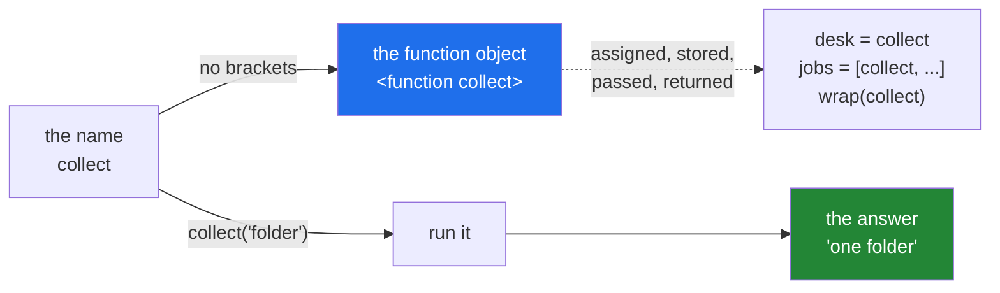

# 1.1 — A function is a value you can hand to somebody else

## One-line answer

In Python a function is an ordinary value, exactly like a number or a string: `collect` on its own is
the function itself, `collect(...)` is the result of running it, and everything on this day rests on
that one character of difference.

---

## The story

There is a desk in the lobby of a small office building, and a book on the desk.

You come in to pick up one folder from the office on the third floor. You do not walk straight to the
lift. You stop at the desk, the person there writes your name and the time in the book, and then you
go up. On the way out they write the time again.

The office on the third floor knows none of this happened. Somebody knocked, they handed over a
folder, and that was the whole of their day. The desk added something around the visit without
changing the visit.

Here is the part that matters, and it is easy to walk past. **The desk never does the visiting.** It
does not go up and fetch the folder. Somebody hands the desk a job — *"this person is going to the
third floor"* — and the desk arranges things around that job. The job is a thing that can be handed
over, described, written down, and given to somebody else to arrange.

That is the whole idea of today, and it starts one step further back than most people expect. Before
you can wrap a job, you have to be able to **hold** one.

---

## The idea in plain language

When you write `def collect(what): ...`, two things happen, and most people only notice one of them.
Python builds a function object, and then it puts that object in a name — the name `collect`. The
`def` statement is an assignment wearing a different coat.

That means `collect` behaves like every other name in the language. A name that holds the number `3`
can be copied into a second name, put in a list, or passed into another function. A name that holds a
function can do all three, because there is nothing special about the value inside it.

The one character that decides everything is the bracket.

- **`collect`** — the function itself. Nothing runs. You are holding the job.
- **`collect("folder")`** — *call* the function. It runs, and you are holding its answer.

Two words for this, both of which you will meet in error messages and in other people's code:

- A value that can be treated like any other value — assigned, stored, passed, returned — is called a
  **first-class** value. In Python, functions are first-class.
- A function that takes another function as an argument, or hands one back, is called a
  **higher-order** function. `sorted(names, key=len)` is one you have already used: `len` went in
  without brackets, because `sorted` wanted the job, not the answer.

You already relied on this on
[Day 11, 3.2](../../../day-11-iterators-and-generators/parts/03-lambda-and-map/3.2-map-and-filter-are-lazy.md),
where `map(clean, titles)` handed `clean` — the function — to `map`. Today the same fact stops being a
convenience and becomes a tool.

---

## Why Setu needs it

- **Everything after this document depends on it.** A decorator is a function that takes a function
  and returns a function. If `collect` without brackets does not feel like a value you can hold, the
  next four parts will read like magic, and magic is the thing this curriculum refuses.
- **Day 19's Pydantic validators** are functions registered by handing them to something else, not by
  calling them.
- **Phase 20's LangChain and Phase 22's LangGraph are built on this all the way down.** A LangGraph
  node is a function you hand to a graph, and the graph decides when it runs. If you can hold a
  function, that library is ordinary. If you cannot, it is a wall.
- **`pytest` already does it to you.** You have written test functions since
  [Day 2](../../../day-02-quality-gate/parts/03-pytest/3.1-the-test-that-can-go-red.md) and never
  called one. `pytest` collects them as values and calls them for you.

---

## The mechanism

```python
"""A function is a value: it can be named again, put in a list, and passed on."""


def collect(what: str) -> str:
    """Go up to the third floor and come back with one thing."""
    return f"one {what}"


desk = collect

print("called by its own name :", collect("folder"))
print("called by the new name :", desk("folder"))
print("the same object?       :", desk is collect)
print("what the name holds    :", collect)
print("its own idea of itself :", collect.__name__)

jobs = [collect, str.upper, len]
for job in jobs:
    print(f"  {job.__name__:8} -> {job('folder')!r}")
```

Run on Python 3.12.12 on 2026-09-01:

```
called by its own name : one folder
called by the new name : one folder
the same object?       : True
what the name holds    : <function collect at 0x000002A1E6D9D1C0>
its own idea of itself : collect
  collect  -> 'one folder'
  upper    -> 'FOLDER'
  len      -> 6
```

**Line by line:**

- `desk = collect` — no brackets, so nothing runs. This is the same kind of statement as `x = 3`. The
  function object now has two names pointing at it.
- `desk("folder")` gives the same answer as `collect("folder")` because there is only one function.
  Copying a name never copies the thing
  ([Day 4, 2.3](../../../day-04-objects/parts/02-containers/2.3-aliasing-two-names-one-object.md)).
- `desk is collect` is `True`, and `is` is the identity test from
  [Day 4, 3.2](../../../day-04-objects/parts/03-identity-trap/3.2-is-versus-equals.md). Not a copy —
  the same object with two labels, exactly like two names on one list.
- `print("what the name holds", collect)` prints `<function collect at 0x...>`, which is the `repr` of
  a function object. **The hexadecimal number is its address in memory and will differ on your
  machine.** That is expected, and it is the same `0x...` you met on
  [Day 12, 2.4](../../../day-12-classes/parts/02-attribute-lookup/2.4-your-object-and-equality.md).
- `collect.__name__` is `'collect'` — a plain string attribute on the function object, written there
  by `def`. This is a *separate thing* from the name you called it by, and part
  [2.2](../02-writing-a-decorator/2.2-functools-wraps.md) is entirely about the day the two stop
  agreeing.
- `jobs = [collect, str.upper, len]` — three functions in an ordinary list. `str.upper` is the method
  taken off the class, so `str.upper("folder")` does what `"folder".upper()` does. `len` is a
  built-in. Python does not sort functions into a separate category from the other values in a list.
- `job('folder')` inside the loop calls whichever function the loop variable is currently holding.
  **This is the whole mechanism of a plugin system**, four lines long.
- `f"{job.__name__:8}"` pads the name to eight characters so the arrows line up, and `!r` prints the
  `repr` of the result, which is why the strings arrive with quotes around them
  ([Day 7, 3.3](../../../day-07-strings/parts/03-formatting/3.3-repr-and-the-debugging-f-string.md)).

Where the brackets sit, drawn:



---

## When it breaks

**Calling by accident when you meant to hand it over:**

```text
$ uv run python -c "
def collect(what):
    return 'one ' + what
jobs = [collect('folder')]
for job in jobs:
    print(job('box'))
"
Traceback (most recent call last):
  File "<string>", line 6, in <module>
TypeError: 'str' object is not callable
```

**What it means.** `collect('folder')` ran immediately, so the list holds the string `'one folder'`,
not the function. `job('box')` then tried to call a string. The message is precise: *this thing is not
callable*. The fix is deleting ten characters — `[collect]`, not `[collect('folder')]`.

**Handing it over when you meant to call it:**

```text
$ uv run python -c "
def collect(what):
    return 'one ' + what
print(collect.upper())
"
Traceback (most recent call last):
  File "<string>", line 4, in <module>
AttributeError: 'function' object has no attribute 'upper'
```

**What it means.** The same mistake in the other direction. `collect` is the function, and functions
have no `.upper()`. Whenever a traceback says `'function' object has no attribute`, a pair of brackets
is missing somewhere. This exact message comes back on
[3.1](../03-decorators-with-arguments/3.1-retry-three-a-decorator-that-takes-an-argument.md) from a
much less obvious cause, so it is worth recognising now.

**Assuming a name and a function stay tied together:**

```text
$ uv run python -c "
def collect(what):
    return 'one ' + what
desk = collect
del collect
print(desk('folder'), desk.__name__)
"
one folder collect
```

**What it means.** No error at all, and that is the lesson. Deleting the name `collect` did not delete
the function; `desk` still points at it, and the object still calls *itself* `collect`. A function
object and the name it happens to be stored in are two different things, and today's most confusing
failures all live in that gap.

---

## In production

**A registry is the production version of `jobs = [collect, str.upper, len]`.** A real codebase keeps
a dictionary from a string to a function — `{"txt": load_text, "html": load_html}` — and dispatches by
looking the string up and calling what comes back. You already built that shape on
[Day 13, 4.2](../../../day-13-inheritance-and-abstraction/parts/04-abstraction/4.2-the-loader-family.md)
with `LOADERS`, using classes instead of functions. Both work, and the choice between them is whether
the thing needs to remember anything between calls.

**What changes at scale is that the dictionary stops being written by hand.** Once there are forty
handlers, nobody maintains a forty-line literal. Instead each handler *registers itself* using a
decorator, which is what section 2 builds, and the whole pattern collapses into `@register("txt")`
above each function. Importing the module is what fills the table. That is why frameworks appear to
work by magic: the magic is a dictionary and a function object.

**The failure that only appears with real code is the import-time side effect.** If registration
happens when a module is imported, a handler in a module nobody imports simply is not there, and the
failure surfaces as a `KeyError` at run time in a completely different file. The professional habit is
one module that imports every handler explicitly, so that "is it registered?" has an answer you can
read rather than guess.

**The review comment a senior engineer leaves.** On a long `if kind == ... elif kind == ...` chain:
*"This is a dictionary. Map the string to the function once, call `handlers[kind](payload)`, and raise
a clear error in the `KeyError` branch. Adding a kind then touches one line instead of the middle of a
function everybody edits."*

**The interview question.** *"What does it mean that functions are first-class in Python?"* The answer
that lands is not the definition, it is a use: you can put functions in a dictionary and dispatch on
it instead of branching, pass one as `key=` to `sorted`, hand one to a framework that decides when to
call it, and — the point of today — write a function that takes a function and returns a new one.
Adding that `def` is really an assignment, so the function object and the name holding it are
separable, is the sentence that shows you have debugged this rather than read about it.

---

## Check yourself

```bash
uv run python -c "
def collect(what):
    return f'one {what}'

desk = collect
jobs = [collect, str.upper, len]
print(desk is collect, collect.__name__)
for job in jobs:
    print(f'{job.__name__:8} -> {job(\"folder\")!r}')
"
```

Three functions, one loop, no brackets in the list. Add `str.strip` to `jobs` and predict the output
before you run it.

**Answer out loud, without scrolling up:**

> What is the difference between `collect` and `collect()`, and what does `def` actually do to the
> name `collect`? Then say what is still true about the function after `del collect`.

---

**Next:** [1.2 — a function that returns a function](1.2-a-function-that-returns-a-function.md), which
is the other half of the machinery: not just holding a job, but building a new one to hand back.
