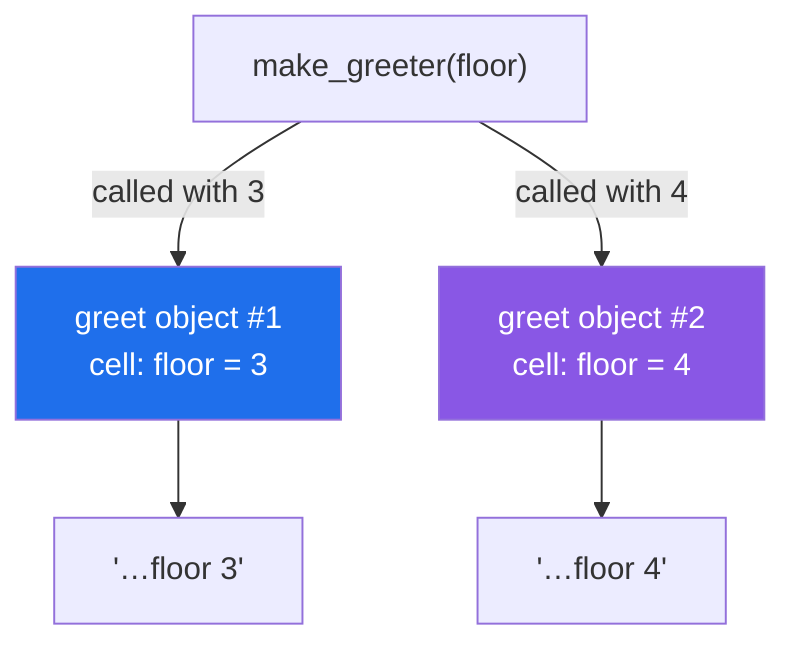

# 1.2 — A function that builds another function and hands it back

## One-line answer

A `def` inside a `def` builds a brand-new function object every time the outer one runs, and that new
function remembers the outer function's names — so `make_greeter(3)` and `make_greeter(4)` hand back
two different functions that say two different things.

---

## The story

The desk in the lobby has a stack of printed slips.

Somebody new starts on the desk, and rather than teach them the whole building, the manager writes
them a slip for each floor they will be dealing with today. One slip says *"send them to floor 3"*.
Another says *"send them to floor 4"*. The slips look identical apart from the number, and neither
slip is the manager.

That is the useful bit. The manager did the thinking once, and then handed over **two separate
things** that each carry one number inside them. Later in the day, when a visitor comes in for floor
3, the person on the desk does not have to remember which floor anything is on. They pick up the slip
and read it out.

The number is inside the slip. Nobody has to pass the number in again.

---

## The idea in plain language

A `def` statement can appear anywhere a statement can appear, including inside another function. When
the outer function runs, the inner `def` runs too, and it builds a **new function object** right then.
The outer function can then `return` that object like any other value
([1.1](1.1-a-function-is-a-value.md)).

Two facts make this more than a curiosity.

**First, each call builds a genuinely separate function.** Two calls to the outer function give you
two objects that are not the same object, even though they came from the same source code. They are
two slips, not one slip read twice.

**Second, the inner function keeps a live link to the outer function's names.** A function that does
this is called a **closure**, and you met it on
[Day 10, 2.4](../../../day-10-functions/parts/02-scope/2.4-closures-and-late-binding.md) as the note
that pointed at a whiteboard rather than copying the number off it. The inner function does not get a
copy of `floor`; it gets directions to where `floor` lives.

Here that is exactly what you want, and it is worth being clear about why. `make_greeter(3)` finishes
and its local variables would normally go away. They do not, because the function it returned still
points at them. Python keeps the box alive for as long as somebody is pointing at it. The whiteboard
from Day 10 is still on the wall, and nobody is ever going to change the number on it, so pointing at
it and copying it amount to the same thing.

That last sentence is the whole difference between Day 10's bug and today's tool. **A closure is a
bug when the outer name keeps changing, and a tool when it does not.** The number a decorator captures
— which function to wrap, how many attempts to allow — is written once and never touched again.

---

## Why Setu needs it

- **A decorator is exactly this shape.** `retry(3)` on
  [3.1](../03-decorators-with-arguments/3.1-retry-three-a-decorator-that-takes-an-argument.md) is a
  function that returns a function that returns a function, and each layer exists to capture one
  thing. Without this part, that sentence is unreadable.
- **[1.3](1.3-the-wrapper-written-by-hand.md) is the next four lines.** Once the returned function can
  *call* the captured value instead of printing it, you have written a decorator by hand.
- **Day 19's `functools.partial` and Phase 20's chain builders are the same trick.** A configured thing
  handed back for later use is the dominant pattern in every framework this plan reaches.
- **Phase 22's LangGraph conditional edges** are functions built by a factory that captured the
  routing rule. Recognising the shape is what makes that library readable rather than mysterious.

---

## The mechanism

```python
"""A function that builds and returns another function."""


def make_greeter(floor: int):
    """Return a NEW function that knows which floor to say."""

    def greet(name: str) -> str:
        return f"{name}, take the lift to floor {floor}"

    return greet


third = make_greeter(3)
fourth = make_greeter(4)

print(third("delivery"))
print(fourth("delivery"))
print("two different objects?", third is not fourth)
print("both are called       :", third.__name__, fourth.__name__)
print("what third remembers  :", third.__closure__[0].cell_contents)
```

Run on Python 3.12.12 on 2026-09-01:

```
delivery, take the lift to floor 3
delivery, take the lift to floor 4
two different objects? True
both are called       : greet greet
what third remembers  : 3
```

**Line by line:**

- `def make_greeter(floor: int):` — the outer function. Its whole job is to build something and hand
  it over. Nothing about `greet` happens until `make_greeter` is called.
- `def greet(name: str) -> str:` — the inner `def`. **This statement runs each time `make_greeter`
  runs**, and each run produces a new function object. That is why `third` and `fourth` are separate.
- `f"... floor {floor}"` — `floor` is not a parameter of `greet`. Python finds it by looking outward
  into `make_greeter`'s scope, which is the **E** in the LEGB rule from
  [Day 10, 2.1](../../../day-10-functions/parts/02-scope/2.1-legb-where-a-name-is-found.md).
- `return greet` — **no brackets.** Returning `greet()` would call it, immediately, with no `name`
  argument, and fail. This is [1.1](1.1-a-function-is-a-value.md)'s one-character difference at the
  exact spot where it costs the most.
- `third is not fourth` is `True` — two objects, not one shared object. If they were the same, the two
  greetings could not differ.
- `third.__name__` and `fourth.__name__` are **both `greet`**. The function object's own idea of its
  name comes from the `def` line, not from what you assigned it to. Hold on to this; it becomes a real
  problem in [2.2](../02-writing-a-decorator/2.2-functools-wraps.md).
- `third.__closure__[0].cell_contents` is `3`. `__closure__` is a tuple of **cells**, and a cell is the
  box Python keeps alive so the inner function can still reach `floor`. You will never write this line
  in real code; it is here so that "it remembers" stops being a figure of speech.

The two slips, drawn:



---

## When it breaks

**Returning the call instead of the function:**

```text
$ uv run python -c "
def make_greeter(floor):
    def greet(name):
        return f'{name}, floor {floor}'
    return greet()
third = make_greeter(3)
"
Traceback (most recent call last):
  File "<string>", line 6, in <module>
  File "<string>", line 5, in make_greeter
TypeError: make_greeter.<locals>.greet() missing 1 required positional argument: 'name'
```

**What it means.** `return greet()` ran the inner function while building it, and it had no `name` to
work with. Read the traceback bottom-up: the failure is *inside* `make_greeter`, before it ever
returned anything, and `make_greeter.<locals>.greet` is the qualified name — the `<locals>` says the
function was defined inside another one. One pair of brackets, deleted, fixes it, and this is the
most common typo
in a decorator.

**Capturing a name that is still going to change:**

```text
$ uv run python -c "
greeters = []
for floor in (3, 4, 5):
    greeters.append(lambda name: f'{name}, floor {floor}')
for g in greeters:
    print(g('delivery'))
"
delivery, floor 5
delivery, floor 5
delivery, floor 5
```

**What it means.** No error, three wrong answers. All three functions point at the *same* `floor`
name, and by the time any of them ran, the loop had left it at `5` — the whiteboard from
[Day 10, 2.4](../../../day-10-functions/parts/02-scope/2.4-closures-and-late-binding.md). The fix is to
give each function its own box, which is precisely what calling `make_greeter(floor)` does: a call
makes a fresh scope, and a fresh scope is a fresh cell.

**Expecting the outer variable to be assignable from inside:**

```text
$ uv run python -c "
def counter():
    n = 0
    def bump():
        n = n + 1
        return n
    return bump
b = counter()
print(b())
"
Traceback (most recent call last):
  File "<string>", line 9, in <module>
  File "<string>", line 5, in bump
UnboundLocalError: cannot access local variable 'n' where it is not associated with a value
```

**What it means.** Assigning to `n` anywhere in `bump` makes `n` local to `bump` for the whole
function, so the read on the right-hand side finds nothing —
[Day 10, 2.2](../../../day-10-functions/parts/02-scope/2.2-unboundlocalerror.md) in its natural
habitat. Reading a captured name is free; *writing* one needs `nonlocal n`
([Day 10, 2.3](../../../day-10-functions/parts/02-scope/2.3-global-and-nonlocal.md)). Every decorator
on this day only ever reads what it captured, which is why none of them needs `nonlocal`.

---

## In production

**The professional name for this is a factory, and the reason to reach for one is configuration.**
When a value is decided once at start-up and then used on every call — a base URL, a timeout, a model
name, a retry count — a factory captures it once instead of threading it through every signature. The
alternative is a parameter that every caller has to pass and nobody ever varies, which is noise in
every call site in the codebase.

**What changes at scale is the memory.** A closure keeps its captured values alive for as long as the
returned function is reachable, which is normally the life of the process. Capture a small number and
nobody notices. Capture a loaded dataframe, an open connection or a whole response object, and you
have pinned it in memory forever — and it will not show up as a leak in the obvious place, because the
object looks like it is owned by a function nobody thinks about. The habit is to capture the small
thing: capture the path, not the file's contents.

**The failure that only appears with real data is the shared mutable capture.** Two returned functions
that captured the *same* list are not independent, and one appending to it changes what the other
sees. It looks like the objects are separate, because they are; the box they both point at is not.
This is [Day 4, 2.3](../../../day-04-objects/parts/02-containers/2.3-aliasing-two-names-one-object.md)
wearing a function, and it is diagnosed the same way, with `is`.

**The review comment a senior engineer leaves.** On a factory built inside a loop: *"Every closure
here captures the loop variable, not its value, so all of them will see the last one. Either take it
as a parameter of the factory — `make_handler(kind)` — or bind it with a default argument. As written
the tests pass because the loop has one item."*

**The interview question.** *"What is a closure, and when has one bitten you?"* The answer that lands
names the mechanism and the bug in the same breath: an inner function keeps a live reference to the
enclosing scope rather than a copy, which is what lets a factory configure a function once, and which
is why functions built in a loop all see the loop variable's final value. Saying that a call creates a
fresh scope, and that this is why passing the value into a factory fixes the loop bug, is the part
that shows you have actually hit it.

---

## Check yourself

```bash
uv run python -c "
def make_greeter(floor):
    def greet(name):
        return f'{name}, take the lift to floor {floor}'
    return greet

third, fourth = make_greeter(3), make_greeter(4)
print(third('delivery'))
print(fourth('delivery'))
print(third is fourth, third.__name__, third.__closure__[0].cell_contents)
"
```

Two calls, two functions, two remembered numbers. Now delete the brackets after `make_greeter(3)` and
say what `third('delivery')` does before you run it.

**Answer out loud, without scrolling up:**

> Why do `third` and `fourth` say different floors when they were built from the same three lines of
> code? Then say why both of them report `__name__` as `greet`.

---

**Next:** [1.3 — the wrapper written by hand](1.3-the-wrapper-written-by-hand.md), where the returned
function stops describing the job and starts calling it.
