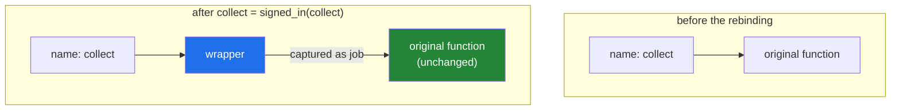

# 1.3 — The wrapper written by hand, with no `@` anywhere

## One-line answer

Take a function in, build a new function that does something, calls the original, does something
else, and returns its answer — then hand that new function back and store it under the original's
name; you have written a decorator, and no special syntax was involved.

---

## The story

Back to the desk in the lobby.

Somebody comes in for a folder from the third floor. The person on the desk writes the time down,
lets them through, and writes the time again when they come back out. Then they hand the visitor the
folder and say goodbye.

Look at what the visitor experienced. They asked for a folder. They got a folder. From where they
stand, nothing has changed at all — they did not know the book existed, and nobody upstairs knew
either. The only thing that changed is that the building now has a record of the visit, kept by
somebody whose entire job is keeping records.

Two things had to be true for that to work.

The desk had to **hand the folder over at the end**. If the person on the desk had taken the folder,
written the time, and then gone to lunch holding it, the visitor would have come in for a folder and
left with nothing, and it would have taken them a while to work out where it went.

And the desk had to **stay out of the way**. The visitor still says "third floor, one folder". They do
not have to say it differently because there is now a book.

---

## The idea in plain language

That is a **wrapper**: a new function that goes around an existing one.

The recipe has four steps, and every decorator on this day is these four steps with different filling.

1. Take the original function as an argument.
2. Define a new function inside — call it `wrapper` — that does something before, calls the original,
   and does something after.
3. **Return the original's answer** from `wrapper`, so the caller gets what they asked for.
4. Return `wrapper` from the outer function ([1.2](1.2-a-function-that-returns-a-function.md)), and
   store it in the original's name.

That last step is worth slowing down on. When you write `collect = signed_in(collect)`, you are not
changing the function that `def collect` built. That function is untouched, and `wrapper` is holding
on to it. You are changing what the *name* `collect` points at
([1.1](1.1-a-function-is-a-value.md)). Everybody who calls `collect(...)` from now on gets the wrapper,
and the wrapper is the only thing that still knows how to reach the original.

Two terms, both of which you will meet in real code:

- **The wrapped function** (or the *inner*, or the *wrapped callable*) is the original — the thing that
  actually does the work.
- **The wrapper** is the new function that stands in front of it.

Nothing here is new. Step 1 is [1.1](1.1-a-function-is-a-value.md), steps 2 and 4 are
[1.2](1.2-a-function-that-returns-a-function.md), and step 3 is an ordinary `return`. A decorator is
those three facts standing in a line.

---

## Why Setu needs it

- **[1.4](1.4-the-at-sign-is-two-lines.md) shows that the `@` symbol is a shorthand for the last line
  of this document and nothing more.** Meeting the mechanism before the syntax is
  [Principle 2](../../../../docs/00_MASTER_PLAN_DS_GENAI.md) — from scratch before library — applied to
  the language itself.
- **Every timing, retry, caching, logging and authentication decorator you will ever read is this
  shape.** Recognising it by eye is what makes a stranger's codebase readable.
- **Day 19's async work wraps a coroutine the same way**, with `async def wrapper` and an `await`
  around the inner call. Nothing else changes.
- **Phase 3 onward will time things constantly.** `@timed` from
  [2.4](../02-writing-a-decorator/2.4-timed-the-first-real-one.md) is the first thing you write into
  `src/setu/` today and the last thing you will stop using.

---

## The mechanism

```python
"""The wrapper, written by hand, with no @ anywhere."""

import time


def collect(what: str) -> str:
    time.sleep(0.05)
    return f"one {what}"


def signed_in(job):
    """Take a function, return a function that signs the book around it."""

    def wrapper(what: str) -> str:
        start = time.perf_counter()
        result = job(what)
        elapsed = time.perf_counter() - start
        print(f"  book: {job.__name__} took {elapsed:.3f}s")
        return result

    return wrapper


collect = signed_in(collect)

print("caller says:", collect("folder"))
```

Run on Python 3.12.12 on 2026-09-01:

```
  book: collect took 0.050s
caller says: one folder
```

**Line by line:**

- `time.sleep(0.05)` inside `collect` — the original has to take a measurable amount of time or the
  wrapper has nothing to report. This stands in for the work a real function does.
- `def signed_in(job):` — `job` is the parameter that receives the function. Naming it `job` rather
  than `func` is deliberate here: it keeps the story attached to the code, and it stops `func` from
  looking like a keyword.
- `def wrapper(what: str) -> str:` — the new function, built fresh each time `signed_in` runs
  ([1.2](1.2-a-function-that-returns-a-function.md)). It takes the same argument the original takes,
  because callers must not have to change.
- `start = time.perf_counter()` — the "before" step. `perf_counter` rather than `time.time()`, for a
  reason that gets its own measurement in
  [2.4](../02-writing-a-decorator/2.4-timed-the-first-real-one.md).
- `result = job(what)` — **this is the whole point of the wrapper.** `job` is the captured original,
  and calling it here is what makes the visit actually happen. Note the brackets: `job` would be the
  function, `job(what)` is the folder.
- `elapsed = ...` and the `print` — the "after" step. `{elapsed:.3f}` prints three decimal places
  ([Day 7, 3.2](../../../day-07-strings/parts/03-formatting/3.2-the-format-spec.md)).
- `job.__name__` prints `collect`, not `wrapper`, because `job` is still pointing at the original
  function object. The name the *wrapper* reports is a different question, and
  [2.2](../02-writing-a-decorator/2.2-functools-wraps.md) is about the day that starts to hurt.
- `return result` — **step 3, and the one people forget.** Without it `wrapper` returns `None`, the
  timing still prints, and the caller silently gets nothing. See
  [2.3](../02-writing-a-decorator/2.3-returning-the-value.md) for what that costs.
- `return wrapper` — no brackets, [1.2](1.2-a-function-that-returns-a-function.md)'s rule.
- `collect = signed_in(collect)` — the rebinding. The right-hand side runs first, using the original;
  then the name is pointed at the result. **The original function object is not modified and not
  destroyed**; it is now reachable only through `wrapper`'s captured `job`.
- `collect("folder")` — the caller's line has not changed at all. That is the property the whole
  pattern exists for.

What the name points at, before and after:



---

## When it breaks

**Forgetting `return wrapper`:**

```text
$ uv run python -c "
def signed_in(job):
    def wrapper(what):
        return job(what)
def collect(what):
    return 'one ' + what
collect = signed_in(collect)
print(collect('folder'))
"
Traceback (most recent call last):
  File "<string>", line 9, in <module>
TypeError: 'NoneType' object is not callable
```

**What it means.** `signed_in` fell off the end without returning anything, so it returned `None`, and
`collect` is now `None`. The message is honest but points at the call, not the cause — the mistake is
four lines above the traceback. **`'NoneType' object is not callable` right after applying a decorator
always means a missing `return wrapper`.**

**Passing the answer instead of the function:**

```text
$ uv run python -c "
def signed_in(job):
    def wrapper(what):
        return job(what)
    return wrapper
def collect(what):
    return 'one ' + what
collect = signed_in(collect('folder'))
print(collect('box'))
"
Traceback (most recent call last):
  File "<string>", line 9, in <module>
  File "<string>", line 4, in wrapper
TypeError: 'str' object is not callable
```

**What it means.** `signed_in(collect('folder'))` called `collect` first, so `job` is the string
`'one folder'`, and `job(what)` tried to call a string. This is
[1.1](1.1-a-function-is-a-value.md)'s bracket mistake, and the traceback is useful here: the second
frame says `in wrapper`, which tells you the failure is inside the machinery rather than in your own
function.

**A wrapper whose signature is narrower than the function it wraps:**

```text
$ uv run python -c "
def signed_in(job):
    def wrapper(what):
        return job(what)
    return wrapper
@signed_in
def collect_many(what, count):
    return f'{count} x {what}'
print(collect_many('folder', 3))
"
Traceback (most recent call last):
  File "<string>", line 9, in <module>
TypeError: signed_in.<locals>.wrapper() takes 1 positional argument but 2 were given
```

**What it means.** The wrapper hard-coded one parameter, so it can only ever wrap one-argument
functions. Read the name in the message carefully: **`wrapper` is being blamed for a call the reader
wrote against `collect_many`**, which is exactly the sort of confusion a decorator introduces. The fix
is `*args, **kwargs`, and it is [2.1](../02-writing-a-decorator/2.1-args-and-kwargs-in-a-wrapper.md).

---

## In production

**The professional version of this is called middleware, and it is everywhere.** A web framework
handling a request runs it through a stack of wrappers — one that logs, one that checks the caller is
allowed in, one that times it, one that catches errors — and the view function at the bottom knows
about none of them. FastAPI in Phase 26 and LangChain's callbacks in Phase 20 are both this shape. Once
you can read a hand-written wrapper you can read a middleware stack, because they are the same object
in different clothes.

**What changes at scale is that the wrapper becomes a place where bugs hide.** Every wrapper adds a
frame to every traceback and a layer between the caller and the code they think they are calling. Three
wrappers on a hot function is three extra function calls per invocation, which is invisible at a
thousand calls and measurable at ten million. The professional rule is that a wrapper does one small
thing and does it fast, and that anything expensive — writing to a database, making a network call —
goes on a queue rather than into the wrapper's own body.

**The failure that only appears with real data is the wrapper that changes behaviour on an error
path.** A wrapper that catches an exception to log it and then does not re-raise turns a crash into a
silently wrong answer, in every function it is applied to at once. The habit is `try` / `finally` around
the inner call rather than `try` / `except`, so the "after" step still runs and the exception still
travels — which is exactly how `@timed` is written in
[2.4](../02-writing-a-decorator/2.4-timed-the-first-real-one.md).

**The review comment a senior engineer leaves.** On a wrapper with `job(what)` and no `return`: *"The
wrapper drops the return value, so every decorated function now returns `None`. It is not caught by
the tests because they only assert the log line. Return the inner call's result and add an assertion
on the value."*

**The interview question.** *"Write a decorator without using the `@` symbol."* The answer is this
document: an outer function that takes the function, an inner `wrapper` that calls it and returns its
result, the outer returning `wrapper`, and the rebinding `f = deco(f)`. Saying out loud that the
rebinding changes the name rather than the function, and that the original survives inside the
closure, is what separates somebody who has written one from somebody who has used one.

---

## Check yourself

```bash
uv run python -c "
import time

def collect(what):
    time.sleep(0.05)
    return f'one {what}'

def signed_in(job):
    def wrapper(what):
        start = time.perf_counter()
        result = job(what)
        print(f'  book: {job.__name__} took {time.perf_counter() - start:.3f}s')
        return result
    return wrapper

collect = signed_in(collect)
print('caller says:', collect('folder'))
"
```

Now delete the `return result` line and run it again. The book still records the visit, and the caller
gets `None`. Say which of the four steps you removed.

**Answer out loud, without scrolling up:**

> After `collect = signed_in(collect)`, what happened to the function that `def collect` originally
> built, and how can anybody still reach it? Then name the four steps of the wrapper recipe.

---

**Next:** [1.4 — the `@` sign is two lines](1.4-the-at-sign-is-two-lines.md), which introduces the only
piece of new syntax on this day and then shows that it is not new at all.
