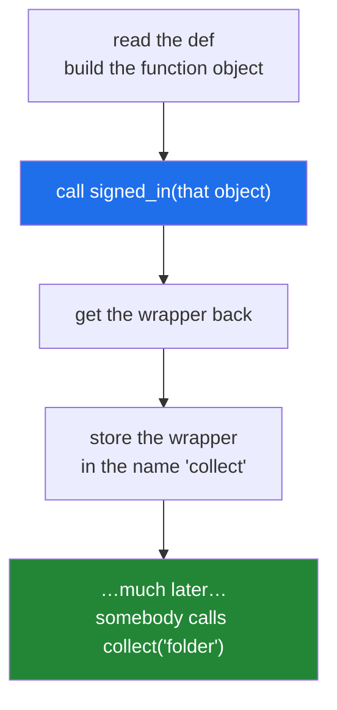

# 1.4 — The `@` sign is the rebinding you already wrote

## One-line answer

`@signed_in` written above `def collect` means exactly `collect = signed_in(collect)` written below it
— same objects, same order, same result — so the only thing the syntax adds is that the reader sees
the wrapping at the top of the function instead of hunting for it at the bottom.

---

## The story

The desk gets a sign.

For years the arrangement was word of mouth: everyone who worked in the building knew that visitors
sign in, and a new starter found out when somebody told them. It worked, but you had to already know.

So somebody printed a small sign and stuck it on the door of each office that takes visitors:
**"visitors sign in at the desk"**. Nothing about the building changed. The desk was already there,
the book was already there, and the arrangement was already exactly what the sign says. What changed is
that you now find out **at the door you are about to walk through**, rather than after the fact.

That is the entire contribution of the `@` symbol. It moves an existing fact to where somebody
reading will trip over it.

---

## The idea in plain language

A line beginning with `@`, written directly above a `def`, is called a **decorator line**, and the
thing named after the `@` is called a **decorator**.

Python's rule for it is short. When it sees

```text
@signed_in
def collect(what): ...
```

it builds the function `collect` in the normal way, then calls `signed_in(collect)`, then stores the
result in the name `collect`. That is it. Nothing is inspected, nothing is registered, and there is no
list of "decorated functions" anywhere in the interpreter. The syntax is defined this way in the
language reference itself, under *Function definitions* in the Python Language Reference
(<https://docs.python.org/3/reference/compound_stmts.html#function-definitions>), which spells the
transformation out as `func = decorator(func)`.

Two consequences follow immediately, and both catch people.

**The decorator runs at definition time, not at call time.** The wrapping happens once, when Python
reads the file. If your decorator prints something, that something prints on import, before anybody
calls anything.

**Anything callable can go after the `@`.** It does not have to be a function you wrote. It can be a
name from another module, a method, a class, or — as [3.1](../03-decorators-with-arguments/3.1-retry-three-a-decorator-that-takes-an-argument.md)
uses — the *result of calling* something. The only requirement is that the thing after the `@` can be
called with one argument.

The `@` syntax arrived in Python 2.4 through *PEP 318 — Decorators for Functions and Methods* (2003,
<https://peps.python.org/pep-0318/>), and the problem it names is worth knowing: before it, the
rebinding sat *after* the function body, so on a forty-line function the reader met the fact that it
was wrapped only once they had finished reading it, having already formed the wrong idea of what it
did.

---

## Why Setu needs it

- **Every part after this one uses the `@` form.** Meeting it here, after
  [1.3](1.3-the-wrapper-written-by-hand.md) built the same thing by hand, means it stays a shorthand
  rather than becoming a spell.
- **You have been reading decorator lines since Day 2.** `@pytest.mark.parametrize` on
  [Day 2, 3.3](../../../day-02-quality-gate/parts/03-pytest/3.3-markers-and-exit-code-five.md), and
  `@abstractmethod` and `@staticmethod` on
  [Day 13, 4.1](../../../day-13-inheritance-and-abstraction/parts/04-abstraction/4.1-abc-and-abstractmethod.md),
  were all this rule. Now they stop being syntax you accept.
- **Day 15 is `@classmethod`, `@staticmethod` and `@property`**, three decorators built into the
  language, and the day is much shorter if you already know what a decorator line does.
- **Day 19's Pydantic and Phase 26's FastAPI are decorator-driven from top to bottom.**
  `@app.get("/papers")` is a function call whose result decorates a function, and that sentence has to
  be readable before those days are.

---

## The mechanism

```python
"""The @ line and the reassignment are the same thing."""


def signed_in(job):
    def wrapper(*args, **kwargs):
        print(f"  book: {job.__name__} in")
        result = job(*args, **kwargs)
        print(f"  book: {job.__name__} out")
        return result

    return wrapper


def by_hand(what):
    return f"one {what}"


by_hand = signed_in(by_hand)


@signed_in
def by_at_sign(what):
    return f"one {what}"


print("by hand   :", by_hand("folder"))
print("by @      :", by_at_sign("folder"))
print("both names now point at:", by_hand.__name__, by_at_sign.__name__)
```

Run on Python 3.12.12 on 2026-09-01:

```
  book: by_hand in
  book: by_hand out
by hand   : one folder
  book: by_at_sign in
  book: by_at_sign out
by @      : one folder
both names now point at: wrapper wrapper
```

**Line by line:**

- `def wrapper(*args, **kwargs):` — accepts anything, so the same decorator works on both functions.
  [2.1](../02-writing-a-decorator/2.1-args-and-kwargs-in-a-wrapper.md) is why.
- `by_hand = signed_in(by_hand)` — the long form from [1.3](1.3-the-wrapper-written-by-hand.md).
- `@signed_in` above `def by_at_sign` — the short form. **There is no bracket after `signed_in` on the
  decorator line**, because Python supplies the argument. Putting one there means something different,
  and [3.1](../03-decorators-with-arguments/3.1-retry-three-a-decorator-that-takes-an-argument.md) is
  where that becomes useful and dangerous at once.
- The two functions behave identically: same book entries, same answer. **Two spellings, one
  mechanism.**
- `both names now point at: wrapper wrapper` — proof that the names are no longer pointing at the
  original functions. Both now hold a `wrapper` object, and both have forgotten what they used to be
  called. That is the damage `functools.wraps` repairs.

The order Python does things in:



---

## When it breaks

**Something that is not callable after the `@`:**

```text
$ uv run python -c "
signed_in = 'not a function'
@signed_in
def collect(what):
    return 'one ' + what
"
Traceback (most recent call last):
  File "<string>", line 3, in <module>
TypeError: 'str' object is not callable
```

**What it means.** Python did what the rule says — it called the thing after the `@` — and the thing
was a string. Note **line 3**: the failure is at the decorator line, at import, before any test ran
and before the function was ever used. A decorator mistake is a start-up mistake.

**Expecting the decorator to run when the function is called:**

```text
$ uv run python -c "
def announce(job):
    print('  decorating', job.__name__)
    return job

@announce
def collect(what):
    return 'one ' + what

print('now the module is loaded')
print(collect('folder'))
"
  decorating collect
now the module is loaded
one folder
```

**What it means.** No error, and a surprise for most people the first time: `decorating collect`
printed **before** `now the module is loaded`, because the decorator ran while the file was being
read. Anything expensive in the body of a decorator — reading a file, opening a connection — happens
at import, in every process that imports the module, whether or not the function is ever called.

**Reaching for the original after decorating it:**

```text
$ uv run python -c "
def signed_in(job):
    def wrapper(*a, **k):
        return job(*a, **k)
    return wrapper

@signed_in
def collect(what):
    return 'one ' + what

print(collect.__doc__, collect.__name__)
"
None wrapper
```

**What it means.** The name `collect` no longer reaches the original function, so its docstring is
gone and its name is wrong. Nothing raised; the information simply left. This is the failure
[2.2](../02-writing-a-decorator/2.2-functools-wraps.md) exists to prevent, and it is the reason
`functools.wraps` appears in every serious decorator.

---

## In production

**The professional habit is that a decorator line is documentation, and it is read as such.** A
reviewer scanning a file sees `@retry(3)`, `@cached`, `@requires_auth` above each function and knows
the operational behaviour of the whole module without reading a body. That readability is the actual
argument for the syntax over the hand-written rebinding, and it is why a decorator with a vague name —
`@wrap`, `@handle` — is worse than no decorator at all.

**What changes at scale is import time.** Because decorators run at import, a codebase with a thousand
decorated functions does a thousand extra function calls before `main()` starts, and any decorator
that touches the network or the filesystem at decoration time multiplies across every worker process.
Serverless deployments feel this most, because import happens on every cold start. The rule is that
the body of a decorator does setup only, and everything else waits inside `wrapper` until the function
is actually called.

**The failure that only appears with real data is the decorator applied conditionally.** Code like
`if DEBUG: collect = timed(collect)` produces a program whose call stack, tracebacks and timings differ
between environments, which means a bug that reproduces only where the flag is set. If a decorator is
worth applying it is worth applying always; if it is expensive, make the *wrapper* check the flag, so
the shape of the program stays the same everywhere.

**The review comment a senior engineer leaves.** On a decorator that opens a database connection in its
body: *"This runs at import, so importing the module opens a connection, in tests too. Move the
connection inside `wrapper` and take it from the pool per call, or accept it as an argument to the
factory."*

**The interview question.** *"What does the `@` symbol actually do?"* The answer is one sentence —
`func = decorator(func)`, evaluated at definition time — and the follow-up that separates people is
*when*. Saying that decoration happens once at import rather than on every call, and drawing the
consequence that a decorator's own body is start-up code, is the version that shows you have debugged a
slow import.

---

## Check yourself

```bash
uv run python -c "
def announce(job):
    print('  decorating', job.__name__)
    return job

@announce
def collect(what):
    return 'one ' + what

print('module loaded')
print(collect('folder'))
print(collect('box'))
"
```

`decorating collect` prints once, before `module loaded`, and never again however many times you call
`collect`. Say why.

**Answer out loud, without scrolling up:**

> Rewrite `@signed_in` above `def collect` as a line of ordinary Python with no `@` in it. Then say at
> what moment that line runs.

---

**Next:** section 2 starts at
[2.1 — `*args` and `**kwargs` in a wrapper](../02-writing-a-decorator/2.1-args-and-kwargs-in-a-wrapper.md),
which fixes the wrapper that could only ever wrap one shape of function.
