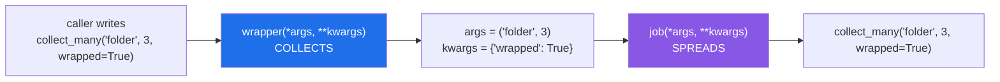

# 2.1 — `*args` and `**kwargs`: a wrapper that does not know what it is wrapping

## One-line answer

A wrapper must accept every call its function could accept and pass them all on unchanged, and the
only signature that does that is `def wrapper(*args, **kwargs)` calling `job(*args, **kwargs)`.

---

## The story

The desk deals with three kinds of visitor on an ordinary day.

One person comes in for a folder. One comes in for three folders and wants them in an envelope. One
person is not visiting anybody — they are the courier from yesterday, coming back to sign out.

The person on the desk writes all three in the book. They do not need to understand what an envelope is
for, or why somebody would want three of something, or what the courier forgot yesterday. They write
down what was asked for, in whatever words it was asked in, and let the visitor through.

Now imagine the desk had a form with exactly one box on it, labelled **"what"**. The first visitor is
fine. The second one has two things to say and one box to say them in. The third one has nothing to
write in the box at all and gets turned away at the door of a building they work in.

The book takes whatever it is given. The one-box form does not.

---

## The idea in plain language

The wrapper in [1.3](../01-functions-as-values/1.3-the-wrapper-written-by-hand.md) had a one-box form.
It was written `def wrapper(what)`, so it could only stand in front of functions that take exactly one
argument called `what`. The moment it was put in front of anything else, the call failed.

The fix is the catch-all from
[Day 10, 1.4](../../../day-10-functions/parts/01-the-signature/1.4-args-and-kwargs.md), used in both
directions.

**Collecting.** In a `def` line, `*args` means *"put every positional argument into a tuple called
`args`"*, and `**kwargs` means *"put every keyword argument into a dictionary called `kwargs`"*.
Together they accept any call at all.

**Spreading.** In a *call*, the same two stars mean the opposite: `job(*args)` means *"take this tuple
apart and pass its items as separate positional arguments"*, and `job(**kwargs)` means *"take this
dictionary apart and pass its items as keyword arguments"*.

That symmetry is the whole trick. The wrapper collects whatever arrived into two ordinary containers,
and then spreads those containers back out into the real call. The original function sees exactly the
arguments the caller wrote, in the same positions, with the same keywords. It cannot tell it was
wrapped.

Two details that are easy to get wrong and expensive to debug:

- **The stars must appear in both places.** `def wrapper(*args)` that then calls `job(args)` passes the
  *tuple itself* as a single argument. No error at the wrapper; a confusing error inside the function.
- **`**kwargs` is not optional.** A wrapper with only `*args` rejects every keyword call, and
  keyword arguments are how most real functions are called
  ([Day 10, 1.2](../../../day-10-functions/parts/01-the-signature/1.2-positional-and-keyword.md)).

The names `args` and `kwargs` carry no meaning to Python — `*a, **k` works identically — but they are
so nearly universal that using anything else in a wrapper will be read as a mistake.

---

## Why Setu needs it

- **`@timed` and `@retry` go on functions you have not written yet.** A decorator that only works on
  one-argument functions is worth nothing on Day 20, Day 162 or Day 229, and those days are why they
  are being written today.
- **[4.1](../04-the-toolkit/4.1-a-decorator-on-a-method.md) puts a decorator on a method**, where the
  first positional argument is `self`. `*args` is what makes that work without a single extra line.
- **Day 13's loaders are the first things you will decorate.** `TextLoader.load()` takes no arguments
  and `HTMLLoader.__init__` takes three, one of them keyword-only
  ([Day 13, 4.2](../../../day-13-inheritance-and-abstraction/parts/04-abstraction/4.2-the-loader-family.md)).
  One decorator, both shapes.
- **Every API client in Phase 17 onward is called with keywords** — `model=`, `temperature=`,
  `timeout=` — because [Principle 4](../../../../docs/00_MASTER_PLAN_DS_GENAI.md) demands they be
  typed out. A wrapper without `**kwargs` cannot go near one.

---

## The mechanism

```python
"""A wrapper that does not know, and must not care, what it is wrapping."""


def signed_in(job):
    def wrapper(*args, **kwargs):
        print(f"  book: {job.__name__}{args}{kwargs or ''}")
        return job(*args, **kwargs)

    return wrapper


@signed_in
def collect(what):
    return f"one {what}"


@signed_in
def collect_many(what, count, *, wrapped=False):
    parcel = f"{count} x {what}"
    return f"{parcel} (wrapped)" if wrapped else parcel


@signed_in
def sign_out():
    return "left the building"


print(collect("folder"))
print(collect_many("folder", 3, wrapped=True))
print(sign_out())
```

Run on Python 3.12.12 on 2026-09-01:

```
  book: collect('folder',)
one folder
  book: collect_many('folder', 3){'wrapped': True}
3 x folder (wrapped)
  book: sign_out()
left the building
```

**Line by line:**

- `def wrapper(*args, **kwargs):` — the collecting form. `args` is always a tuple, possibly empty;
  `kwargs` is always a dictionary, possibly empty. Neither is ever `None`, which is why the printing
  below needs no guard.
- `{args}` in the f-string prints the tuple, which is why the first line shows `('folder',)` with a
  trailing comma. **That comma is how a one-item tuple prints**
  ([Day 8, 1.3](../../../day-08-containers/parts/01-sequences/1.3-a-tuple-is-a-record.md)), not a typo.
- `{kwargs or ''}` — an empty dictionary is falsy
  ([Day 5, 2.2](../../../day-05-operators-and-conditionals/parts/02-conditionals/2.2-truthiness.md)),
  so `or` supplies an empty string and the log line for `collect` does not end in a bare `{}`. This is
  the `or`-default from
  [Day 5, 3.1](../../../day-05-operators-and-conditionals/parts/03-the-or-trap/3.1-the-or-default-and-falsy-zero.md),
  used where it is safe because there is no meaningful falsy dictionary other than the empty one.
- `return job(*args, **kwargs)` — the spreading form. **The stars are doing the opposite job here to
  the one they did on the `def` line**, and that is the single most important sentence in this
  document.
- `def collect_many(what, count, *, wrapped=False)` — a bare `*` makes everything after it
  keyword-only ([Day 10, 1.5](../../../day-10-functions/parts/01-the-signature/1.5-keyword-only-and-positional-only.md)).
  The wrapper handles it without knowing it exists, because `wrapped=True` simply lands in `kwargs`.
- `def sign_out():` — no arguments at all. `args` is `()` and `kwargs` is `{}`, and `job()` is called
  with nothing. The same three lines of wrapper cover zero arguments and three.
- Every wrapped call still returns the right answer, because `return` is in front of `job(...)`
  ([2.3](2.3-returning-the-value.md) is what happens when it is not).

What the stars do, in each place:



---

## When it breaks

**A wrapper with `*args` but no `**kwargs`:**

```text
$ uv run python -c "
def signed_in(job):
    def wrapper(*args):
        return job(*args)
    return wrapper
@signed_in
def collect_many(what, count=1):
    return f'{count} x {what}'
print(collect_many('folder', count=3))
"
Traceback (most recent call last):
  File "<string>", line 9, in <module>
TypeError: signed_in.<locals>.wrapper() got an unexpected keyword argument 'count'
```

**What it means.** `collect_many` accepts `count` perfectly well; the *wrapper* does not, and the
wrapper is what the caller reached. **The message names `wrapper`, not the function the reader
wrote**, which is why this one is confusing the first time. The fix is four characters: add
`**kwargs` to the `def` and to the call.

**Forgetting the stars when passing on:**

```text
$ uv run python -c "
def signed_in(job):
    def wrapper(*args, **kwargs):
        return job(args, kwargs)
    return wrapper
@signed_in
def collect(what):
    return 'one ' + what
print(collect('folder'))
"
Traceback (most recent call last):
  File "<string>", line 9, in <module>
  File "<string>", line 4, in wrapper
TypeError: collect() takes 1 positional argument but 2 were given
```

**What it means.** `job(args, kwargs)` passed two objects — a tuple and a dictionary — instead of
spreading them. The count in the message is the clue: the caller wrote one argument and the function
received two. The second traceback frame, `in wrapper`, says where the extra one came from.

**A default in the wrapper that quietly overrides the function's own:**

```text
$ uv run python -c "
def signed_in(job):
    def wrapper(*args, count=1, **kwargs):
        return job(*args, count=count, **kwargs)
    return wrapper
@signed_in
def collect_many(what, count=5):
    return f'{count} x {what}'
print(collect_many('folder'))
"
1 x folder
```

**What it means.** No error, and a wrong answer. The wrapper named `count` in its own signature, so it
caught the missing argument and supplied *its* default of `1` before `collect_many` ever got the
chance to supply `5`. **A wrapper must not name any parameter of the function it wraps.** This is the
strongest argument for `*args, **kwargs` and nothing else: a wrapper with no parameter names cannot
shadow anything.

---

## In production

**The professional version does not stop at forwarding — it forwards *without inspecting*.** A wrapper
that reads `args[0]` to log "the first argument" works until somebody calls the function with that
argument as a keyword, and then it either logs the wrong thing or raises `IndexError` on a call that
was perfectly valid. When a decorator genuinely needs to see a named argument, the tool is
`inspect.signature(job).bind(*args, **kwargs)`, which resolves the call against the real signature and
gives back a mapping that is right whichever way the caller wrote it.

**What changes at scale is the cost of the forwarding itself.** Building a tuple and a dictionary on
every call is cheap but not free, and on a function called millions of times in a tight loop the
wrapper can cost more than the function. The professional answer is not to hand-optimise the wrapper —
it is to move the decorator up a level, onto the function that runs the loop rather than the one
inside it.

**The failure that only appears with real data is the log line that grows.** A wrapper printing
`{args}` is fine while the arguments are short strings. Pass it a list of fifty thousand records and
that one `print` renders the whole thing, on every call, into a log somebody pays to store. Real
logging decorators log the argument *count* and the types, or a truncated repr, never the values —
which is also what keeps user data out of the log, and that is a privacy problem before it is a cost
problem.

**The review comment a senior engineer leaves.** On a wrapper with a named parameter: *"`wrapper` names
`timeout`, so it swallows that argument and the wrapped function's own default never applies. Use
`*args, **kwargs` only, and read `timeout` out of `kwargs` if you need it — without removing it."*

**The interview question.** *"Why does almost every decorator use `*args, **kwargs`?"* The answer that
lands has both halves: the wrapper replaces the function at its call site, so it must accept every call
the function accepts and pass them through untouched, and the stars mean *collect* on a `def` line and
*spread* on a call. Adding that a wrapper naming any parameter can shadow the function's own default —
silently, with no error — is the detail that shows you have been bitten.

---

## Check yourself

```bash
uv run python -c "
def signed_in(job):
    def wrapper(*args, **kwargs):
        print(f'  book: {job.__name__} args={args} kwargs={kwargs}')
        return job(*args, **kwargs)
    return wrapper

@signed_in
def collect_many(what, count, *, wrapped=False):
    return f'{count} x {what}' + (' (wrapped)' if wrapped else '')

print(collect_many('folder', 3, wrapped=True))
print(collect_many(count=2, what='box'))
"
```

Same wrapper, two very differently-shaped calls. Now change `job(*args, **kwargs)` to
`job(*args, kwargs)` and read the error before you fix it back.

**Answer out loud, without scrolling up:**

> What do `*` and `**` mean on a `def` line, and what do they mean at a call site? Then say why a
> wrapper must never name a parameter that its wrapped function also names.

---

**Next:** [2.2 — `functools.wraps`](2.2-functools-wraps.md), which fixes the thing every wrapper on
this day has quietly broken: the function's own idea of who it is.
