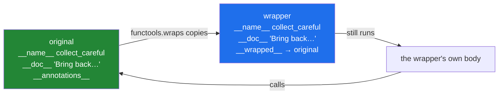

# 2.2 — The badge that lost your name: `functools.wraps`

## One-line answer

A wrapper is a different function object from the one it wraps, so after decorating, the name, the
docstring and the signature all belong to the wrapper — and `@functools.wraps(job)` copies the
original's identity across so the outside world still sees the right function.

---

## The story

The desk gives out badges.

You sign in, they hand you a plastic badge on a lanyard, and you clip it on and go up. On the third
floor somebody looks at your chest to see who they are talking to, and the badge says **VISITOR**.

Not your name. Not who you are here to see. Not what you came for. Just VISITOR, in the same letters
as everybody else's.

It works, in the sense that you get in and out. But the person upstairs has to ask your name, the
person who covers the desk at lunch cannot tell one visitor from another, and when somebody looks
back through the day to work out who was in the building, every badge says the same word.

The desk knows exactly who you are. It is written in the book, two feet away. It just did not put it
on the badge.

---

## The idea in plain language

Every function object carries a few attributes that describe itself, put there by the `def` statement
([1.1](../01-functions-as-values/1.1-a-function-is-a-value.md)):

- `__name__` — the name on the `def` line, as a string.
- `__doc__` — the docstring.
- `__qualname__` — the *qualified* name, which includes any class or function it was defined inside.
- `__module__` — the module it came from.
- `__dict__` — any attributes somebody attached to it.
- `__annotations__` — the type hints from the signature.

When a decorator replaces the function with a wrapper, the name now points at the wrapper, and the
wrapper's own attributes are the ones anybody reads. It was defined by a line that said `def wrapper`,
inside a decorator, with no docstring and a signature of `(*args, **kwargs)`. So that is what it
reports. The original's identity is not destroyed — the wrapper is holding the original in its closure
— but nothing is looking there.

`functools.wraps` is a decorator that fixes this, and it is applied *to the wrapper*:

> `@functools.wraps(job)` above `def wrapper` copies `job`'s identifying attributes onto `wrapper`, and
> sets `wrapper.__wrapped__ = job` so the original is still reachable.

It is part of the standard library's `functools` module, and it is documented at
<https://docs.python.org/3/library/functools.html#functools.wraps>.

Two things worth being precise about, because they are the source of most confusion:

**`wraps` copies the description, not the behaviour.** The wrapper still runs the wrapper's code. Only
the labels change. It does not make the wrapper accept the same arguments — that is
[2.1](2.1-args-and-kwargs-in-a-wrapper.md)'s `*args, **kwargs`, and it is a separate problem with a
separate fix.

**`inspect.signature` reports the *original's* signature after `wraps`, because it follows
`__wrapped__`.** That is a deliberate special case in `inspect`, and it is the reason help text and
editor autocomplete come back to life.

---

## Why Setu needs it

- **Every decorator written from here on has this line.** It is two lines of typing and its absence is
  invisible until something goes wrong a long way away.
- **A registry keyed on `__name__` collapses without it**, and that is precisely the pattern
  [1.1](../01-functions-as-values/1.1-a-function-is-a-value.md) called the production version of a
  dispatch table. Two registered functions, one entry, no error.
- **`pytest` reports test names, and Phase 26's FastAPI builds its OpenAPI schema from signatures.** A
  decorator without `wraps` makes every route in the documentation take `(*args, **kwargs)`.
- **Day 19 adds a type checker.** A wrapper without `wraps` erases the annotations the checker needs,
  so a decorated function silently stops being checked.

---

## The mechanism

```python
"""The badge that lost your name, and the one line that fixes it."""

import functools
import inspect


def plain(job):
    def wrapper(*args, **kwargs):
        return job(*args, **kwargs)

    return wrapper


def careful(job):
    @functools.wraps(job)
    def wrapper(*args, **kwargs):
        return job(*args, **kwargs)

    return wrapper


@plain
def collect_plain(what: str, count: int = 1) -> str:
    """Bring back `count` of `what` from the third floor."""
    return f"{count} x {what}"


@careful
def collect_careful(what: str, count: int = 1) -> str:
    """Bring back `count` of `what` from the third floor."""
    return f"{count} x {what}"


for func in (collect_plain, collect_careful):
    print(f"__name__ : {func.__name__}")
    print(f"__doc__  : {func.__doc__}")
    print(f"signature: {inspect.signature(func)}")
    print(f"__wrapped__ present: {hasattr(func, '__wrapped__')}")
    print()
```

Run on Python 3.12.12 on 2026-09-01:

```
__name__ : wrapper
__doc__  : None
signature: (*args, **kwargs)
__wrapped__ present: False

__name__ : collect_careful
__doc__  : Bring back `count` of `what` from the third floor.
signature: (what: str, count: int = 1) -> str
__wrapped__ present: True
```

**Line by line:**

- `def plain(job)` and `def careful(job)` are **identical apart from one line**. Everything different
  in the output comes from that line.
- `@functools.wraps(job)` sits above `def wrapper`, inside `careful`. Note what it is applied to: the
  wrapper, not the original. It is itself a decorator that takes an argument, which is the shape
  [3.1](../03-decorators-with-arguments/3.1-retry-three-a-decorator-that-takes-an-argument.md) builds
  from scratch — `functools.wraps(job)` is called first, and *its result* decorates `wrapper`.
- `__name__ : wrapper` for the plain one. The badge says VISITOR. Anything that prints a function's
  name — a log line, a profiler, a test report, a registry key — now says `wrapper`.
- `__doc__ : None` — the docstring is not missing from the program, it is on the original function,
  which nothing is looking at. `help(collect_plain)` shows nothing useful.
- `signature: (*args, **kwargs)` for the plain one — the wrapper's real signature, which is true and
  useless. Every editor tooltip, every generated API document and every type checker now sees a
  function that takes anything.
- `signature: (what: str, count: int = 1) -> str` for the careful one. **`inspect.signature` did not
  read the wrapper**; it followed `__wrapped__` to the original and read that instead.
- `hasattr(func, '__wrapped__')` is `False` then `True`. That attribute is `wraps`' one addition rather
  than a copy, and it is what makes the original reachable — `collect_careful.__wrapped__` is the
  undecorated function, which is occasionally exactly what a test wants.
- `for func in (...)` — the two are compared in one loop, so the difference is read as a difference and
  not as two separate facts.

What `wraps` copies:



---

## When it breaks

**A registry keyed on `__name__`, with two functions in it:**

```text
$ uv run python -c "
REGISTRY = {}
def register(job):
    def wrapper(*a, **k):
        return job(*a, **k)
    REGISTRY[wrapper.__name__] = wrapper
    return wrapper

@register
def load_text(p): return 'text'

@register
def load_html(p): return 'html'

print('registry keys:', list(REGISTRY))
print('entries:', len(REGISTRY))
"
registry keys: ['wrapper']
entries: 1
```

**What it means.** Both functions registered themselves under the name `wrapper`, so the second
overwrote the first. **Two handlers went in and one came out, with no error and no warning.** Whichever
file happens to be imported last wins, so the bug moves when somebody reorders imports. One
`@functools.wraps(job)` line fixes it completely.

**`help()` on a decorated function:**

```text
$ uv run python -c "
def plain(job):
    def wrapper(*a, **k):
        return job(*a, **k)
    return wrapper

@plain
def collect(what: str) -> str:
    '''Fetch one thing from the third floor.'''
    return 'one ' + what

help(collect)
"
Help on function wrapper in module __main__:

wrapper(*a, **k)
```

**What it means.** The documentation the author wrote is still in the file and unreachable from the
name. Anybody running `help()`, reading an editor tooltip, or generating documentation gets `wrapper(*a,
**k)` for every decorated function in the codebase, and concludes the codebase is undocumented.

**`wraps` applied to the wrong thing:**

```text
$ uv run python -c "
import functools
def careful(job):
    @functools.wraps
    def wrapper(*a, **k):
        return job(*a, **k)
    return wrapper

@careful
def collect(what):
    return 'one ' + what

print(collect('folder'))
"
Traceback (most recent call last):
  File "<string>", line 13, in <module>
  File "...\Lib\functools.py", line 56, in update_wrapper
    setattr(wrapper, attr, value)
AttributeError: 'str' object has no attribute '__module__'
```

**What it means.** `@functools.wraps` was written without `(job)`, so `wraps` treated the *wrapper
itself* as the thing to copy from and handed back an unfinished helper. That helper became `collect`,
and calling `collect('folder')` handed the string `'folder'` to `update_wrapper` as the thing to copy
*onto*. The frame naming `functools.py` and `update_wrapper` is the clue: **the mistake is on the
`wraps` line, not in your own code, and not in the call the traceback points at.** `wraps` always takes
the wrapped function as an argument — `@functools.wraps(job)`.

---

## In production

**The professional habit is that `@functools.wraps(job)` is typed at the same time as `def wrapper`,
as one motion, before the body is written.** It is not a polish step. Every decorator in the standard
library, in `pytest`, in `click`, in FastAPI and in LangChain has it, because a library whose
decorators erase names produces tracebacks and documentation that are useless to its users.

**What changes at scale is observability.** Metrics, profilers, error trackers and log aggregators all
group by function name. In a codebase where decorators drop `__name__`, every decorated function
reports as `wrapper`, so the dashboard shows one enormous bar labelled `wrapper` covering half the
system's time, and the profiler cannot tell you which function is slow. This is the failure that makes
people believe their monitoring is broken when their decorators are.

**The failure that only appears with real data is the one that hits a framework's introspection.**
FastAPI reads the signature to decide how to parse a request; Pydantic reads annotations to validate;
`pytest` reads the signature to work out which fixtures a test needs. A decorator without `wraps`
turns every one of those into `(*args, **kwargs)`, and the failure is a 422 response or a fixture that
silently is not injected — a long way from the decorator that caused it.

**The review comment a senior engineer leaves.** On a new decorator: *"Add `@functools.wraps(job)` above
`wrapper`. Without it every function this decorates reports as `wrapper` in Sentry and in the profiler,
and the registry below keys on `__name__`, so the second handler will overwrite the first."*

**The interview question.** *"What does `functools.wraps` do, and what breaks without it?"* The
definition is the easy half — it copies `__name__`, `__doc__`, `__qualname__`, `__module__`,
`__annotations__` and `__dict__` onto the wrapper and sets `__wrapped__`. The half that shows
experience is the consequence: name-keyed registries collide, `help()` and generated API docs go blank,
profilers and error trackers group everything under `wrapper`, and `inspect.signature` reports
`(*args, **kwargs)` unless it can follow `__wrapped__`.

---

## Check yourself

```bash
uv run python -c "
import functools, inspect

def careful(job):
    @functools.wraps(job)
    def wrapper(*args, **kwargs):
        return job(*args, **kwargs)
    return wrapper

@careful
def collect(what: str, count: int = 1) -> str:
    '''Fetch things from the third floor.'''
    return f'{count} x {what}'

print(collect.__name__, '|', collect.__doc__)
print(inspect.signature(collect))
print('original still reachable:', collect.__wrapped__('folder', 9))
"
```

Delete the `@functools.wraps(job)` line and run it again. Three of the four printed facts change, and
the last line raises. Name which.

**Answer out loud, without scrolling up:**

> Name three things that go wrong in a real system when a decorator omits `functools.wraps`. Then say
> what `__wrapped__` is for, and why `inspect.signature` gives the right answer while the wrapper's own
> signature has not changed.

---

**Next:** [2.3 — returning the value](2.3-returning-the-value.md), the other one-line omission, which
is quieter and worse.
