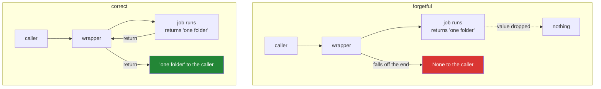

# 2.3 — The decorator that ate the return value

## One-line answer

A wrapper that calls the function but does not `return` its result hands `None` back to every caller,
silently, and the failure surfaces somewhere else entirely — so the `return` in front of the inner call
is the single most important character in a decorator.

---

## The story

Somebody comes to the desk for a folder from the third floor.

The person on the desk writes the time in the book, lets them up, and the visitor comes back down with
the folder. The desk takes it, writes the time again, says "thanks, all done" — and puts the folder
under the counter.

The visitor walks out of the building with nothing.

Nobody shouted. Nobody was rude. The book is filled in perfectly and the record of the visit is
flawless. The visitor gets to the car park before they notice, and by then the only thing they know is
that they do not have a folder. They will probably go back and ask the office on the third floor,
because that is who they think they were dealing with, and the office will say they handed it over —
which is true.

The failure and the place you would look for it are in two different rooms.

---

## The idea in plain language

A function that reaches the end of its body without a `return` statement returns `None`. That is not a
special rule for wrappers; it is the ordinary rule for every function in Python
([Day 10, 1.1](../../../day-10-functions/parts/01-the-signature/1.1-a-function-is-a-promise.md)).

Inside a wrapper it is unusually dangerous, for three reasons.

**The wrapper looks finished without it.** `job(*args, **kwargs)` on a line by itself is a complete,
valid statement. The function runs. Any printing it does appears. Any file it writes is written. The
only thing missing is the answer, and nothing about the code's shape suggests it.

**Nothing raises at the boundary.** The caller receives `None`, which is a perfectly ordinary value.
The error, when it comes, is an `AttributeError` or a `TypeError` on a line that had nothing to do with
the decorator, often in a different file.

**It hits every decorated function at once.** One missing character on one line changes the return
value of every function carrying that decorator, which on a real codebase is dozens.

The rule is a single sentence: **a wrapper returns whatever the wrapped function returned, unchanged,
unless the decorator's entire purpose is to change it.** If you do mean to change it — to round it, to
wrap it in a result object, to add a cache header — that has to be the documented purpose of the
decorator and its name has to say so.

There is a matching rule for exceptions, and it is the same idea. A wrapper must let an exception
travel unless catching it is the decorator's stated job. That is why the "after" step of a timing
decorator goes in a `finally` block rather than after the call, and
[2.4](2.4-timed-the-first-real-one.md) builds it that way.

---

## Why Setu needs it

- **`@timed` reports on a function and must not change it.** A timing decorator that swallowed return
  values would make every function it touched useless, which is the opposite of an observability tool.
- **[3.1](../03-decorators-with-arguments/3.1-retry-three-a-decorator-that-takes-an-argument.md)'s
  `@retry` has the same trap in a nastier form**: a `for` loop whose `return` is inside the `try` will
  fall out of the bottom and return `None` when the last attempt fails, instead of raising.
- **Day 13's `load()` returns `list[Paper]`, and its contract says never `None`**
  ([Day 13, 4.2](../../../day-13-inheritance-and-abstraction/parts/04-abstraction/4.2-the-loader-family.md)).
  A decorator that ate the return value would break that contract from the outside, and the loader's own
  tests would still pass.
- **Principle 7 is what catches this.** A test that asserts a log line was printed passes; a test that
  asserts the *value* fails. Which test you wrote decides whether you find this in a minute or a week.

---

## The mechanism

```python
"""The decorator that ate the return value."""

import functools


def forgetful(job):
    @functools.wraps(job)
    def wrapper(*args, **kwargs):
        job(*args, **kwargs)

    return wrapper


def correct(job):
    @functools.wraps(job)
    def wrapper(*args, **kwargs):
        return job(*args, **kwargs)

    return wrapper


@forgetful
def collect_forgetful(what):
    return f"one {what}"


@correct
def collect_correct(what):
    return f"one {what}"


print("forgetful:", repr(collect_forgetful("folder")))
print("correct  :", repr(collect_correct("folder")))
print()
print("the failure it causes, two lines later:")
try:
    print(collect_forgetful("folder").upper())
except AttributeError as error:
    print("  AttributeError:", error)
```

Run on Python 3.12.12 on 2026-09-01:

```
forgetful: None
correct  : 'one folder'

the failure it causes, two lines later:
  AttributeError: 'NoneType' object has no attribute 'upper'
```

**Line by line:**

- `forgetful` and `correct` differ by **six characters**: the word `return` and a space. Everything
  else, including `@functools.wraps(job)`, is identical.
- `job(*args, **kwargs)` in `forgetful` — the function genuinely runs. If it appended to a list, wrote
  a file or made a request, all of that happened. Only the answer was dropped.
- `repr(...)` around both results rather than plain printing. **`print(None)` shows `None`, and
  `print('')` shows nothing, and both look like "it printed nothing wrong"** — `repr` makes the
  difference visible, which is the debugging habit from
  [Day 7, 3.3](../../../day-07-strings/parts/03-formatting/3.3-repr-and-the-debugging-f-string.md).
- `collect_forgetful("folder").upper()` — the realistic version of the failure. The decorator is not in
  this line, the wrapped function is not in this line, and the traceback will point here.
- `AttributeError: 'NoneType' object has no attribute 'upper'` — **this message is one of the two or
  three most common in Python, and "a function returned `None` when you thought it returned a value" is
  almost always the cause.** After today, add "or a decorator ate it" to the list of suspects.
- The `try` / `except AttributeError` is only here so the demonstration keeps running. In real code
  this failure is a crash.

Where the value goes, in both versions:



---

## When it breaks

**The wrapper that returns nothing, used in a chain:**

```text
$ uv run python -c "
def forgetful(job):
    def wrapper(*a, **k):
        job(*a, **k)
    return wrapper

@forgetful
def titles():
    return ['milk', 'bread']

for t in titles():
    print(t)
"
Traceback (most recent call last):
  File "<string>", line 11, in <module>
TypeError: 'NoneType' object is not iterable
```

**What it means.** The same missing `return`, meeting a `for` loop instead of a method call. The
message changes with what the caller does next, which is why this bug has no single signature. Line 11
is the loop; the mistake is on line 4.

**The wrapper that returns something, but not the right thing:**

```text
$ uv run python -c "
def logged(job):
    def wrapper(*a, **k):
        result = job(*a, **k)
        return print('  ran', job.__name__)
    return wrapper

@logged
def collect(what):
    return 'one ' + what

print(repr(collect('folder')))
"
  ran collect
None
```

**What it means.** There *is* a `return`, and it still returns `None`, because `print()` returns
`None`. The variable `result` was assigned and then abandoned. This one survives review more often than
the missing `return`, because the word `return` is on the line and the eye stops there.

**Swallowing the exception as well as the value:**

```text
$ uv run python -c "
def quiet(job):
    def wrapper(*a, **k):
        try:
            return job(*a, **k)
        except Exception as e:
            print('  logged:', e)
    return wrapper

@quiet
def collect(what):
    raise OSError('third floor is locked')

print('caller got:', repr(collect('folder')))
print('caller thinks everything is fine')
"
  logged: third floor is locked
caller got: None
caller thinks everything is fine
```

**What it means.** The worst version. A crash became a `None`, the program carried on, and the log line
is the only evidence — in a system that writes thousands of log lines an hour. **A wrapper that catches
an exception must re-raise it unless suppressing it is the decorator's documented purpose.** The fix is
`raise` at the end of the `except` block, or `finally` instead of `except` when the wrapper only wants
to do its "after" step.

---

## In production

**The professional shape is `try` / `finally` with the `return` inside the `try`.** It gets both rules
right at once: the value travels, the exception travels, and the "after" step runs either way. That is
exactly how [2.4](2.4-timed-the-first-real-one.md) writes `@timed`, and once you have seen it, a
decorator that does its cleanup after the call rather than in a `finally` looks wrong on sight, because
it silently stops doing its job on the error path — which is the path you most wanted it for.

**What changes at scale is that a value-eating decorator becomes a data-loss bug.** A pipeline where
one stage silently returns `None` does not crash; it writes an empty result, and the next run overwrites
yesterday's good output with today's empty one. By the time somebody notices, the good data is several
backups back. This is why a decorator is reviewed for what it returns before it is reviewed for what it
does.

**The failure that only appears with real data is the decorator on a generator function.** A wrapper
that calls a generator function and returns its result is fine, because calling a generator function
returns a generator object immediately
([Day 11, 2.1](../../../day-11-iterators-and-generators/parts/02-generators/2.1-yield-the-function-that-pauses.md)).
But a `@timed` wrapper around one measures **how long it took to create the generator**, which is
approximately zero, and reports that as the cost of work that has not happened yet. The decorator is
not wrong about the value; it is wrong about the meaning, and only a real dataset makes that obvious.

**The review comment a senior engineer leaves.** *"`wrapper` calls `job` and then falls off the end, so
every function decorated with this now returns `None`. The tests pass because they only assert on the
log output. Return the result, and add one assertion on the value so this cannot happen again."*

**The interview question.** *"What is the most common bug in a hand-written decorator?"* The answer is
this document — a wrapper that drops the return value — and the part that shows experience is
describing *where you find out*: not at the decorator, but at an `AttributeError` on `'NoneType'` in
unrelated code. Adding the exception half — that a wrapper must not swallow exceptions either, and that
`try`/`finally` is how you get both right — turns a small answer into a good one.

---

## Check yourself

```bash
uv run python -c "
import functools

def correct(job):
    @functools.wraps(job)
    def wrapper(*args, **kwargs):
        return job(*args, **kwargs)
    return wrapper

@correct
def collect(what):
    return f'one {what}'

print(repr(collect('folder')))
"
```

Delete the word `return` on the line inside `wrapper` and run it again. Then predict what
`collect('folder').upper()` does, and check.

**Answer out loud, without scrolling up:**

> A decorated function suddenly returns `None`. Where is the bug, and where will the traceback point?
> Then say why the "after" step of a timing decorator belongs in a `finally` block.

---

**Next:** [2.4 — `@timed`, the first real one](2.4-timed-the-first-real-one.md), which puts everything
in section 2 together into a decorator worth keeping in `src/setu/`.
