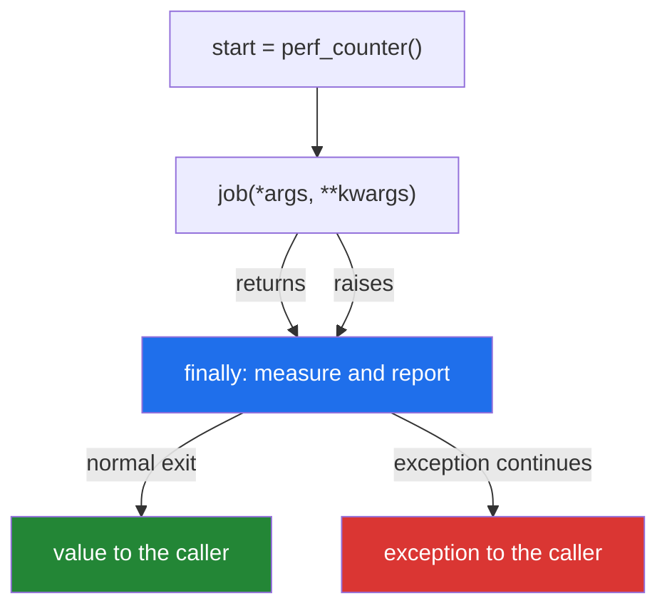

# 2.4 — `@timed`: the first decorator worth keeping

## One-line answer

`@timed` is `functools.wraps`, `*args, **kwargs`, a `perf_counter` reading either side of the call and
a `try` / `finally` so the measurement is taken even when the function raises — and it is the first
thing today that goes into `src/setu/` and never comes out again.

---

## The story

The book on the desk has two columns: **in** and **out**.

For a long time it only had one. Somebody signed in, and that was the record. It answered "who came in
today", which was the question anybody had asked so far.

Then a lift broke, and somebody was stuck on the third floor for most of an afternoon before anybody
noticed. The question changed. It was no longer "who came in" but "how long was that visit, and is that
normal?" — and the book, with one column, could not answer it.

So a second column appeared. Nothing else about the desk changed: same person, same book, same
visitors. But now every visit has a length, and the odd one stands out without anybody having to
remember what odd looks like.

One more thing changed, and it was learned the hard way. The first version of the two-column book only
got its **out** time written when the visitor came back down and said goodbye. Anybody who left through
the fire door had an in-time and no out-time, and those are precisely the visits somebody would want to
look at. The rule now is that the out-time gets written when the visit ends, however it ends.

---

## The idea in plain language

`@timed` records how long a function took, and hands its answer back untouched.

Three decisions in it are worth making deliberately, because each one is a mistake people actually
make.

**Which clock.** Python has several. `time.time()` gives you the wall clock — the time of day — and it
can jump backwards when the machine syncs with a time server, so a duration measured with it can come
out negative. `time.perf_counter()` is a monotonic clock with the highest resolution the machine
offers, and it exists for exactly this job. On the Windows machine this was written on, `time.time()`
has a resolution of about 15.6 milliseconds and `perf_counter()` about 100 nanoseconds — a difference of
five orders of magnitude, and the reason a fast function timed with `time.time()` reports `0.000000`.
The distinction and the guarantees are set out in *PEP 418 — Add monotonic time, performance counter,
and process time functions* (2012, <https://peps.python.org/pep-0418/>).

**Where the "after" step goes.** Not after the call — in a `finally` block. A `finally` block runs
whether the `try` finished normally or blew up
([2.3](2.3-returning-the-value.md)), so the measurement is taken on the error path too. That matters
more than it sounds: **a function that fails slowly is a much more interesting event than one that
succeeds slowly**, and a timing decorator that only reports on success is blind to it.

**Where the number goes.** Printing is right for today and wrong for a real system. A number that goes
to standard output cannot be aggregated, filtered or alerted on, and it is written from inside a
library that has no business deciding where output goes. The production answer is the `logging` module
or a metrics client, and *In production* below says why. Today it prints, because printing is visible
and this is the version you learn on.

---

## Why Setu needs it

- **It goes in `src/setu/decorators.py` today**, and every later phase imports it. Phase 3's NumPy
  timings, Phase 12's model fits, Phase 19's retrieval latency and Phase 27's agent steps are all
  measured with this function.
- **[Day 8, 3.1](../../../day-08-containers/parts/03-dedup/3.1-ten-thousand-ids-timed.md) timed a list
  against a set by hand**, with `perf_counter` calls written around the code being measured. `@timed`
  is that same measurement, taken out of the code and put above it.
- **Principle 5 makes latency the currency.** On free tiers there is no bill to read, so the only
  signals you get are wall-clock and rate-limit responses, and one of them is this.
- **Day 233's eval suite reports per-stage timings.** A decorator applied on Day 14 is what makes that
  possible without editing every stage.

---

## The mechanism

```python
"""@timed - the first decorator worth keeping."""

import functools
import time


def timed(job):
    """Print how long `job` took, and hand back whatever it returned."""

    @functools.wraps(job)
    def wrapper(*args, **kwargs):
        start = time.perf_counter()
        try:
            return job(*args, **kwargs)
        finally:
            elapsed = time.perf_counter() - start
            print(f"  [timed] {job.__name__} {elapsed:.4f}s")

    return wrapper


@timed
def collect(what, pause=0.05):
    time.sleep(pause)
    return f"one {what}"


@timed
def collect_but_fails(what):
    time.sleep(0.02)
    raise RuntimeError(f"third floor is closed, cannot get {what}")


print("result:", collect("folder"))
try:
    collect_but_fails("folder")
except RuntimeError as error:
    print("caller saw:", type(error).__name__, "-", error)
```

Run on Python 3.12.12 on 2026-09-01. The timings will differ on your machine in the last two digits;
the two facts to read are that both are close to their `sleep`, and that **the failing one still
reported**:

```
  [timed] collect 0.0502s
result: one folder
  [timed] collect_but_fails 0.0203s
caller saw: RuntimeError - third floor is closed, cannot get folder
```

**Line by line:**

- `@functools.wraps(job)` — [2.2](2.2-functools-wraps.md). Without it the log line below would be right
  but every profiler and registry would be wrong.
- `def wrapper(*args, **kwargs):` — [2.1](2.1-args-and-kwargs-in-a-wrapper.md), so this goes on any
  function.
- `start = time.perf_counter()` — **before the `try`.** Inside it would still work; before it says
  clearly that the measurement brackets the call and nothing else.
- `try:` with `return job(*args, **kwargs)` **inside it.** The `return` is
  [2.3](2.3-returning-the-value.md)'s rule, and putting it inside the `try` is what lets `finally` run
  after the value has been computed but before it reaches the caller.
- `finally:` — the "after" step. This block runs on the way out **whichever way you leave**: a normal
  return, an exception, even a `break` in a caller's loop. There is no `except`, so the exception is
  not caught, not logged and not swallowed — it travels on to the caller untouched, which is exactly
  what the output's last line proves.
- `elapsed = time.perf_counter() - start` — a difference of two readings from the same clock. The
  absolute values are meaningless (`perf_counter`'s zero point is undefined); only the difference has
  meaning, which is what "monotonic" buys.
- `f"{elapsed:.4f}s"` — four decimal places, so a sub-millisecond call is still visible as a number
  rather than as `0.0`.
- `job.__name__` and not `wrapper.__name__` — `job` is the original, so this is right even in a
  decorator that forgot `wraps`. It is the log line that is safe; everything *else* about that
  decorator is still broken.
- `def collect(what, pause=0.05)` and `def collect_but_fails(what)` — two different signatures, one
  decorator, no changes. That is `*args, **kwargs` earning its place.
- `try` / `except RuntimeError` around the failing call — the caller's ordinary error handling, still
  working. The decorator did not interfere with it.

The two exits, drawn:



---

## When it breaks

**The wrong clock, on a fast function:**

```text
$ uv run python -c "
import time
def work():
    return sum(range(10000))
for _ in range(3):
    s = time.time(); work(); print(f'time.time():      {time.time() - s:.6f}s')
for _ in range(3):
    s = time.perf_counter(); work(); print(f'perf_counter():   {time.perf_counter() - s:.6f}s')
"
time.time():      0.001009s
time.time():      0.000000s
time.time():      0.000000s
perf_counter():   0.000204s
perf_counter():   0.000218s
perf_counter():   0.000239s
```

**What it means.** `time.time()` reported the same piece of work as taking one millisecond and then as
taking no time at all, because on this machine its resolution is coarser than the work is long. The
first reading is not more accurate than the others — it is the same clock happening to tick during the
call. `perf_counter()` gives a stable answer three times. **A decorator that reports `0.0000s` for
everything fast is not measuring a fast function; it is using the wrong clock.**

**Timing a generator function:**

```text
$ uv run python -c "
import functools, time

def timed(job):
    @functools.wraps(job)
    def wrapper(*a, **k):
        start = time.perf_counter()
        try:
            return job(*a, **k)
        finally:
            print(f'  [timed] {job.__name__} {time.perf_counter() - start:.4f}s')
    return wrapper

@timed
def slow_lines(n):
    for i in range(n):
        time.sleep(0.01)
        yield i

g = slow_lines(5)
print('generator built')
print('items:', list(g))
"
  [timed] slow_lines 0.0000s
```

**What it means.** No error, and a number that is a lie. Calling a generator function does not run its
body; it builds a generator object and returns immediately
([Day 11, 2.1](../../../day-11-iterators-and-generators/parts/02-generators/2.1-yield-the-function-that-pauses.md)),
so `@timed` measured the building. Read the order of the output: **the timing printed before
`generator built`, and long before the fifty milliseconds of sleeping happened.** The decorator is
correct and the measurement is meaningless. Timing a generator means timing the consumption, not the
call — so time the `list(...)`, or wrap the loop that drains it.

**Doing the "after" step after the call instead of in `finally`:**

```text
$ uv run python -c "
import time
def timed(job):
    def wrapper(*a, **k):
        start = time.perf_counter()
        result = job(*a, **k)
        print(f'  [timed] {job.__name__} {time.perf_counter() - start:.4f}s')
        return result
    return wrapper

@timed
def collect_but_fails(what):
    time.sleep(0.02)
    raise RuntimeError('third floor is closed')

try:
    collect_but_fails('folder')
except RuntimeError as e:
    print('caller saw:', e)
"
caller saw: third floor is closed
```

**What it means.** No `[timed]` line at all. The exception jumped straight past the `print`, so the one
call anybody would want the timing for is the one call that produced none. The decorator works
perfectly on the happy path and is silent on the path you built it for. `try` / `finally` is the whole
fix.

---

## In production

**The professional version does not print, it logs, and it logs structured fields.** A real `@timed`
calls `logger.info("call", extra={"func": job.__qualname__, "ms": elapsed * 1000, "ok": ok})`, so the
duration arrives as a *number in a field* rather than as words in a line. That is the difference
between "we can chart the 95th-percentile latency of this function" and "we can grep the logs". It also
puts the decision about where output goes back with the application, which is where it belongs — a
library that prints is a library that has taken that decision for its users.

**What changes at scale is that individual timings stop being useful and distributions start.** One
call taking 400 milliseconds tells you nothing; the fact that the slowest one call in a hundred takes
four seconds tells you everything, and only percentiles show it. Production decorators therefore feed a
histogram rather than a log line, and they record whether the call succeeded, because the latency of
failures and the latency of successes are different distributions and averaging them together hides
both. The next step up is a *span* in a tracing system, where each timed call is a node in a tree that
shows which of the twelve things a request did was the slow one.

**The failure that only appears with real data is measurement overhead on a hot path.** A decorator
that costs a microsecond is free on a function called a thousand times and costs seconds on one called
ten million times — and the timing decorator then shows up in its own profile. The professional habits
are to decorate at the coarse level rather than the fine one, and to sample: time one call in a
hundred, and multiply.

**The review comment a senior engineer leaves.** *"This times the wrong thing on `stream_papers`,
because that is a generator and the wrapper only measures how long it took to create it. Move `@timed`
onto the function that drains the generator, or have the wrapper detect a generator result and time the
iteration."*

**The interview question.** *"Write a timing decorator."* Everyone gets the four lines. What separates
answers is what you say without being asked: `perf_counter` and not `time.time`, because the wall clock
can jump and is too coarse; `try`/`finally` and not a line after the call, because a slow failure is
the interesting case; `functools.wraps`, because the profiler groups by name; and that in a real system
this emits a metric rather than a `print`. Mentioning that it silently misreports generators and
`async` functions is the answer of somebody who has shipped one.

---

## Check yourself

```bash
uv run python -c "
import functools, time

def timed(job):
    @functools.wraps(job)
    def wrapper(*args, **kwargs):
        start = time.perf_counter()
        try:
            return job(*args, **kwargs)
        finally:
            print(f'  [timed] {job.__name__} {time.perf_counter() - start:.4f}s')
    return wrapper

@timed
def collect(what, pause=0.05):
    time.sleep(pause)
    return f'one {what}'

print('result:', collect('folder'))
print('resolution of the two clocks:')
print('  time.time     ', time.get_clock_info('time').resolution)
print('  perf_counter  ', time.get_clock_info('perf_counter').resolution)
"
```

Then change `finally:` to `except Exception:` with a bare `pass`, decorate a function that raises, and
say what the caller now sees.

**Answer out loud, without scrolling up:**

> Why `perf_counter` rather than `time.time`, and why `finally` rather than a line after the call? Then
> say what `@timed` reports when you put it on a generator function, and why.

---

**Next:** [2.5 — stacking, and the order they apply](2.5-stacking-and-the-order.md), because `@timed`
and `@retry` are about to end up on the same function and the order will matter.
