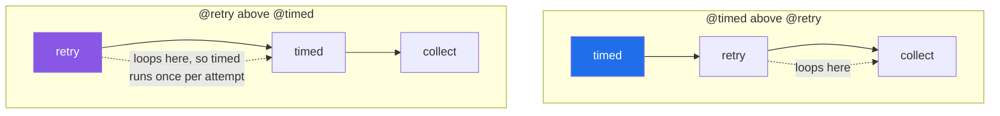

# 2.5 — Stacking decorators, and the order that changes the answer

## One-line answer

Stacked decorators are applied bottom-up and run top-down — `@a` above `@b` means `a(b(f))`, so `a`
wraps `b` and `a`'s code runs first — and swapping two lines can change what gets measured, what gets
cached and what gets retried without changing a single character of the function.

---

## The story

The building adds a second desk.

The first desk, in the lobby, is the one from before: it writes down when you arrived and when you
left. The second one is at the foot of the stairs, and it is there because the lift keeps breaking. If
the third floor does not answer, that desk sends you back up to try again, twice, before it gives up
and tells you to go home.

Now the question nobody asked when the second desk was installed: which desk do you meet first?

Put the lobby desk on the outside and it writes **one entry** for your visit, covering everything —
the first failed trip, the second failed trip, and the one that worked. The visit took twenty minutes,
because that is how long you were in the building.

Put the stairs desk on the outside instead, and the lobby desk is now *inside* the retrying, so it
writes **one entry per trip**. Three entries, each of them short, and nothing in the book says that
those three were one visitor trying to do one thing.

Neither book is wrong. They answer different questions, and the answer to "which one do we want?" is
"which question are you going to ask?" — which nobody decided when they put the desks in.

---

## The idea in plain language

When decorator lines are stacked, Python applies them **from the bottom up**. This:

```text
@timed
@retry
def collect(what): ...
```

means exactly `collect = timed(retry(collect))`. The decorator nearest the `def` goes on first, and
each one afterwards wraps what the previous one produced.

Applying bottom-up produces a set of layers, and calling then goes **from the top down**, because the
outermost wrapper is the one the caller reaches. So:

- **The last line before `def` is the innermost layer** — closest to the real function.
- **The first line is the outermost layer** — first to run, last to finish.

The two directions are not a contradiction; they are the same fact read from opposite ends. It is the
same shape as putting a parcel in a box and the box in a bag: the box goes on first, and the bag comes
off first.

The reason this matters is that most decorators are not commutative — swapping them changes the
program. Three pairs where the difference is real:

- **`@timed` and `@retry`.** Timing outside gives one number for the whole effort, including waiting
  between attempts. Timing inside gives one number per attempt. Both are useful; they are different
  measurements.
- **A cache and anything else.** Whatever sits *inside* the cache stops running on a cache hit. A
  timing decorator inside a cache reports only on misses; outside a cache, it reports on both, which is
  how you find out whether the cache is helping.
- **Authentication and logging.** Logging outside the auth check records rejected attempts; inside it,
  it records only the ones that got through — which is exactly backwards from what a security review
  wants.

A rule of thumb that survives contact with real code: **put the decorator whose measurements you want
to include everything on the outside, and the one whose behaviour you want to skip on the inside.**

---

## Why Setu needs it

- **`@timed` and `@retry` are today's build, and they will be on the same function.** Deciding the
  order is part of writing them, not a detail afterwards.
- **[4.2](../04-the-toolkit/4.2-functools-cache-and-its-trap.md) puts `functools.cache` into the
  stack**, which is the ordering with the largest visible difference.
- **Phase 26's FastAPI routes stack four or five deep** — the route decorator, an auth dependency, a
  rate limiter, an error handler — and getting them in the wrong order is a security bug rather than a
  performance one.
- **Day 15 stacks `@property` with `@classmethod` and `@staticmethod`**, where the wrong order raises
  at import rather than misbehaving quietly, and knowing this rule is what makes that message readable.

---

## The mechanism

```python
"""Two decorators on one function, and which one is on the outside."""

import functools


def outer(job):
    @functools.wraps(job)
    def wrapper(*args, **kwargs):
        print("  outer: before")
        result = job(*args, **kwargs)
        print("  outer: after")
        return result

    return wrapper


def inner(job):
    @functools.wraps(job)
    def wrapper(*args, **kwargs):
        print("  inner: before")
        result = job(*args, **kwargs)
        print("  inner: after")
        return result

    return wrapper


@outer
@inner
def collect(what):
    print("  collect: running")
    return f"one {what}"


def by_hand(what):
    print("  collect: running")
    return f"one {what}"


by_hand = outer(inner(by_hand))

print("with @:")
collect("folder")
print("by hand - outer(inner(f)):")
by_hand("folder")
```

Run on Python 3.12.12 on 2026-09-01:

```
with @:
  outer: before
  inner: before
  collect: running
  inner: after
  outer: after
by hand - outer(inner(f)):
  outer: before
  inner: before
  collect: running
  inner: after
  outer: after
```

**Line by line:**

- `@outer` above `@inner` above `def collect` — read the two stacked lines as `outer(inner(collect))`,
  which is what the `by_hand` line spells out in full.
- **The two runs are byte-for-byte identical.** That is the point of including the hand-written version:
  the stack is not a new feature, it is nested calls with the brackets removed
  ([1.4](../01-functions-as-values/1.4-the-at-sign-is-two-lines.md)).
- `outer: before` prints first even though `@inner` was applied first. **Applied last, runs first** —
  because `outer`'s wrapper is the object the name `collect` now holds, so it is the one the caller
  actually calls.
- `inner: before` then `collect: running` — each layer calls the next one inward.
- The `after` lines come back out in reverse: `inner: after` then `outer: after`. A stack of decorators
  is a stack in the ordinary sense, entered top-down and left bottom-up.
- `@functools.wraps(job)` in **both** decorators. In a stack, one layer missing it is enough to lose the
  name for the whole stack, because the layer above copies from the broken layer below
  ([2.2](2.2-functools-wraps.md)).

Now the same idea where the order changes the answer:

```python
"""Timing outside the retrying, and timing inside it."""

import functools
import time

CALLS = {"n": 0}


def timed(job):
    @functools.wraps(job)
    def wrapper(*args, **kwargs):
        start = time.perf_counter()
        try:
            return job(*args, **kwargs)
        finally:
            print(f"  [timed] {job.__name__} {time.perf_counter() - start:.3f}s")

    return wrapper


def retry(attempts):
    def decorator(job):
        @functools.wraps(job)
        def wrapper(*args, **kwargs):
            for attempt in range(1, attempts + 1):
                try:
                    return job(*args, **kwargs)
                except RuntimeError:
                    print(f"  [retry] attempt {attempt} failed")
                    if attempt == attempts:
                        raise

        return wrapper

    return decorator


@timed
@retry(3)
def outer_timed(what):
    CALLS["n"] += 1
    time.sleep(0.01)
    if CALLS["n"] < 3:
        raise RuntimeError("closed")
    return f"one {what}"


@retry(3)
@timed
def outer_retry(what):
    CALLS["n"] += 1
    time.sleep(0.01)
    if CALLS["n"] < 6:
        raise RuntimeError("closed")
    return f"one {what}"


print("timed on the outside:")
print(" ", outer_timed("folder"))
print("retry on the outside:")
print(" ", outer_retry("folder"))
```

Run on Python 3.12.12 on 2026-09-01:

```
timed on the outside:
  [retry] attempt 1 failed
  [retry] attempt 2 failed
  [timed] outer_timed 0.031s
  one folder
retry on the outside:
  [timed] outer_retry 0.011s
  [retry] attempt 1 failed
  [timed] outer_retry 0.011s
  [retry] attempt 2 failed
  [timed] outer_retry 0.010s
  one folder
```

**Line by line:**

- `CALLS` is a module-level dictionary counting real calls, so both functions can be made to succeed on
  their third attempt without any randomness. A mutable container rather than an integer, because a
  plain `int` would need `global` to be reassigned
  ([Day 10, 2.3](../../../day-10-functions/parts/02-scope/2.3-global-and-nonlocal.md)).
- `retry(attempts)` here is a preview of
  [3.1](../03-decorators-with-arguments/3.1-retry-three-a-decorator-that-takes-an-argument.md); read it
  for now as "a decorator that re-runs the function".
- `@timed` above `@retry(3)` — **one timing line, `0.031s`**, covering three attempts of ten
  milliseconds each. That is the visitor's whole time in the building.
- `@retry(3)` above `@timed` — **three timing lines, about `0.011s` each**, one per attempt, and
  nothing in the output says they belong together. That is one entry per trip up the stairs.
- The retry lines appear in different places relative to the timing lines, and that is the whole
  signal: in the first stack the retrying is inside the measurement, in the second the measurement is
  inside the retrying.
- **Neither is wrong.** "How long did this operation take, end to end?" wants the first. "Is one
  particular attempt getting slower?" wants the second. What is wrong is choosing without noticing.

The layers, drawn:



---

## When it breaks

**A cache in the wrong place, hiding the measurement:**

```text
$ uv run python -c "
import functools, time
def timed(job):
    @functools.wraps(job)
    def w(*a, **k):
        s = time.perf_counter()
        try:
            return job(*a, **k)
        finally:
            print(f'    [timed] {job.__name__} {time.perf_counter()-s:.4f}s')
    return w

@functools.cache
@timed
def cache_outside(n):
    time.sleep(0.02)
    return n * 2

@timed
@functools.cache
def cache_inside(n):
    time.sleep(0.02)
    return n * 2

print('cache OUTSIDE timed - two calls, same argument:')
cache_outside(1); cache_outside(1)
print('cache INSIDE timed - two calls, same argument:')
cache_inside(1); cache_inside(1)
"
cache OUTSIDE timed - two calls, same argument:
    [timed] cache_outside 0.0205s
cache INSIDE timed - two calls, same argument:
    [timed] cache_inside 0.0201s
    [timed] cache_inside 0.0000s
```

**What it means.** Two calls each time, and the first arrangement printed **one** timing line. With the
cache on the outside, the second call never reached the timing wrapper at all, so the log has no record
that the call happened. With the cache on the inside, both calls are recorded and the `0.0000s` line is
the cache hit — **which is the only arrangement that can tell you whether the cache is doing anything.**
The first arrangement will have somebody staring at a dashboard wondering why the call volume dropped.

**One layer missing `functools.wraps` poisons the stack:**

```text
$ uv run python -c "
import functools
def a(job):
    def wrapper(*x, **y): return job(*x, **y)
    return wrapper
def b(job):
    @functools.wraps(job)
    def wrapper(*x, **y): return job(*x, **y)
    return wrapper

@b
@a
def collect(what): return 'one ' + what
print('b(a(f)).__name__ =', collect.__name__)

@a
@b
def collect2(what): return 'one ' + what
print('a(b(f)).__name__ =', collect2.__name__)
"
b(a(f)).__name__ = wrapper
a(b(f)).__name__ = wrapper
```

**What it means.** Both orders lose the name, for two different reasons. In the first, `b` faithfully
copied the identity of what it was given — and what it was given was `a`'s anonymous wrapper. In the
second, `a` was outermost and copied nothing. **A stack is only as good as its worst layer**, so a
third-party decorator without `wraps` costs you the name however carefully you write yours.

**Assuming the order is the reading order:**

```text
$ uv run python -c "
def first(job):
    print('  applied: first')
    return job
def second(job):
    print('  applied: second')
    return job

@first
@second
def collect(what): return 'one ' + what
"
  applied: second
  applied: first
```

**What it means.** The decorator written *second* was applied *first*. There is no error here and
nothing to fix — it is here because the instinct to read a stack top-to-bottom is strong, and this is
the two-line experiment that replaces the instinct with a fact.

---

## In production

**The professional habit is that the order is written down where the stack is.** A codebase with a
standard stack — say `@app.post(...)`, `@requires_role("admin")`, `@rate_limited`, `@timed` — puts a
comment or a doc line beside the first one it defines, saying which layer is outermost and why. The
alternative is that each new route copies whichever existing route the author happened to open, and
after a year the same four decorators appear in four different orders across the service.

**What changes at scale is that the ordering becomes a security property, not a preference.** Put a
logging or metrics decorator inside the authorisation check and the system stops recording rejected
requests, which is the exact data an incident review needs. Put a rate limiter inside a cache and the
limiter never sees the calls the cache served, so the limit does not mean what its name says. These
are not performance bugs; they are the sort of thing a compliance audit finds.

**The failure that only appears with real data is the retry outside the timeout.** A stack with retry
on the outside and a per-call timeout inside will, on a genuinely dead dependency, take the timeout
multiplied by the attempt count — so a "ten-second timeout" quietly becomes thirty seconds, and every
caller upstream that had its own ten-second budget gives up while your code is still politely trying.
The professional answer is an overall deadline held on the outside of the whole stack, checked before
each attempt, which [3.2](../03-decorators-with-arguments/3.2-backoff-jitter-and-which-errors.md)
builds.

**The review comment a senior engineer leaves.** *"`@cache` is above `@timed` here, so cache hits never
reach the timer and the latency chart only shows misses — which is why it looks like this endpoint got
slower after we added caching. Swap the two lines."*

**The interview question.** *"In `@a` over `@b` over `def f`, which runs first?"* The answer has two
halves and most people give one: applied bottom-up, so it is `a(b(f))`, and executed top-down, so `a`'s
code runs first. The half that shows real use is a case where it matters — a cache above a timer hiding
the hits, or a logger inside an auth check losing every rejected request — because that is what turns
a syntax question into an engineering one.

---

## Check yourself

```bash
uv run python -c "
def first(job):
    print('  applied: first')
    return job
def second(job):
    print('  applied: second')
    return job

@first
@second
def collect(what):
    return 'one ' + what

print(collect('folder'))
"
```

Swap the two decorator lines and predict the output before you run it. Then write the same thing as a
single line of ordinary Python with no `@`.

**Answer out loud, without scrolling up:**

> In `@a` over `@b` over `def f`, which decorator is applied first and which one's code runs first?
> Then give one example where swapping two decorators changes what the program reports.

---

**Next:** section 3 opens with
[3.1 — `@retry(3)`](../03-decorators-with-arguments/3.1-retry-three-a-decorator-that-takes-an-argument.md),
where the decorator gains a third layer so it can take an argument.
