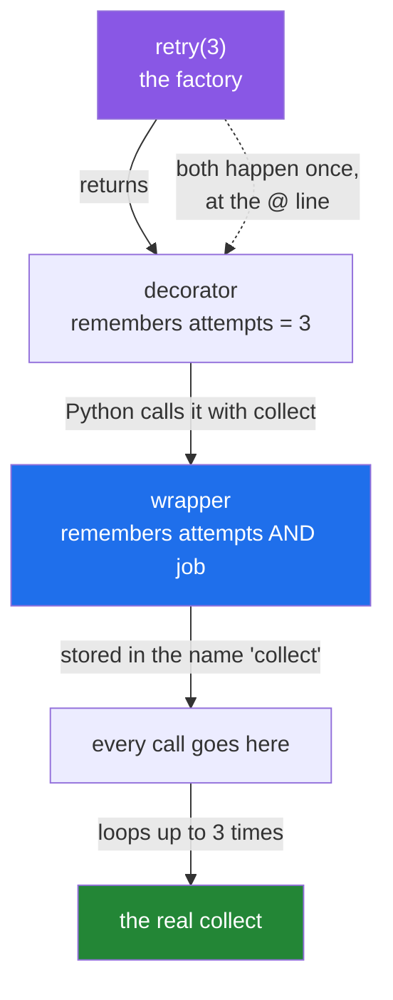

# 3.1 — `@retry(3)`: a decorator that takes an argument is a function that returns a decorator

## One-line answer

`@retry(3)` is not a decorator — it is a *call*, and its result is the decorator, so the code needs
three nested functions: one to capture the argument, one to capture the function, and one to be the
wrapper.

---

## The story

The desk at the foot of the stairs has a rule, and the rule is written on a card.

The card says: **"if nobody answers, send them up again — twice more, then send them home."** The
number on the card is three, because that is what the building manager decided when they printed it.

Somebody could have printed a card that says two. Somebody could print a different card for the office
on the fifth floor, which is often out at lunch, saying five. The card is not the desk and it is not the
rule; the card is a *filled-in* rule. The manager fills the number in once, prints the card, and hands
it over. From then on nobody thinks about the number — they read the card and do what it says.

Filling in the number and following the card are two separate acts, and they happen at two separate
moments. That is the whole shape of the next twenty lines of code.

---

## The idea in plain language

A decorator line is `@` followed by something that Python calls with one argument: the function
([1.4](../01-functions-as-values/1.4-the-at-sign-is-two-lines.md)).

`@retry(3)` obeys that rule exactly. Python first works out what `retry(3)` *is* — it calls `retry`
with the number `3` — and then decorates the function with whatever comes back. So `retry(3)` must
return a decorator.

That gives three layers, and each one exists to capture one thing:

| Layer | Written | Captures | Called |
|---|---|---|---|
| the **factory** | `def retry(attempts):` | the argument | once, at the `@` line |
| the **decorator** | `def decorator(job):` | the function | once, at the `@` line |
| the **wrapper** | `def wrapper(*a, **k):` | nothing | every time the function is called |

Nothing here is new. Each layer is [1.2](../01-functions-as-values/1.2-a-function-that-returns-a-function.md)'s
function-returning-a-function, stacked three deep because there are three things to remember.

The behaviour inside the wrapper is the capped retry loop you wrote from scratch on
[Day 6, 3.2](../../../day-06-loops/parts/03-capped-retry/3.2-the-capped-retry-from-scratch.md). The
loop has not changed at all. What has changed is that it has moved out of the function and above it,
so the function is back to expressing only what it does, and a reader can see from the `@` line that
it will be attempted more than once.

One rule about that loop is worth stating separately, because it is the source of the worst bug in this
document: **the last failed attempt must re-raise.** A `for` loop that runs out of attempts and falls
off the bottom returns `None`, which means a function that failed three times reports success with an
empty answer — [2.3](../02-writing-a-decorator/2.3-returning-the-value.md)'s trap, wearing a loop.

---

## Why Setu needs it

- **Free-tier APIs return `429 Too Many Requests` as a matter of routine** — that is
  [Day 3, 4.2](../../../day-03-keys-and-budget/parts/04-rate-budget/4.2-429-and-real-backoff.md), and
  a retry is not an optimisation there, it is how the call succeeds at all.
- **The plan names `@retry(3)` for this day** and says it is reused in every later phase. Phases 17
  through 27 make thousands of calls to services that are free, shared and occasionally busy.
- **`@functools.wraps(job)` has been this shape since [2.2](../02-writing-a-decorator/2.2-functools-wraps.md)**
  without being explained. Now it is: `wraps` is the factory, and `wraps(job)` is the decorator.
- **Phase 26's FastAPI is entirely this pattern.** `@app.get("/papers")` calls `app.get` with a path,
  gets a decorator back, and decorates the view function with it.

---

## The mechanism

```python
"""A decorator that takes an argument is a function that returns a decorator."""

import functools


def retry(attempts):
    """Build a decorator that will re-run its function up to `attempts` times."""

    def decorator(job):
        @functools.wraps(job)
        def wrapper(*args, **kwargs):
            for attempt in range(1, attempts + 1):
                try:
                    return job(*args, **kwargs)
                except RuntimeError as error:
                    print(f"  attempt {attempt}/{attempts} failed: {error}")
                    if attempt == attempts:
                        raise
            raise AssertionError("unreachable")

        return wrapper

    return decorator


calls = {"n": 0}


@retry(3)
def collect(what):
    calls["n"] += 1
    if calls["n"] < 3:
        raise RuntimeError("nobody on the third floor")
    return f"one {what}"


print("result:", collect("folder"))
print("calls made:", calls["n"])
print()

calls["n"] = 0


@retry(2)
def never_works(what):
    calls["n"] += 1
    raise RuntimeError("third floor closed for good")


try:
    never_works("folder")
except RuntimeError as error:
    print("gave up with:", type(error).__name__, "-", error)
print("calls made:", calls["n"])
```

Run on Python 3.12.12 on 2026-09-01:

```
  attempt 1/3 failed: nobody on the third floor
  attempt 2/3 failed: nobody on the third floor
result: one folder
calls made: 3

  attempt 1/2 failed: third floor closed for good
  attempt 2/2 failed: third floor closed for good
gave up with: RuntimeError - third floor closed for good
calls made: 2
```

**Line by line:**

- `def retry(attempts):` — the factory. It runs **once**, at the `@retry(3)` line, and its only job is
  to remember `3`.
- `def decorator(job):` — the middle layer. It is what `retry(3)` returns, and Python calls it with the
  function. **This is the layer that is invisible in the `@` line**, and forgetting it is the mistake in
  the first failure below.
- `@functools.wraps(job)` — [2.2](../02-writing-a-decorator/2.2-functools-wraps.md), applied to the
  wrapper as always. It is itself a decorator-with-an-argument, which is why it needed the brackets that
  `@retry(3)` needs.
- `for attempt in range(1, attempts + 1):` — counting from `1` rather than `0` so the printed message
  reads `1/3` and not `0/3`. The `+ 1` is the price of that, and it is worth it in a message a human
  reads at three in the morning.
- `return job(*args, **kwargs)` **inside the `try`** — a successful attempt returns immediately and the
  loop never comes round again. The `return` is what ends the loop; there is no `break`, and adding one
  would be unreachable.
- `except RuntimeError as error:` — **one specific exception type, not `Exception`.** Which types are
  worth retrying is a real decision with real consequences, and it gets its own document in
  [3.2](3.2-backoff-jitter-and-which-errors.md).
- `if attempt == attempts: raise` — the re-raise on the last attempt. A bare `raise` inside an `except`
  block re-raises **the exception that is currently being handled, with its original traceback**, which
  is why the caller's message names the real problem and not the decorator.
- `raise AssertionError("unreachable")` after the loop — the loop cannot reach this line, because the
  last attempt either returns or raises. It is here as a tripwire: if somebody later edits the loop and
  breaks that property, this line fires loudly instead of returning `None` quietly.
- `calls = {"n": 0}` — a dictionary rather than an integer so the decorated function can change it
  without `global` ([Day 10, 2.3](../../../day-10-functions/parts/02-scope/2.3-global-and-nonlocal.md)).
  It is a counter for the demonstration, not a pattern to copy.
- `calls made: 3` in the first run and `2` in the second — **the attempt count is a cap, not a target.**
  A function that works first time is called once.
- `gave up with: RuntimeError` — the caller sees the function's own exception. The decorator added
  attempts and took nothing away.

The three layers and when each one runs:



---

## When it breaks

**`@retry` with the brackets left off:**

```text
$ uv run python -c "
import functools
def retry(attempts):
    def decorator(job):
        @functools.wraps(job)
        def wrapper(*a, **k):
            return job(*a, **k)
        return wrapper
    return decorator

@retry
def collect(what):
    return 'one ' + what

print(collect('folder'))
"
<function retry.<locals>.decorator.<locals>.wrapper at 0x0000025F7FB2A3E0>
```

**What it means.** No exception, and an answer that is a function. `@retry` without brackets passed
`collect` in as `attempts`, so `retry` returned `decorator`, and the name `collect` now holds
`decorator`. Calling `collect('folder')` therefore ran `decorator('folder')`, which returned `wrapper`
— and `print` dutifully printed it. **Every layer did exactly what it was written to do**, and the
result is nonsense. The next line is where it actually hurts:

```text
$ uv run python -c "
import functools
def retry(attempts):
    def decorator(job):
        @functools.wraps(job)
        def wrapper(*a, **k):
            return job(*a, **k)
        return wrapper
    return decorator

@retry
def collect(what):
    return 'one ' + what

print(collect('folder').upper())
"
Traceback (most recent call last):
  File "<string>", line 15, in <module>
AttributeError: 'function' object has no attribute 'upper'
```

**What it means.** `'function' object has no attribute` — the message
[1.1](../01-functions-as-values/1.1-a-function-is-a-value.md) said would come back. After today, read
it as *"a decorator that needed an argument did not get one"* as well as *"you forgot to call
something"*. The fix is two characters: `@retry(3)`.

**The loop that falls off the bottom:**

```text
$ uv run python -c "
import functools
def retry(attempts):
    def decorator(job):
        @functools.wraps(job)
        def wrapper(*a, **k):
            for attempt in range(attempts):
                try:
                    return job(*a, **k)
                except RuntimeError:
                    pass
        return wrapper
    return decorator

@retry(3)
def collect(what):
    raise RuntimeError('third floor closed')

print('caller got:', repr(collect('folder')))
"
caller got: None
```

**What it means.** Three attempts, three failures, and the caller was told everything is fine. The
`except` swallowed each exception and the loop ran out, so `wrapper` fell off the end and returned
`None`. **This is the single worst bug you can put in a retry decorator**, because it converts an
outage into silently missing data, in every function it is applied to. `if attempt == attempts: raise`
is the fix, and the `raise AssertionError("unreachable")` line in the mechanism is the belt to that
braces.

**An attempt count of zero:**

```text
$ uv run python -c "
import functools
def retry(attempts):
    def decorator(job):
        @functools.wraps(job)
        def wrapper(*a, **k):
            for attempt in range(1, attempts + 1):
                try:
                    return job(*a, **k)
                except RuntimeError:
                    if attempt == attempts:
                        raise
        return wrapper
    return decorator

@retry(0)
def collect(what):
    print('  running')
    raise RuntimeError('closed')

print('caller got:', repr(collect('folder')))
"
caller got: None
```

**What it means.** `running` never printed: `range(1, 1)` is empty, so the function was **not called at
all**, and the caller got `None`. A zero is not usually typed by hand — it arrives from a configuration
file or an environment variable, where someone meant "no retries" and got "no call". The fix is to
validate in the factory, where it is checked once at import rather than on every call:
`if attempts < 1: raise ValueError(...)`.

---

## In production

**The professional version validates its arguments in the factory and nowhere else.** The factory runs
once, at import, so a bad configuration fails at start-up with a clear message rather than on the first
unlucky request. That property — *configuration errors surface at import, call errors surface at call
time* — is one of the real reasons to prefer a decorator factory over a function that takes the same
setting as a parameter on every call.

**What changes at scale is that a naive retry multiplies load on the thing that is already struggling.**
Three attempts against a service that is failing because it is overloaded is three times the traffic,
from every client, at the same moment — the pattern has a name, the *retrying storm*, and it is how a
brief wobble becomes an outage. The defences are the subject of
[3.2](3.2-backoff-jitter-and-which-errors.md): wait longer each time, add randomness so clients do not
line up, cap the total time, and stop retrying things that will never succeed.

**The failure that only appears with real data is the retry on a call that is not safe to repeat.**
Retrying a read is free; retrying a write can create two records, send two emails or charge twice.
[3.3](3.3-the-retry-that-made-it-worse.md) is that failure in full. The rule to carry until then:
**a decorator cannot know whether the function it wraps is safe to repeat, so the person applying it
must.**

**The review comment a senior engineer leaves.** *"`@retry(3)` on a function whose `except` block
swallows the error means three failures return `None`. Re-raise on the final attempt, and add a test
that asserts the exception reaches the caller — the current test only checks the happy path, which is
the one this decorator does not change."*

**The interview question.** *"How do you write a decorator that takes arguments?"* The answer is the
three layers and what each captures — factory for the argument, decorator for the function, wrapper for
the call — plus *when* each runs: the outer two once, at import; the inner one on every call. Adding
that `@retry` without brackets does not raise but silently binds the function to `attempts` is the
detail that shows you have made the mistake and debugged it.

---

## Check yourself

```bash
uv run python -c "
import functools

def retry(attempts):
    def decorator(job):
        @functools.wraps(job)
        def wrapper(*args, **kwargs):
            for attempt in range(1, attempts + 1):
                try:
                    return job(*args, **kwargs)
                except RuntimeError as error:
                    print(f'  attempt {attempt}/{attempts}: {error}')
                    if attempt == attempts:
                        raise
        return wrapper
    return decorator

calls = {'n': 0}

@retry(3)
def collect(what):
    calls['n'] += 1
    if calls['n'] < 3:
        raise RuntimeError('nobody there')
    return f'one {what}'

print('result:', collect('folder'), '| calls:', calls['n'])
"
```

Now delete the two lines `if attempt == attempts:` and `raise`, set the threshold to `calls['n'] < 9`,
and read what the caller gets.

**Answer out loud, without scrolling up:**

> Name the three functions in a decorator that takes an argument, say what each one captures, and say
> which of them run once and which runs on every call. Then say what `@retry` without brackets does.

---

**Next:** [3.2 — backoff, jitter, and which errors are worth retrying](3.2-backoff-jitter-and-which-errors.md),
which turns a loop that hammers a struggling service into one that helps it recover.
