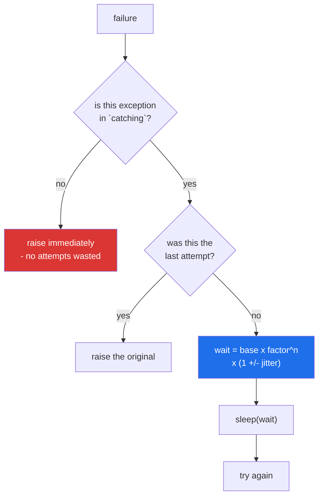

# 3.2 — Waiting longer each time, waiting differently, and choosing what to retry

## One-line answer

A retry that fires again immediately makes a busy service busier, and a retry that catches every
exception spends all its attempts on failures that could never have succeeded — so a real one waits
longer after each attempt, adds a small random amount to that wait, and names the exact exceptions
worth trying again.

---

## The story

The lift is broken and everybody knows it.

At two in the afternoon, four people are waiting to go up to the third floor. Each of them has been
told the same thing by the desk: *if nobody answers, try again*. So all four go up the stairs, all four
knock, and the one person on the third floor — who is on the phone — cannot answer four doors at once.
All four come back down. Thirty seconds later, all four go up again. Together. Because they were all
told the same thing at the same moment, and they are all counting the same thirty seconds.

Two things are wrong with that afternoon, and neither is the retrying.

The first is that they are going up **at the same rate no matter how bad it is**. If nobody answered
the first three times, the fourth attempt thirty seconds later is unlikely to be different, and the
climbing is costing everybody something.

The second is that they are going up **together**. If each person had waited a slightly different
amount of time — one of them thirty-one seconds, one twenty-six — the person upstairs would have had
four separate knocks and might have got to one of them.

And there is a third thing, which is not about timing at all. One of the four is holding a delivery for
the *fifth* floor, and there is no fifth floor in this building. They will still be climbing at six
o'clock. Nothing about waiting longer helps somebody who is trying to do an impossible thing.

---

## The idea in plain language

Three separate fixes, and it is worth keeping them separate because they solve three different
problems.

**Backoff: wait longer each time.** Rather than a fixed pause, the wait grows — typically doubling.
The idea is that a short outage is fixed by the first short wait, and a longer one is not made worse by
somebody knocking every second. Doubling is called **exponential backoff**, and the sequence for a base
of half a second is `0.5, 1, 2, 4`. Note what that costs: four attempts with those waits means the
caller is blocked for seven and a half seconds before finding out it failed, which is why a *total
budget* matters as much as the attempt count.

**Jitter: do not all wait the same amount.** Adding a small random amount to each wait spreads clients
out. Without it, every client that failed at the same instant retries at the same instant, and the
service gets a series of synchronised spikes instead of a smooth trickle — the *thundering herd*. The
jitter here is proportional: a wait of one second with 25 percent jitter becomes a random wait between
0.75 and 1.25 seconds.

**Choosing what to retry.** The single most important decision, and the one people skip. Retrying is
only sensible for a failure that might not happen next time:

- **Worth retrying** — a timeout, a connection reset, a `429 Too Many Requests`, a `503 Service
  Unavailable`. Something is busy or briefly unreachable.
- **Never worth retrying** — a `400 Bad Request`, a `401 Unauthorized`, a `404 Not Found`, a
  `ValueError` from your own parsing, a `KeyError`. The input is wrong, and it will still be wrong on
  the fourth attempt.

You made this distinction on
[Day 6, 3.3](../../../day-06-loops/parts/03-capped-retry/3.3-which-errors-are-retryable.md); the
decorator's job is to make it a parameter, so the caller states it at the `@` line where a reviewer can
see it.

One more piece, which is not about the algorithm but about being able to test it: **the sleeping
function should be injectable.** A retry decorator that calls `time.sleep` directly makes every test of
it take real seconds, and a test suite that takes real seconds is a test suite people stop running
([Principle 7](../../../../docs/00_MASTER_PLAN_DS_GENAI.md)). Taking `sleep=time.sleep` as a parameter
costs one line and lets a test pass a function that records the wait instead of taking it.

---

## Why Setu needs it

- **[Day 3, 4.2](../../../day-03-keys-and-budget/parts/04-rate-budget/4.2-429-and-real-backoff.md)
  established that free tiers answer `429` routinely**, and that a `Retry-After` header, when present,
  beats any backoff formula you can invent. This is where that becomes a decorator.
- **Principle 5 makes the rate limit the budget.** Retrying a permanent error four times spends four
  requests out of a daily allowance to learn something the first response already said.
- **Principle 4 says nothing floats, including randomness.** A jittered retry with an unseeded random
  number generator cannot be tested for its wait schedule, which is why `seed` is a parameter here in
  exactly the way `random_state=` is on every estimator from Phase 12 onward.
- **Day 220's tooling calls public APIs politely**, and Day 237's cost dashboard counts the requests
  this decorator makes. A retry policy is a budget decision as much as a reliability one.

---

## The mechanism

First, the waits themselves, with nothing else in the way:

```python
"""Waiting longer each time, and never all at once."""

import random


def delays(attempts, base, factor, jitter, seed):
    """The wait before each retry, as a list, so it can be tested."""
    rng = random.Random(seed)
    return [
        base * (factor**attempt) * (1 + rng.uniform(-jitter, jitter))
        for attempt in range(attempts - 1)
    ]


print("fixed    :", [round(x, 3) for x in delays(5, 0.5, 1.0, 0.0, 0)])
print("doubling :", [round(x, 3) for x in delays(5, 0.5, 2.0, 0.0, 0)])
print("jittered :", [round(x, 3) for x in delays(5, 0.5, 2.0, 0.25, 0)])
print("same seed:", [round(x, 3) for x in delays(5, 0.5, 2.0, 0.25, 0)])
print("other pod:", [round(x, 3) for x in delays(5, 0.5, 2.0, 0.25, 1)])
print("total wait before giving up, doubling:", sum(delays(5, 0.5, 2.0, 0.0, 0)))
```

Run on Python 3.12.12 on 2026-09-01:

```
fixed    : [0.5, 0.5, 0.5, 0.5]
doubling : [0.5, 1.0, 2.0, 4.0]
jittered : [0.586, 1.129, 1.921, 3.518]
same seed: [0.586, 1.129, 1.921, 3.518]
other pod: [0.409, 1.174, 2.264, 3.51]
total wait before giving up, doubling: 7.5
```

**Line by line:**

- `def delays(...)` is a **pure function** ([Day 10, 3.3](../../../day-10-functions/parts/03-the-module/3.3-pure-functions-and-the-seam.md)):
  no sleeping, no clock, no network. That is deliberate — the wait schedule is the part worth testing,
  and it is testable only because it has been pulled out of the thing that waits.
- `rng = random.Random(seed)` — a **local** random number generator, not the module-level `random.random`.
  Two reasons: the schedule is reproducible from the seed, and it does not disturb any other randomness
  in the program.
- `base * (factor**attempt)` — `factor` of `1.0` gives a fixed wait, `2.0` gives doubling. Writing it as
  a parameter rather than a hard-coded `2` means a caller can choose `1.5` for a service that recovers
  fast.
- `range(attempts - 1)` — there are **four** waits for **five** attempts, because nobody waits after the
  last one. Getting this off by one means either an attempt with no pause or a pointless wait before
  giving up.
- `1 + rng.uniform(-jitter, jitter)` — a multiplier between `0.75` and `1.25` for a jitter of `0.25`.
  Proportional rather than absolute, so a four-second wait gets a second of spread and a half-second
  wait gets an eighth.
- `fixed` versus `doubling` — the first row is what a naive loop does. The last wait is the same as the
  first, whatever the service is telling you.
- `jittered` versus `same seed` — **identical**, which is the point. Random does not mean untestable.
- `other pod` — a different seed gives a different schedule, which is the whole reason for the jitter:
  two machines, both retrying, no longer knocking together.
- `total wait ... 7.5` — the number that surprises people. Five attempts of "just half a second" is
  seven and a half seconds of the caller's time, and if the caller is a web request with a five-second
  budget, this decorator caused the timeout it was meant to prevent.

Now the whole decorator, with the exception type and the sleeping function both chosen by the caller:

```python
"""The full retry: backoff, jitter, a chosen exception, and an injectable clock."""

import functools
import random
import time

ATTEMPTED = []


def retry(attempts, *, catching, base=0.5, factor=2.0, jitter=0.25, seed=0, sleep=time.sleep):
    if attempts < 1:
        raise ValueError(f"attempts must be at least 1, got {attempts}")

    def decorator(job):
        @functools.wraps(job)
        def wrapper(*args, **kwargs):
            rng = random.Random(seed)
            for attempt in range(1, attempts + 1):
                try:
                    return job(*args, **kwargs)
                except catching as error:
                    if attempt == attempts:
                        raise
                    wait = base * (factor ** (attempt - 1)) * (1 + rng.uniform(-jitter, jitter))
                    print(f"  attempt {attempt}/{attempts} failed ({error}); waiting {wait:.3f}s")
                    sleep(wait)
            raise AssertionError("unreachable")

        return wrapper

    return decorator


def fake_sleep(seconds):
    ATTEMPTED.append(round(seconds, 3))


@retry(4, catching=TimeoutError, sleep=fake_sleep)
def collect(what):
    raise TimeoutError("the desk phone rang out")


try:
    collect("folder")
except TimeoutError as error:
    print("gave up:", error)
print("waits the decorator asked for:", ATTEMPTED)
print("total wait, had it been real   :", round(sum(ATTEMPTED), 3))
```

Run on Python 3.12.12 on 2026-09-01, and it finishes instantly because nothing actually slept:

```
  attempt 1/4 failed (the desk phone rang out); waiting 0.586s
  attempt 2/4 failed (the desk phone rang out); waiting 1.129s
  attempt 3/4 failed (the desk phone rang out); waiting 1.921s
gave up: the desk phone rang out
waits the decorator asked for: [0.586, 1.129, 1.921]
total wait, had it been real   : 3.636
```

**Line by line:**

- `def retry(attempts, *, catching, ...)` — the bare `*` makes everything after it keyword-only
  ([Day 10, 1.5](../../../day-10-functions/parts/01-the-signature/1.5-keyword-only-and-positional-only.md)).
  `@retry(3, TimeoutError)` is therefore a syntax the caller cannot write, which is deliberate: a bare
  second positional argument at a call site is unreadable, and `catching=` is not.
- `catching` has **no default**. Making it required forces the decision at every call site. A default
  of `Exception` would be the convenient choice and would quietly reintroduce the bug this document
  exists to prevent.
- `if attempts < 1: raise ValueError(...)` — validation **in the factory**, so a bad configuration
  fails at import with a clear message rather than returning `None` at the worst possible moment
  ([3.1](3.1-retry-three-a-decorator-that-takes-an-argument.md)'s last failure).
- `sleep=time.sleep` — the real sleeper as the default, so ordinary use needs no thought, and an
  injection point for tests. This is the *seam* from
  [Day 10, 3.3](../../../day-10-functions/parts/03-the-module/3.3-pure-functions-and-the-seam.md), and
  it is one keyword argument wide.
- `rng = random.Random(seed)` **inside `wrapper`**, not in the factory. Putting it in the factory would
  make one generator shared by every call, so the second call's waits would continue the first call's
  sequence and a test could not predict either. Inside the wrapper, every call starts from the same
  seed and is reproducible.
- `except catching as error:` — `catching` is a captured *value*, and `except` accepts any exception
  class or tuple of classes, so `catching=(TimeoutError, ConnectionError)` works with no change to this
  line.
- `if attempt == attempts: raise` **before** computing the wait. Getting this order wrong means
  sleeping for four seconds and then giving up, which is four seconds of pure waste on every failure.
- `factor ** (attempt - 1)` — `attempt` starts at `1`, so the first wait is `base * factor**0`, which is
  `base`. The `- 1` is the price of counting attempts from one for the human-readable message.
- `def fake_sleep(seconds): ATTEMPTED.append(...)` — four lines, no mocking library, exactly like the
  `RaisingReader` in
  [Day 13, 4.2](../../../day-13-inheritance-and-abstraction/parts/04-abstraction/4.2-the-loader-family.md).
  **The test now asserts on the wait schedule and runs instantly.**
- `[0.586, 1.129, 1.921]` — three waits for four attempts, growing, jittered, and reproducible from
  `seed=0`. Every one of those properties is a line in the test you will write today.

Where each fix acts:



---

## When it breaks

**Catching too broadly, on an error that will never come right:**

```text
$ uv run python -c "
import functools
TRIES = {'n': 0}
def retry(attempts, catching):
    def decorator(job):
        @functools.wraps(job)
        def wrapper(*a, **k):
            for attempt in range(1, attempts + 1):
                try:
                    return job(*a, **k)
                except catching:
                    if attempt == attempts:
                        raise
        return wrapper
    return decorator

@retry(4, catching=Exception)
def broad(name):
    TRIES['n'] += 1
    raise KeyError('floor')

@retry(4, catching=TimeoutError)
def narrow(name):
    TRIES['n'] += 1
    raise KeyError('floor')

for func in (broad, narrow):
    TRIES['n'] = 0
    try:
        func('delivery')
    except Exception as error:
        print(f'{func.__name__:7} gave up after {TRIES[\"n\"]} calls with {type(error).__name__}')
"
broad   gave up after 4 calls with KeyError
narrow  gave up after 1 calls with KeyError
```

**What it means.** Both end with the same `KeyError`, and one of them spent four requests to get there.
A `KeyError` is your own code failing to find a key; no amount of waiting changes it. **`catching=
Exception` turns a retry decorator into a way of making bugs four times slower to report**, and on a
metered API it also makes them four times more expensive. With real backoff between those attempts the
caller waits several seconds to be told something the first attempt already knew.

**Jitter with the module-level random number generator:**

```text
$ uv run python -c "
import random
def waits(n):
    return [round(0.5 * 2**i * (1 + random.uniform(-0.25, 0.25)), 3) for i in range(n)]
random.seed(0)
print('run 1:', waits(4))
print('run 2:', waits(4))
"
run 1: [0.586, 1.129, 1.921, 3.518]
run 2: [0.503, 0.952, 2.284, 3.607]
```

**What it means.** The seed was set once and the second call continued the sequence, so the same code
produced two different schedules in one process. A test asserting the waits passes when it runs alone
and fails when another test consumed a random number first — the worst kind of flaky test, because the
failure depends on test *order*. A local `random.Random(seed)` created per call, as in the mechanism
above, cannot do this.

**Sleeping for real inside a test:**

```text
$ uv run python -c "
import functools, time

def retry(attempts, *, catching, base=0.5, factor=2.0, sleep=time.sleep):
    def deco(job):
        @functools.wraps(job)
        def w(*a, **k):
            for i in range(1, attempts + 1):
                try:
                    return job(*a, **k)
                except catching:
                    if i == attempts:
                        raise
                    sleep(base * factor ** (i - 1))
        return w
    return deco

@retry(4, catching=TimeoutError)
def real_sleep_version():
    raise TimeoutError('busy')

@retry(4, catching=TimeoutError, sleep=lambda s: None)
def injected_version():
    raise TimeoutError('busy')

for f in (real_sleep_version, injected_version):
    s = time.perf_counter()
    try:
        f()
    except TimeoutError:
        pass
    print(f'{f.__name__:20} test took {time.perf_counter() - s:.3f}s')
"
real_sleep_version   test took 3.502s
injected_version     test took 0.000s
```

**What it means.** The same four attempts, the same failure, and one of them costs three and a half
seconds of somebody's life. That is **per test**: twenty tests of retrying behaviour add over a minute
to every run of `./m check`, on every commit, on every machine and in CI. Nobody deletes those tests —
they stop running the suite, which is worse
([Day 2, 4.1](../../../day-02-quality-gate/parts/04-the-gate/4.1-what-m-check-actually-runs.md) is why
a gate people skip protects nothing). `sleep=` as a parameter is the whole fix, and the injected
version still exercises every line of the loop.

---

## In production

**The professional version prefers the server's own instruction to its own arithmetic.** An HTTP `429`
or `503` frequently carries a `Retry-After` header saying exactly how long to wait, and a client that
ignores it in favour of its own doubling is guessing when it was told
([Day 3, 4.2](../../../day-03-keys-and-budget/parts/04-rate-budget/4.2-429-and-real-backoff.md)). The
real decorator reads the header when there is one and falls back to jittered backoff when there is not.

**What changes at scale is that per-call retrying is not enough, and a circuit breaker joins it.** When
a dependency has been failing for a while, the correct behaviour is not to keep trying politely — it is
to stop calling it at all for a period, fail fast, and let one probe call decide when to resume. Retry
handles a wobble; a circuit breaker handles an outage. A system with retries and no breaker converts a
dependency's bad minute into its own bad hour, because every caller is still queued up waiting on
backoff.

**The failure that only appears with real data is the retry budget nobody added up.** Three services
each with three attempts, called in a chain, is up to twenty-seven calls for one user request, and the
backoff waits multiply the same way. The professional answer is a **deadline** rather than an attempt
count: the caller passes "you have four seconds", every layer honours it, and the retry loop checks the
remaining time before each attempt rather than counting to three.

**The review comment a senior engineer leaves.** *"`catching=Exception` here retries our own
`ValidationError`, so a malformed payload costs four upstream calls and four seconds before it 400s.
Narrow it to `(TimeoutError, ConnectionError)` and let everything else fail on the first attempt."*

**The interview question.** *"Your service calls a flaky API. Walk me through your retry policy."* The
answer that lands names all four decisions and not just the first: which exceptions are retryable and
which are permanently fatal; exponential backoff with jitter, and why the jitter matters when a hundred
clients fail at once; a total deadline rather than only an attempt count, because the caller has a
budget too; and idempotency — whether the call is even safe to repeat, which is
[3.3](3.3-the-retry-that-made-it-worse.md). Mentioning `Retry-After` and a circuit breaker is what
turns a good answer into one from somebody who has run this in production.

---

## Check yourself

```bash
uv run python -c "
import random

def delays(attempts, base, factor, jitter, seed):
    rng = random.Random(seed)
    return [round(base * (factor**i) * (1 + rng.uniform(-jitter, jitter)), 3)
            for i in range(attempts - 1)]

print('doubling, no jitter :', delays(5, 0.5, 2.0, 0.0, 0))
print('jittered, seed 0    :', delays(5, 0.5, 2.0, 0.25, 0))
print('jittered, seed 0    :', delays(5, 0.5, 2.0, 0.25, 0))
print('jittered, seed 1    :', delays(5, 0.5, 2.0, 0.25, 1))
print('total, no jitter    :', sum(delays(5, 0.5, 2.0, 0.0, 0)))
"
```

Two identical seeds give identical schedules and a different seed gives a different one. Now work out
how many attempts you can afford if the caller's whole request budget is three seconds.

**Answer out loud, without scrolling up:**

> Name three exceptions worth retrying and three that never are, and say what the second group costs
> you when `catching=Exception`. Then say what jitter is for, and why the sleeping function is a
> parameter.

---

**Next:** [3.3 — the retry that made it worse](3.3-the-retry-that-made-it-worse.md), which is the
failure no amount of backoff prevents.
