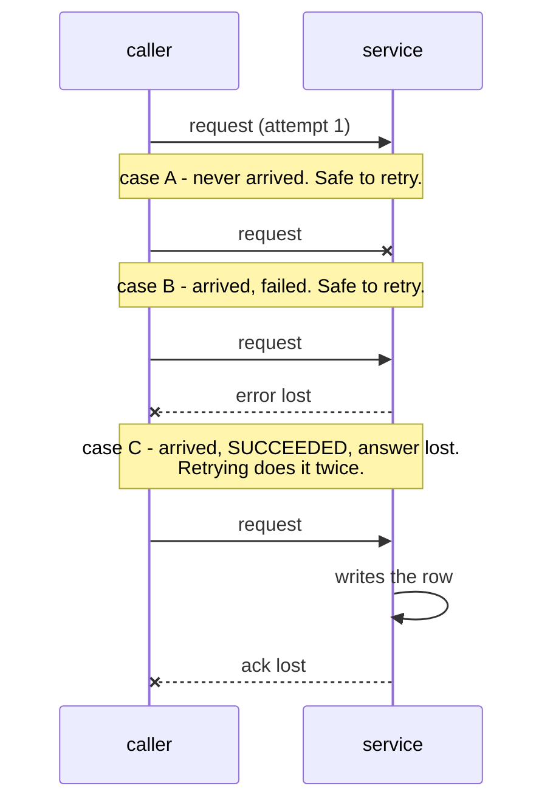

# 3.3 — The retry that made it worse: repeating something that already worked

## One-line answer

A timeout does not mean the call failed — it means you did not hear the answer — so retrying anything
that *changes* something can do it two or three times, and no amount of backoff, jitter or exception
filtering prevents that.

---

## The story

The desk takes a delivery.

The courier hands over a parcel, and the person on the desk writes the delivery in the book and then
picks up the phone to tell the third floor it has arrived. The phone rings out. Nobody answers.

They follow the card: try again. So they write the delivery in the book and ring again. Rings out.
Once more: write it in the book, ring again. Nothing. They give up and tell the courier the third floor
is not answering.

At the end of the day the book shows **three deliveries** and there is **one parcel** in the corner.

Nothing went wrong with the retrying. It did precisely what it was told, three times, and each attempt
was a faithful repeat of the first. The mistake was earlier and quieter: the two things the desk does —
*write it down* and *tell them* — got treated as one step, and only the second one was ever likely to
fail. Repeating the pair repeats the half that had already succeeded.

The next morning somebody in accounts asks why three parcels were delivered and one was signed for.

---

## The idea in plain language

There is a word for the property that makes retrying safe: **idempotent**. An operation is idempotent
when doing it twice leaves the world in the same state as doing it once.

- **Idempotent**: reading a page, looking up a record, setting a value to 5, deleting a specific
  record by its id.
- **Not idempotent**: appending to a list, adding one to a counter, inserting a row, sending an email,
  charging a card, posting a message.

Now the fact that makes this urgent. **A timeout is not a failure of the operation; it is a failure to
learn the outcome.** When a call times out, three things are equally possible: it never arrived, it
arrived and failed, or it arrived, succeeded, and the answer got lost coming back. A retry decorator
cannot tell these apart, because from where it stands they look identical.

So the honest summary of a retry is: *"I will make this call again, and I do not know whether the last
one worked."* That is a fine thing to say about a read and an alarming thing to say about a payment.

The fixes, in the order you should reach for them:

1. **Split the work.** Do the part that changes something once, outside the retry, and retry only the
   part that can safely be repeated. The desk should write the delivery down once and retry only the
   phone call.
2. **Carry an identifier.** Give the operation an id that the receiving end recognises — an
   *idempotency key* — so a repeat is recognised as a repeat and ignored. Payment providers require
   this precisely because networks lose answers.
3. **Make it a set, not a list.** Some operations become idempotent for free if the data model changes:
   `visits[visit_id] = entry` is idempotent where `visits.append(entry)` is not.

And the rule for the decorator itself: **`@retry` says something about the function it is on, so it
belongs on functions that are safe to repeat, and putting it on one that is not is a bug in the
placement, not in the decorator.**

---

## Why Setu needs it

- **Day 226 onwards writes to Postgres and Mongo**, and a retried insert without an id is duplicate
  rows. Duplicate rows in a paper database are worse than a failed insert, because a failure is
  visible and a duplicate is not.
- **Principle 12 puts a human in front of every external write.** This part is why: the class of
  operation that must not be repeated blindly is the same class that must not be performed
  autonomously.
- **Day 227's ingestion runs a scraper repeatedly**, so every write it performs has to be
  repeat-safe by construction. Deciding that on Day 14 is much cheaper than discovering it on Day 227.
- **Phase 17 onward, a timed-out LLM call may already have been charged against your quota**
  ([Day 3, 4.1](../../../day-03-keys-and-budget/parts/04-rate-budget/4.1-rpm-rpd-tpm.md)). Retrying it
  spends the allowance twice even when the first call succeeded on the server.

---

## The mechanism

```python
"""The same call, made safe to repeat."""

import functools

BOOK = []


def retry(attempts, *, catching):
    def decorator(job):
        @functools.wraps(job)
        def wrapper(*args, **kwargs):
            for attempt in range(1, attempts + 1):
                try:
                    return job(*args, **kwargs)
                except catching:
                    if attempt == attempts:
                        raise

        return wrapper

    return decorator


@retry(3, catching=TimeoutError)
def sign_in_unsafe(name):
    """Append, then fail to confirm. Repeating this repeats the append."""
    BOOK.append(name)
    raise TimeoutError("the desk phone rang out before it said 'done'")


@retry(3, catching=TimeoutError)
def sign_in_safe(name, visit_id):
    """The same call, carrying an id the desk can recognise."""
    if not any(entry["id"] == visit_id for entry in BOOK):
        BOOK.append({"id": visit_id, "name": name})
    raise TimeoutError("the desk phone rang out before it said 'done'")


try:
    sign_in_unsafe("delivery")
except TimeoutError:
    pass
print("unsafe, one visitor ->", len(BOOK), "entries:", BOOK)

BOOK.clear()
try:
    sign_in_safe("delivery", visit_id="v-001")
except TimeoutError:
    pass
print("safe,   one visitor ->", len(BOOK), "entries:", BOOK)
```

Run on Python 3.12.12 on 2026-09-01:

```
unsafe, one visitor -> 3 entries: ['delivery', 'delivery', 'delivery']
safe,   one visitor -> 1 entries: [{'id': 'v-001', 'name': 'delivery'}]
```

**Line by line:**

- `BOOK` is a module-level list standing in for a database table. Three entries in it after one visitor
  is the bug, stated as a number.
- `sign_in_unsafe` does **two things**: it appends, and then it raises. The append is the part that
  changes the world and the raise is the part that fails, and the retry cannot tell them apart because
  they are inside one function.
- `raise TimeoutError(...)` **after** the append — that ordering is the entire point. It is the real
  shape of the real bug: the write lands, and the acknowledgement is what gets lost. A function that
  failed *before* changing anything would be perfectly safe to retry.
- `except catching:` with no `as` — the exception is not used here, so binding it to a name would be
  noise, and `ruff`'s `F841` would flag the unused variable if it were assigned.
- `print(..., len(BOOK), ...)` — **three entries, one visitor.** No exception was hidden, nothing was
  swallowed, the caller was correctly told the call failed. The damage is entirely in the side effect.
- `def sign_in_safe(name, visit_id)` — one extra parameter, and it is the whole fix. The `visit_id` is
  the **idempotency key**: a value that identifies *this attempt at this operation*, not this call.
- `if not any(entry["id"] == visit_id for entry in BOOK)` — the check that makes the repeat harmless.
  `any` with a generator expression short-circuits at the first match
  ([Day 11, 3.4](../../../day-11-iterators-and-generators/parts/03-lambda-and-map/3.4-reduce-any-and-all.md)),
  so it stops looking as soon as it finds the earlier attempt. In a database this is a unique
  constraint on the key column, which is the same idea enforced by the storage rather than by your
  code.
- `sign_in_safe` **still raises**, and still raises three times. The caller is told the same thing.
  Idempotency does not make the operation succeed; it makes the repeats harmless, which is a different
  and more achievable promise.
- `one visitor -> 1 entries` — the desired outcome: the world changed once, however many times the call
  was made.

The three ways a timeout can happen, none of which the caller can distinguish:



---

## When it breaks

**The counter that counted the retries:**

```text
$ uv run python -c "
import functools
QUOTA = {'used': 0}
def retry(attempts, *, catching):
    def deco(job):
        @functools.wraps(job)
        def w(*a, **k):
            for i in range(1, attempts + 1):
                try:
                    return job(*a, **k)
                except catching:
                    if i == attempts:
                        raise
        return w
    return deco

@retry(3, catching=TimeoutError)
def ask_model(prompt):
    QUOTA['used'] += 1
    raise TimeoutError('no answer in time')

try:
    ask_model('hello')
except TimeoutError:
    pass
print('requests the caller made:', 1)
print('requests the quota saw  :', QUOTA['used'])
"
requests the caller made: 1
requests the quota saw  : 3
```

**What it means.** One logical call, three requests against a daily allowance
([Day 3, 4.1](../../../day-03-keys-and-budget/parts/04-rate-budget/4.1-rpm-rpd-tpm.md)). The
free-tier budget in every lesson counts *requests*, not intentions, so a retry policy is a budget
decision. A day that plans for fifty calls and uses `@retry(3)` has planned for a hundred and fifty.

**The retry that hid a slow success:**

```text
$ uv run python -c "
import functools, time
SERVER = []
def retry(attempts, *, catching, sleep=lambda s: None):
    def deco(job):
        @functools.wraps(job)
        def w(*a, **k):
            for i in range(1, attempts + 1):
                try:
                    return job(*a, **k)
                except catching:
                    if i == attempts:
                        raise
                    sleep(0.5)
        return w
    return deco

@retry(3, catching=TimeoutError)
def post_message(text):
    SERVER.append(text)
    raise TimeoutError('client gave up waiting; the server did not')

try:
    post_message('the parcel has arrived')
except TimeoutError as e:
    print('caller was told:', e)
print('messages the recipient sees:', len(SERVER))
for m in SERVER:
    print('  -', m)
"
caller was told: client gave up waiting; the server did not
messages the recipient sees: 3
```

**What it means.** The caller was told it failed, and the recipient got the message three times. This
is the shape of every "why did I get the same notification three times" support ticket, and it is
worth noticing that **the client-side logs show a clean failure**. Nothing in the caller's monitoring
would ever reveal this; the evidence is on the other side of the network.

**Retrying inside a transaction that has already been rolled back:**

```text
$ uv run python -c "
import functools
class TxAborted(RuntimeError): pass
STATE = {'aborted': False}
def retry(attempts, *, catching):
    def deco(job):
        @functools.wraps(job)
        def w(*a, **k):
            for i in range(1, attempts + 1):
                try:
                    return job(*a, **k)
                except catching:
                    if i == attempts:
                        raise
        return w
    return deco

@retry(3, catching=TxAborted)
def insert(row):
    if STATE['aborted']:
        raise TxAborted('current transaction is aborted, commands ignored until end of block')
    STATE['aborted'] = True
    raise TxAborted('duplicate key value violates unique constraint')

try:
    insert({'id': 1})
except TxAborted as e:
    print('final error:', e)
"
final error: current transaction is aborted, commands ignored until end of block
```

**What it means.** The first attempt failed for a real, permanent reason — a duplicate key — and every
attempt after it failed for a *different* reason, because the transaction was already dead. **The
caller sees the last error, so the message they get is about the retry machinery rather than about the
bug.** This is the shape of the real PostgreSQL message `current transaction is aborted, commands
ignored until end of transaction block`, and it is why a retry belongs *outside* a transaction — around
the whole unit of work, starting a fresh transaction each time — and never inside one.

---

## In production

**The professional habit is that idempotency is designed into the operation, not added to the client.**
A write endpoint accepts a client-generated key, stores it with the row, and returns the original result
when it sees the key again; the database enforces this with a unique constraint rather than an `if`
statement, because two concurrent retries can both pass an `if`. Payment APIs mandate this exact
pattern, and the reason is the one from this document's story: the network loses acknowledgements, and
the client cannot tell that from a genuine failure.

**What changes at scale is that "rare" becomes "hourly".** A timeout that loses its answer one call in a
hundred thousand is a curiosity at a thousand calls a day and a daily incident at ten million. Systems
at that scale assume every message is delivered *at least* once, and design consumers to tolerate it —
"at-least-once delivery with idempotent consumers" is the standard phrase, and it exists because
exactly-once is not achievable across a network you do not control.

**The failure that only appears with real data is the partial retry inside a multi-step function.** A
function that writes to Postgres, then to Mongo, then returns is not idempotent even if each write is,
because a retry after a Mongo failure repeats the Postgres write. The professional shapes are to make
the whole sequence resumable — record what has been done, check it on entry — or to make the sequence a
single transaction, or to split it into steps that are each retried on their own with their own keys.
This is exactly the structure Day 232's durable checkpoints are for.

**The review comment a senior engineer leaves.** *"`@retry(3)` on `save_paper` will insert three rows
when the connection times out after the write lands. Either move the retry to the read that follows it,
or pass the paper's id as an idempotency key and add a unique index on it. The current tests all use a
fake that never times out, so none of them can see this."*

**The interview question.** *"When is it not safe to retry?"* The answer that lands starts from the
network: a timeout does not mean the operation failed, only that the answer was lost, so any operation
that is not idempotent can be performed more than once by a retry. The follow-up that shows real
experience is the fix — an idempotency key checked by a unique constraint, splitting the changing part
out of the retried part, and keeping the retry outside the transaction rather than inside it, because
retrying inside an aborted transaction only changes the error message.

---

## Check yourself

```bash
uv run python -c "
import functools
BOOK = []

def retry(attempts, *, catching):
    def deco(job):
        @functools.wraps(job)
        def w(*a, **k):
            for i in range(1, attempts + 1):
                try:
                    return job(*a, **k)
                except catching:
                    if i == attempts:
                        raise
        return w
    return deco

@retry(3, catching=TimeoutError)
def sign_in(name):
    BOOK.append(name)
    raise TimeoutError('rang out')

try:
    sign_in('delivery')
except TimeoutError:
    pass
print('one visitor ->', len(BOOK), 'entries')
"
```

One visitor, three entries. Now rewrite `sign_in` so that a third argument `visit_id` makes the repeat
harmless, and check that the count is 1.

**Answer out loud, without scrolling up:**

> What are the three things that could have happened when a call times out, and why can the caller not
> tell them apart? Then say what an idempotency key is and where it should be enforced.

---

**Next:** section 4 opens with [4.1 — a decorator on a method](../04-the-toolkit/4.1-a-decorator-on-a-method.md),
where the first positional argument turns out to be `self`.
