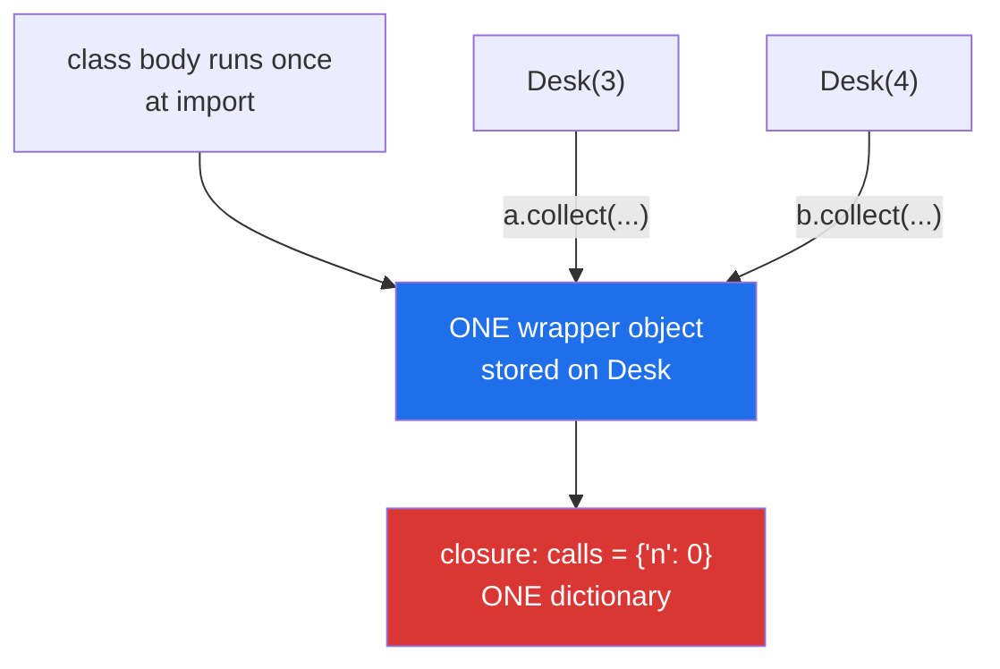

# 4.1 — A decorator on a method, and where `self` goes

## One-line answer

A method is just a function defined in a class body, so a decorator sees `self` as the ordinary first
positional argument and `*args, **kwargs` handles it with no special case — but the decorator itself is
created **once, for the class**, so anything it remembers is shared by every instance.

---

## The story

The building manager prints one card and pins it to the wall behind the desk.

The card says what the desk does: sign people in, sign them out, and try again twice if nobody
answers. It is not printed per visitor. It is not printed per floor. One card, on the wall, and every
single person who comes through the door is dealt with according to it.

That is exactly right for a rule. It would be strange to print a fresh card for each visitor.

But somebody adds a line to the bottom of the card: **"visits today: ____"**, and starts filling it in
with a pencil. Now the card is doing two jobs. The rule part is still fine being shared. The count is
not: it is one number on one card, covering every visitor to every floor, and the moment anyone asks
"how many people went to the third floor today" the card cannot answer, because it never separated
them.

The card is shared. Anything written on the card is shared too, and that is only obvious once somebody
writes something on it that should not have been.

---

## The idea in plain language

You met the mechanism on
[Day 12, 1.3](../../../day-12-classes/parts/01-the-blank-form/1.3-methods-find-their-object.md): a
method is a function stored on the class, and `desk.collect("folder")` is Python finding `collect` on
the class and calling it with `desk` as the first argument. `self` is not magic and it is not a
keyword; it is a parameter that happens to be filled in for you.

That makes decorating a method easy, and the reason is one you already have:
`def wrapper(*args, **kwargs)` accepts anything, and `self` is just the first thing in `args`
([2.1](../02-writing-a-decorator/2.1-args-and-kwargs-in-a-wrapper.md)). No extra parameter, no special
case, no different decorator. If you want the object inside the wrapper, it is `args[0]`.

The part that catches people is **when** the decoration happens.

A decorator line inside a class body runs while the class body is being executed — once, at import,
before any instance exists ([1.4](../01-functions-as-values/1.4-the-at-sign-is-two-lines.md)). So there
is exactly one wrapper object for the method, stored on the class, and every instance shares it. That
is right for behaviour, because the behaviour genuinely is the same for every instance. It is wrong for
state: a counter, a cache or a set of "already done" ids held in the decorator's closure is shared by
every object of that class, and by every subclass too.

Two smaller details that come up immediately:

**Order matters with `@staticmethod` and `@classmethod`.** These two are themselves decorators, and
they produce objects rather than plain functions. Since Python 3.10 those objects are directly
callable, which is documented in *What's New In Python 3.10*
(<https://docs.python.org/3/whatsnew/3.10.html>), so `@yours` above `@staticmethod` now works where it
used to raise. `@classmethod` is a different matter and still does not. The rule that never fails:
**put `@staticmethod` and `@classmethod` outermost — first line, closest to the top.**

**`__qualname__` is more useful than `__name__` here.** For a method, `__name__` is `collect` and
`__qualname__` is `Desk.collect`. In a log line covering three classes that each have a `load` method,
the qualified name is the one that identifies anything.

---

## Why Setu needs it

- **Day 13's loaders are methods**, and today's `@timed` and `@retry` go on `TextLoader.load` and
  `HTMLLoader.load`
  ([Day 13, 4.2](../../../day-13-inheritance-and-abstraction/parts/04-abstraction/4.2-the-loader-family.md)).
  If a decorator needed a different version for methods, half of what you write today would be
  unusable.
- **Day 15 is `@classmethod`, `@staticmethod` and `@property` in depth**, and the ordering rule here is
  what makes that day's error messages readable rather than baffling.
- **Phase 26's FastAPI and Phase 22's LangGraph put decorators on methods routinely**, and the
  shared-state trap below is a real source of cross-request bugs in exactly those frameworks.
- **Principle 11's blast radius applies to a shared cache**: a decorator holding data on the class is a
  place where one object's data can be handed to another, which is a security question before it is a
  correctness one.

---

## The mechanism

```python
"""A decorator on a method: self is just the first positional argument."""

import functools


def signed_in(job):
    @functools.wraps(job)
    def wrapper(*args, **kwargs):
        print(f"  book: {job.__qualname__} args={args[1:]} on {type(args[0]).__name__}")
        return job(*args, **kwargs)

    return wrapper


class Desk:
    def __init__(self, floor):
        self.floor = floor

    @signed_in
    def collect(self, what):
        return f"one {what} from floor {self.floor}"

    @staticmethod
    @signed_in
    def rules():
        return "sign in, sign out"


desk = Desk(3)
print(desk.collect("folder"))
print("bound method name:", desk.collect.__name__)
print("qualified name   :", desk.collect.__qualname__)
```

Run on Python 3.12.12 on 2026-09-01:

```
  book: Desk.collect args=('folder',) on Desk
one folder from floor 3
bound method name: collect
qualified name   : Desk.collect
```

**Line by line:**

- `def wrapper(*args, **kwargs):` — unchanged from
  [2.1](../02-writing-a-decorator/2.1-args-and-kwargs-in-a-wrapper.md). **There is no method-specific
  decorator**, and writing one would be a mistake.
- `args[0]` is the instance — `desk` itself. `type(args[0]).__name__` prints `Desk`, which is how the
  log line knows what kind of object it was called on.
- `args[1:]` is everything the caller actually wrote. **Slicing off the first item is what stops the log
  line printing the whole object**, which for a `Paper` or a dataframe would be an enormous log entry
  and possibly somebody's personal data.
- `job.__qualname__` prints `Desk.collect` where `__name__` would print `collect`. On a codebase with
  three `load` methods, this is the difference between a useful log and a confusing one.
- `@signed_in` above `def collect(self, what)` — inside the class body, and it runs **while the class is
  being defined**, before `Desk(3)` exists.
- `@staticmethod` above `@signed_in` above `def rules()` — `staticmethod` outermost. Read it bottom-up
  ([2.5](../02-writing-a-decorator/2.5-stacking-and-the-order.md)): `signed_in` wraps the plain
  function, and `staticmethod` then marks the result as not needing an instance.
- `desk.collect.__name__` is `collect` — `functools.wraps` did its job through the method machinery
  exactly as it does for a plain function.
- `desk.collect` is a **bound method**: Python has already attached `desk` to it, which is why calling
  it with one argument results in the wrapper seeing two.

Now the trap, which is not about `self` at all:

```python
"""One decorator object, shared by every instance of the class."""

import functools


def counted(job):
    calls = {"n": 0}

    @functools.wraps(job)
    def wrapper(*args, **kwargs):
        calls["n"] += 1
        print(f"  {job.__name__} call #{calls['n']}")
        return job(*args, **kwargs)

    return wrapper


class Desk:
    def __init__(self, floor):
        self.floor = floor

    @counted
    def collect(self, what):
        return f"{what} from {self.floor}"


a, b = Desk(3), Desk(4)
a.collect("folder")
b.collect("folder")
a.collect("box")
```

Run on Python 3.12.12 on 2026-09-01:

```
  collect call #1
  collect call #2
  collect call #3
```

**Line by line:**

- `calls = {"n": 0}` lives in `counted`'s scope, so it is captured by the closure
  ([1.2](../01-functions-as-values/1.2-a-function-that-returns-a-function.md)) — **one dictionary, made
  once, when the class body ran.**
- `a` and `b` are two separate `Desk` objects with different floors. They share nothing of their own.
- **The count reads 1, 2, 3 and not 1, 1, 2.** `a`'s two calls and `b`'s one call all incremented the
  same number, because there is one wrapper on the class and one closure behind it.
- Whether that is a bug depends entirely on what you meant. "How many times was `collect` called
  anywhere?" — correct. "How many times did *this desk* collect something?" — silently wrong, and no
  error will ever tell you.
- The fix for a per-instance count is to store it **on the instance**: `setattr(args[0], "_calls", ...)`
  inside the wrapper, which is ugly, or — much better — not to use a decorator for per-object state at
  all, which is [4.3](4.3-when-a-decorator-is-wrong.md)'s argument.

Where the wrapper lives:



---

## When it breaks

**A wrapper that forgot `self` exists:**

```text
$ uv run python -c "
import functools
def signed_in(job):
    @functools.wraps(job)
    def w(what):
        return job(what)
    return w

class Desk:
    def __init__(self, floor): self.floor = floor
    @signed_in
    def collect(self, what): return f'{what} from {self.floor}'

print(Desk(3).collect('folder'))
"
Traceback (most recent call last):
  File "<string>", line 14, in <module>
TypeError: Desk.collect() takes 1 positional argument but 2 were given
```

**What it means.** The wrapper declared one parameter, and the call supplied two — `self` and
`'folder'`. Note the name in the message: because `functools.wraps` copied `__qualname__`, the error
says `Desk.collect`, **which is the one function whose signature is not the problem.** That is
`wraps` doing exactly what it was asked and making one message worse in exchange for making every log
line better. `*args, **kwargs` is the fix and there is no other.

**`@classmethod` in the wrong position:**

```text
$ uv run python -c "
import functools
def signed_in(job):
    @functools.wraps(job)
    def w(*a, **k): return job(*a, **k)
    return w

class Desk:
    @signed_in
    @classmethod
    def build(cls, floor):
        return cls.__name__ + str(floor)

print(Desk.build(3))
"
Traceback (most recent call last):
  File "<string>", line 14, in <module>
  File "<string>", line 5, in w
TypeError: 'classmethod' object is not callable
```

**What it means.** `@classmethod` ran first and produced a `classmethod` object, which `signed_in` then
tried to call like a function. Read the second traceback frame — `in w` — as *"my wrapper tried to call
what it was given, and what it was given was not callable"*. Moving `@classmethod` to the top line fixes
it, and that is the general rule: **`classmethod` and `staticmethod` go outermost.** Day 15 is where
those two get explained properly.

**A cache in the decorator, shared across instances:**

```text
$ uv run python -c "
import functools
def cached(job):
    store = {}
    @functools.wraps(job)
    def w(self, key):
        if key not in store:
            store[key] = job(self, key)
        return store[key]
    return w

class Desk:
    def __init__(self, floor): self.floor = floor
    @cached
    def collect(self, what): return f'{what} from floor {self.floor}'

a, b = Desk(3), Desk(4)
print('a asks first:', a.collect('folder'))
print('b asks after:', b.collect('folder'))
"
a asks first: folder from floor 3
b asks after: folder from floor 3
```

**What it means.** `b` is on floor 4 and was told floor 3. The cache key was `'folder'`, `self` was
never part of it, and the store is one dictionary shared by the whole class — so the second object was
handed the first object's answer. **No exception, no warning, and a wrong value that looks entirely
plausible.** Notice also that the bug depends on call order: had `b` asked first, `a` would have got
floor 4, so a test that happens to use one object passes forever. If those two objects were two users'
sessions this is a data leak, which is why
[Principle 11](../../../../docs/00_MASTER_PLAN_DS_GENAI.md) treats shared state as a blast-radius
question. The key has to include the instance, or the cache has to live on the instance — and
[4.2](4.2-functools-cache-and-its-trap.md) shows that `functools.cache` has exactly this shape with an
extra problem attached.

---

## In production

**The professional habit is that a decorator on a method holds no per-object state, ever.** Behaviour on
the class, data on the instance. A decorator that needs to remember something per object either takes
the object's identity into its key — and then keeps that store alive forever, which is
[4.2](4.2-functools-cache-and-its-trap.md)'s problem — or is the wrong tool, and the thing wanted is an
attribute set in `__init__`.

**What changes at scale is that shared state in a decorator becomes a concurrency bug.** `calls["n"] +=
1` is a read, an add and a write, and two threads can interleave them so that two calls increment the
count by one. Under a web server handling parallel requests, a decorator with a mutable closure is
shared by every request in the process, so a cache keyed carelessly can serve one user's data to
another. The rule that avoids all of it: the closure holds configuration, which is written once and
only read; anything written on every call belongs somewhere with an owner.

**The failure that only appears with real data is the log line that printed the object.** A wrapper
logging `args` on a plain function is fine; the same wrapper on a method logs `self` too, which for a
`Paper` with a full abstract, or a model wrapper holding weights, means the log line is enormous. And if
that object holds an API key or an email address, the decorator has just written it to a log that leaves
the machine. `args[1:]` in the mechanism above is not a formatting nicety.

**The review comment a senior engineer leaves.** *"`@cached` on this method has a module-level store
keyed only on the argument, so two instances share entries. Under the thread pool that is a
cross-request data leak, not just a stale value. Move it to a `functools.cached_property` on the
instance, or include the instance in the key and bound the size."*

**The interview question.** *"How is decorating a method different from decorating a function?"* The
answer people expect is "it is not — `self` is just `args[0]`", and that is correct and incomplete. The
half that shows experience is the other one: the decorator runs once when the class body executes, so
there is one wrapper and one closure for the whole class, and any state it holds is shared by every
instance and every subclass. Adding that `staticmethod` and `classmethod` must go outermost, and why,
finishes it.

---

## Check yourself

```bash
uv run python -c "
import functools

def counted(job):
    calls = {'n': 0}
    @functools.wraps(job)
    def wrapper(*args, **kwargs):
        calls['n'] += 1
        print(f'  {job.__qualname__} call #{calls[\"n\"]} on {type(args[0]).__name__}')
        return job(*args, **kwargs)
    return wrapper

class Desk:
    def __init__(self, floor): self.floor = floor
    @counted
    def collect(self, what): return f'{what} from {self.floor}'

a, b = Desk(3), Desk(4)
a.collect('folder'); b.collect('folder'); a.collect('box')
print('the wrapper is one object:', Desk.collect is Desk.collect)
"
```

Three calls, two objects, one counter. Now add a third `Desk` and predict the numbers before you run it.

**Answer out loud, without scrolling up:**

> Where does `self` appear inside a wrapper written with `*args, **kwargs`? Then say how many wrapper
> objects exist for a decorated method on a class with a thousand instances, and what that means for
> anything the decorator remembers.

---

**Next:** [4.2 — `functools.cache` and its trap](4.2-functools-cache-and-its-trap.md), a decorator you
did not write, with the shared-state problem built in.
