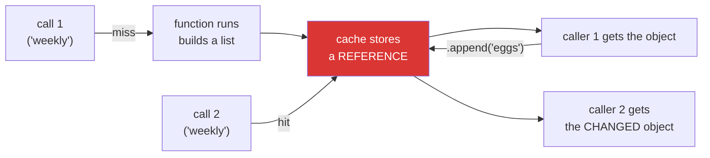

# 4.2 — `functools.cache`: the decorator you did not write, and what it keeps

## One-line answer

`@functools.cache` remembers the answer for each set of arguments and never calls the function again
for them — which makes a repeated call free, requires every argument to be hashable, hands every caller
the *same* object rather than a copy, and keeps everything it has ever seen for the life of the process.

---

## The story

The person on the desk gets asked the same question a lot.

*"Which floor is the payroll office?"* — six or seven times a day, always the same answer, and every
time it means walking to the back room and checking the list on the wall. After a week of this they
write the answer on a sticky note and put it under the counter. Next time somebody asks, they read the
note.

This is straightforwardly a good idea, and two things go wrong with it over the following year.

The first is that payroll moves to the fourth floor. Nobody tells the desk, because nobody thinks of
the desk as somewhere information is stored. The list on the wall in the back room is updated, and the
sticky note is not, and for three weeks visitors are sent to the wrong floor with complete confidence.

The second is quieter. There are now four hundred sticky notes under the counter, because every
question anybody has ever asked got one. Nobody threw any away. There was never a moment where
throwing them away was the obvious thing to do, and there is now no room under the counter for
anything else.

---

## The idea in plain language

Caching means: keep the answer, and when the same question comes again, give back the kept answer
instead of working it out.

`functools.cache` does this as a decorator. Put it on a function and it keeps a dictionary from
arguments to results. `functools.lru_cache(maxsize=N)` is the same thing with a limit: when the
dictionary is full, the **least recently used** entry is thrown out to make room. `cache` is documented
as being equivalent to `lru_cache(maxsize=None)`, at
<https://docs.python.org/3/library/functools.html#functools.cache>.

Four properties matter, and each one is a real failure below.

**The arguments become a dictionary key, so they must be hashable.** A tuple works, a list does not
([Day 4, 2.5](../../../day-04-objects/parts/02-containers/2.5-hashability.md)). This is the first thing
people hit.

**The cached value is the *same object*, not a copy.** If the function returns a list and a caller
appends to it, the next caller gets the changed list. There is no copying anywhere in a cache, and
there is no warning either.

**Nothing is ever invalidated.** `cache` has no expiry, no maximum age and — unless you use `lru_cache`
with a size — no maximum size. Once a value is in, it is in until `cache_clear()` is called or the
process ends. If the underlying answer can change, the cache will be wrong and stay wrong.

**Everything referenced by a key or a value is kept alive.** A cache holds references, and a held
reference cannot be collected. On a method, the key includes `self`, so the cache keeps every instance
it has ever seen alive forever — which is a memory leak that no profiler labels as one, because from
the interpreter's point of view the objects are perfectly reachable.

The short rule that follows: **cache pure functions of small, hashable arguments that return immutable
results, and put a size limit on it.**

---

## Why Setu needs it

- **You are about to be tempted.** Every day from Phase 3 onward has a function that is called with the
  same argument repeatedly, and `@cache` is one line. Knowing the four failures now is what makes that
  line safe.
- **Phase 18's embeddings are the obvious candidate**: embedding the same text twice is wasted local
  compute, and the input is a string, which is hashable. It is a genuinely good use, and it still needs
  a size limit.
- **Phase 19's retrieval is the obvious trap**: caching a retriever's results means the index can be
  updated and the answers will not change, which looks exactly like a broken index.
- **Principle 5 makes a cache tempting for API calls**, and Day 3's budget is why: a cached call spends
  nothing. It is also why a stale cached answer is easy to miss — nothing in the request count says
  anything went wrong.

---

## The mechanism

```python
"""functools.cache - the decorator you did not write, and what it keeps."""

import functools

CALLS = {"n": 0}


@functools.cache
def collect(what):
    CALLS["n"] += 1
    return f"one {what}"


print(collect("folder"), collect("folder"), collect("box"))
print("calls that actually ran:", CALLS["n"])
print("cache stats:", collect.cache_info())
collect.cache_clear()
print("after clear:", collect.cache_info())
```

Run on Python 3.12.12 on 2026-09-01:

```
one folder one folder one box
calls that actually ran: 2
cache stats: CacheInfo(hits=1, misses=2, maxsize=None, currsize=2)
after clear: CacheInfo(hits=0, misses=0, maxsize=None, currsize=0)
```

**Line by line:**

- `@functools.cache` — no brackets. It is a plain decorator, not a factory
  ([3.1](../03-decorators-with-arguments/3.1-retry-three-a-decorator-that-takes-an-argument.md)), which
  is why it differs from `@functools.lru_cache(maxsize=128)`, which is one.
- `CALLS["n"] += 1` inside the function — a side effect, put there so the demonstration can prove the
  body did not run. **A function with a side effect is exactly the wrong thing to cache**, and it is
  here only as a counter.
- Three calls, `calls that actually ran: 2` — the second `collect("folder")` never entered the function.
- `collect.cache_info()` — `cache` attaches this to the wrapper, and it is the single most useful thing
  about the standard-library version. `hits=1, misses=2` says the cache did something; `hits=0` after a
  thousand calls says the keys are not repeating and the cache is pure overhead.
- `maxsize=None` — **unbounded.** Every distinct argument this function is ever called with is kept
  forever. For six known inputs that is fine; for user-supplied text it is a slow leak.
- `currsize=2` — two entries for two distinct arguments.
- `collect.cache_clear()` and the zeroed stats — the only way to invalidate. Note what is missing: there
  is no way to remove *one* entry, and no way to expire by age. A cache that needs either of those
  needs a different tool.

Now the trap that has no error message:

```python
"""The cached value is the same object, handed to everybody."""

import functools


@functools.cache
def shopping_list(name):
    """Pretend this read a file. It returns a fresh list... once."""
    return ["milk", "bread"]


first = shopping_list("weekly")
first.append("eggs")

print("second caller gets:", shopping_list("weekly"))
print("same object?      :", shopping_list("weekly") is first)
```

Run on Python 3.12.12 on 2026-09-01:

```
second caller gets: ['milk', 'bread', 'eggs']
same object?      : True
```

**Line by line:**

- The function returns a **new list every time it runs** — the literal `["milk", "bread"]` builds a
  fresh object. That is what makes the result surprising: the function is written correctly.
- It only ran once. Every later call returns the object built by that one run.
- `first.append("eggs")` changes that object, and the cache is holding it, so the cache's stored value
  changed too. **Nothing was written back to the cache; there was never a copy to write back.**
- `shopping_list("weekly") is first` is `True` — the identity test from
  [Day 4, 3.2](../../../day-04-objects/parts/03-identity-trap/3.2-is-versus-equals.md), giving the
  diagnosis in one line.
- This is aliasing
  ([Day 4, 2.3](../../../day-04-objects/parts/02-containers/2.3-aliasing-two-names-one-object.md)) with
  a cache holding one of the names. The rule that avoids it: **cache functions that return immutable
  values** — a string, a number, a tuple, a frozen dataclass — or return a copy at the call site.



---

## When it breaks

**An unhashable argument:**

```text
$ uv run python -c "
import functools
@functools.cache
def collect(items):
    return len(items)
print(collect(('a','b')))
print(collect(['a','b']))
"
2
Traceback (most recent call last):
  File "<string>", line 7, in <module>
TypeError: unhashable type: 'list'
```

**What it means.** The tuple worked and the list did not. The cache builds a dictionary key from the
arguments, and a list cannot be a dictionary key
([Day 4, 2.5](../../../day-04-objects/parts/02-containers/2.5-hashability.md)). Note that **the function
itself would have been perfectly happy with a list** — `len` works on both — so the decorator has
narrowed what the function accepts. The fix is to convert at the boundary (`tuple(items)`) or to not
cache this function.

**A cache on a method, keeping every instance alive:**

```text
$ uv run python -c "
import functools, gc, weakref

class Desk:
    def __init__(self, floor): self.floor = floor
    @functools.cache
    def collect(self, what): return f'{what} from {self.floor}'

d = Desk(3)
ref = weakref.ref(d)
d.collect('folder')
del d
gc.collect()
print('instance still alive after del:', ref() is not None)
print('cache holds:', Desk.collect.cache_info())
"
instance still alive after del: True
cache holds: CacheInfo(hits=0, misses=1, maxsize=None, currsize=1)
```

**What it means.** `del d` removed the only name pointing at the object, and a full garbage collection
ran, and the object is **still alive** — because the cache's key contains `self`. Every `Desk` ever
passed through that method is retained for the life of the process. In a web application creating one
object per request, that is a leak that grows with traffic and looks like nothing in particular in a
memory profile, because every byte of it is genuinely reachable. `functools.cached_property` — Day 15 —
stores the value **on the instance** and does not have this problem.

**The stale answer nobody can see:**

```text
$ uv run python -c "
import functools
FLOORS = {'payroll': 3}

@functools.cache
def which_floor(office):
    return FLOORS[office]

print('before the move:', which_floor('payroll'))
FLOORS['payroll'] = 4
print('the list now says:', FLOORS['payroll'])
print('the desk still says:', which_floor('payroll'))
print('cache:', which_floor.cache_info())
"
before the move: 3
the list now says: 4
the desk still says: 3
cache: CacheInfo(hits=1, misses=1, maxsize=None, currsize=1)
```

**What it means.** The source of truth changed and the cached answer did not. There is no error, no
warning and no expiry — `cache_info` reports a healthy-looking hit, because from the cache's point of
view everything is working perfectly. **A cache is only correct for a function whose answer does not
change**, and "does not change" has to be true for the whole life of the process, not just for the
minute you were thinking about it.

---

## In production

**The professional default is `lru_cache(maxsize=...)` with a number, not `cache`.** An unbounded cache
on a function whose arguments come from outside the program is a memory leak with a friendly name, and
the person who added it is never the person who finds it. Choosing a size forces the question *how many
distinct inputs does this really have?*, which is the question that decides whether caching is
appropriate at all.

**What changes at scale is that a process-local cache stops being a cache.** Twenty worker processes
have twenty separate caches, so the hit rate is a twentieth of what a single-process test suggested, and
twenty copies of the data sit in memory. Worse, a stale entry now exists in some workers and not others,
so the same request returns different answers depending on which worker takes it — a bug that cannot be
reproduced locally. Beyond one process, a cache means Redis or Memcached, with an explicit expiry and an
explicit key format, and that is a different design rather than a decorator.

**The failure that only appears with real data is caching a function that reads the world.** Configuration
from a file, a feature flag, a token that expires, the current date — all of these look pure for the
length of a test and are not. The token case is a favourite: `@cache` on `get_access_token()` works
beautifully for an hour and then every call in the system fails with `401` at once, because the cached
token expired and nothing will ever ask for a new one.

**The review comment a senior engineer leaves.** *"`@cache` on `load_config` is unbounded and never
invalidated, so a config change needs a restart — say that in the docstring if it is intended. And it
returns a dict, so any caller that mutates the result corrupts it for everybody. Return a frozen
dataclass, or `lru_cache(maxsize=1)` and a copy."*

**The interview question.** *"What are the risks of `functools.lru_cache`?"* A complete answer walks the
four: arguments must be hashable, so the decorator narrows what the function accepts; the value is
shared, not copied, so a mutable return is a shared mutable; nothing expires, so any function whose
answer can change goes stale silently; and everything in a key or a value is kept alive, which on a
method means retaining every instance. Adding that it is per-process, so the hit rate and the staleness
both differ under multiple workers, is the answer of somebody who has run it in production.

---

## Check yourself

```bash
uv run python -c "
import functools

CALLS = {'n': 0}

@functools.lru_cache(maxsize=2)
def collect(what):
    CALLS['n'] += 1
    return f'one {what}'

for item in ['folder', 'box', 'folder', 'crate', 'folder']:
    collect(item)

print('calls that ran:', CALLS['n'])
print(collect.cache_info())
"
```

Five calls, three distinct arguments, a cache that only holds two. Work out how many times the body ran
before you look, then say which entry was evicted and why.

**Answer out loud, without scrolling up:**

> Name the four things `functools.cache` does that can surprise you. Then say what happens to an object
> that was passed as `self` to a cached method, and what to use instead.

---

**Next:** [4.3 — when a decorator is the wrong tool](4.3-when-a-decorator-is-wrong.md), the last
document of the day, and the one that stops today's new hammer finding nails everywhere.
