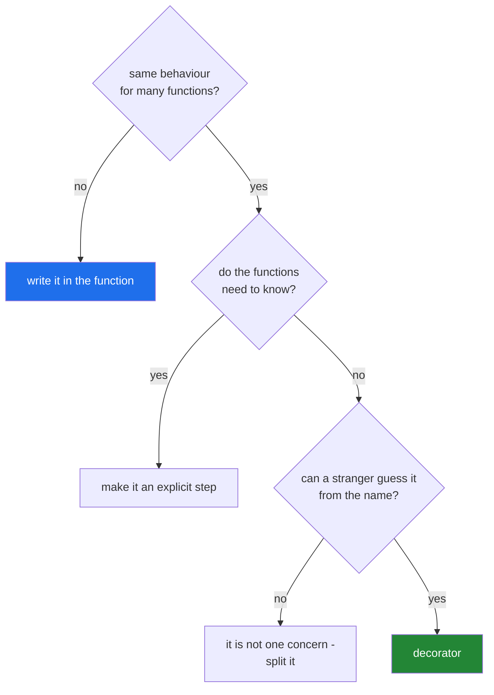

# 4.3 — When a decorator is the wrong tool

## One-line answer

A decorator is right when the same behaviour has to wrap many functions and the functions do not need
to know about it — and wrong when it applies to one function, when it needs to change what the function
does, or when the reader would have to open the decorator to understand the call.

---

## The story

The building has too many desks now.

There is the lobby desk that signs you in. There is the desk at the foot of the stairs that sends you
back up if nobody answers. Somebody has added a third that checks whether you are allowed on the floor
you asked for, and a fourth that keeps a note of who asked for what so that a repeat visitor does not
have to be signed in again.

A new person starts on the fourth floor, and asks a simple question: *"if I come in the front door and
go up to my desk, what actually happens?"*

Nobody can answer without walking them past all four desks. Every desk on its own is a good idea, and
every one of them was added by somebody solving a real problem. Together they are a corridor, and the
building's front door — the thing everybody uses every day — is now something you need a guided tour
to understand.

And here is the one nobody defends when it is pointed out: the fourth desk, the one that remembers
repeat visitors, exists for exactly one office. Every other office gets nothing from it. It was built
as a general arrangement for the whole building because building it that way felt tidier than putting a
note in one office's own procedure.

---

## The idea in plain language

A decorator earns its place when three things are true at once:

1. **The behaviour is the same for many functions** — timing, retrying, logging, checking a permission.
2. **The functions should not know about it.** They would be correct without it; it adds an operational
   concern, not a step of the work.
3. **A reader can guess what it does from its name.** `@timed`, `@retry(3)` and `@requires_admin` pass.
   `@handle`, `@process` and `@wrap` do not.

When any of those is false, something else is better, and there is usually an obvious candidate:

| The situation | Better than a decorator |
|---|---|
| It applies to exactly one function | Write it in that function |
| It needs to change the arguments or the return value | Make it an explicit step the caller can see |
| It needs per-object state | An attribute set in `__init__` ([4.1](4.1-a-decorator-on-a-method.md)) |
| Callers need to turn it on and off | A parameter |
| It needs the caller's context to decide | A context manager (Day 16) or an explicit argument |
| It is fixing every call site the same way | Fix the function |

The costs are worth naming, because they are paid on every call and every read.

**A decorator hides a call in a place with no brackets.** Somebody debugging `collect("folder")` sees
one function call and there are three. Every wrapper adds a frame to the traceback, and a stack of four
puts twelve lines of machinery between the error and the code that caused it.

**A decorator cannot be turned off at the call site.** It is applied at import
([1.4](../01-functions-as-values/1.4-the-at-sign-is-two-lines.md)), so a caller who wants this one call
untimed, or uncached, or unretried, has no way to say so — unless the decorator was written to look for
a flag, which puts the decision back in the wrapper where the caller cannot see it.

**A decorator makes the function harder to test.** A test that wants the undecorated behaviour has to
reach through `__wrapped__` ([2.2](../02-writing-a-decorator/2.2-functools-wraps.md)) or accept the
wrapper's behaviour as part of what it is testing. A retry decorator with real sleeping makes every
test of that function slow ([3.2](../03-decorators-with-arguments/3.2-backoff-jitter-and-which-errors.md)).

The one-sentence test to apply before writing one: **if you cannot name the decorator in one or two
words that a stranger would understand, it is not a cross-cutting concern, and it should be a line of
code inside the function.**

---

## Why Setu needs it

- **Today handed you a new tool, and the usual next mistake is applying it everywhere.** This document
  exists so that Day 15 does not arrive with six home-made decorators in `src/setu/`.
- **`src/setu/decorators.py` should hold exactly two things at the end of today** — `timed` and
  `retry` — and both pass all three tests above. Anything else you were tempted to add is the subject
  here.
- **Day 16's context managers cover the case a decorator cannot**: behaviour around a *block* rather
  than a *function*, where the caller decides the boundary.
- **[Principle 3](../../../../docs/00_MASTER_PLAN_DS_GENAI.md) — one concept, one day, one demo — is the
  same instinct applied to a day.** A decorator that does two things is over-scoped in exactly the way a
  day can be.

---

## The mechanism

The clearest way to feel the cost is to look at a traceback:

```python
"""What a stack of decorators does to an error report."""

import functools


def timed(job):
    @functools.wraps(job)
    def wrapper(*args, **kwargs):
        return job(*args, **kwargs)

    return wrapper


def retried(job):
    @functools.wraps(job)
    def wrapper(*args, **kwargs):
        return job(*args, **kwargs)

    return wrapper


def logged(job):
    @functools.wraps(job)
    def wrapper(*args, **kwargs):
        return job(*args, **kwargs)

    return wrapper


@timed
@retried
@logged
def collect(what):
    return 1 / 0


collect("folder")
```

Run on Python 3.12.12 on 2026-09-01, saved as `stack.py` so the line numbers are real (the full path is
shortened here to fit the page):

```
Traceback (most recent call last):
  File "stack.py", line 37, in <module>
    collect("folder")
  File "stack.py", line 9, in wrapper
    return job(*args, **kwargs)
           ^^^^^^^^^^^^^^^^^^^^
  File "stack.py", line 17, in wrapper
    return job(*args, **kwargs)
           ^^^^^^^^^^^^^^^^^^^^
  File "stack.py", line 25, in wrapper
    return job(*args, **kwargs)
           ^^^^^^^^^^^^^^^^^^^^
  File "stack.py", line 34, in collect
    return 1 / 0
           ~~^~~
ZeroDivisionError: division by zero
```

**Line by line:**

- Three decorators that do **nothing at all** — each one just forwards. They are deliberately empty so
  that the only thing the traceback shows is the cost of the stack itself.
- The traceback is **five frames** for a two-frame program. Three of them say `in wrapper` and
  `return job(*args, **kwargs)`, which is the same line three times, from three different functions that
  happen to share a name.
- **The first and last frames are the only ones a reader cares about**: line 37 called it, line 34 divided
  by zero. Everything between is machinery, and in a real system the machinery is where the reader's eye
  goes first because it is in the middle.
- `functools.wraps` does not help here. It fixes `__name__`, not the frames, because the frames come from
  the code object of each `wrapper`, which is genuinely a separate function.
- Multiply by a realistic stack — a web framework's route handler often has five or six — and a
  `KeyError` in a view produces a screenful of forwarding before it says anything about your code.
- **This is the price, and it is worth paying for behaviour that genuinely belongs to many functions.**
  It is not worth paying to avoid writing one line inside one function.

The same job, done two ways:

```python
"""A one-off concern: as a decorator, and as a line of code."""

import functools


def only_for_this_one_function(job):
    """A decorator applied exactly once, in the whole codebase."""

    @functools.wraps(job)
    def wrapper(name):
        cleaned = name.strip().lower()
        return job(cleaned)

    return wrapper


@only_for_this_one_function
def sign_in_decorated(name):
    return f"signed in: {name}"


def sign_in_plain(name):
    """The same behaviour, visible where it happens."""
    cleaned = name.strip().lower()
    return f"signed in: {cleaned}"


print(sign_in_decorated("  Delivery  "))
print(sign_in_plain("  Delivery  "))
```

Run on Python 3.12.12 on 2026-09-01:

```
signed in: delivery
signed in: delivery
```

**Line by line:**

- Both print the same thing, so this is a choice about readability rather than behaviour.
- `def wrapper(name):` in the decorator — note that it **cannot** use `*args, **kwargs`, because it needs
  to reach into the arguments and change one. A decorator that modifies arguments must know their shape,
  which ties it to one function's signature and destroys the reason to be a decorator at all
  ([2.1](../02-writing-a-decorator/2.1-args-and-kwargs-in-a-wrapper.md)).
- `sign_in_plain` is **three lines shorter in total**, has one frame in a traceback, and the reader of
  `sign_in_plain` can see everything it does without opening another function.
- The decorated version also silently changes the contract: `sign_in_decorated` no longer receives what
  its caller passed. A reader looking at `def sign_in_decorated(name)` cannot tell that `name` has been
  altered before it arrives.
- **The test that decides it is the count.** If the answer to "how many functions need this?" is one, the
  decorator is a way of putting a line of code somewhere the reader will not look for it.



---

## When it breaks

**A decorator that changes the arguments:**

```text
$ uv run python -c "
import functools
def normalise(job):
    @functools.wraps(job)
    def w(name, *a, **k):
        return job(name.strip().lower(), *a, **k)
    return w

@normalise
def sign_in(visitor, floor=3):
    return f'{visitor} to floor {floor}'

print(sign_in('  Delivery  '))
print(sign_in(visitor='  Delivery  '))
"
delivery to floor 3
Traceback (most recent call last):
  File "<string>", line 14, in <module>
TypeError: sign_in() missing 1 required positional argument: 'name'
```

**What it means.** The decorator worked for a positional call and broke for a keyword call of the same
function. The wrapper called its own first parameter `name`; the function calls it `visitor`; so
`visitor='  Delivery  '` went into `**k` and the wrapper's required `name` was never supplied. Read the
message: **it blames `sign_in` for a missing argument called `name`, and `sign_in` has no parameter of
that name at all** — `functools.wraps` copied the qualified name onto a wrapper whose signature is
different. A decorator that reaches into arguments has to reimplement Python's argument binding, and it
will get it wrong. The right tool for "this argument is always cleaned first" is a line at the top of
the function.

**A decorator nobody can turn off:**

```text
$ uv run python -c "
import functools, time
def cached(job):
    store = {}
    @functools.wraps(job)
    def w(*a, **k):
        if a not in store:
            store[a] = job(*a, **k)
        return store[a]
    return w

@cached
def price(item):
    return {'folder': 2}[item] + time.localtime().tm_sec * 0

print('first :', price('folder'))
print('again :', price('folder'))
print('can a caller ask for a fresh one?', hasattr(price, 'no_cache'))
"
first : 2
again : 2
can a caller ask for a fresh one? False
```

**What it means.** There is no interface for "give me the real value this time". A caller who needs a
fresh result has to know the decorator exists, know it stored the values in a closure, and reach for
`price.__wrapped__` — which only works because of `functools.wraps` and reads like a hack, because it
is one. When callers legitimately need both behaviours, the answer is a parameter — `price(item,
use_cache=False)` — not a decorator.

**Two concerns in one decorator:**

```text
$ uv run python -c "
import functools
def timed_and_retried_and_logged(job):
    @functools.wraps(job)
    def w(*a, **k):
        for i in range(3):
            try:
                return job(*a, **k)
            except Exception:
                pass
    return w

@timed_and_retried_and_logged
def collect(what):
    raise RuntimeError('closed')

print('caller got:', repr(collect('folder')))
"
caller got: None
```

**What it means.** The name is the diagnosis. Three words joined by `and` is three decorators, and the
implementation shows why merging them is bad: catching `Exception` broadly
([3.2](../03-decorators-with-arguments/3.2-backoff-jitter-and-which-errors.md)) and losing the value
([2.3](../02-writing-a-decorator/2.3-returning-the-value.md)) both slipped in, because a function doing
three jobs has three places to be careless and no clear rule for any of them. **The one-idea test from
the plan's Part 11 applies to code as well as to documents.**

---

## In production

**The professional heuristic is the count and the name.** A decorator applied to fifteen functions and
called `@retry` is infrastructure. A decorator applied to one function and called `@prepare_input` is a
line of code that has been hidden. Reviewers ask "how many call sites?" before they read the
implementation, because the answer decides whether the abstraction has earned its cost.

**What changes at scale is that decorators become a framework nobody agreed to build.** A codebase where
every function has three or four project-specific decorators has, in effect, its own execution model, and
every new engineer has to learn it before they can read a single function. The tell is a `decorators.py`
that has grown past a screen. The professional response is to keep the shared ones few, well named and
documented in one place, and to push everything project-specific back into the functions that need it.

**The failure that only appears with real data is the decorator that was fine until it was applied
somewhere unusual.** `@retry` on a read is right; the same decorator, copied by somebody onto a write,
is [3.3](../03-decorators-with-arguments/3.3-the-retry-that-made-it-worse.md)'s duplicate rows.
`@cache` on a pure function is right; the same one on a function that reads a config file is a value that
never updates. **A decorator makes a behaviour easy to apply, and easy to apply is easy to apply
wrongly** — which is an argument for naming the precondition in its docstring, in a sentence a person
copying the line will actually read.

**The review comment a senior engineer leaves.** *"This decorator is used once, and it edits the argument
before the function sees it. That means the signature in the `def` is not what the function receives,
which is going to cost somebody an afternoon. Put the two lines at the top of the function and delete
the decorator."*

**The interview question.** *"When would you not use a decorator?"* The answer that lands is a list with
reasons attached: when it applies to one function, because it is then just code in a place nobody looks;
when it needs to change the arguments, because it has to reimplement argument binding and will get
keyword calls wrong; when callers need to switch it off, because there is no call-site interface; and
when it holds per-object state, because there is one wrapper for the whole class. Finishing with the
cost — extra frames in every traceback and a function that cannot be read on its own — shows you are
weighing it rather than reciting it.

---

## Check yourself

```bash
uv run python -c "
import functools

def a(job):
    @functools.wraps(job)
    def w(*args, **kwargs): return job(*args, **kwargs)
    return w

@a
@a
@a
def collect(what):
    return 1 / 0

collect('folder')
" 2>&1 | tail -12
```

Count the frames. Three decorators that do nothing added three lines of `return job(*args, **kwargs)`
between your call and your bug. Now say what you would have to be getting in return to make that a good
trade.

**Answer out loud, without scrolling up:**

> Name the three conditions that make a decorator the right tool, and give one situation for each where
> a parameter, a plain line of code or an attribute is better. Then say what a decorator costs every
> time somebody reads a traceback.

---

**That is the last document of Day 14.** Back to the hub — [`../../LESSON.md`](../../LESSON.md) §4 — to
build `src/setu/decorators.py` with `timed` and `retry`, and the tests in §5 that can go red before
either of them exists.
