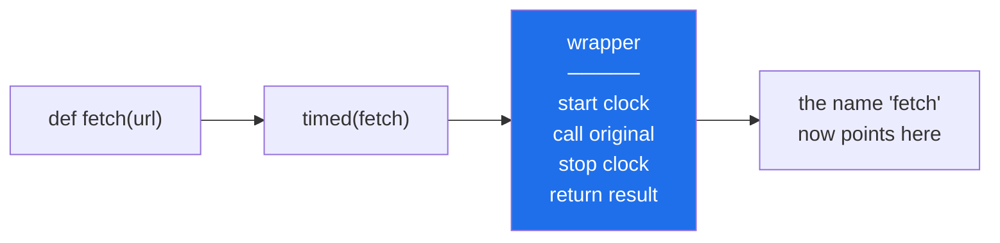

# Day 14 — Decorators: `@timed` and `@retry`

**Phase 2 · Module 2** · ID: **PY-16** (decorators)

> **Yesterday:** the loader hierarchy.
> **Today:** the `@` syntax. You have already used six decorators without writing one —
> `@pytest.fixture`, `@pytest.mark.parametrize`, `@dataclass`, `@abstractmethod`, `@property`
> (tomorrow), `@st.cache_data` (Day 55). Today you find out they are ordinary functions.
> **Tomorrow:** `classmethod`, `staticmethod`, `property`, and dunder methods.

```bash
./m start 14 && ./m scaffold 14
```

**Time:** 100 minutes. **Request budget:** 0 model calls.

---

## §1 The story

You have `with_retry(fn, attempts=5)` from Day 6. It works, and every call site looks like this:

```python
result = with_retry(lambda: fetch(url), attempts=3)
```

The retry logic has leaked into the *call*. Every caller has to remember it, and a caller who forgets
gets an unguarded network call — which on a free tier is the thing that burns your day.

A decorator moves that decision to the **definition**:

```python
@retry(attempts=3)
def fetch(url: str) -> str:
    ...
```

Now `fetch` retries. Everywhere. Forever. Nobody has to remember.

And the mechanism is simpler than the syntax suggests. **A decorator is a function that takes a
function and returns a function.** `@` is sugar for one line of assignment:

```python
@timed
def work(): ...

# is EXACTLY:
def work(): ...
work = timed(work)
```

That is the whole idea. Everything else today is bookkeeping — mostly `functools.wraps`, and the
extra layer you need when a decorator takes arguments.



---

## §2 Setup — run this

```bash
mkdir -p days/day-14/lab
touch days/day-14/lab/decorators.py
touch src/setu/decorators.py
touch tests/test_decorators.py
```

`functools` and `time` are standard library. No new packages.

---

## §3 PY-16 — from first principles

`days/day-14/lab/decorators.py`:

```python
"""PY-16: decorators, built up one layer at a time."""

from __future__ import annotations

import functools
import time


def desugared() -> None:
    def shout(fn):
        def wrapper(*args, **kwargs):
            return fn(*args, **kwargs).upper()
        return wrapper

    def greet(name):
        return f"hello {name}"

    greet = shout(greet)                 # <- what @ does, written out
    print(f"\n{greet('setu')=}")


def with_at_syntax() -> None:
    def shout(fn):
        def wrapper(*args, **kwargs):
            return fn(*args, **kwargs).upper()
        return wrapper

    @shout
    def greet(name):
        return f"hello {name}"

    print(f"{greet('setu')=}   <- identical")


def what_wraps_fixes() -> None:
    def naked(fn):
        def wrapper(*args, **kwargs):
            return fn(*args, **kwargs)
        return wrapper

    def wrapped(fn):
        @functools.wraps(fn)
        def wrapper(*args, **kwargs):
            return fn(*args, **kwargs)
        return wrapper

    @naked
    def a(x):
        """Docstring A."""

    @wrapped
    def b(x):
        """Docstring B."""

    print(f"\n{a.__name__=} {a.__doc__=}   <- identity destroyed")
    print(f"{b.__name__=} {b.__doc__=}   <- preserved")
    print(f"{b.__wrapped__.__name__=}   <- wraps() keeps a handle on the original")


def decorator_with_arguments() -> None:
    def repeat(times: int):              # layer 1: takes the ARGUMENT
        def decorator(fn):               # layer 2: takes the FUNCTION
            @functools.wraps(fn)
            def wrapper(*args, **kwargs):   # layer 3: takes the CALL
                return [fn(*args, **kwargs) for _ in range(times)]
            return wrapper
        return decorator

    @repeat(3)
    def roll():
        return "x"

    print(f"\n{roll()=}   <- three layers, because @repeat(3) is a CALL")


def stacking() -> None:
    def tag(label):
        def decorator(fn):
            @functools.wraps(fn)
            def wrapper(*a, **kw):
                return f"<{label}>{fn(*a, **kw)}</{label}>"
            return wrapper
        return decorator

    @tag("outer")
    @tag("inner")
    def content():
        return "hi"

    print(f"\n{content()=}   <- bottom decorator applied FIRST, so it ends up innermost")


def state_in_a_decorator() -> None:
    def counted(fn):
        @functools.wraps(fn)
        def wrapper(*args, **kwargs):
            wrapper.calls += 1
            return fn(*args, **kwargs)
        wrapper.calls = 0                # attribute on the wrapper, not a global
        return wrapper

    @counted
    def ping():
        return "pong"

    ping(); ping(); ping()
    print(f"\n{ping.calls=}   <- state lives on the wrapper object")


def timing_reality() -> None:
    def timed(fn):
        @functools.wraps(fn)
        def wrapper(*args, **kwargs):
            start = time.perf_counter()
            try:
                return fn(*args, **kwargs)
            finally:
                print(f"    {fn.__name__} took {time.perf_counter() - start:.4f}s")
        return wrapper

    @timed
    def slow():
        time.sleep(0.05)

    @timed
    def broken():
        raise ValueError("boom")

    print()
    slow()
    try:
        broken()
    except ValueError:
        print("    ...and the timing still printed, because of `finally`")


if __name__ == "__main__":
    desugared()
    with_at_syntax()
    what_wraps_fixes()
    decorator_with_arguments()
    stacking()
    state_in_a_decorator()
    timing_reality()
```

**Line by line:**

- `greet = shout(greet)` — the desugaring. Read it twice. Every decorator is this.
- `def wrapper(*args, **kwargs)` — the wrapper must accept **anything**, because it does not know the
  signature of what it wraps. Day 10's `*args`/`**kwargs`, earning their keep.
- `a.__name__` is `'wrapper'` — without `functools.wraps`, the decorated function loses its name,
  docstring, module and annotations. That breaks `help()`, breaks tracebacks, and breaks pytest's test
  discovery if you ever decorate a test. **Always use `@functools.wraps`.**
- `b.__wrapped__` — `wraps` also stores a reference to the original, which is how you unwrap for
  introspection or testing.
- `repeat(3)` needs **three** nested layers, because `@repeat(3)` is a function *call* whose result is
  then used as the decorator. `@repeat` (no brackets) would need two. This is the part everyone
  stumbles on: count the layers by counting the argument groups.
- `@tag("outer")` above `@tag("inner")` gives `<outer><inner>hi</inner></outer>` — **the decorator
  closest to `def` is applied first**, so it ends up innermost. Read a decorator stack bottom-up.
- `wrapper.calls = 0` — functions are objects (Day 4), so you can hang attributes on them. State on
  the wrapper, not in a global.
- `try: return fn(...) finally:` — the `finally` block runs whether the call succeeded or raised. A
  timing decorator without `finally` silently reports nothing for exactly the calls you most want
  timed: the ones that failed.

---

## §4 Build brief — `src/setu/decorators.py`

```python
"""Reusable decorators. @retry replaces Day 6's call-site with_retry."""

from __future__ import annotations

import functools
import logging
import time
from collections.abc import Callable
from typing import Any

from setu.retry import RetriesExhausted, backoff_delay

logger = logging.getLogger(__name__)


def timed(fn: Callable[..., Any]) -> Callable[..., Any]:
    """TODO(me): log how long fn took, at DEBUG level, even when it raises.

    - use time.perf_counter()
    - use functools.wraps
    - use try/finally so a failed call is still timed
    - must NOT swallow the exception
    """
    raise NotImplementedError


def retry(
    *,
    attempts: int = 3,
    exceptions: tuple[type[BaseException], ...] = (Exception,),
    sleep: Callable[[float], None] = time.sleep,
) -> Callable[[Callable[..., Any]], Callable[..., Any]]:
    """TODO(me): the Day 6 retry loop, as a decorator.

    - three layers, because this takes arguments
    - retry ONLY the exception types in `exceptions`; anything else propagates immediately
    - hard cap: never more than `attempts` calls
    - no sleep after the final failure
    - raise RetriesExhausted from the last error
    - `sleep` injected so tests do not wait
    """
    raise NotImplementedError


def memoize(fn: Callable[..., Any]) -> Callable[..., Any]:
    """TODO(me): cache results by arguments. Expose fn.cache_clear() and fn.cache_info().

    Build it yourself (Principle 2), THEN read functools.lru_cache and note the differences
    in your commit message. Unhashable arguments must raise, not silently skip the cache.
    """
    raise NotImplementedError
```

- `exceptions: tuple[type[BaseException], ...]` — **the important design choice today.** Day 6's
  helper retried everything, which means a `TypeError` from your own broken code gets retried three
  times and then reported as a network problem. Retry only what is genuinely transient.
- `logging` rather than `print` — a library never prints. The application decides where output goes.
- `memoize` before `lru_cache` — Principle 2. You will use `lru_cache` freely afterwards.

---

## §5 The eval that must be able to fail

`tests/test_decorators.py`:

```python
import logging

import pytest

from setu.decorators import memoize, retry, timed
from setu.retry import RetriesExhausted


def test_timed_preserves_identity():
    @timed
    def work(x: int) -> int:
        """Docstring."""
        return x

    assert work.__name__ == "work", "missing functools.wraps"
    assert work.__doc__ == "Docstring."


def test_timed_returns_the_value():
    @timed
    def work():
        return 42

    assert work() == 42


def test_timed_logs_even_when_the_call_raises(caplog):
    @timed
    def broken():
        raise ValueError("boom")

    with caplog.at_level(logging.DEBUG), pytest.raises(ValueError):
        broken()
    assert any("broken" in r.message for r in caplog.records), "no timing logged on failure"


def test_retry_succeeds_on_third_attempt():
    calls = []

    @retry(attempts=5, exceptions=(ConnectionError,), sleep=lambda _: None)
    def flaky():
        calls.append(1)
        if len(calls) < 3:
            raise ConnectionError("boom")
        return "ok"

    assert flaky() == "ok"
    assert len(calls) == 3


def test_retry_cap_is_hard():
    calls = []

    @retry(attempts=4, exceptions=(ConnectionError,), sleep=lambda _: None)
    def always():
        calls.append(1)
        raise ConnectionError("boom")

    with pytest.raises(RetriesExhausted):
        always()
    assert len(calls) == 4


def test_retry_does_not_swallow_unlisted_exceptions():
    calls = []

    @retry(attempts=5, exceptions=(ConnectionError,), sleep=lambda _: None)
    def bug():
        calls.append(1)
        raise TypeError("this is my bug, not the network's")

    with pytest.raises(TypeError):
        bug()
    assert len(calls) == 1, "a programming error must not be retried"


def test_retry_sleeps_between_but_not_after():
    delays = []

    @retry(attempts=3, exceptions=(ConnectionError,), sleep=delays.append)
    def always():
        raise ConnectionError("boom")

    with pytest.raises(RetriesExhausted):
        always()
    assert len(delays) == 2


def test_retry_preserves_identity():
    @retry(attempts=1)
    def work():
        """Doc."""

    assert work.__name__ == "work"


def test_memoize_calls_the_function_once_per_distinct_argument():
    calls = []

    @memoize
    def square(n: int) -> int:
        calls.append(n)
        return n * n

    assert [square(3), square(3), square(4)] == [9, 9, 16]
    assert calls == [3, 4]


def test_memoize_cache_clear():
    calls = []

    @memoize
    def square(n: int) -> int:
        calls.append(n)
        return n * n

    square(2)
    square.cache_clear()
    square(2)
    assert calls == [2, 2]


def test_memoize_rejects_unhashable_arguments():
    @memoize
    def total(items):
        return sum(items)

    with pytest.raises(TypeError):
        total([1, 2, 3])
```

**Line by line:**

- `caplog` — a built-in pytest fixture capturing log records. `caplog.at_level(logging.DEBUG)` lowers
  the threshold for the block. This is how you test logging without reading stdout.
- `test_timed_logs_even_when_the_call_raises` — **two assertions at once**: the exception still
  propagates (`pytest.raises`) *and* the timing was recorded. Drop the `finally` and this goes red.
- `test_retry_does_not_swallow_unlisted_exceptions` — **the day's most important test.** A `TypeError`
  in your own code is not transient. Retrying it wastes four requests and then reports the wrong
  cause. `len(calls) == 1` is the assertion that catches a too-broad `except`.
- `sleep=delays.append` — a list's bound `append` method used directly as the fake. It takes one
  argument and records it, which is exactly the interface needed. Neater than a class.
- `test_memoize_rejects_unhashable_arguments` — a list cannot be a dict key (Day 8). The cache must
  raise rather than silently bypassing itself, or you get invisible performance cliffs.

```bash
uv run python -m pytest tests/test_decorators.py -v
```

---

## §6 Request budget

| Resource | Spent today |
|---|---|
| LLM calls | **0** |

---

## §7 Traps

- **Forgetting `functools.wraps`.** Name, docstring and signature vanish; tracebacks get worse.
- **Miscounting the layers.** `@d` needs two; `@d(...)` needs three.
- **Reading a decorator stack top-down.** Bottom-most is applied first.
- **Timing without `try/finally`.** Failed calls — the ones you care about — report nothing.
- **A decorator that swallows exceptions.** Unless that is literally its job, re-raise.
- **Retrying every exception type.** A `TypeError` is your bug, not a transient fault.
- **`print` inside a library decorator.** Use `logging`.
- **Memoizing something with side effects, or an unbounded cache.** Both are leaks.
- **Decorating a method and forgetting `self`** flows through `*args`. It does — as long as you used
  `*args`.

---

## §8 Verify before you code

Written **2026-08-21**:

- <https://docs.python.org/3/library/functools.html#functools.wraps> — what it copies.
- <https://docs.python.org/3/library/functools.html#functools.lru_cache> — read **after** writing
  `memoize`; note `maxsize`, `typed`, and `cache_info()`.
- <https://docs.pytest.org/en/stable/how-to/logging.html> — the `caplog` fixture.

---

## §9 Say it in an interview

> "A decorator is just a function that takes a function and returns one — `@d` is sugar for
> `f = d(f)`. The two things I always check in a review are `functools.wraps`, because without it the
> name and docstring are gone and tracebacks get harder to read, and the exception filter on a retry
> decorator. Day one of the project I had a retry that caught bare `Exception`, which meant a
> `TypeError` in my own code got retried three times, burned three requests on a free tier, and then
> got reported as a network failure. So mine takes an explicit tuple of exception types, and there's a
> test asserting an unlisted exception is called exactly once and propagates."

---

## §10 Done when

Tick [`CHECKLIST.md`](CHECKLIST.md), then `./m check && ./m done 14`.
