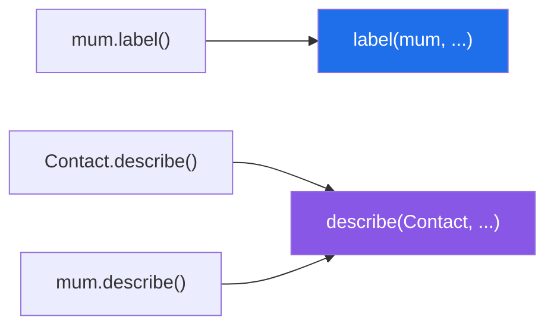

# 1.1 — The method that receives the class instead of the object

## One-line answer

A normal method's first parameter is the object it was called on; a `@classmethod`'s first parameter
is the **class** — so it can answer questions about the whole family and build new members of it,
without needing any particular one to exist.

---

## The story

Three contacts on a phone: your mum, a friend called Sam, and the dentist.

Some questions are about **one** of them. *What is Sam's number?* You have to pick Sam out of the list
before the question means anything. There is no way to answer it without a particular contact in front
of you.

Some questions are about **contacts in general**. *What can a contact hold?* A name, a number, maybe a
photo and a birthday. That answer does not change depending on which contact you are looking at, and —
this is the part that matters — you can answer it on a brand-new phone with **no contacts saved at
all**. The question is about the shape of the thing, not about any filled-in copy of it.

And there is a third kind of question, which is where this section is going. *Add this number to my
contacts.* You cannot ask a contact to do that, because the contact you want does not exist yet. You
ask **the contacts app**.

---

## The idea in plain language

On [Day 12, 1.3](../../../day-12-classes/parts/01-the-blank-form/1.3-methods-find-their-object.md) you
learned that a method is a function stored on the class, and that `sam.label()` is Python finding
`label` on the class and calling it with `sam` filled into the first parameter. That first parameter is
conventionally called `self`, and it is not a keyword — just a name everybody agrees on.

`@classmethod` changes what gets filled into that first parameter. Instead of the object, Python passes
**the class**, and the convention is to call the parameter `cls` rather than `self`. (`class` is a
reserved word, which is why the abbreviation exists.)

So there are two kinds of method so far, and they differ in exactly one way:

| | first parameter receives | can it run with no instances? |
|---|---|---|
| a normal method | the object — `self` | no |
| a `@classmethod` | the class — `cls` | yes |

Three things follow, and each one is a real use.

**A classmethod can be called on the class itself.** `Contact.describe()` works. `Contact.label()` does
not, because there is no object to fill `self` with.

**A classmethod can also be called on an object**, and Python still passes the class. `sam.describe()`
and `Contact.describe()` do exactly the same thing. That surprises people, and it is worth knowing
because it means the *caller* cannot tell the difference.

**A classmethod can build a new instance**, by calling `cls(...)`. That is the important one, and it is
the whole subject of [1.2](1.2-from-message-the-second-door-in.md).

One word for the vocabulary. `@classmethod` is a **decorator** — the `@` from
[Day 14, 1.4](../../../day-14-decorators/parts/01-functions-as-values/1.4-the-at-sign-is-two-lines.md),
meaning `describe = classmethod(describe)` — and it is one the language ships with rather than one you
wrote. That is the whole of today's connection to yesterday: three of the four things in this section
and the next are built-in decorators.

---

## Why Setu needs it

- **The plan names `Paper.from_arxiv_id()` for this day**, and it is a classmethod. Everything in
  section 1 exists to make that one line obvious.
- **[Day 12, 3.1](../../../day-12-classes/parts/03-the-paper-object/3.1-designing-paper.md) designed
  `Paper` with one way in.** Real papers arrive from a file, from an identifier and from a search
  result, and adding three more optional parameters to `__init__` is the alternative this day rejects.
- **Day 19's Pydantic models use `model_validate` and `model_validate_json`**, which are classmethods
  doing exactly this job. They stop being magic once you have written one.
- **Day 226 loads `Paper` objects out of Postgres and Mongo.** Each store has a different row shape and
  each gets its own classmethod, so `__init__` stays the one place that decides what a valid `Paper`
  is.

---

## The mechanism

```python
"""A classmethod receives the class; a regular method receives the object."""


class Contact:
    kind = "person"

    def __init__(self, name, number):
        self.name = name
        self.number = number

    def label(self):
        """A regular method: self is this one contact."""
        return f"{self.name} ({self.number})"

    @classmethod
    def describe(cls):
        """A classmethod: cls is the class itself, not any contact."""
        return f"{cls.__name__} stores a {cls.kind}"


mum = Contact("Mum", "07700 900111")

print("method on the object :", mum.label())
print("classmethod, via class :", Contact.describe())
print("classmethod, via object:", mum.describe())
print("what cls actually is   :", Contact.describe.__self__)
print("the two kinds of thing :", type(mum.label), type(Contact.describe))
```

Run on Python 3.12.12 on 2026-09-01:

```
method on the object : Mum (07700 900111)
classmethod, via class : Contact stores a person
classmethod, via object: Contact stores a person
what cls actually is   : <class '__main__.Contact'>
the two kinds of thing : <class 'method'> <class 'method'>
```

**Line by line:**

- `kind = "person"` sits directly in the class body, so it is a **class attribute** — one value shared
  by every contact ([Day 12, 1.4](../../../day-12-classes/parts/01-the-blank-form/1.4-instance-and-class-attributes.md)).
  It is here because `describe` needs something it can reach through `cls`.
- `def label(self):` — the ordinary kind. `self.name` needs a particular contact, so this method cannot
  answer without one.
- `@classmethod` above `def describe(cls):` — one line, and it changes what arrives in the first
  parameter. **The parameter name `cls` is a convention, not a rule**; the decorator is what does the
  work.
- `cls.__name__` is the string `'Contact'`, and `cls.kind` reaches the class attribute. Neither needs an
  object.
- `Contact.describe()` — called **on the class**, with no brackets after `Contact` and no object
  anywhere. Try that with `label` and it fails, which is the second failure below.
- `mum.describe()` — called on an object, and it prints the same thing. Python still passed the class.
  **The object was ignored**, which is exactly what you want for a question that is not about any one
  contact.
- `Contact.describe.__self__` is `<class '__main__.Contact'>` — the classmethod is already *bound*, and
  what it is bound to is the class. `__main__` is the module name for a script run directly.
- `type(mum.label)` and `type(Contact.describe)` are **both `method`**. Python does not distinguish
  them at this level; what differs is what got bound.

Which thing arrives first:



---

## When it breaks

**A `@classmethod` whose first parameter is called `self`:**

```text
$ uv run python -c "
class Contact:
    kind = 'person'
    def __init__(self, name): self.name = name
    @classmethod
    def describe(self):
        return f'{self.name} stores a {self.kind}'
print(Contact.describe())
"
Traceback (most recent call last):
  File "<string>", line 8, in <module>
  File "<string>", line 7, in describe
AttributeError: type object 'Contact' has no attribute 'name'
```

**What it means.** The parameter is called `self`, and the class still arrived in it, because the
decorator decides what is passed and the name decides nothing. Then `self.name` looked for `name` on
the *class*, and only instances have one. **Read `type object 'Contact' has no attribute` as "you are
holding the class and you thought you were holding an object."** Renaming the parameter to `cls` fixes
nothing by itself; it stops you making this mistake next time.

**Forgetting the `@classmethod` line:**

```text
$ uv run python -c "
class Contact:
    kind = 'person'
    def describe(cls):
        return f'{cls.__name__} stores a {cls.kind}'
print(Contact.describe())
"
Traceback (most recent call last):
  File "<string>", line 6, in <module>
TypeError: Contact.describe() missing 1 required positional argument: 'cls'
```

**What it means.** Without the decorator it is an ordinary method that happens to have called its first
parameter `cls`, and calling it on the class supplies nothing. The message names `cls`, which reads
like the decorator is missing — and it is. Note the difference from the previous failure: forgetting the
decorator fails **loudly at the call**, while getting the parameter name wrong fails later and more
confusingly.

**Calling an ordinary method on the class:**

```text
$ uv run python -c "
class Contact:
    def __init__(self, name): self.name = name
    def label(self): return self.name
print(Contact.label())
"
Traceback (most recent call last):
  File "<string>", line 5, in <module>
TypeError: Contact.label() missing 1 required positional argument: 'self'
```

**What it means.** `Contact.label` is just the function, with nothing bound to it, so `self` is a
parameter you have to supply — `Contact.label(mum)` works and is what `mum.label()` does underneath
([Day 12, 1.3](../../../day-12-classes/parts/01-the-blank-form/1.3-methods-find-their-object.md)). The
message is the clearest statement in the language that `self` is an ordinary parameter and not magic.

---

## In production

**The professional test for which kind to write is: what does this need in order to answer?** If it
needs one object's data, it is a method. If it needs the class — to name it, to read a class-level
setting, or to build a new instance — it is a classmethod. If it needs neither, it is a
`staticmethod` ([1.3](1.3-staticmethod-the-method-that-gets-nothing.md)) or, very often, a plain
function that does not belong on the class at all.

**What changes at scale is that classmethods become the registry pattern.** A base class with a
`from_row` classmethod, and every subclass inheriting it, gives you one line that builds the right type
for the right table — because `cls` follows the class it was called on
([1.4](1.4-cls-and-inheritance.md)). This is how object-relational mappers, serialisation libraries and
Pydantic all work, and it is why they can hand you the correct subclass without a chain of `if`
statements.

**The failure that only appears with real code is the classmethod that mutates class state.** A
classmethod assigning to `cls.something` writes on the class, so it changes behaviour for every instance
in the process, including ones created before the call
([Day 12, 1.5](../../../day-12-classes/parts/01-the-blank-form/1.5-the-shared-class-attribute.md)). Under
a web server that is one request changing another request's behaviour. Classmethods should read class
state and build instances; writing class state is a different and much more dangerous thing.

**The review comment a senior engineer leaves.** *"`normalise_number` takes `self` and never uses it, so
it is a classmethod or a staticmethod, not a method. Making that explicit means it can be called and
tested without constructing a `Contact` — which the test below is currently doing for no reason."*

**The interview question.** *"What is the difference between a method, a classmethod and a
staticmethod?"* The answer that lands is about what arrives in the first parameter, not about syntax: a
method gets the instance, a classmethod gets the class, a staticmethod gets neither. Adding that a
classmethod can be called on an instance and still receives the class, and that its real job is
alternative constructors because `cls(...)` follows the subclass, is what turns a definition into an
answer.

---

## Check yourself

```bash
uv run python -c "
class Contact:
    kind = 'person'
    def __init__(self, name, number):
        self.name, self.number = name, number
    def label(self):
        return f'{self.name} ({self.number})'
    @classmethod
    def describe(cls):
        return f'{cls.__name__} stores a {cls.kind}'

mum = Contact('Mum', '07700 900111')
print(mum.label())
print(Contact.describe(), '|', mum.describe())
print(Contact.describe.__self__)
"
```

Now delete the `@classmethod` line and predict the error before you run it. Then put it back and try
`Contact.label()`.

**Answer out loud, without scrolling up:**

> What arrives in the first parameter of a `@classmethod`, and what arrives in the first parameter of an
> ordinary method? Then say what happens when you call a classmethod on an instance.

---

**Next:** [1.2 — `from_message`, the second door in](1.2-from-message-the-second-door-in.md), where
`cls` stops being read and starts being called.
