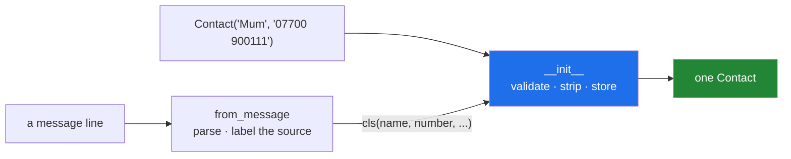

# 1.2 — The second door in: an alternative constructor

## One-line answer

A classmethod that ends in `return cls(...)` is a second way to build the object — it does the
unpacking, the parsing and the guessing, then hands clean values to the one `__init__` that decides
what a valid object is.

---

## The story

There are two ways you have ever added a contact to a phone, and you have used both.

The first is the long way. You open contacts, tap the plus, and type a name into one box and a number
into another. You decide what goes in each box.

The second is the short way. A message arrives from a number you do not have saved, and at the top of
it there is a button that says **add to contacts**. You tap it, and the phone fills in the number for
you, guesses the name from the signature at the bottom, and shows you the form already half completed.

Two doors. One contact, and it is the same kind of contact either way — you cannot tell afterwards
which door it came through, and nothing about it works differently.

What the short way actually did is worth being precise about, because it is the whole idea. It did not
invent a new kind of contact. It **read a message and worked out what to type into the long form**.
The long form is still the only thing that decides what a contact needs; the short way is a helper that
fills it in.

---

## The idea in plain language

`__init__` is the long form. Its job, established on
[Day 12, 3.2](../../../day-12-classes/parts/03-the-paper-object/3.2-validation-in-init.md), is to
decide what a valid object is and to refuse to build an invalid one. It accepts the values it needs,
checks them, and stores them — and does nothing else.

The pressure to break that comes from the world, which hands you data in several shapes. A contact
might come from a typed form, from a message header, or from a row in a file. The tempting fix is to
teach `__init__` about all three, with optional parameters and a branch at the top: *"if you gave me a
`line`, parse it; otherwise use `name` and `number`."*

That is the shape this document exists to prevent, and the reasons are worth naming:

- **The signature stops being readable.** `Contact(name=None, number=None, line=None, row=None)` does
  not tell a caller what a contact needs, because nothing is required and everything is optional.
- **The invalid combinations are not checked.** Nothing stops `Contact(name="Mum", line="...")`, and
  `__init__` has to decide what that means.
- **The parsing and the validating end up in one function.** Then a change to the message format edits
  the same code that decides what a valid contact is.

An **alternative constructor** is the fix, and it is one classmethod per input shape:

> `Contact.from_message(line)` parses the line, works out the name and the number, and calls
> `cls(name, number)`.

`__init__` keeps one job and one signature. Each classmethod keeps one job: turn *this* input shape into
the arguments `__init__` wants. Adding a fourth source adds a fourth classmethod and changes nothing
else — which is [Day 13, 4.2](../../../day-13-inheritance-and-abstraction/parts/04-abstraction/4.2-the-loader-family.md)'s
"what does adding a fourth format cost?" asked about construction instead of loading.

Two rules for writing one:

**Call `cls(...)`, never the class by name.** `return Contact(...)` works today and breaks the moment
somebody subclasses you — [1.4](1.4-cls-and-inheritance.md) is that failure in full.

**Name it `from_<something>`.** The convention is universal enough that a reader knows what
`from_json`, `from_row` and `from_arxiv_id` are before opening them, which is exactly what
[Day 14, 4.3](../../../day-14-decorators/parts/04-the-toolkit/4.3-when-a-decorator-is-wrong.md)'s
naming rule asks of a decorator.

---

## Why Setu needs it

- **`Paper.from_arxiv_id()` is the plan's named example for `PY-17`**, and it is this exact shape:
  take an identifier, work out the fields, hand them to `__init__`.
- **[Day 13's loaders build `Paper` objects from three sources](../../../day-13-inheritance-and-abstraction/parts/04-abstraction/4.2-the-loader-family.md)**,
  and each one currently constructs by hand inside `load()`. An alternative constructor is where that
  per-source knowledge belongs.
- **Day 19's Pydantic gives you `model_validate` and `model_validate_json` for free**, which are
  alternative constructors somebody else wrote. Recognising the pattern is what stops that library
  feeling like magic.
- **Day 226 reads `Paper` rows out of Postgres and documents out of Mongo.** Two stores, two row
  shapes, one `__init__` — or two stores and an `__init__` that knows about databases, which is the
  version this prevents.

---

## The mechanism

```python
"""The second door in: an alternative constructor."""


class Contact:
    def __init__(self, name, number, source="typed"):
        if not name.strip():
            raise ValueError("a contact needs a name")
        self.name = name.strip()
        self.number = number.strip()
        self.source = source

    @classmethod
    def from_message(cls, line):
        """Build a Contact from one line of a message header."""
        name, _, number = line.partition(":")
        return cls(name, number, source="message")

    def __repr__(self):
        return f"Contact(name={self.name!r}, number={self.number!r}, source={self.source!r})"


typed = Contact("Mum", "07700 900111")
tapped = Contact.from_message(" Mum : 07700 900111 ")

print("typed by hand :", typed)
print("tapped from a message:", tapped)
print("same class?   :", type(typed) is type(tapped))
```

Run on Python 3.12.12 on 2026-09-01:

```
typed by hand : Contact(name='Mum', number='07700 900111', source='typed')
tapped from a message: Contact(name='Mum', number='07700 900111', source='message')
same class?   : True
```

**Line by line:**

- `def __init__(self, name, number, source="typed")` — **two required parameters and one with a
  default.** Read the signature and you know what a contact needs. That readability is the thing being
  protected.
- `if not name.strip(): raise ValueError(...)` — the validation stays here, in the one place every door
  goes through
  ([Day 12, 3.2](../../../day-12-classes/parts/03-the-paper-object/3.2-validation-in-init.md)). A
  classmethod that skipped `__init__` could build an invalid object, which is why they never do.
- `@classmethod` and `def from_message(cls, line)` — `cls` is the class
  ([1.1](1.1-the-method-that-gets-the-class.md)), and `line` is the one thing this door needs.
- `line.partition(":")` splits on the **first** colon and always returns three parts, so unpacking never
  raises even when there is no colon at all
  ([Day 7, 2.2](../../../day-07-strings/parts/02-methods/2.2-split-and-join.md)). `split(":")` would
  raise `ValueError: not enough values to unpack` on a line with no colon, and this method's whole
  purpose is dealing with messy input.
- `name, _, number = ...` — the middle item is the separator itself, and `_` is the conventional name
  for a value you are deliberately ignoring
  ([Day 8, 1.4](../../../day-08-containers/parts/01-sequences/1.4-unpacking-and-star-rest.md)).
- `return cls(name, number, source="message")` — **the whole point.** It calls the constructor rather
  than assigning attributes itself, so validation and normalising both happen. `cls` and not `Contact`,
  for the reason in [1.4](1.4-cls-and-inheritance.md).
- `source="message"` — provenance, recorded at the door it came through
  ([Principle 9](../../../../docs/00_MASTER_PLAN_DS_GENAI.md)). This is a real reason to have separate
  constructors rather than one clever one: each door knows where the data came from and can say so.
- The whitespace in `" Mum : 07700 900111 "` is gone in both fields of the output, and **`from_message`
  never stripped anything** — `__init__` did. Every door gets the same cleaning for free.
- `type(typed) is type(tapped)` is `True`. One kind of object, two ways to make one. Nothing downstream
  needs to know which door was used.

The two doors:



---

## When it breaks

**An alternative constructor that forgets to return:**

```text
$ uv run python -c "
class Contact:
    def __init__(self, name, number):
        self.name, self.number = name, number
    @classmethod
    def from_message(cls, line):
        name, _, number = line.partition(':')
        cls(name.strip(), number.strip())

c = Contact.from_message('Mum: 07700 900111')
print(repr(c))
print(c.name)
"
None
Traceback (most recent call last):
  File "<string>", line 12, in <module>
AttributeError: 'NoneType' object has no attribute 'name'
```

**What it means.** The object was built correctly and then thrown away, because a function with no
`return` returns `None`
([Day 14, 2.3](../../../day-14-decorators/parts/02-writing-a-decorator/2.3-returning-the-value.md)).
Nothing raised at the constructor. The failure arrives at the first attribute access, which may be in a
completely different file.

**Skipping `__init__` and setting attributes directly:**

```text
$ uv run python -c "
class Contact:
    def __init__(self, name, number):
        if not name.strip():
            raise ValueError('a contact needs a name')
        self.name, self.number = name.strip(), number.strip()
    @classmethod
    def from_message(cls, line):
        obj = cls.__new__(cls)
        name, _, number = line.partition(':')
        obj.name, obj.number = name, number
        return obj

bad = Contact.from_message(' : 07700 900111')
print('name:', repr(bad.name))
print('an object the constructor would have refused:', repr(bad.number))
"
name: ' '
an object the constructor would have refused: ' 07700 900111'
```

**What it means.** `cls.__new__(cls)` builds the object without running `__init__`, so nothing was
validated and nothing was stripped. The result is a `Contact` with a blank name — **the exact object
`__init__` exists to make impossible**. There is no error, and the object will look fine until
something downstream tries to use the name. An alternative constructor's job is to *prepare arguments*
for `__init__`, never to work around it.

**Teaching `__init__` about every input shape instead:**

```text
$ uv run python -c "
class Contact:
    def __init__(self, name=None, number=None, line=None):
        if line is not None:
            name, _, number = line.partition(':')
        self.name, self.number = name, number

print(Contact(line='Mum: 07700 900111').name)
print(Contact('Mum', '07700 900111').name)
print(Contact().name)
print(Contact('Mum', line='Sam: 07700 900222').name)
"
Mum
Mum
None
Sam
```

**What it means.** Every call is accepted and two of them are nonsense. `Contact()` built a contact with
no name and no number; `Contact('Mum', line='Sam: ...')` was given two different names and silently
picked one. **The signature can no longer say what a contact requires**, because everything is optional
— and there is no line to add a check to, because there is no longer a single correct shape to check
against. Splitting it into `__init__(name, number)` plus `from_message(line)` makes both illegal calls
`TypeError`s at the call site.

---

## In production

**The professional habit is that `__init__` is the narrowest door and every other door leads to it.**
A code review question that catches most of the mistakes here is *"can I build an invalid object
without going through `__init__`?"* If the answer is yes, the validation is decorative. That is also
the reason alternative constructors are classmethods rather than module-level functions: a classmethod
is discoverable on the class, reads as part of its interface, and cannot drift into a different module
from the constructor it feeds.

**What changes at scale is that each door becomes a place where a schema is pinned.** `from_row`
encodes what the database columns are called; `from_json` encodes the wire format; `from_arxiv_id`
encodes an API's response shape. When the API changes, one classmethod changes, and its test is the one
that goes red. Under one clever `__init__`, an API change edits the same function that every other
caller relies on, and the blast radius is the whole class.

**The failure that only appears with real data is the constructor that parses.** Parsing means messy
input, and messy input means partial results: a line with no colon, a number with a country code, a
name in a different encoding. If that logic lives in `__init__`, every one of those cases is a way to
build a half-valid object. If it lives in `from_message`, that method can raise a clear error *before*
calling `cls(...)`, and the object either exists correctly or does not exist at all — which is the
promise [Day 12, 3.2](../../../day-12-classes/parts/03-the-paper-object/3.2-validation-in-init.md) made.

**The review comment a senior engineer leaves.** *"`__init__` now takes six optional keyword arguments
and branches on which ones are `None`. Give it the two fields a `Paper` actually requires, and move each
input shape into its own `from_*` classmethod. The signature is documentation, and right now it
documents nothing."*

**The interview question.** *"How do you give a class more than one way to be constructed?"* The answer
is the classmethod that returns `cls(...)`, and the follow-up that matters is *why not just add
parameters to `__init__`* — because the signature stops describing the object, invalid combinations
become unheckable, and parsing gets mixed into validation. Adding that each alternative constructor is
where one external format is pinned, so a format change touches one method, is what shows you have
maintained one.

---

## Check yourself

```bash
uv run python -c "
class Contact:
    def __init__(self, name, number, source='typed'):
        if not name.strip():
            raise ValueError('a contact needs a name')
        self.name, self.number, self.source = name.strip(), number.strip(), source
    @classmethod
    def from_message(cls, line):
        name, _, number = line.partition(':')
        return cls(name, number, source='message')
    def __repr__(self):
        return f'Contact({self.name!r}, {self.number!r}, {self.source!r})'

print(Contact('Mum', '07700 900111'))
print(Contact.from_message(' Mum : 07700 900111 '))
print(Contact.from_message(' : 07700 900111'))
"
```

The third line raises, and it raises from `__init__` rather than from `from_message`. Say why that is
the right place for it.

**Answer out loud, without scrolling up:**

> What is an alternative constructor's job, and what is it not allowed to do? Then say what goes wrong
> when `__init__` learns to parse three different input shapes.

---

**Next:** [1.3 — `staticmethod`, the method that receives nothing](1.3-staticmethod-the-method-that-gets-nothing.md),
the third kind, and the one that is most often the wrong choice.
