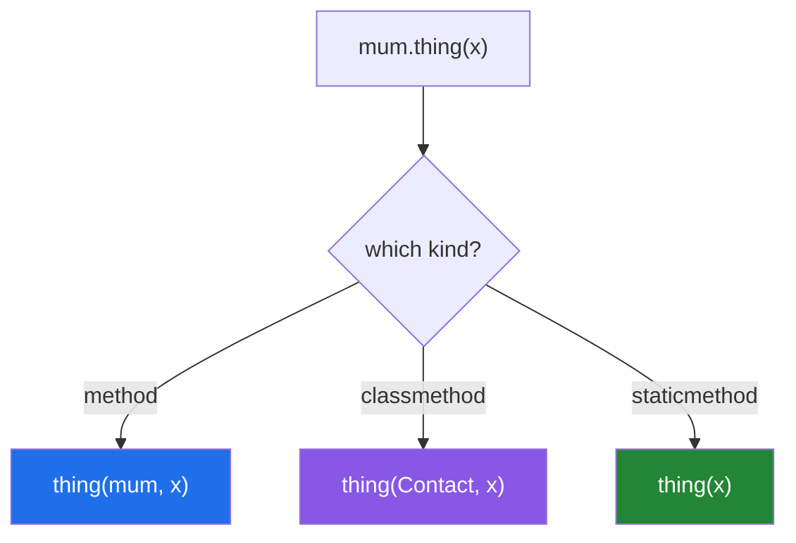

# 1.3 — `staticmethod`: the method that receives nothing

## One-line answer

A `@staticmethod` is a plain function that happens to live inside a class body — it receives neither
the object nor the class — so its only real argument is *"this belongs with this class and a reader
should find it here."*

---

## The story

Stuck to the inside of the kitchen cupboard door there is a small printed card of oven temperatures:
gas mark to degrees, and back again.

The card is nothing to do with any particular meal. It does not know what is in the oven. You could
carry it to somebody else's house and it would still be correct, because the numbers on it are true
regardless of who is cooking.

So why is it in that cupboard rather than in a drawer with the receipts? Because that is where you are
standing when you need it. The card belongs *near* the cooking, not *to* any dish.

That is the entire argument for a `staticmethod`, and it is worth noticing how weak an argument it is —
it is about where a reader will look, not about what the code needs. Which is why the honest answer, a
surprising amount of the time, is that the card should just be a note on the fridge, and the function
should just be a module-level function.

---

## The idea in plain language

Three kinds of thing can live in a class body, and they differ only in what Python fills into the
first parameter:

| | first parameter | called on |
|---|---|---|
| a method | the instance — `self` | an instance |
| a `@classmethod` | the class — `cls` | either |
| a `@staticmethod` | **nothing** | either |

A `@staticmethod` has no `self` and no `cls`. Its parameters are exactly the ones you wrote. Python
does not pass it anything extra, and it does not care whether you call it on the class
(`Contact.normalise(...)`) or on an instance (`mum.normalise(...)`) — both do the same thing.

The genuinely good reasons to use one:

- **It is a helper the class's own code uses**, like normalising a phone number before storing it. It
  lives beside the code that uses it.
- **It is part of the class's public interface conceptually** — `Contact.normalise(text)` reads as *"the
  way contacts normalise numbers"*, and a reader looking at `Contact` finds it.
- **A subclass may want to change it.** A staticmethod is looked up on the class, so a subclass can
  override it. A module-level function cannot be overridden.

And the reason not to: **if a function needs nothing from the class, a module-level function is
simpler.** It is easier to import, easier to test, and does not make the class longer. Static methods
accumulate in codebases as a way of avoiding the decision about where something lives, and a class with
nine of them and no state has become a namespace pretending to be a type — which
[Day 12, 3.4](../../../day-12-classes/parts/03-the-paper-object/3.4-when-not-to-write-a-class.md)
already argued against from the other direction.

One historical note that removes a common confusion. Before Python 3.10, a `staticmethod` object could
not be called directly — only reached through the class. Since 3.10 they are ordinary callables, which
is documented in *What's New In Python 3.10*
(<https://docs.python.org/3/whatsnew/3.10.html>), and it is why they can now be stacked under another
decorator ([Day 14, 4.1](../../../day-14-decorators/parts/04-the-toolkit/4.1-a-decorator-on-a-method.md)).

---

## Why Setu needs it

- **`Paper` needs a title normaliser**, and you already wrote one on
  [Day 7, 4.1](../../../day-07-strings/parts/04-normalising/4.1-the-title-normaliser.md) as a plain
  function. Today is where you decide whether it moves onto the class, and this document is the
  argument on both sides.
- **[1.2](1.2-from-message-the-second-door-in.md)'s alternative constructors need helpers** — parsing an
  identifier, cleaning a field — and a staticmethod is where a helper used by two constructors lives.
- **Day 19's Pydantic validators are written as staticmethods or classmethods**, and knowing why the
  library asks for one rather than a method is the difference between following a recipe and
  understanding it.
- **Principle 2 says from scratch before library.** Writing the normaliser as a staticmethod and then
  meeting Pydantic's `field_validator` on Day 19 is that principle applied to validation.

---

## The mechanism

```python
"""A staticmethod gets neither the object nor the class."""


class Contact:
    def __init__(self, name, number):
        self.name = name
        self.number = self.normalise(number)

    @staticmethod
    def normalise(number):
        """Strip spaces and a leading country code. Needs no contact and no class."""
        digits = number.replace(" ", "").replace("-", "")
        return "0" + digits[3:] if digits.startswith("+44") else digits

    def __repr__(self):
        return f"Contact({self.name!r}, {self.number!r})"


print("called on the class :", Contact.normalise("+44 7700 900111"))
print("called on an object :", Contact("Mum", "07700 900111").normalise("07700-900111"))
print("used inside __init__:", Contact("Mum", "+44 7700 900111"))
print("what it actually is :", type(Contact.__dict__["normalise"]))
print("what you get out    :", type(Contact.normalise))
```

Run on Python 3.12.12 on 2026-09-01:

```
called on the class : 07700900111
called on an object : 07700900111
used inside __init__: Contact('Mum', '07700900111')
what it actually is : <class 'staticmethod'>
what you get out    : <class 'function'>
```

**Line by line:**

- `@staticmethod` above `def normalise(number)` — **one parameter, and it is the number.** No `self`, no
  `cls`. What you wrote is what it receives.
- `self.normalise(number)` inside `__init__` — calling it through `self` works, and Python passes
  nothing extra. That is the everyday use: the class's own code reaching a helper that belongs to it.
- `number.replace(" ", "").replace("-", "")` — string methods before regular expressions, which is
  [Day 7, 4.3](../../../day-07-strings/parts/04-normalising/4.3-methods-before-regex.md)'s rule. Two
  replacements are readable; one pattern is not.
- `"0" + digits[3:] if digits.startswith("+44") else digits` — a conditional expression
  ([Day 5, 2.5](../../../day-05-operators-and-conditionals/parts/02-conditionals/2.5-the-conditional-expression.md)).
  `digits[3:]` drops `+44` and the leading `0` is put back, which is the actual convention for a UK
  number and not an invented rule.
- `Contact.normalise("+44 7700 900111")` — called on the class, no instance anywhere. **This is what you
  cannot do with an ordinary method**, and it is what makes the helper testable without building a
  contact.
- `Contact("Mum", "07700 900111").normalise(...)` — called on an instance, same answer. The instance was
  ignored entirely.
- `type(Contact.__dict__["normalise"])` is `staticmethod` — that is the object actually stored on the
  class, put there by the decorator.
- `type(Contact.normalise)` is **`function`** — reaching it through the class gives you the plain
  function back. Compare with [1.1](1.1-the-method-that-gets-the-class.md), where `Contact.describe` came
  out as a `method` already bound to the class. **A staticmethod binds to nothing, and that is the whole
  definition.**

What each kind receives:



---

## When it breaks

**A `staticmethod` that reaches for `self`:**

```text
$ uv run python -c "
class Contact:
    def __init__(self, name): self.name = name
    @staticmethod
    def shout():
        return self.name.upper()
print(Contact('Mum').shout())
"
Traceback (most recent call last):
  File "<string>", line 7, in <module>
  File "<string>", line 6, in shout
NameError: name 'self' is not defined
```

**What it means.** `self` is a *parameter name*, and this function has no parameters, so inside it the
name `self` means nothing at all — the error is the same one you would get from any undefined name
([Day 10, 2.1](../../../day-10-functions/parts/02-scope/2.1-legb-where-a-name-is-found.md)). Note that it
is a `NameError` and not an `AttributeError`: the object was never passed in, so there was nothing to
have an attribute. If a function needs the object, it is a method.

**Forgetting `@staticmethod` on a helper:**

```text
$ uv run python -c "
class Contact:
    def normalise(number):
        return number.replace(' ', '')
    def __init__(self, name, number):
        self.number = self.normalise(number)
print(Contact.normalise('07700 900111'))
print(Contact('Mum', '07700 900111').number)
"
07700900111
Traceback (most recent call last):
  File "<string>", line 8, in <module>
  File "<string>", line 6, in __init__
TypeError: Contact.normalise() takes 1 positional argument but 2 were given
```

**What it means.** Read the order: **the first call worked and the second failed.** Without the
decorator it is an ordinary method, so `Contact.normalise('07700 900111')` passed the string as `self`
and happened to work, while `self.normalise(number)` passed the instance *and* the number, which is two
arguments for a one-parameter function. A missing `@staticmethod` therefore does not fail at the class
definition and does not fail on every call — it fails only where the function is used the way it was
meant to be.

**A staticmethod that quietly wanted to be a classmethod:**

```text
$ uv run python -c "
class Contact:
    country = '+44'
    def __init__(self, name): self.name = name
    @staticmethod
    def describe():
        return f'contacts default to {Contact.country}'

class USContact(Contact):
    country = '+1'

print(Contact.describe())
print(USContact.describe())
"
contacts default to +44
contacts default to +44
```

**What it means.** No error, and one wrong answer. `USContact.describe()` reported `+44`, because the
staticmethod names `Contact` in its body and a staticmethod has no `cls` to follow. **The subclass's
override was ignored.** Anything that needs to know which class it was called on is a classmethod, and
[1.4](1.4-cls-and-inheritance.md) is the same failure in its most expensive form.

---

## In production

**The professional default is: if it needs nothing from the class, it is a module-level function.** A
staticmethod earns its place when a reader would look for it on the class, or when a subclass might
reasonably replace it. Those are real reasons, and there are fewer of them than the number of
staticmethods in most codebases. A useful review question is *"could I move this to `utils.py` without
anybody noticing?"* — if the honest answer is yes, that is where it belongs, and the class gets shorter.

**What changes at scale is testability and import weight.** A staticmethod inside a large class means
importing that class — and everything the module needs — to test one pure function. A codebase where the
small pure functions live in their own module has a fast test suite for them and can reuse them from
places that have no business importing the class. That is the same seam argument as
[Day 10, 3.3](../../../day-10-functions/parts/03-the-module/3.3-pure-functions-and-the-seam.md), applied
to where a function is *stored* rather than to what it touches.

**The failure that only appears with real code is the class that became a namespace.** Nine
staticmethods, no `__init__`, no state, and every call written `Helpers.do_thing(...)`. It works, and it
is a module wearing a class — with the extra cost that nobody can import one function from it, tools
cannot see which ones are unused, and every caller carries the class name as noise. Python has modules
for this; a language without them is where the habit comes from.

**The review comment a senior engineer leaves.** *"`normalise` is a staticmethod that mentions `Contact`
by name in its body, so `USContact` gets the base class's country code. Make it a classmethod and use
`cls.country`, or move it out of the class entirely — right now it is neither."*

**The interview question.** *"When would you use a staticmethod rather than a module-level function?"*
The answer that lands is honest about how narrow the case is: when the function belongs to the class
conceptually and a reader will look for it there, or when a subclass may need to override it — because a
staticmethod is looked up on the class and a module-level function is not. Adding that a staticmethod
which names its own class in its body has all the costs and none of the benefits, and should be a
classmethod, is the detail that shows you have refactored one.

---

## Check yourself

```bash
uv run python -c "
class Contact:
    def __init__(self, name, number):
        self.name, self.number = name, self.normalise(number)
    @staticmethod
    def normalise(number):
        digits = number.replace(' ', '').replace('-', '')
        return '0' + digits[3:] if digits.startswith('+44') else digits

print(Contact.normalise('+44 7700 900111'))
print(Contact('Mum', '07700-900111').number)
print(type(Contact.__dict__['normalise']), type(Contact.normalise))
"
```

Now delete the `@staticmethod` line and predict which of the three prints breaks first.

**Answer out loud, without scrolling up:**

> What does a `@staticmethod` receive in its first parameter? Then give the one reason to put a
> function on a class as a staticmethod rather than in a module, and the reason not to.

---

**Next:** [1.4 — `cls` and inheritance](1.4-cls-and-inheritance.md), where naming the class instead of
using `cls` returns the wrong type and nothing complains.
