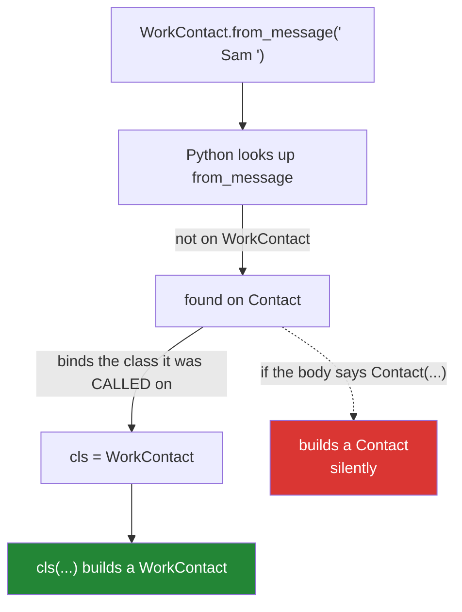

# 1.4 — `cls` and inheritance: the constructor that returned the wrong class

## One-line answer

`cls` is the class the method was *called on*, not the class it was written in — so an alternative
constructor that ends in `cls(...)` builds the right subclass automatically, and one that names its own
class builds the base every time and nothing warns you.

---

## The story

The contacts app gets a second kind of entry: a **work contact**, which is a contact with a company on
it.

Everything a normal contact can do, a work contact can do — it has a name and a number and shows up in
the same list. It just has one extra field, and one extra thing it can show you: a little line under
the name saying where the person works.

Somebody adds a work contact the short way, by tapping **add to contacts** on a message. The button
runs the same code it always did, the entry appears in the list, and it looks right.

Then they tap it to see the company, and there is no company. Not blank — *not there*. The app did not
crash and did not complain. It made an ordinary contact, because the code behind the button was written
before work contacts existed and it says, in as many words, *make a contact*.

Nobody noticed for a month, because the only way to see the difference is to look for the one field
that is missing.

---

## The idea in plain language

Inheritance ([Day 13, 1.1](../../../day-13-inheritance-and-abstraction/parts/01-inheritance/1.1-one-form-that-starts-from-another.md))
means `WorkContact` can start from `Contact` and add to it. Every method on `Contact` is available on
`WorkContact`, including the classmethods.

The question this document answers is: **when you call an inherited classmethod on the subclass, what
is in `cls`?**

The answer is the subclass. `WorkContact.from_message(...)` puts `WorkContact` in `cls`, even though
`from_message` was written inside `Contact` and knows nothing about work contacts. That is the same rule
as `type(self).__name__` reporting the real class on
[Day 13, 1.1](../../../day-13-inheritance-and-abstraction/parts/01-inheritance/1.1-one-form-that-starts-from-another.md):
Python binds the actual class, not the one the source code sits in.

So `return cls(name, number)` builds a `WorkContact`, and `return Contact(name, number)` builds a
`Contact`. One character of difference in intent, and a completely different object.

This is the reason [1.2](1.2-from-message-the-second-door-in.md)'s rule was stated as a rule rather than
a style preference. It is also why the failure is quiet: a `Contact` where a `WorkContact` was expected
has all the attributes anybody checks casually, and fails only at the one method or field the subclass
added.

There is a matching obligation on the subclass, and it is easy to miss. **If a subclass changes
`__init__`'s required parameters, every inherited `cls(...)` breaks.** That is
[Day 13, 2.3](../../../day-13-inheritance-and-abstraction/parts/02-polymorphism/2.3-liskov-in-plain-words.md)'s
first rule — a subclass may accept more but never *demand* more — restated for constructors, and the
failure is at least loud.

---

## Why Setu needs it

- **Day 13 built a loader family**, and Day 226 will build a `Paper` family: a base with `from_row`, and
  subclasses for the shapes that come out of Postgres and Mongo. `cls` is what makes one inherited
  method serve all of them.
- **[1.2](1.2-from-message-the-second-door-in.md) told you to write `cls(...)` and deferred the reason
  here.** This is the address that promise pointed at
  ([Part 11's no-shortcut test](../../../../docs/00_MASTER_PLAN_DS_GENAI.md)).
- **Day 19's Pydantic relies on it completely**: `Model.model_validate(data)` returns an instance of
  whichever subclass you called it on, and that only works because the library uses `cls`.
- **Principle 7 is what catches this class of bug.** A test asserting `isinstance(result, WorkContact)`
  costs one line and is the only thing that would have caught the story above.

---

## The mechanism

```python
"""cls follows the class you called it on, and a hard-coded name does not."""


class Contact:
    def __init__(self, name):
        self.name = name

    @classmethod
    def from_message(cls, line):
        return cls(line.strip())

    @classmethod
    def hard_coded(cls, line):
        return Contact(line.strip())


class WorkContact(Contact):
    def __init__(self, name, company="unknown"):
        super().__init__(name)
        self.company = company


a = WorkContact.from_message(" Sam ")
b = WorkContact.hard_coded(" Sam ")

print("cls version   ->", type(a).__name__, "| has company?", hasattr(a, "company"))
print("hard-coded    ->", type(b).__name__, "| has company?", hasattr(b, "company"))
```

Run on Python 3.12.12 on 2026-09-01:

```
cls version   -> WorkContact | has company? True
hard-coded    -> Contact | has company? False
```

**Line by line:**

- `from_message` and `hard_coded` are **identical except for one word**: `cls` in the first,
  `Contact` in the second. Everything different in the output comes from that word.
- `class WorkContact(Contact):` — the subclass. Its `__init__` takes `company` with a **default**, which
  is what makes `cls(line.strip())` — one argument — legal. That is
  [Day 13, 2.3](../../../day-13-inheritance-and-abstraction/parts/02-polymorphism/2.3-liskov-in-plain-words.md)'s
  rule doing real work rather than being a principle.
- `super().__init__(name)` — the parent's constructor still runs, so `name` is stored once, in one place
  ([Day 13, 1.2](../../../day-13-inheritance-and-abstraction/parts/01-inheritance/1.2-super-and-the-init-that-runs-twice.md)).
- `WorkContact.from_message(" Sam ")` — neither class defines `from_message` on `WorkContact`. Python
  found it on `Contact` and **bound `WorkContact` into `cls`**, because that is the class the call was
  made on.
- `type(a).__name__` is `WorkContact` — the inherited method built the subclass, without a line of code
  in `WorkContact` mentioning it.
- `type(b).__name__` is `Contact`, from a method called on `WorkContact`. **No error, no warning.** The
  object is a perfectly valid `Contact`; it is simply not the class the caller asked for.
- `hasattr(b, "company")` is `False` — the one visible symptom, and only if somebody looks. Every other
  attribute is present, so a debug print of `b` looks entirely normal.

Where `cls` comes from:



---

## When it breaks

**The wrong class, discovered three files away:**

```text
$ uv run python -c "
class Contact:
    def __init__(self, name): self.name = name
    @classmethod
    def from_message(cls, line): return Contact(line.strip())

class WorkContact(Contact):
    def __init__(self, name, company='unknown'):
        super().__init__(name)
        self.company = company
    def badge(self): return f'{self.name} / {self.company}'

c = WorkContact.from_message(' Sam ')
print(type(c).__name__)
print(c.badge())
"
Contact
Traceback (most recent call last):
  File "<string>", line 15, in <module>
AttributeError: 'Contact' object has no attribute 'badge'
```

**What it means.** The construction succeeded, `type(c).__name__` printed the diagnosis to anybody who
happened to be looking, and the program carried on until something asked for a method only the subclass
has. **`'X' object has no attribute` where X is the *base* class is the signature of this bug**, and the
constructor that caused it may be in a different module entirely. `cls` in place of `Contact` is the
whole fix.

**A subclass that demands more than the base:**

```text
$ uv run python -c "
class Contact:
    def __init__(self, name): self.name = name
    @classmethod
    def from_message(cls, line): return cls(line.strip())

class WorkContact(Contact):
    def __init__(self, name, company):
        super().__init__(name)
        self.company = company

print(WorkContact.from_message(' Sam '))
"
Traceback (most recent call last):
  File "<string>", line 12, in <module>
  File "<string>", line 5, in from_message
TypeError: WorkContact.__init__() missing 1 required positional argument: 'company'
```

**What it means.** `cls` did its job and the subclass could not be built the way the base's constructor
is called. This is the *loud* version of the mistake, and it is the better one: the inherited
constructor broke immediately rather than producing a half-formed object. The fixes are a default for
`company`, or `WorkContact` overriding `from_message`. What is **not** a fix is going back to
`Contact(...)`, which only hides the incompatibility.

**A classmethod that annotates its own class as the return type:**

```text
$ uv run python -c "
from typing import Self

class Contact:
    def __init__(self, name): self.name = name
    @classmethod
    def from_message(cls, line) -> 'Contact':
        return cls(line.strip())
    @classmethod
    def better(cls, line) -> Self:
        return cls(line.strip())

class WorkContact(Contact):
    def __init__(self, name, company='unknown'):
        super().__init__(name)
        self.company = company

print(type(WorkContact.from_message('Sam')).__name__)
print(type(WorkContact.better('Sam')).__name__)
"
WorkContact
WorkContact
```

**What it means.** Both are `WorkContact` at run time, because Python does not enforce annotations
([Day 10, 1.6](../../../day-10-functions/parts/01-the-signature/1.6-the-signature-is-the-contract.md)).
The difference appears only once a type checker is in the build, which Day 19 adds: `-> 'Contact'` tells
it the wrong thing, so `WorkContact.from_message('Sam').badge()` is reported as an error on correct
code. `typing.Self` — added by *PEP 673 — Self Type* (2021, <https://peps.python.org/pep-0673/>) — is the
annotation that says *"whatever class this was called on"*, and it is the right one for every
alternative constructor.

---

## In production

**The professional habit is that `cls(...)` is the only way an alternative constructor builds
anything**, and it is checked by a test that asserts the class rather than the fields. The test is one
line — `assert isinstance(WorkContact.from_row(row), WorkContact)` — and it is the only mechanical
defence, because every other assertion about the object passes on the base class too.

**What changes at scale is that this becomes a whole family's contract.** A base with six alternative
constructors and eight subclasses is forty-eight combinations, and `cls` is what makes them all work
without a line of per-subclass code. The moment one of those methods names the base class, one cell of
that table is wrong, and it stays wrong until somebody calls the one subclass-only method it breaks. A
parametrised test over every subclass — the shape from
[Day 13, 4.2](../../../day-13-inheritance-and-abstraction/parts/04-abstraction/4.2-the-loader-family.md)
— turns forty-eight combinations into one test.

**The failure that only appears with real data is the deserialised object that is subtly the wrong
type.** Rows come back from a database, get built through an inherited `from_row`, and the resulting
objects behave correctly for every read path. The bug surfaces at the one place that calls a
subclass-only method — often a reporting job that runs monthly — and by then the objects are in a cache,
a queue or a pickle, and the bad ones cannot be told from the good ones without checking their type.

**The review comment a senior engineer leaves.** *"`from_row` returns `Paper(...)` rather than
`cls(...)`, so `ArxivPaper.from_row` gives you a plain `Paper`. Nothing fails until somebody calls
`.arxiv_url()`. Use `cls`, annotate it `-> Self`, and parametrise the existing test over every
subclass."*

**The interview question.** *"What does `cls` refer to in a classmethod?"* The short answer — the class
it was called on — invites the follow-up that matters: what happens with inheritance. Saying that an
inherited alternative constructor builds the subclass automatically, that hard-coding the class name
silently returns the base, and that the symptom is an `AttributeError` naming the *base* class a long way
from the constructor, is the answer of somebody who has debugged it. Adding `typing.Self` for the
annotation shows you have written one recently.

---

## Check yourself

```bash
uv run python -c "
class Contact:
    def __init__(self, name): self.name = name
    @classmethod
    def from_message(cls, line): return cls(line.strip())
    @classmethod
    def hard_coded(cls, line): return Contact(line.strip())

class WorkContact(Contact):
    def __init__(self, name, company='unknown'):
        super().__init__(name)
        self.company = company

for builder in (WorkContact.from_message, WorkContact.hard_coded):
    obj = builder(' Sam ')
    print(f'{builder.__name__:12} -> {type(obj).__name__:12} company? {hasattr(obj, \"company\")}')
"
```

One of the two is wrong and neither raised. Now write the one-line assertion that would have caught it
in a test.

**Answer out loud, without scrolling up:**

> When an inherited classmethod is called on a subclass, what is in `cls`? Then say what the symptom of
> a hard-coded class name looks like, and why it can survive a long time in a codebase.

---

**Next:** section 2 begins at [2.1 — a property is worked out](../02-property/2.1-a-property-is-worked-out.md),
where a method starts pretending to be an attribute.
