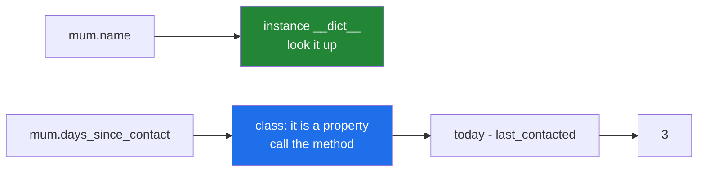

# 2.1 — A property: an attribute that is worked out when you ask

## One-line answer

`@property` turns a method into something you read like an attribute — no brackets — so a value that is
*derived* from what the object stores can be asked for the same way as a value that is stored, and the
caller never has to know which is which.

---

## The story

Open a contact on your phone and look at what it tells you.

**Mum. 07700 900111. Last message: 3 days ago.**

Two of those three were typed in by somebody. The name was typed. The number was typed. Nobody typed
"3 days ago" — and nobody could have, because it was two days ago yesterday and it will be four days ago
tomorrow. There is no box anywhere holding the string "3 days ago".

What the phone has stored is a **date**: the day the last message arrived. The "3 days ago" is worked
out at the moment you look, by subtracting that date from today's.

And here is the bit that makes it interesting rather than obvious: **you cannot tell.** All three lines
look the same on the screen. Nothing marks one of them as calculated. The phone chose to present a
derived value exactly like a stored one, because from where you are standing the difference does not
matter — you asked what it says, and it told you.

---

## The idea in plain language

Objects hold values in their `__dict__`
([Day 12, 2.1](../../../day-12-classes/parts/02-attribute-lookup/2.1-the-instance-dict.md)), and reading
`mum.name` looks the value up there. Some values, though, are not worth storing because they can be
worked out from the ones that are.

There are two obvious ways to offer such a value, and both have a cost:

- **Store it too.** Then there are two facts that must agree, and one day they will not — which is
  [Day 13, 3.3](../../../day-13-inheritance-and-abstraction/parts/03-encapsulation/3.3-the-invariant.md)'s
  invariant problem exactly.
- **Make it a method.** `mum.days_since_contact()` is honest, and it puts brackets on something the
  caller thinks of as a fact rather than an action.

`@property` is the third way. It is a decorator
([Day 14, 1.4](../../../day-14-decorators/parts/01-functions-as-values/1.4-the-at-sign-is-two-lines.md))
that takes a method and makes reading the attribute *call* it:

> Write `def days_since_contact(self)` with `@property` above it, and `mum.days_since_contact` — with no
> brackets — runs the method and gives you its return value.

Three consequences worth having straight from the start.

**Nothing is stored.** There is no `days_since_contact` in the object's `__dict__`, and printing
`vars(mum)` proves it. The value is produced on demand and thrown away.

**It runs every time.** Reading it twice runs the method twice. That is exactly what you want for a
value that changes, and exactly what you do not want if the work is expensive —
[2.3](2.3-the-property-that-did-real-work.md) is that problem and
[2.4](2.4-cached-property-and-the-stale-cache.md) is the standard answer.

**It cannot be assigned to, by default.** `mum.days_since_contact = 10` raises. A property with only a
getter is read-only, which is often precisely right, and [2.2](2.2-the-setter-and-validation.md) is how
you add writing when you want it.

The word for the machinery underneath is **descriptor** — an object that customises what happens when
an attribute is read on an instance. You do not need to write one today; `property` is the descriptor,
already written, and the language reference describes the protocol at
<https://docs.python.org/3/reference/datamodel.html#descriptors>.

---

## Why Setu needs it

- **`Paper` has derived fields.** `age_in_years`, `short_title`, `is_preprint` — every one of them is a
  function of the fields [Day 12, 3.1](../../../day-12-classes/parts/03-the-paper-object/3.1-designing-paper.md)
  already decided to store, and storing them as well is how the two get out of step.
- **[Day 12, 2.2](../../../day-12-classes/parts/02-attribute-lookup/2.2-setting-attributes-from-outside.md)
  showed that anybody can set any attribute from outside.** A read-only property is the first tool that
  makes a field genuinely unassignable, and [2.2](2.2-the-setter-and-validation.md) is the second.
- **Day 19's Pydantic has `@computed_field`**, which is a property that also appears in the serialised
  output. It is the same idea with one extra promise.
- **Phase 12 onward, every estimator has properties** — `coef_`, `n_features_in_` — and Phase 4's
  dataframes are full of them. Reading `df.shape` without brackets and `df.head()` with them is a
  distinction you will make hundreds of times.

---

## The mechanism

```python
"""An attribute that is worked out when somebody asks for it."""

from datetime import date


class Contact:
    def __init__(self, name, number, last_contacted):
        self.name = name
        self.number = number
        self.last_contacted = last_contacted

    @property
    def days_since_contact(self):
        """Not stored anywhere. Worked out from what IS stored."""
        return (date(2026, 9, 1) - self.last_contacted).days


mum = Contact("Mum", "07700 900111", date(2026, 8, 29))

print("read it like an attribute:", mum.days_since_contact)
print("no brackets needed       :", type(mum.days_since_contact).__name__)
print("what is actually stored  :", sorted(vars(mum)))
mum.last_contacted = date(2026, 8, 1)
print("it followed the change   :", mum.days_since_contact)
```

Run on Python 3.12.12 on 2026-09-01:

```
read it like an attribute: 3
no brackets needed       : int
what is actually stored  : ['last_contacted', 'name', 'number']
it followed the change   : 31
```

**Line by line:**

- `from datetime import date` — the standard library's date type. `date(2026, 9, 1)` is written out
  rather than `date.today()` **so the output above is the same whenever you run it**; a real
  implementation uses `date.today()` and a test injects the date, which is
  [Day 10, 3.3](../../../day-10-functions/parts/03-the-module/3.3-pure-functions-and-the-seam.md)'s seam
  again.
- `self.last_contacted = last_contacted` — the **stored** fact. A date, not a phrase.
- `@property` above `def days_since_contact(self)` — the decorator. Reading the attribute now calls this
  method.
- `(date(...) - self.last_contacted)` gives a `timedelta`, and `.days` takes the whole number of days out
  of it. Subtracting two dates is [Day 5, 1.1](../../../day-05-operators-and-conditionals/parts/01-operators/1.1-an-operator-is-a-method-call.md)'s
  point — `-` is a method call, and `date` defines it.
- `mum.days_since_contact` — **no brackets.** With brackets you would get `TypeError: 'int' object is
  not callable`, because the property already gave you the number and you tried to call it.
- `type(...).__name__` is `int` — the property gives back whatever the method returned, with nothing
  wrapped around it.
- `sorted(vars(mum))` shows **three** names and `days_since_contact` is not among them. `vars` is the
  instance `__dict__` ([Day 12, 2.1](../../../day-12-classes/parts/02-attribute-lookup/2.1-the-instance-dict.md)),
  and the property lives on the *class*, not on the object.
- `mum.last_contacted = date(2026, 8, 1)` then reading it again gives `31`. **The derived value followed
  the stored one, because it was never a copy.** That is the whole argument against storing both.

Where the value comes from:



---

## When it breaks

**Calling it like a method:**

```text
$ uv run python -c "
class Contact:
    def __init__(self, n): self.n = n
    @property
    def shout(self): return self.n.upper()
print(Contact('Mum').shout())
"
Traceback (most recent call last):
  File "<string>", line 6, in <module>
TypeError: 'str' object is not callable
```

**What it means.** `Contact('Mum').shout` already ran the method and produced the string `'MUM'`, and
then the `()` tried to call a string. **`'X' object is not callable' right after reading an attribute
means you added brackets to a property.** The message names the *result's* type, which is the clue: the
value arrived fine.

**Assigning to a property that has only a getter:**

```text
$ uv run python -c "
class Contact:
    def __init__(self, n): self.n = n
    @property
    def shout(self): return self.n.upper()
c = Contact('Mum')
c.shout = 'SAM'
"
Traceback (most recent call last):
  File "<string>", line 7, in <module>
AttributeError: property 'shout' of 'Contact' object has no setter
```

**What it means.** A property with no setter is read-only, and Python says so precisely. This is
genuinely useful — it is the first thing on this curriculum that makes an attribute impossible to
overwrite from outside, which
[Day 12, 2.2](../../../day-12-classes/parts/02-attribute-lookup/2.2-setting-attributes-from-outside.md)
established you otherwise cannot do. If you want it writable, [2.2](2.2-the-setter-and-validation.md)
adds a setter.

**Forgetting `@property` on something used as an attribute:**

```text
$ uv run python -c "
class Contact:
    def __init__(self, n): self.n = n
    def shout(self): return self.n.upper()
c = Contact('Mum')
print('is it shouting?', c.shout)
if c.shout:
    print('the if passed')
"
is it shouting? <bound method Contact.shout of <__main__.Contact object at 0x000001192BE8A300>>
the if passed
```

**What it means.** **No error at all**, and both lines are wrong. Reading `c.shout` without brackets
gave the bound method object, which printed as a long piece of machinery, and then `if c.shout:` was
`True` — because a method object is always truthy
([Day 5, 2.2](../../../day-05-operators-and-conditionals/parts/02-conditionals/2.2-truthiness.md)). A
missing `@property` on a method used in a condition is therefore a branch that is always taken, and the
test that catches it has to assert the *value*, not the truthiness.

**A property that names itself:**

```text
$ uv run python -c "
class Contact:
    def __init__(self, number): self.number = number
    @property
    def number(self): return self._number
print(Contact('07700900111').number)
"
Traceback (most recent call last):
  File "<string>", line 5, in <module>
  File "<string>", line 3, in __init__
AttributeError: property 'number' of 'Contact' object has no setter
```

**What it means.** The property is called `number` and `__init__` assigns to `self.number`, so the
constructor's own line hit the read-only property. Read the second frame: **the failure is in
`__init__`, on a line that looks like an ordinary assignment.** The fix is either a different stored name
(`self._number`, with the property returning it) or a setter — and the setter version is where this
pattern becomes powerful, which is the next document.

---

## In production

**The professional rule is that a property must be cheap and must not surprise.** A reader who sees
`mum.days_since_contact` assumes an attribute read: no network, no disk, no exception, no side effect.
That expectation is the whole benefit of the syntax, and breaking it is worse than never having used it
— [2.3](2.3-the-property-that-did-real-work.md) is what that costs. The corollary is that anything slow,
fallible or effectful should keep its brackets, because brackets are how a reader knows to think about
cost.

**What changes at scale is that a property is where "stored versus derived" gets decided, and it is a
decision with a cost either side.** Deriving is always correct and costs time on every read; storing is
fast and costs correctness the moment the inputs change. Real systems draw the line with a rule of
thumb: derive by default, store only when a measurement says the derivation is hot, and when you do
store, make the stored value impossible to set except through the code that keeps it in step.

**The failure that only appears with real data is the property that is not total.** A derived field
usually assumes its inputs are present, and real data has missing values, so `self.last_contacted`
becomes `None` for a contact that has never been messaged, and the property raises `TypeError` in the
middle of rendering a list. Nothing in the call site suggests an attribute read could raise. Properties
over optional data must return something sensible for the missing case — `None`, or a default — and say
so in the docstring.

**The review comment a senior engineer leaves.** *"`total_price` is a property that iterates every line
item, and the template reads it four times, so we walk the list four times per row. Either compute it
once in the view, or make it a `cached_property` and document that the object is treated as immutable
after construction."*

**The interview question.** *"When would you use a property instead of just an attribute?"* The answer
that lands is about the invariant rather than the syntax: a derived value stored alongside its inputs is
two facts that can disagree, and a property makes disagreement impossible by never storing the second
one. Adding the constraint — that a property must be cheap and must not raise, because the call site
looks like an attribute read — shows you have been on the wrong side of one.

---

## Check yourself

```bash
uv run python -c "
from datetime import date

class Contact:
    def __init__(self, name, last_contacted):
        self.name, self.last_contacted = name, last_contacted
    @property
    def days_since_contact(self):
        return (date(2026, 9, 1) - self.last_contacted).days

mum = Contact('Mum', date(2026, 8, 29))
print(mum.days_since_contact, sorted(vars(mum)))
mum.last_contacted = date(2026, 8, 1)
print(mum.days_since_contact)
"
```

`days_since_contact` is not in `vars(mum)` and it still changed when the date did. Now try
`mum.days_since_contact = 0` and read the message.

**Answer out loud, without scrolling up:**

> What does `@property` change about reading an attribute, and where does the value live? Then say what
> happens when you read the same property twice.

---

**Next:** [2.2 — the setter, and validation that cannot be walked round](2.2-the-setter-and-validation.md),
where a property starts guarding what goes in as well as what comes out.
