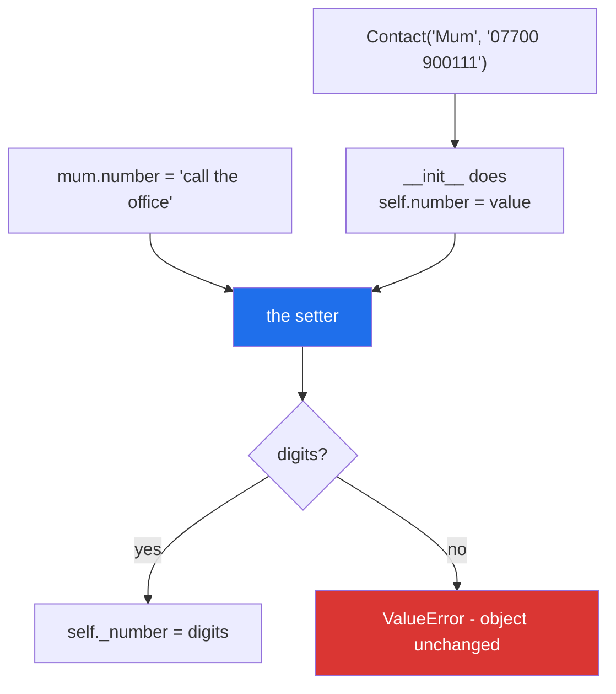

# 2.2 — The setter: validation that cannot be walked round

## One-line answer

`@number.setter` puts a method behind assignment, so `mum.number = "call the office"` runs your check
instead of just storing the value — which closes the hole
[Day 12, 3.2](../../../day-12-classes/parts/03-the-paper-object/3.2-validation-in-init.md) left open,
where the constructor validated and the next line overwrote it.

---

## The story

The number box on the contacts form does not let you type letters.

Try it. Open a new contact, put the cursor in the phone-number field, and press a letter — nothing
appears. The field is not checking afterwards and telling you off; it simply will not accept the
character in the first place. Meanwhile the name field above it takes anything you like, because a name
can be anything.

Two boxes on the same form, and one of them has an opinion.

Now the important part, and it is the reason this is not just a nice touch. The rule lives **in the
box**, not in the person filling it in. It does not matter whether the number arrived because you typed
it, because you pasted it, or because the phone filled it in from a message. Every route in goes through
the same field, and the field has the same opinion every time.

That is not true of a rule written on the form's instructions, which only applies to whoever reads them.

---

## The idea in plain language

[Day 12, 3.2](../../../day-12-classes/parts/03-the-paper-object/3.2-validation-in-init.md) put the
validation in `__init__`, so an object could not be *born* invalid. It also showed the hole:

> `mum = Contact("Mum", "07700 900111")` is checked.
> `mum.number = "call the office"` is not.

Assignment on an ordinary attribute stores whatever it is given
([Day 12, 2.2](../../../day-12-classes/parts/02-attribute-lookup/2.2-setting-attributes-from-outside.md)),
so the constructor's promise lasts exactly until somebody assigns.

A **setter** closes it. `@property` on
[2.1](2.1-a-property-is-worked-out.md) put a method behind *reading*; a setter puts one behind
*writing*:

```text
@property                 ->  reading mum.number calls this
def number(self): ...

@number.setter            ->  writing mum.number = x calls this
def number(self, value): ...
```

Three details decide whether it works.

**The setter is `@<name>.setter`, and `<name>` is the property's name.** `@number.setter` only exists
because `number` is already a property; the decorator is an attribute *of* the property object. Both
methods are also called `number`, which looks like a redefinition and is not — the second one produces a
new property that has both halves.

**The real value goes in a differently-named attribute.** The property is called `number`, so the stored
value cannot also be called `number` or the setter would call itself forever. The convention is one
leading underscore: `self._number`, which
[Day 13, 3.1](../../../day-13-inheritance-and-abstraction/parts/03-encapsulation/3.1-public-protected-private.md)
established means *"internal, do not touch from outside"* and enforces nothing.

**`__init__` should assign through the property.** Writing `self.number = number` in the constructor
runs the setter, so construction and later assignment share one piece of validation. That is the whole
prize: **one rule, one place, every route in.**

---

## Why Setu needs it

- **`Paper` has fields with rules.** A year that must be a number in a sensible range, a title that must
  not be blank, a source that must be one of a known set. Every one of them is a setter, and every one of
  them was bypassable after
  [Day 12, 3.2](../../../day-12-classes/parts/03-the-paper-object/3.2-validation-in-init.md).
- **[Day 13, 3.3](../../../day-13-inheritance-and-abstraction/parts/03-encapsulation/3.3-the-invariant.md)
  defined an invariant as something that must always be true.** A setter is the first mechanism on this
  curriculum that can actually hold one, rather than checking it once and hoping.
- **Day 19's Pydantic validates on assignment**, but only if you ask — `model_config =
  ConfigDict(validate_assignment=True)`. Knowing what that setting turns on, because you wrote it by
  hand today, is the difference between a checked model and a decorated one.
- **Day 226 loads papers from a database and Day 231 has an agent write to them.** Principle 11's blast
  radius says an object an agent can reach should refuse bad values itself, not rely on the agent being
  careful.

---

## The mechanism

```python
"""A setter: validation that cannot be walked round."""


class Contact:
    def __init__(self, name, number):
        self.name = name
        self.number = number  # goes through the setter below

    @property
    def number(self):
        return self._number

    @number.setter
    def number(self, value):
        digits = value.replace(" ", "").replace("-", "")
        if not digits.isdigit():
            raise ValueError(f"a phone number must be digits, got {value!r}")
        self._number = digits


mum = Contact("Mum", "07700 900111")
print("stored, normalised:", mum.number)
print("what is really on the object:", sorted(vars(mum)))

try:
    mum.number = "call the office"
except ValueError as error:
    print("assignment refused:", error)

try:
    Contact("Dad", "ask Mum")
except ValueError as error:
    print("construction refused:", error)

print("still the old value:", mum.number)
```

Run on Python 3.12.12 on 2026-09-01:

```
stored, normalised: 07700900111
what is really on the object: ['_number', 'name']
assignment refused: a phone number must be digits, got 'call the office'
construction refused: a phone number must be digits, got 'ask Mum'
still the old value: 07700900111
```

**Line by line:**

- `self.number = number` in `__init__` — this line **calls the setter**. It looks like a plain
  assignment, which is the point: the constructor does not know or care that validation is happening.
- `@property def number(self): return self._number` — the getter, and it does nothing but hand back the
  stored value. A getter that only returns is worth writing anyway, because it is what makes the setter
  possible.
- `@number.setter` — read it as *"the setter belonging to the property called `number`"*. If the property
  above were named `phone`, this line would have to be `@phone.setter`, and a mismatch is the first
  failure below.
- `def number(self, value):` — **two parameters**, the object and the value being assigned. The name
  `value` is convention; nothing enforces it.
- `value.replace(" ", "").replace("-", "")` — normalising before checking, so `"07700 900111"` and
  `"07700-900111"` both pass. **The setter normalises as well as validates**, which is why every stored
  number is in one format regardless of how it was typed.
- `if not digits.isdigit(): raise ValueError(...)` — `isdigit` is `False` for an empty string too, so a
  blank number is refused by the same line. The message includes `{value!r}` — the original, with quotes
  — so the person reading the log sees exactly what was sent
  ([Day 7, 3.3](../../../day-07-strings/parts/03-formatting/3.3-repr-and-the-debugging-f-string.md)).
- `self._number = digits` — the **underscore name**, and the only place it is ever assigned. Assigning to
  `self.number` here would call the setter again, forever, which is the second failure below.
- `sorted(vars(mum))` is `['_number', 'name']` — the object stores `_number`, not `number`. The
  attribute the outside world uses does not exist on the instance at all
  ([2.1](2.1-a-property-is-worked-out.md)).
- `mum.number = "call the office"` raised, and the **last line proves the old value survived**. A setter
  that raises leaves the object exactly as it was, which is what makes a failed assignment safe.
- The same message came from a constructor and from an assignment. **One rule, written once.**

Both doors, one guard:



---

## When it breaks

**The setter's decorator naming the wrong property:**

```text
$ uv run python -c "
class Contact:
    def __init__(self, number): self.number = number
    @property
    def number(self): return self._number
    @phone.setter
    def number(self, value): self._number = value
print(Contact('07700900111').number)
"
Traceback (most recent call last):
  File "<string>", line 2, in <module>
  File "<string>", line 6, in Contact
NameError: name 'phone' is not defined. Did you mean: 'None'?
```

**What it means.** `@number.setter` works because `number` is a name that already exists **in the class
body at that point**, holding the property object. `phone` was never defined, so the decorator line
failed while the class was still being built — note the frame `in Contact`, which is the class body
executing. Renaming a property means renaming its setter's decorator too.

**A setter that assigns to its own property:**

```text
$ uv run python -c "
import sys
sys.setrecursionlimit(60)
class Contact:
    @property
    def number(self): return self._number
    @number.setter
    def number(self, value): self.number = value
Contact().number = '07700900111'
"
Traceback (most recent call last):
  File "<string>", line 9, in <module>
  File "<string>", line 8, in number
  File "<string>", line 8, in number
  File "<string>", line 8, in number
  [Previous line repeated 56 more times]
RecursionError: maximum recursion depth exceeded
```

**What it means.** `self.number = value` inside the setter *is an assignment to `number`*, so it calls
the setter, which assigns to `number`, and so on. The `[Previous line repeated]` marker and one line
number appearing over and over is the signature of infinite recursion. The stored name has to be
different — `self._number` — and this is the single most common mistake in the pattern. (The recursion
limit is lowered here only to keep the traceback short.)

**Validation that only lives in `__init__`:**

```text
$ uv run python -c "
class Contact:
    def __init__(self, number):
        if not number.replace(' ', '').isdigit():
            raise ValueError('a phone number must be digits')
        self.number = number

mum = Contact('07700 900111')
print('constructed ok  :', mum.number)
mum.number = 'call the office'
print('and then        :', mum.number)
"
constructed ok  : 07700 900111
and then        : call the office
```

**What it means.** The constructor's check is real and completely bypassed one line later, with no
error — this is
[Day 12, 3.2](../../../day-12-classes/parts/03-the-paper-object/3.2-validation-in-init.md)'s open hole
in three lines. **An object that was valid when it was built is not the same promise as an object that
is always valid**, and only the second one is worth relying on.

**A setter that is bypassed by writing to the underscore name:**

```text
$ uv run python -c "
class Contact:
    def __init__(self, number): self.number = number
    @property
    def number(self): return self._number
    @number.setter
    def number(self, value):
        if not value.isdigit():
            raise ValueError('digits only')
        self._number = value

mum = Contact('07700900111')
mum._number = 'call the office'
print('the setter was skipped:', mum.number)
"
the setter was skipped: call the office
```

**What it means.** One underscore is a convention and not a lock
([Day 13, 3.1](../../../day-13-inheritance-and-abstraction/parts/03-encapsulation/3.1-public-protected-private.md)),
so anybody who wants to can write straight to the storage. This is not a reason to skip the setter — it
is a reason to be clear about what it buys. **A setter prevents accidents, not attacks.** It catches the
caller who wrote the obvious thing; it does not stop the caller who deliberately went round it, and no
Python mechanism does.

---

## In production

**The professional habit is that a setter validates and normalises, and does nothing else.** No network,
no database write, no logging that costs anything, no triggering of other updates. A reader looking at
`paper.year = 2019` expects an assignment, and an assignment that opens a connection is the same broken
promise as a property that does — [2.3](2.3-the-property-that-did-real-work.md) is that argument in full.
Setters that fire other work are how a single assignment ends up costing four queries, and the call site
gives no hint.

**What changes at scale is that hand-written setters stop being the right tool.** Fifteen fields with
rules is fifteen getter-setter pairs, sixty lines of boilerplate and fifteen chances to write
`self.number` where `self._number` was meant. That is precisely the problem Pydantic solves on Day 19 —
declare the type and the constraint, get the validation generated — and the reason to write two by hand
today is so that the generated version is recognisable rather than magic
([Principle 2](../../../../docs/00_MASTER_PLAN_DS_GENAI.md)).

**The failure that only appears with real data is the setter that runs during `__init__` before its
dependencies exist.** A setter that validates `number` against `self.country_code` breaks when
`__init__` assigns `number` first, with an `AttributeError` naming a field the reader can see being
assigned two lines further down. The rule is to assign the fields a setter depends on **before** the
fields that depend on them, and — because that ordering is invisible — to say so in a comment where it
matters.

**The review comment a senior engineer leaves.** *"`year` is validated in `__init__` and nowhere else,
and `update_from_row` assigns to it directly, so a bad row produces a `Paper` with `year=0`. Make it a
property with a setter and have `__init__` assign through it — then both paths get the same check and
the test you already wrote covers both."*

**The interview question.** *"How do you make sure an object's field is always valid?"* Validating in
`__init__` is the half everybody gives; the half that shows experience is knowing it is not enough,
because assignment goes straight past it. A property with a setter puts one rule behind every write,
including the constructor's, and the two things to say next are that the stored attribute must have a
different name or the setter recurses forever, and that the leading underscore is a convention — a
setter prevents accidents, not determined bypass.

---

## Check yourself

```bash
uv run python -c "
class Contact:
    def __init__(self, name, number):
        self.name, self.number = name, number
    @property
    def number(self): return self._number
    @number.setter
    def number(self, value):
        digits = value.replace(' ', '').replace('-', '')
        if not digits.isdigit():
            raise ValueError(f'a phone number must be digits, got {value!r}')
        self._number = digits

mum = Contact('Mum', '07700-900111')
print(mum.number, sorted(vars(mum)))
try:
    mum.number = 'call the office'
except ValueError as e:
    print('refused:', e)
print('unchanged:', mum.number)
"
```

Now change `self._number = digits` to `self.number = digits` and read the traceback. Say in one sentence
why it never stops.

**Answer out loud, without scrolling up:**

> What does a setter add that validating in `__init__` does not? Then say why the stored attribute must
> have a different name from the property, and what one leading underscore does and does not prevent.

---

**Next:** [2.3 — the property that did real work](2.3-the-property-that-did-real-work.md), where the
syntax that hides a method call starts hiding a cost.
