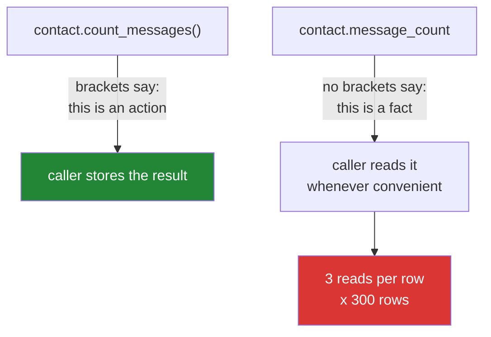

# 2.3 — The property that did real work, and the caller who read it four times

## One-line answer

A property is read like an attribute, so callers read it as often as it is convenient — which is fine
when it is a subtraction and expensive when it walks a list, opens a file or makes a request, because
nothing at the call site says the read costs anything.

---

## The story

The contacts app grows a new line under each name: **"142 messages"**.

It is genuinely useful. It also has to be counted, and counting means going through the message history
for that person. On one contact, opened on its own, nobody notices.

Then somebody puts the same line in the contacts *list*. Now every row on the screen counts its own
history, and there are three hundred rows, and scrolling gets sticky in a way that is hard to attribute
to anything, because every individual line of code involved looks trivial. The row template says
`contact.message_count` three times — once to show the number, once to decide whether to show the
"chatty" badge, and once when the row is packed up to be sent to the widget. Three counts per row, nine
hundred passes over the message history to draw one screen.

Nobody wrote a loop. Nobody wrote anything that looks slow. Somebody wrote **a fact that has to be
worked out, in a place where facts are free**, and then read it the number of times you read a fact.

---

## The idea in plain language

`@property` ([2.1](2.1-a-property-is-worked-out.md)) removes the brackets. That is its whole benefit and
its whole cost.

The brackets were doing a job. `count_messages()` tells a reader *"this is an action, it takes time,
call it once and keep the answer."* `message_count` tells a reader *"this is a fact, read it whenever."*
People then behave accordingly, and they are right to — the syntax made a promise.

So a property carries an unwritten contract, and it has four clauses:

- **Cheap.** Cheap enough that reading it three times in a row is not a decision.
- **Total.** It returns a value for every state the object can be in, rather than raising for some of
  them. A read that can raise turns every `f"{contact.days_since}"` into something needing a `try`.
- **Pure.** No side effects. Reading a fact must not change anything, because debuggers, `repr`, IDE
  tooltips and logging frameworks all read attributes without asking.
- **Consistent.** Reading it twice with nothing changed in between gives the same answer.

If any of those is false, the honest thing is a method with brackets. `contact.count_messages()` is not
worse code; it is more truthful code, and truth at the call site is what stops somebody putting it in a
loop.

That "pure" clause deserves a second look, because it is the one people break by accident. A debugger
showing an object's attributes reads every property on it. So does an editor's variable inspector, so
does a naive `__repr__` that loops over `dir(self)`. If a property increments a counter, writes a log
line or opens a connection, all of that happens **because somebody hovered over a variable** — and the
resulting bug is unreproducible without the debugger that caused it.

---

## Why Setu needs it

- **Phase 4's dataframes make this decision constantly.** `df.shape` is a property because it is two
  stored numbers; `df.describe()` has brackets because it computes. Reading which is which is how you
  guess a library's costs before profiling it.
- **`Paper.abstract_word_count` is exactly the trap.** It is one line to write as a property and it
  walks the whole abstract, and Day 233's eval suite will render thousands of papers in a loop.
- **Phase 19's retrieval scores must not be properties.** A property that ran a vector search would put
  a network call behind an attribute read, and the code doing the reading is a template.
- **Principle 5 makes this a budget question, not only a speed one.** A property that calls an API is a
  request nobody counted, fired as many times as somebody happened to read it.

---

## The mechanism

```python
"""A property that looks free and is not."""

import time

READS = {"n": 0}


class Contact:
    def __init__(self, name, messages):
        self.name = name
        self.messages = messages

    @property
    def word_count(self):
        """Looks like a field. Walks every message, every time."""
        READS["n"] += 1
        return sum(len(m.split()) for m in self.messages)


mum = Contact("Mum", ["are you coming sunday " * 200] * 500)

start = time.perf_counter()
line = f"{mum.name}: {mum.word_count} words"
if mum.word_count > 100:
    line += " (chatty)"
summary = {"name": mum.name, "words": mum.word_count}
print(line[:40])
print("summary words:", summary["words"])
print("property reads in three lines:", READS["n"])
print(f"time for those three lines   : {time.perf_counter() - start:.3f}s")

READS["n"] = 0
start = time.perf_counter()
words = mum.word_count
line = f"{mum.name}: {words} words"
if words > 100:
    line += " (chatty)"
summary = {"name": mum.name, "words": words}
print("read once into a name        :", READS["n"])
print(f"time                         : {time.perf_counter() - start:.3f}s")
```

Run on Python 3.12.12 on 2026-09-01. Your timings will differ; the ratio is the point:

```
Mum: 400000 words (chatty)
summary words: 400000
property reads in three lines: 3
time for those three lines   : 0.035s
read once into a name        : 1
time                         : 0.010s
```

**Line by line:**

- `READS` is a module-level counter so the demonstration can say how many times the property actually
  ran. It is a measuring device, not a pattern — a real property must not write anything, which is the
  third failure below.
- `["are you coming sunday " * 200] * 500` — five hundred messages of about a thousand words each. Small
  enough to build instantly, big enough that walking it is measurable.
- `sum(len(m.split()) for m in self.messages)` — a generator expression inside `sum`
  ([Day 9, 2.3](../../../day-09-comprehensions/parts/02-dict-set-gen/2.3-the-generator-expression.md)),
  which is the efficient way to write it. **The property is not badly written.** It is correctly written
  and read three times.
- The three reads are `f"...{mum.word_count}..."`, `if mum.word_count > 100:` and `{"words":
  mum.word_count}`. Every one of them looks like reading a field, and no reviewer would flag any of
  them.
- `property reads in three lines: 3` — the count, made visible. In the contacts list from the story this
  is three per row.
- `0.035s` against `0.010s` — **three and a half times the work for the same screen**, and the second
  version differs only in that the value went into a name first.
- `words = mum.word_count` is the entire fix at the call site, and it is what a reader would have done
  by instinct if the thing had brackets on it.
- The badge check `if words > 100` reads the local name. Nothing about the object's design changed; the
  caller stopped asking three times.

What the brackets were telling you:



---

## When it breaks

**A property that raises on real data:**

```text
$ uv run python -c "
class Contact:
    def __init__(self, name, last): self.name, self.last = name, last
    @property
    def days_since(self):
        return (2026 - self.last)

book = [Contact('Mum', 2026), Contact('Sam', None)]
for c in book:
    print(f'{c.name}: {c.days_since}')
"
Mum: 0
Traceback (most recent call last):
  File "<string>", line 10, in <module>
  File "<string>", line 6, in days_since
TypeError: unsupported operand type(s) for -: 'int' and 'NoneType'
```

**What it means.** The first contact rendered and the second one killed the loop, because `Sam` has
never been messaged and `last` is `None`. **The line that raised is an f-string** — nothing about
`f'{c.days_since}'` suggests it can fail, so no caller will ever wrap it in a `try`. A property over
optional data must handle the missing case itself and say what it returns for it, or it must not be a
property.

**A property with a side effect, fired by looking at the object:**

```text
$ uv run python -c "
class Contact:
    def __init__(self, name): self.name, self.reads = name, 0
    @property
    def label(self):
        self.reads += 1
        return f'{self.name} (read {self.reads} times)'

c = Contact('Mum')
print(c.label)
print(c.label)
print('reads after two prints:', c.reads)
print(repr(vars(c)))
"
Mum (read 1 times)
Mum (read 2 times)
reads after two prints: 2
{'name': 'Mum', 'reads': 2}
```

**What it means.** Reading changed the object, and the two prints do not agree with each other. Now
imagine that counter is a database write or an API call: **a debugger's variable panel, an editor
tooltip or a logging call that renders the object will all trigger it**, so the count depends on who was
watching. This is the hardest category of bug to reproduce, because the act of investigating causes it.

**A property that hides a network call:**

```text
$ uv run python -c "
CALLS = {'n': 0}

def fetch_citations(paper_id):
    CALLS['n'] += 1
    return 42

class Paper:
    def __init__(self, paper_id): self.paper_id = paper_id
    @property
    def citations(self): return fetch_citations(self.paper_id)

papers = [Paper(i) for i in range(20)]
top = [p for p in papers if p.citations > 10]
report = [(p.paper_id, p.citations) for p in top]
print('papers:', len(papers), '| requests made:', CALLS['n'])
"
papers: 20 | requests made: 40
```

**What it means.** Twenty papers, forty requests, from two lines that both look like filters. On a free
tier that is a quota gone ([Day 3, 4.1](../../../day-03-keys-and-budget/parts/04-rate-budget/4.1-rpm-rpd-tpm.md)),
and neither line of code contains anything a reviewer would stop at. **A property must never do input or
output.** If a value comes from outside the process, its accessor keeps its brackets so the call site
shows the cost.

---

## In production

**The professional rule of thumb is: if it is more expensive than an attribute lookup and a bit of
arithmetic, give it brackets.** The exceptions are values so central that a cache is worth the
complexity, and that is [2.4](2.4-cached-property-and-the-stale-cache.md)'s subject — but caching is a
second decision with its own failure mode, not a way of avoiding this one. Libraries with good
ergonomics are strict about it: `len(x)` and `x.shape` are cheap, `x.describe()` and `x.sum()` have
brackets, and you can predict a library's cost model from its punctuation.

**What changes at scale is that the read count is not written anywhere.** A method called in a loop is
visible in a profile as one hot function; a property read three times per row across four templates is
spread over four files and shows up as *"rendering is slow"*. The professional habit when a property
does turn out to be hot is to leave the property in place — callers have already been written against
it — and to add the local name at the call site, exactly as the mechanism above does, because that fix
is local and obvious.

**The failure that only appears with real data is the property that is cheap on small objects.** Word
counts, sums over child records, "does this have any errors" checks — all instant on the three-row
fixture in the test suite, all linear in something that is unbounded in production. The tell is a
property whose body contains a loop, a comprehension or a call to another object's property, and the
question to ask is *"what is the biggest this collection gets?"*

**The review comment a senior engineer leaves.** *"`total_words` walks every message and the template
reads it three times per row. Assign it to a local at the top of the row block. Longer term this wants
to be a stored column updated on write — but the one-line fix pays for itself now."*

**The interview question.** *"When should something be a property and when should it be a method?"* The
answer that lands is about the promise the syntax makes: no brackets tells callers this is a fact, so
they will read it as often as it is convenient, and the property must therefore be cheap, total, pure
and consistent. Adding the diagnostic — that a slow property shows up as diffuse slowness rather than
one hot function, because the reads are spread across templates — shows you have chased one.

---

## Check yourself

```bash
uv run python -c "
import time

READS = {'n': 0}

class Contact:
    def __init__(self, name, messages):
        self.name, self.messages = name, messages
    @property
    def word_count(self):
        READS['n'] += 1
        return sum(len(m.split()) for m in self.messages)

mum = Contact('Mum', ['are you coming sunday ' * 200] * 500)
start = time.perf_counter()
_ = f'{mum.word_count} words'
_ = mum.word_count > 100
_ = {'words': mum.word_count}
print('reads:', READS['n'], f'time: {time.perf_counter() - start:.3f}s')
"
```

Three reads for one screen. Rewrite the three lines so the property is read once, and compare the time.

**Answer out loud, without scrolling up:**

> Name the four things a property promises a caller by not having brackets. Then say why a property with
> a side effect is unusually hard to debug.

---

**Next:** [2.4 — `cached_property`, and the cache that went stale](2.4-cached-property-and-the-stale-cache.md),
which is the standard fix for this document's problem and brings a new one.
