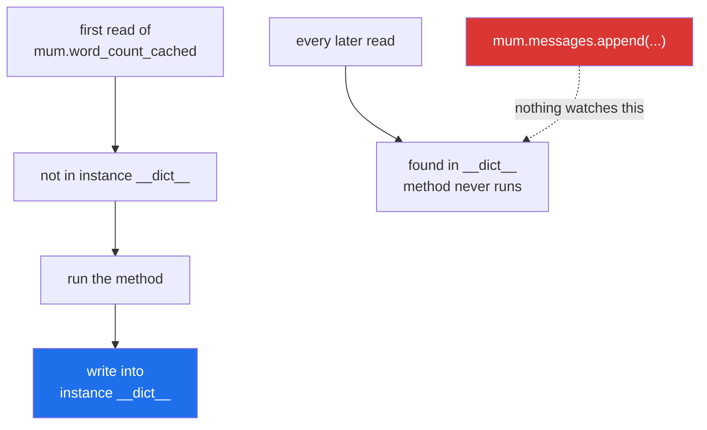

# 2.4 — `cached_property`, and the value that stopped being true

## One-line answer

`functools.cached_property` works the value out the first time it is read and then stores it **on the
instance**, so every later read is a plain attribute lookup — which fixes
[2.3](2.3-the-property-that-did-real-work.md)'s repeated cost and introduces the one problem a plain
property could never have: an answer that is out of date.

---

## The story

The contact screen now shows **"142 messages"** without the scrolling going sticky, because somebody
worked out the number once and wrote it under the name.

It is right for about a minute.

A message arrives. The history now has 143 in it, and the line still says 142, because nothing told it
to count again. It is not wrong in an obvious way — it is one out, which is exactly the kind of wrong
nobody notices and nobody can reproduce. *"I'm sure it said 142 a moment ago"*, and it did.

The thing to be clear about is what changed. Before, the number was worked out at the moment you looked
at it, and it was always right and always cost something. Now it is worked out once and it is free
afterwards, and it is only right until the thing it was counting changes.

That is not a bug in the counting. It is the trade, and it has been made whether or not anybody decided
it.

---

## The idea in plain language

`functools.cached_property` is a decorator that behaves like `@property` on the **first** read and like
an ordinary attribute on every read after that.

The mechanism is worth knowing exactly, because it explains all of its behaviour:

> On the first read it calls the method and then **writes the result into the instance's `__dict__`
> under the property's own name**. Attribute lookup on an instance finds `__dict__` first, so every
> later read never reaches the descriptor at all.

Three consequences follow directly.

**It really is free after the first read.** Not "cheaper" — the same cost as reading `self.name`,
because it *is* reading an ordinary entry in the instance dictionary.

**There is no invalidation, and there cannot be.** Nothing watches the inputs. Nothing expires. The
value is correct until something the method depended on changes, and then it is silently wrong. You
clear it with `del obj.word_count`, which removes the stored entry so the next read computes again.

**It needs the object to have a `__dict__`.** A class using `__slots__`
([Day 12, 2.3](../../../day-12-classes/parts/02-attribute-lookup/2.3-slots-and-a-million-objects.md))
has nowhere to write, and the failure is a `TypeError` at the first read.

It is documented at
<https://docs.python.org/3/library/functools.html#functools.cached_property>, and it is worth comparing
it with the cache you met yesterday. `functools.cache`
([Day 14, 4.2](../../../day-14-decorators/parts/04-the-toolkit/4.2-functools-cache-and-its-trap.md))
stores in a dictionary that lives on the *function*, keyed by the arguments — which on a method means
the key holds `self`, and every instance is kept alive forever.

| | `@cached_property` | `@functools.cache` on a method |
|---|---|---|
| where the value lives | the instance's `__dict__` | a dict on the function |
| freed when the object is | yes, with the object | **no — the object is retained** |
| takes arguments | no | yes |
| clearing it | `del obj.name` | `Method.cache_clear()`, all instances at once |

For a per-object derived value, `cached_property` is the right tool and the memory leak simply does not
arise.

The rule that makes it safe: **cache a value only on an object whose inputs do not change after
construction.** If the object is treated as immutable — built, used, discarded — a cached property is
correct and free. If the object is edited, a cached property is a bug waiting for the first edit.

---

## Why Setu needs it

- **[2.3](2.3-the-property-that-did-real-work.md) ends with a problem and this is the standard fix**, so
  the pair is one decision: derive every time, or derive once and accept staleness.
- **A `Paper`'s embedding is the real case.** Phase 18 embeds an abstract into a vector — expensive,
  local, and a pure function of the abstract. A `Paper` whose abstract never changes after construction
  is exactly the object this is safe on.
- **Day 19's Pydantic models are frozen by default in the shape this wants** (`model_config =
  ConfigDict(frozen=True)`), and a frozen model is precisely one where caching a derived value cannot go
  stale.
- **Principle 5 again.** If the derived value costs a request or a second of local compute, computing it
  once per object rather than once per read is the difference between a lab that runs and one that does
  not.

---

## The mechanism

```python
"""cached_property: worked out once, stored on the instance."""

import functools


class Contact:
    def __init__(self, name, messages):
        self.name = name
        self.messages = messages

    @property
    def word_count_fresh(self):
        print("    (counting...)")
        return sum(len(m.split()) for m in self.messages)

    @functools.cached_property
    def word_count_cached(self):
        print("    (counting...)")
        return sum(len(m.split()) for m in self.messages)


mum = Contact("Mum", ["are you coming sunday", "bring the blue bowl"])

print("property, twice:")
print("   ", mum.word_count_fresh)
print("   ", mum.word_count_fresh)
print("cached_property, twice:")
print("   ", mum.word_count_cached)
print("   ", mum.word_count_cached)
print("what is on the instance now:", sorted(vars(mum)))

mum.messages.append("and the bread")
print("after adding a message, cached:", mum.word_count_cached)
print("after adding a message, fresh :", mum.word_count_fresh)
```

Run on Python 3.12.12 on 2026-09-01:

```
property, twice:
    (counting...)
    8
    (counting...)
    8
cached_property, twice:
    (counting...)
    8
    8
what is on the instance now: ['messages', 'name', 'word_count_cached']
after adding a message, cached: 8
    (counting...)
after adding a message, fresh : 11
```

**Line by line:**

- The two methods have **identical bodies**. Only the decorator differs, and every difference in the
  output comes from that.
- `print("    (counting...)")` inside the body is how the demonstration shows when the work happens. It
  is a side effect in a property, which [2.3](2.3-the-property-that-did-real-work.md) says never to do —
  it is here to make the mechanism visible and nowhere else.
- `word_count_fresh` printed `(counting...)` **twice** for two reads. That is
  [2.1](2.1-a-property-is-worked-out.md)'s "it runs every time".
- `word_count_cached` printed it **once** for two reads. The second read never entered the method.
- `sorted(vars(mum))` now includes **`word_count_cached`** and not `word_count_fresh`. That single line
  is the whole mechanism: the cached value was written into the instance's `__dict__`
  ([Day 12, 2.1](../../../day-12-classes/parts/02-attribute-lookup/2.1-the-instance-dict.md)) under the
  property's own name, and instance attributes are found before class-level descriptors.
- `mum.messages.append("and the bread")` changes the input **in place**
  ([Day 4, 2.2](../../../day-04-objects/parts/02-containers/2.2-what-in-place-means.md)). No assignment
  happened, so nothing could possibly have noticed.
- `after adding a message, cached: 8` — **the stale answer.** Three more words went in and the cached
  count did not move. No error, no warning; just a number that used to be true.
- `after adding a message, fresh : 11` printed `(counting...)` first and gave the right answer. Both
  properties are working exactly as designed, and they now disagree.
- The fix, when you need it, is `del mum.word_count_cached` — that removes the entry from `__dict__`, so
  the next read recomputes.

Where the value goes:



---

## When it breaks

**Clearing a cached property that has never been read:**

```text
$ uv run python -c "
import functools
class Contact:
    def __init__(self, messages): self.messages = messages
    @functools.cached_property
    def word_count(self): return sum(len(m.split()) for m in self.messages)

c = Contact(['one two'])
del c.word_count
"
Traceback (most recent call last):
  File "<string>", line 9, in <module>
AttributeError: 'Contact' object has no attribute 'word_count'
```

**What it means.** `del` removes the entry from the instance dictionary, and there is nothing there
until the first read. A cache-clearing helper therefore cannot just `del`; it needs
`self.__dict__.pop("word_count", None)`, which is harmless when the value was never computed. This
catches people writing a `refresh()` method, because it fails only on the object nobody read first.

**A cached property on a class with `__slots__`:**

```text
$ uv run python -c "
import functools
class Contact:
    __slots__ = ('messages',)
    def __init__(self, messages): self.messages = messages
    @functools.cached_property
    def word_count(self): return sum(len(m.split()) for m in self.messages)

print(Contact(['one two']).word_count)
"
Traceback (most recent call last):
  File "<string>", line 9, in <module>
  File "...\Lib\functools.py", line 995, in __get__
    raise TypeError(msg) from None
TypeError: No '__dict__' attribute on 'Contact' instance to cache 'word_count' property.
```

**What it means.** `__slots__` removes the instance dictionary in exchange for memory
([Day 12, 2.3](../../../day-12-classes/parts/02-attribute-lookup/2.3-slots-and-a-million-objects.md)),
and `cached_property` has nowhere to put the value. The message says exactly this, which is unusually
kind. **The two optimisations are mutually exclusive**, and choosing between them is a real decision:
slots for a million small objects, cached properties for a few expensive ones.

**A cached property overwritten by assignment:**

```text
$ uv run python -c "
import functools
class Contact:
    def __init__(self, messages): self.messages = messages
    @functools.cached_property
    def word_count(self): return sum(len(m.split()) for m in self.messages)

c = Contact(['one two three'])
c.word_count = 99
print('reads back as:', c.word_count)
print('instance dict:', vars(c))
"
reads back as: 99
instance dict: {'messages': ['one two three'], 'word_count': 99}
```

**What it means.** No error. A `cached_property` has no setter and does not need one, because assignment
writes straight into the instance dictionary — the same slot the cache uses. So it is **silently
writable**, unlike a read-only `@property` which raises
([2.1](2.1-a-property-is-worked-out.md)). Anybody who assigns to it, deliberately or by typo, replaces
the cached value with whatever they wrote, and every later read agrees with them.

**A shared mutable value handed out by a cache:**

```text
$ uv run python -c "
import functools
class Contact:
    def __init__(self, messages): self.messages = messages
    @functools.cached_property
    def words(self): return sorted({w for m in self.messages for w in m.split()})

c = Contact(['bring the bowl'])
first = c.words
first.append('OOPS')
print('second reader gets:', c.words)
print('same object?      :', c.words is first)
"
second reader gets: ['bowl', 'bring', 'the', 'OOPS']
same object?      : True
```

**What it means.** The cache stores a reference, not a copy, so the list handed to the first reader *is*
the cached value — and appending to it changed what everybody else will see. This is
[Day 14, 4.2](../../../day-14-decorators/parts/04-the-toolkit/4.2-functools-cache-and-its-trap.md)'s
shared-mutable trap in a different decorator, and the same rule applies: **cache immutable values**, or
return a tuple, or copy at the call site.

---

## In production

**The professional rule is that a cached property belongs on an object that is treated as immutable
after construction**, and that this treatment is stated rather than assumed. In practice that means a
frozen dataclass, a Pydantic model with `frozen=True`, or a class whose docstring says *"fields are set
once in `__init__`; do not mutate"* — and whose setters, if it has any, clear the caches they invalidate.
Half-frozen objects, where two fields are edited and three are cached, are where the confusing bugs
live.

**What changes at scale is the memory.** A cached property on ten thousand objects is ten thousand extra
entries held for as long as the objects live, and if the cached thing is an embedding vector or a parsed
document that is real memory that was previously transient. The saving is real too — the point is that
it is a trade between time and space, and at scale somebody has to have measured which side they wanted.

**The failure that only appears with real data is the cache filled before the object was finished.**
An object built in stages — construct, then set a few fields from a second source, then use — will
happily cache a derived value in the middle, from the half-filled state, if anything reads it. Logging,
a debugger, a `repr` or a validation pass are all enough. The defence is to finish building objects
before anybody reads them, which is another argument for doing all the work in `__init__` or an
alternative constructor ([1.2](../01-three-kinds-of-method/1.2-from-message-the-second-door-in.md))
rather than in a sequence of assignments.

**The review comment a senior engineer leaves.** *"`embedding` is a `cached_property` and
`set_abstract()` changes the text it was computed from, so any paper that has been edited carries an
embedding for the previous abstract. Either drop the setter and make the object immutable, or have it do
`self.__dict__.pop('embedding', None)`."*

**The interview question.** *"What is the difference between `property` and `cached_property`?"* The
mechanism is the answer: `cached_property` stores the result in the instance's `__dict__` under the same
name, so subsequent reads are ordinary attribute lookups and never reach the descriptor. What follows
from that is the interesting half — it is per-object rather than global, it is freed with the object
(unlike `functools.cache` on a method, which retains every instance), it needs a `__dict__` so it is
incompatible with `__slots__`, it is silently assignable, and it never invalidates, so it belongs only
on objects that do not change.

---

## Check yourself

```bash
uv run python -c "
import functools

class Contact:
    def __init__(self, messages): self.messages = messages
    @functools.cached_property
    def word_count(self):
        print('  (counting)')
        return sum(len(m.split()) for m in self.messages)

c = Contact(['are you coming sunday'])
print(c.word_count)
print(c.word_count)
print('instance dict:', sorted(vars(c)))
c.messages.append('bring the bowl')
print('after a new message:', c.word_count)
del c.word_count
print('after clearing     :', c.word_count)
"
```

`(counting)` prints twice: once at the start and once after the `del`. Say what the middle three reads
had in common.

**Answer out loud, without scrolling up:**

> Where does a `cached_property` store its value, and how do you clear it? Then say the one property an
> object must have before caching a derived value on it is safe.

---

**Next:** section 3 begins at [3.1 — what a dunder method is](../03-the-dunders/3.1-what-a-dunder-method-is.md),
where the language starts calling your methods for you.
