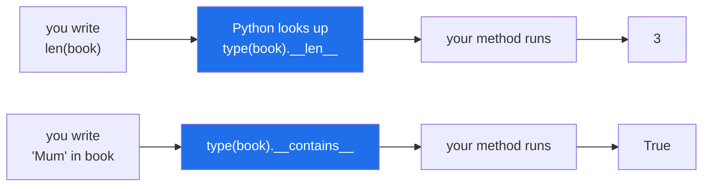

# 3.1 — What a dunder method is: the name Python calls for you

## One-line answer

Built-in syntax is method calls in disguise — `len(x)` runs `type(x).__len__(x)`, `a == b` runs
`type(a).__eq__(a, b)`, `x in y` runs `type(y).__contains__(y, x)` — so writing a method with the right
double-underscore name is how an object of yours joins in with syntax that already exists.

---

## The story

You have never learned a special way to count contacts.

You know how many are in the list because the app says so at the top, and if you wanted to know how many
photos were in an album you would look at the same place on that screen. Somebody asks *"how many?"*, and
whether the answer is contacts or photos or unread messages, the question is the same shape.

That is not an accident of how phones happen to be built. It is a decision somebody made: **the app
answers a question everybody already knows how to ask**, rather than inventing a new one. If contacts
had a `count contacts` button and photos had a `photo tally` menu item, both would work, and every
screen would need learning separately.

The interesting bit is who is doing what. The person asking does not know how the counting happens.
The screen does not know what the question will be used for. There is a question, in a shape both sides
agreed on in advance, and each side does its half.

---

## The idea in plain language

Python has the same arrangement, and it is nearly the whole of how the language works on objects.

You met the first case on
[Day 5, 1.1](../../../day-05-operators-and-conditionals/parts/01-operators/1.1-an-operator-is-a-method-call.md):
`a + b` is not a special instruction, it is `type(a).__add__(a, b)`. The same is true of almost
everything that looks like syntax:

| What you write | What Python calls |
|---|---|
| `len(x)` | `type(x).__len__(x)` |
| `x[k]` | `type(x).__getitem__(x, k)` |
| `k in x` | `type(x).__contains__(x, k)` |
| `a == b` | `type(a).__eq__(a, b)` |
| `a < b` | `type(a).__lt__(a, b)` |
| `for i in x` | `type(x).__iter__(x)` |
| `print(x)` | `type(x).__str__(x)` |
| `repr(x)` | `type(x).__repr__(x)` |
| `with x:` | `type(x).__enter__(x)` and `__exit__` |
| `x()` | `type(x).__call__(x)` |

A method with a name that starts and ends with two underscores is called a **dunder method** —
*double underscore* — and also a *magic method* or a *special method*. The complete list is the *data
model* chapter of the language reference,
<https://docs.python.org/3/reference/datamodel.html#special-method-names>, which is the single most
useful page in the Python documentation for anybody writing classes.

Two facts about how they are found, and both matter:

**They are looked up on the type, not on the instance.** `len(x)` goes to `type(x).__len__`, so a
`__len__` attached to one object is ignored. That is why the table above says `type(x)` rather than `x`.

**Missing means the syntax does not work.** There is no default `__len__`, so `len()` on an object
without one raises `TypeError`. Some dunders *do* have defaults inherited from `object` — `__eq__`
compares identity, `__repr__` prints the class and an address — and those defaults are the source of
some of this section's most confusing bugs, because the syntax works and gives an unhelpful answer
rather than failing.

You have been writing dunders since Day 12. `__init__` is one. So is `__repr__` in every example since.
What changes today is that they stop being two names you memorised and start being a system.

---

## Why Setu needs it

- **The plan names `__repr__`, `__eq__` and `__len__` on `Paper` for `PY-18`**, and each of the next
  four documents is one of them.
- **[Day 12, 2.4](../../../day-12-classes/parts/02-attribute-lookup/2.4-your-object-and-equality.md)
  ended on a cliff**: two identical `Paper` objects are not equal and nothing warns you. `__eq__` in
  [3.3](3.3-eq-and-the-duplicate.md) is the answer that document pointed at.
- **Day 16 is `with`**, and `with` is `__enter__` and `__exit__`. A day spent on context managers is much
  shorter once "syntax is a method call" is a habit rather than a surprise.
- **Phase 3's NumPy and Phase 4's pandas are built almost entirely out of dunders.** `df[mask]`,
  `arr + 1` and `len(df)` are `__getitem__`, `__add__` and `__len__`, and knowing that is what makes an
  unfamiliar error message from those libraries readable.

---

## The mechanism

```python
"""Built-in syntax is a method call on the type."""


class Book:
    def __init__(self, contacts):
        self.contacts = contacts

    def __len__(self):
        print("    (Python called __len__)")
        return len(self.contacts)

    def __contains__(self, name):
        print("    (Python called __contains__)")
        return name in self.contacts


book = Book(["Mum", "Sam", "the dentist"])

print("len(book):")
print("   ", len(book))
print("'Mum' in book:")
print("   ", "Mum" in book)
print("the same call, written out:")
print("   ", book.__len__())
print("where Python looks:", type(book).__len__)
```

Run on Python 3.12.12 on 2026-09-01:

```
len(book):
    (Python called __len__)
    3
'Mum' in book:
    (Python called __contains__)
    True
the same call, written out:
    (Python called __len__)
    3
where Python looks: <function Book.__len__ at 0x000001818B720360>
```

**Line by line:**

- `def __len__(self):` — an ordinary method with an extraordinary name. Nothing about how you *write*
  it is special; the name is what Python is looking for.
- `print("    (Python called __len__)")` inside it — the demonstration's device. It proves the call
  happened rather than asserting it. A real `__len__` prints nothing and does no work worth mentioning.
- `return len(self.contacts)` — delegating to the list's own `__len__`. **A dunder on your class is
  usually a thin forward to the dunder of whatever it wraps**, which is why they are short.
- `def __contains__(self, name):` — two parameters, the object and the thing being looked for. Note the
  order: `"Mum" in book` calls `book.__contains__("Mum")`, so **the container is `self` and the item is
  the argument**, which is the reverse of the reading order and catches people.
- `len(book)` printed the marker and then `3`. The `len` built-in did no counting; it asked.
- `book.__len__()` printed the same marker and gave the same answer. `len(book)` is a nicer spelling of
  a method call and nothing more.
- `type(book).__len__` is `<function Book.__len__ at 0x...>` — **the function on the class**, which is
  where Python looks. The address will differ on your machine.
- Nothing here needed a base class, a registration or an import. Defining the name was the whole of
  joining in.

The two halves of the arrangement:



---

## When it breaks

**The dunder that is missing:**

```text
$ uv run python -c "
class Book:
    def __init__(self, contacts): self.contacts = contacts
print(len(Book(['Mum'])))
"
Traceback (most recent call last):
  File "<string>", line 4, in <module>
TypeError: object of type 'Book' has no len()
```

**What it means.** `len` looked for `__len__` on the type, did not find one, and said so in plain words.
**`object of type 'X' has no len()` always means a missing `__len__`**, and the same shape of message —
`'X' object is not iterable`, `'X' object is not subscriptable`, `'X' object is not callable` — names
the missing dunder in each case. These are the friendliest errors in the language once you can read
them backwards.

**A dunder set on the instance instead of the class:**

```text
$ uv run python -c "
class Book:
    def __init__(self, contacts): self.contacts = contacts
b = Book(['Mum'])
b.__len__ = lambda: 99
print('b.__len__() says:', b.__len__())
print('len(b) says    :', len(b))
"
b.__len__() says: 99
Traceback (most recent call last):
  File "<string>", line 7, in <module>
TypeError: object of type 'Book' has no len()
```

**What it means.** Calling it by hand worked and `len()` did not, from the same object in the same
program. This is the "looked up on the type" rule made visible: `len(b)` never looks at `b.__dict__`.
The practical consequence is that **you cannot add syntax support to one object** — patching an instance
does nothing, and it has to go on the class.

**A dunder with the wrong number of parameters:**

```text
$ uv run python -c "
class Book:
    def __init__(self, contacts): self.contacts = contacts
    def __contains__(self):
        return True
print('Mum' in Book(['Mum']))
"
Traceback (most recent call last):
  File "<string>", line 6, in <module>
TypeError: Book.__contains__() takes 1 positional argument but 2 were given
```

**What it means.** Python calls the dunder with the arguments the protocol says, and the protocol for
`__contains__` is two — the container and the item. **You do not get to choose the signature**; that is
what makes it a protocol rather than a naming convention. The data-model page gives the signature for
every one, and it is worth having open the first few times.

**A dunder returning the wrong type:**

```text
$ uv run python -c "
class Book:
    def __init__(self, contacts): self.contacts = contacts
    def __len__(self): return 'three'
print(len(Book(['Mum'])))
"
Traceback (most recent call last):
  File "<string>", line 5, in <module>
TypeError: 'str' object cannot be interpreted as an integer
```

**What it means.** `__len__` must return a non-negative integer, and the error comes from `len` refusing
what it was handed rather than from your method. Several dunders have return-type rules like this —
`__len__` an integer, `__bool__` a `bool`, `__repr__` a string — and they are checked at the call, not at
the definition, so a wrong one is a run-time failure in the caller's code.

---

## In production

**The professional habit is to implement a dunder only when your object genuinely *is* the thing the
protocol describes.** `__len__` on something that has a natural size, `__iter__` on something that
contains items in order, `__eq__` when two objects can meaningfully be the same. The temptation is to
use them for cleverness — `__add__` on a class where "adding" means something invented — and the result
is code where `a + b` has to be looked up before it can be read, which is the opposite of what the
protocol is for.

**What changes at scale is that libraries depend on your dunders without telling you.** `sorted` needs
`__lt__`; putting objects in a set needs `__hash__` and `__eq__`; `json.dumps` needs a serialiser but
`print` needs `__str__`; a dataframe column of your objects will call `__repr__` for every visible row.
Somebody adding your class to a `set` two years from now is relying on a decision you make today, and
the failure — [3.4](3.4-hash-and-the-broken-set.md)'s — will look like their bug.

**The failure that only appears with real data is the inherited default that is wrong rather than
absent.** A missing `__len__` fails loudly the first time anybody calls `len()`. A missing `__eq__`
does not fail at all: it inherits identity comparison from `object`, so `in`, `==`, `set()` and
`list.remove()` all work and all quietly answer a different question than the caller meant. **Absent
dunders are safe; inherited defaults are the dangerous ones**, and that is why the next three documents
are about `__repr__`, `__eq__` and `__hash__` rather than about `__len__`.

**The review comment a senior engineer leaves.** *"`__getitem__` here takes a name and returns a
contact, but `__iter__` yields numbers, so `list(book)` and `book['Mum']` disagree about what a book
contains. Pick one meaning — the container protocol is a set of promises, not four independent
methods."*

**The interview question.** *"What are dunder methods?"* The definition — special names Python calls in
response to syntax — is half. The half that lands is the mechanism: they are looked up on the *type*,
not the instance, so patching one object does nothing; their signatures are fixed by the protocol; and
a missing one is a clear `TypeError` while an inherited one from `object` silently gives an answer
nobody wanted, which is why `__eq__` and `__hash__` are the ones worth being careful about.

---

## Check yourself

```bash
uv run python -c "
class Book:
    def __init__(self, contacts): self.contacts = contacts
    def __len__(self): return len(self.contacts)
    def __contains__(self, name): return name in self.contacts

book = Book(['Mum', 'Sam', 'the dentist'])
print(len(book), 'Mum' in book, 'nobody' in book)
print(type(book).__len__)
print(book.__len__())
"
```

Now write `for name in book:` underneath and read the error. It names the dunder you have not written
yet.

**Answer out loud, without scrolling up:**

> What does Python actually do when it sees `len(x)`, and where does it look for the method? Then say
> why `x.__len__ = something` on one object does not change what `len(x)` does.

---

**Next:** [3.2 — `__repr__` and `__str__`](3.2-repr-and-str.md), the two dunders that save the most
debugging hours per line of code written.
