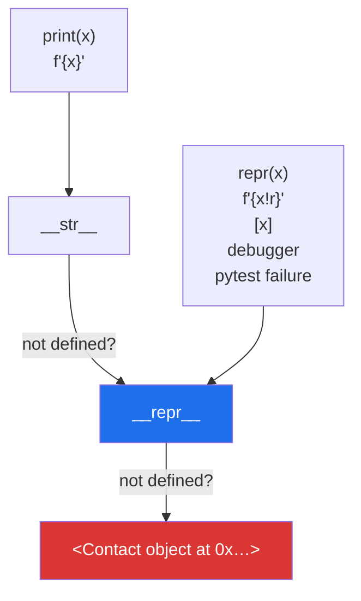

# 3.2 — `__repr__` and `__str__`: the hours they save

## One-line answer

`__repr__` is what your object looks like to *you* when you are debugging — precise, unambiguous, ideally
copy-pasteable — and `__str__` is what it looks like to somebody using the program; write `__repr__`
always, `__str__` only when the two should differ.

---

## The story

Somebody sends you a screenshot of their contacts list and asks why it looks wrong.

Every row says the same thing:

**Contact · Contact · Contact · Contact · Contact**

Five rows, five identical labels, and the person who took the screenshot is not being unhelpful — that
genuinely is what the screen says. Nobody can tell which one is Mum, which is the dentist, whether any
two of them are duplicates, or whether the list is even in the order it should be. The information is
all there, in the app, one tap away, and the view that everyone is actually looking at shows none of it.

You end up asking them to tap each row and read the numbers out. That conversation takes twenty minutes
and would have taken zero if the rows had said the names.

That screen is the default `__repr__`, and the twenty minutes is the cost.

---

## The idea in plain language

Every object has two textual forms, and Python asks for them in different places.

- **`repr(x)`** — the *representation*. For a developer. Unambiguous, and by convention it looks like
  the code that would rebuild the object: `Contact(name='Mum', number='07700 900111')`.
- **`str(x)`** — the display form. For whoever is using the program: `Mum - 07700 900111`.

Which one gets used where is worth memorising, because the split is not obvious:

| Where | Which |
|---|---|
| `print(x)` | `__str__` |
| `f"{x}"` | `__str__` |
| `f"{x!r}"` | `__repr__` |
| `repr(x)` | `__repr__` |
| the interactive prompt | `__repr__` |
| **inside a list, dict, tuple or set** | **`__repr__`** |
| a debugger's variable panel | `__repr__` |
| a `pytest` assertion failure | `__repr__` |

That sixth row is the one that matters most in practice. `print(contact)` uses `__str__`, but
`print([contact])` uses `__repr__` — a container always shows its items' reprs, because a container full
of display strings would be ambiguous. Since most debugging happens on lists of things, **`__repr__` is
the one you actually read**, and it is the one people forget to write.

The fallbacks make the split sharper:

- If you write only `__repr__`, then `str(x)` falls back to it. **One method, both jobs done.**
- If you write only `__str__`, `repr(x)` stays the useless default — and the list, the debugger and the
  test failure all keep showing `<__main__.Contact object at 0x7f...>`.

Which gives the rule: **write `__repr__` first, always. Add `__str__` only when the friendly form is
genuinely different from the precise one.** For most classes it is not, and one method is the whole job.

The conventions for a good `__repr__`:

- **Show the fields that identify the object.** Not all of them if there are twenty; the ones you would
  use to find it.
- **Use `!r` on the values** so strings arrive with quotes and `''` is distinguishable from `' '`
  ([Day 7, 3.3](../../../day-07-strings/parts/03-formatting/3.3-repr-and-the-debugging-f-string.md)).
- **Make it look like a constructor call** if you can. The language reference asks for exactly this at
  <https://docs.python.org/3/reference/datamodel.html#object.__repr__>: *"if at all possible, this
  should look like a valid Python expression that could be used to recreate an object with the same
  value."*
- **Use `type(self).__name__` rather than the literal class name**, so subclasses report themselves
  ([Day 13, 1.1](../../../day-13-inheritance-and-abstraction/parts/01-inheritance/1.1-one-form-that-starts-from-another.md)).
- **Never let it raise.** A `__repr__` that fails makes the object undebuggable at the exact moment
  somebody is debugging it.

---

## Why Setu needs it

- **The plan names `__repr__` for `PY-18` and says why: it saves debugging hours.** That is not a figure
  of speech — the cost is a list of a thousand `<Paper object at 0x...>` in every log, notebook and test
  failure for the rest of the curriculum.
- **`pytest` prints the repr of both sides of a failed assertion.** From
  [Day 2, 3.1](../../../day-02-quality-gate/parts/03-pytest/3.1-the-test-that-can-go-red.md) onward,
  every red test you ever read is a repr, and a bad one turns a diagnosis into a puzzle.
- **[Day 13, 4.2](../../../day-13-inheritance-and-abstraction/parts/04-abstraction/4.2-the-loader-family.md)'s
  loaders return `list[Paper]`**, and printing that list in a notebook is the first thing anybody does.
- **Principle 6 makes the notebook a scratchpad**, and a scratchpad is only useful if the objects in it
  say what they are.

---

## The mechanism

```python
"""__repr__ is for you; __str__ is for the person using the program."""


class Bare:
    def __init__(self, name, number):
        self.name = name
        self.number = number


class Reprd:
    def __init__(self, name, number):
        self.name = name
        self.number = number

    def __repr__(self):
        return f"Contact(name={self.name!r}, number={self.number!r})"


class Both(Reprd):
    def __str__(self):
        return f"{self.name} - {self.number}"


for cls in (Bare, Reprd, Both):
    one = cls("Mum", "07700 900111")
    print(f"{cls.__name__:6} print() :", one)
    print(f"{cls.__name__:6} in a list:", [one])
```

Run on Python 3.12.12 on 2026-09-01:

```
Bare   print() : <__main__.Bare object at 0x000001CFA8EA6E10>
Bare   in a list: [<__main__.Bare object at 0x000001CFA8EA6E10>]
Reprd  print() : Contact(name='Mum', number='07700 900111')
Reprd  in a list: [Contact(name='Mum', number='07700 900111')]
Both   print() : Mum - 07700 900111
Both   in a list: [Contact(name='Mum', number='07700 900111')]
```

**Line by line:**

- `class Bare` defines neither, so both lines show `object`'s default: the class name and the memory
  address. **Two `Bare` objects with identical fields print differently and one object printed twice
  prints the same** — which is exactly backwards from what a reader wants.
- `f"Contact(name={self.name!r}, ...)"` — the `!r` conversion asks for each value's `repr`, so the
  strings come out with quotes
  ([Day 7, 3.3](../../../day-07-strings/parts/03-formatting/3.3-repr-and-the-debugging-f-string.md)).
  Without it, `Contact(name=Mum, number=07700 900111)` is ambiguous about types and hides trailing
  spaces.
- `Reprd` defines **only `__repr__`**, and its `print()` line works — `str` fell back to `repr`. That is
  the "one method, both jobs" rule, visible.
- `class Both(Reprd)` adds `__str__` and inherits `__repr__`. Its `print()` shows the friendly form.
- **Look at the last two lines together.** `Both` inside a list shows `Contact(...)`, not `Mum - 07700
  900111`. The list asked every item for its `repr`, and that is the row of the table that catches
  everybody.
- The `Contact(...)` text is hard-coded rather than built from `type(self).__name__`, which is a bug the
  third failure below demonstrates — a subclass of `Reprd` would lie about its own name.
- The memory address `0x000001CFA8EA6E10` will differ on your machine and between runs, which is part of
  why the default is useless: **it identifies the object and tells you nothing about it**.

Which form goes where:



---

## When it breaks

**A `__repr__` that raises:**

```text
$ uv run python -c "
class Contact:
    def __init__(self, name, number=None):
        self.name, self.number = name, number
    def __repr__(self):
        return f'Contact({self.name!r}, {self.number.strip()!r})'

book = [Contact('Mum', ' 07700 900111 '), Contact('Sam')]
print(book)
"
Traceback (most recent call last):
  File "<string>", line 9, in <module>
  File "<string>", line 6, in __repr__
AttributeError: 'NoneType' object has no attribute 'strip'
```

**What it means.** Printing the list failed because one contact has no number, so **you cannot look at
the data to find out which one**. A `__repr__` that raises removes your ability to debug precisely when
you need it, and it takes the whole container with it — one bad object makes a thousand good ones
unprintable. A repr does no work: it reads fields and formats them, and anything that might be absent
gets `{self.number!r}`, which prints `None` quite happily.

**Writing `__str__` and not `__repr__`:**

```text
$ uv run python -c "
class Contact:
    def __init__(self, name, number): self.name, self.number = name, number
    def __str__(self): return f'{self.name} - {self.number}'

book = [Contact('Mum', '07700900111'), Contact('Sam', '07700900222')]
print(book[0])
print(book)
"
Mum - 07700900111
[<__main__.Contact object at 0x0000027CDE1B66C0>, <__main__.Contact object at 0x0000027CDDE0A720>]
```

**What it means.** The single object prints beautifully and the list — the thing you actually look at —
prints nothing useful. The fallback only runs in one direction: `str` falls back to `repr`, never the
other way. **If you are going to write one, write `__repr__`.**

**A hard-coded class name in `__repr__`:**

```text
$ uv run python -c "
class Contact:
    def __init__(self, name): self.name = name
    def __repr__(self): return f'Contact({self.name!r})'

class WorkContact(Contact):
    def __init__(self, name, company='unknown'):
        super().__init__(name)
        self.company = company

print([Contact('Mum'), WorkContact('Sam', 'the bakery')])
"
[Contact('Mum'), Contact('Sam')]
```

**What it means.** No error, and the output is a lie twice over: the second object is a `WorkContact`,
and its company is missing. Somebody reading that list has no way to know two different types are in it.
`type(self).__name__` fixes the name; the missing field needs the subclass to write its own `__repr__`,
usually as `f"{super().__repr__()[:-1]}, company={self.company!r})"` or, more simply, by writing the
whole thing out.

**A `__repr__` that is too long to read:**

```text
$ uv run python -c "
class Paper:
    def __init__(self, title, abstract): self.title, self.abstract = title, abstract
    def __repr__(self): return f'Paper(title={self.title!r}, abstract={self.abstract!r})'

papers = [Paper('A study', 'word ' * 40) for _ in range(2)]
print(papers)
" | cut -c1-120
[Paper(title='A study', abstract='word word word word word word word word word word word word word word word word word w
```

**What it means.** Two objects produced a line too wide to read, and a list of a thousand papers
produces a wall. The `cut` above is doing what a person would have to do by hand. **A repr shows the
fields that identify the object, not all of them** — a title and an id, with long text truncated or left
out entirely. The test is whether one object fits on one line.

---

## In production

**The professional habit is that `__repr__` is written at the same time as `__init__`, before any
method.** It costs one line, it is the first thing you will want in the first debugging session, and
adding it later means every log line written before then is worthless. Standard-library tools reflect
this: `@dataclass` generates a `__repr__` for you, and Pydantic and `attrs` do the same, precisely
because everybody wants one and nobody enjoys typing it.

**What changes at scale is that reprs end up in logs, and logs are read by strangers.** That has two
consequences. A repr that includes an email address, a phone number or an API key puts it in a log file
that leaves the machine — the `Contact(number='07700 900111')` in this document would be a data-handling
problem in a real system, and the professional version masks it. And a repr that renders a large field
makes log storage expensive: a `Paper` repr that includes the abstract multiplies every log line by a
kilobyte.

**The failure that only appears with real data is the repr that is slow.** A repr that summarises a
collection — `f"Book({len(self.contacts)} contacts)"` — is fine on a list and quietly terrible on a
generator (it consumes it) or on a database-backed collection (it queries). Debuggers call `__repr__` on
everything in scope, so a slow one makes stepping through code unusable and the cause is invisible,
because nothing in the code being stepped through is slow.

**The review comment a senior engineer leaves.** *"`__repr__` interpolates `self.abstract`, so every
`logger.debug("got %s", paper)` writes two kilobytes and the failing-test output is unreadable. Show the
id and a truncated title; add a `full_repr()` method if the long form is genuinely wanted somewhere."*

**The interview question.** *"What is the difference between `__repr__` and `__str__`?"* The definition —
one for developers, one for users — is the start. What shows experience is knowing where each is used:
containers, debuggers and test failures all call `__repr__`, so it is the one you actually read, and
`str` falls back to `repr` but never the reverse, so if you write only one it should be `__repr__`.
Adding that a repr must never raise and must not leak secrets or render huge fields is the answer of
somebody who has read production logs.

---

## Check yourself

```bash
uv run python -c "
class Contact:
    def __init__(self, name, number):
        self.name, self.number = name, number
    def __repr__(self):
        return f'{type(self).__name__}(name={self.name!r}, number={self.number!r})'

class WorkContact(Contact):
    pass

book = [Contact('Mum', '07700 900111'), WorkContact('Sam', '07700 900222')]
print(book)
print(book[0])
print(f'{book[0]} | {book[0]!r}')
"
```

The subclass names itself correctly, and the last line shows the same object twice in two forms — which
are identical here because there is no `__str__`. Add one and run it again.

**Answer out loud, without scrolling up:**

> Which of the two does a list of your objects use, and which does `print()` use? Then say which one to
> write if you are only writing one, and why.

---

**Next:** [3.3 — `__eq__`, and the duplicate that was not caught](3.3-eq-and-the-duplicate.md), which
picks up the cliff Day 12 left you on.
