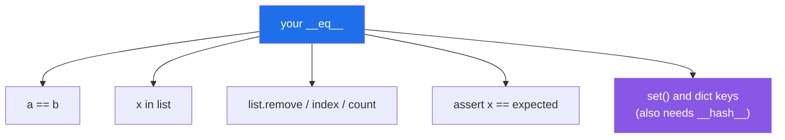

# 3.3 — `__eq__`, and the duplicate that was never caught

## One-line answer

Without `__eq__`, two objects of your class are equal only when they are the same object — so `==`, `in`
and `list.remove()` all answer *"is this the very same one?"* rather than *"do these describe the same
thing?"*, and `__eq__` is where you write down which fields decide.

---

## The story

Two entries in the contacts list, one person.

**Mum** — 07700 900111
**Mum mobile** — 07700 900111

It is obvious how it happened. One was typed in years ago and one arrived from a message, and neither
knew about the other because the names are different. Every time you search for your mum you get two
results, and half your messages are on one thread and half on the other.

Tap **find duplicates**. It finds none.

The tool is not broken. It compared the entries the way it compares everything: are these the same
entry? They are not. They are two entries, in two places in the list, with two internal identity
numbers, and by the only test it applied they are entirely different things.

**The question the tool answered and the question you asked were not the same question**, and nothing in
the interface said so. Deciding that two entries describe one person means deciding *which field
decides* — and the only person who can decide that is somebody who knows what a contact means. The tool
never had that information, so it fell back to the one comparison that is always available and never
useful.

---

## The idea in plain language

[Day 12, 2.4](../../../day-12-classes/parts/02-attribute-lookup/2.4-your-object-and-equality.md) ended
here: for a class you wrote, `a == b` is `True` only when `a is b`. That is `object.__eq__`, inherited by
every class, and it compares identity.

This is a **default that works**, which is what makes it dangerous
([3.1](3.1-what-a-dunder-method-is.md)). A missing `__len__` raises the first time anybody calls `len()`.
A missing `__eq__` raises nothing, ever. It quietly answers a different question in every place equality
is used — and there are more of those places than people expect:

- `a == b`
- `x in some_list`
- `some_list.remove(x)`, `some_list.index(x)`, `some_list.count(x)`
- `assert result == expected` in every test you write
- `set(...)` and dictionary keys — though those need `__hash__` too, which is
  [3.4](3.4-hash-and-the-broken-set.md)

Writing `__eq__` is writing down **which fields decide identity**, and that is a domain decision, not a
technical one. For a contact it is the number. For a `Paper` it is the identifier, if there is one, or
perhaps the title and year together. Nobody can work it out from the class definition, which is exactly
why Python does not guess.

Three rules for writing one:

**Return `NotImplemented` for types you do not know.** Not `False` — `NotImplemented` is a special value
meaning *"I cannot answer this; ask the other object."* Python then tries the reflected operation and,
if that also declines, falls back to identity. Returning `False` instead means `contact == "Mum"` is
definitively false and the other object never gets asked, which breaks comparisons with classes designed
to interoperate with yours.

**Compare a tuple of the deciding fields.** `(self.number,) == (other.number,)` extends cleanly to two
fields and reads as a list of what matters.

**Whatever you decide, `__hash__` must agree** — and defining `__eq__` silently removes the inherited
`__hash__`, which is [3.4](3.4-hash-and-the-broken-set.md)'s subject and the reason these two documents
are next to each other.

---

## Why Setu needs it

- **The plan names `__eq__` on `Paper` for `PY-18`.** A pipeline that ingests from three sources will
  meet the same paper more than once, and "the same paper" has to mean something.
- **[Day 8, 3.2](../../../day-08-containers/parts/03-dedup/3.2-order-preserving-dedup.md) built an
  order-preserving deduplicator over strings.** The moment it is handed `Paper` objects instead, it
  deduplicates nothing, because every object is distinct. That function does not change; the objects
  have to.
- **Every test you write from here on compares objects.** `assert loader.load() == [Paper("The Kitchen
  Table", 2019)]` is a test that cannot pass without `__eq__`, and the failure looks like a bug in the
  loader.
- **Day 227's ingestion and Day 233's eval suite both count distinct papers.** A count that is silently
  three times too high is worse than a crash.

---

## The mechanism

```python
"""Two entries for one person, and the __eq__ that notices."""


class Bare:
    def __init__(self, name, number):
        self.name, self.number = name, number

    def __repr__(self):
        return f"{type(self).__name__}({self.name!r})"


class Equal(Bare):
    def __eq__(self, other):
        if not isinstance(other, Equal):
            return NotImplemented
        return self.number == other.number


for cls in (Bare, Equal):
    a = cls("Mum", "07700900111")
    b = cls("Mum mobile", "07700900111")
    print(f"{cls.__name__:6} a == b :", a == b)
    print(f"{cls.__name__:6} b in [a]:", b in [a])
    print(f"{cls.__name__:6} count  :", len([a, b]))
```

Run on Python 3.12.12 on 2026-09-01:

```
Bare   a == b : False
Bare   b in [a]: False
Bare   count  : 2
Equal  a == b : True
Equal  b in [a]: True
Equal  count  : 2
```

**Line by line:**

- `class Bare` defines `__repr__` only, so `==` is `object.__eq__` — identity
  ([Day 4, 3.2](../../../day-04-objects/parts/03-identity-trap/3.2-is-versus-equals.md)).
- `a` and `b` have **the same number and different names**, which is the story's exact situation.
- `Bare a == b : False` — two entries, one person, and the language says they are different. Not wrong;
  answering a different question.
- `Bare b in [a]: False` — **`in` uses `==`**, so a membership test cannot find the duplicate either.
  This is the line that matters, because `in` is how most deduplicating code is written.
- `def __eq__(self, other):` — two parameters. `a == b` calls `type(a).__eq__(a, b)`
  ([3.1](3.1-what-a-dunder-method-is.md)).
- `if not isinstance(other, Equal): return NotImplemented` — the guard. `isinstance` and not
  `type(other) is Equal`, so a subclass still compares
  ([Day 13, 2.2](../../../day-13-inheritance-and-abstraction/parts/02-polymorphism/2.2-duck-typing-and-isinstance.md)).
- `return NotImplemented` and **not `False`** — it tells Python *"I do not know"*, and Python then asks
  the other object. `Equal("Mum", "07700900111") == "07700900111"` ends up `False` either way, but only
  the `NotImplemented` version lets some future class say it is equal to a `Contact`.
- `return self.number == other.number` — **the domain decision, in one line.** The name is deliberately
  not compared, because "Mum" and "Mum mobile" are the same person.
- `Equal a == b : True` and `b in [a]: True` — the duplicate is now findable, by `==` and by every
  built-in that uses it.
- `count : 2` for **both** classes. `len` counts list items and knows nothing about equality; finding
  duplicates needs `in`, or a `set` — and a `set` needs [3.4](3.4-hash-and-the-broken-set.md).

Where equality is used:



---

## When it breaks

**The deduplicator that deduplicates nothing:**

```text
$ uv run python -c "
class Paper:
    def __init__(self, title, year): self.title, self.year = title, year
    def __repr__(self): return f'Paper({self.title!r})'

def dedupe(items):
    seen = []
    for item in items:
        if item not in seen:
            seen.append(item)
    return seen

found = [Paper('The Kitchen Table', 2019), Paper('The Kitchen Table', 2019)]
print('in  :', len(found))
print('out :', len(dedupe(found)), dedupe(found))
"
in  : 2
out : 2 [Paper('The Kitchen Table'), Paper('The Kitchen Table')]
```

**What it means.** A correct deduplicator, given two identical papers, returned both. `item not in seen`
used `==`, `==` used identity, and the two objects are not the same object. **The function is right and
the objects are wrong**, which is why this is diagnosed at the class rather than at the algorithm — and
why [Day 8, 3.2](../../../day-08-containers/parts/03-dedup/3.2-order-preserving-dedup.md)'s tests, which
used strings, could never have caught it.

**A test that cannot pass:**

```text
$ uv run python -c "
class Paper:
    def __init__(self, title): self.title = title
    def __repr__(self): return f'Paper({self.title!r})'

result = [Paper('The Kitchen Table')]
expected = [Paper('The Kitchen Table')]
assert result == expected, f'{result} != {expected}'
"
Traceback (most recent call last):
  File "<string>", line 8, in <module>
AssertionError: [Paper('The Kitchen Table')] != [Paper('The Kitchen Table')]
```

**What it means.** The two sides of the message are **character-for-character identical** and the
assertion failed. This is the most confusing failure in this document, and it is very common the first
time somebody tests a function that returns objects. The `__repr__` is doing its job perfectly and the
`__eq__` does not exist. Once you have seen it, *"the two sides look the same"* becomes a diagnosis
rather than a mystery.

**Returning `False` instead of `NotImplemented`:**

```text
$ uv run python -c "
class Contact:
    def __init__(self, number): self.number = number
    def __eq__(self, other):
        if not isinstance(other, Contact):
            return False
        return self.number == other.number

class Lookalike:
    def __init__(self, number): self.number = number
    def __eq__(self, other):
        return getattr(other, 'number', None) == self.number

c, look = Contact('07700900111'), Lookalike('07700900111')
print('c == look :', c == look)
print('look == c :', look == c)
"
c == look : False
look == c : True
```

**What it means.** `a == b` and `b == a` gave different answers, which breaks a rule everybody assumes.
`Contact.__eq__` returned `False`, and because that is a real answer Python stopped there and never asked
`Lookalike`. Returning `NotImplemented` instead would have made Python try `Lookalike.__eq__(look, c)`,
and both directions would say `True`. **`NotImplemented` means "ask the other one"; `False` means "I have
decided."**

**Equality that depends on a field somebody can change:**

```text
$ uv run python -c "
class Contact:
    def __init__(self, name, number): self.name, self.number = name, number
    def __eq__(self, other):
        return isinstance(other, Contact) and self.number == other.number
    def __repr__(self): return f'Contact({self.name!r})'

a, b = Contact('Mum', '07700900111'), Contact('Mum mobile', '07700900111')
book = [a]
print('found before:', b in book)
a.number = '07700900222'
print('found after :', b in book)
"
found before: True
found after : False
```

**What it means.** Nothing about `b` changed and it stopped being in the list, because equality depends
on a mutable field. That is legal and it makes the objects unreliable in any collection. The
professional answer is that **fields deciding equality should not change after construction** — which is
also, exactly, what makes [3.4](3.4-hash-and-the-broken-set.md)'s hashing safe, and why "equality fields
are immutable" is a single rule serving both.

---

## In production

**The professional habit is to define equality by an identifier when there is one, and by a small tuple
of natural fields when there is not.** For a `Paper` that means the DOI or arXiv id if present, and
`(normalised_title, year)` otherwise — with the normalising being
[Day 7, 4.1](../../../day-07-strings/parts/04-normalising/4.1-the-title-normaliser.md)'s function, because
`"The Kitchen Table"` and `"the kitchen table "` are the same paper and a raw comparison says otherwise.
That last point is the one that decides whether a real pipeline deduplicates anything: equality on
un-normalised strings is equality on formatting.

**What changes at scale is that `in` becomes the bottleneck.** `item not in seen` on a list is a linear
scan, so deduplicating *n* papers is *n²* comparisons — which is
[Day 6, 4.1](../../../day-06-loops/parts/04-loop-cost/4.1-the-accidental-quadratic.md)'s accidental
quadratic, and it is fine for a hundred papers and hopeless for a hundred thousand. The fix is a `set`,
and a `set` needs `__hash__`, which is why the next document exists and why in practice `__eq__` and
`__hash__` are written in the same sitting.

**The failure that only appears with real data is the equality that is too loose.** Deciding two papers
are the same because their titles match seems safe until the corpus contains two genuinely different
papers called *"Introduction"*, and then the pipeline silently discards one. Equality that is too strict
produces duplicates, which somebody notices; equality that is too loose destroys data, which nobody
does. When in doubt, be strict and count the duplicates.

**The review comment a senior engineer leaves.** *"`__eq__` compares every field including
`retrieved_at`, so the same paper fetched twice is never equal to itself and the cache never hits.
Equality should be the identifier, or the normalised title and year — the timestamp is metadata about
the fetch, not about the paper."*

**The interview question.** *"What happens if you define `__eq__` but not `__hash__`?"* — which is
[3.4](3.4-hash-and-the-broken-set.md), and the fact that it is the usual follow-up tells you the two are
one topic. On `__eq__` itself, the answer that lands is that the inherited default compares identity and
never fails, so it silently changes the meaning of `==`, `in`, `remove` and every assertion in your test
suite; that `NotImplemented` rather than `False` is what keeps comparison symmetric; and that the fields
deciding equality should be immutable, or the object's membership of a collection changes underneath it.

---

## Check yourself

```bash
uv run python -c "
class Contact:
    def __init__(self, name, number): self.name, self.number = name, number
    def __repr__(self): return f'Contact({self.name!r})'
    def __eq__(self, other):
        if not isinstance(other, Contact):
            return NotImplemented
        return self.number == other.number

a = Contact('Mum', '07700900111')
b = Contact('Mum mobile', '07700900111')
c = Contact('the dentist', '07700900999')
print('a == b:', a == b, '| a == c:', a == c)
print('b in [a]:', b in [a], '| c in [a]:', c in [a])
print('a == \"Mum\":', a == 'Mum')
"
```

Now try `print({a, b})` and read the error. It is the whole of the next document.

**Answer out loud, without scrolling up:**

> Name four things besides `a == b` that change when you define `__eq__`. Then say why it returns
> `NotImplemented` rather than `False` for an unknown type.

---

**Next:** [3.4 — `__hash__`, and the object that broke the set](3.4-hash-and-the-broken-set.md), which is
the error you just read.
