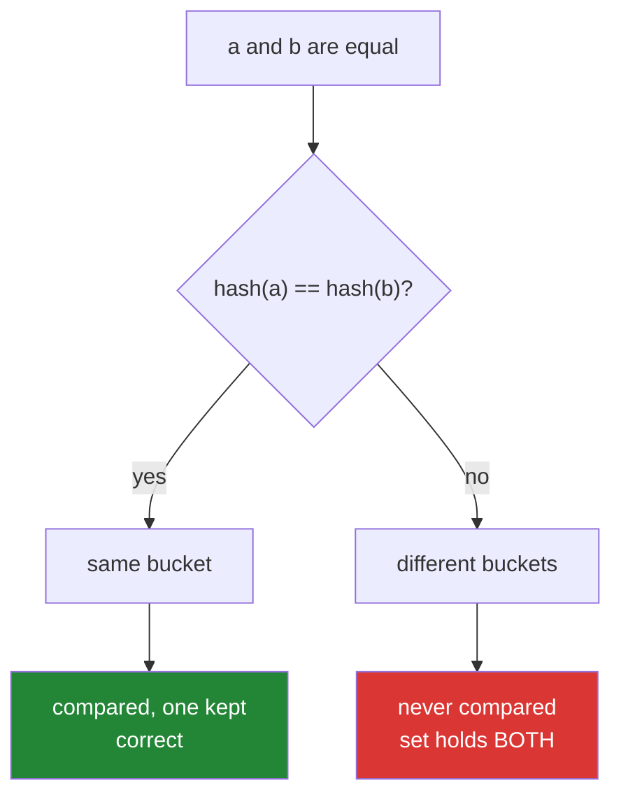

# 3.4 — `__hash__`, and the object that broke the set

## One-line answer

Defining `__eq__` removes the inherited `__hash__`, so your objects stop working in sets and as
dictionary keys — and putting it back means writing `__hash__` over **exactly** the fields `__eq__` uses,
because two objects that are equal must hash the same or the set will hold both.

---

## The story

The contacts list is sorted alphabetically, and that is the only reason searching it is instant.

You type M and it jumps to the M section, because everything beginning with M is filed in one place.
Nobody scans the whole list. The filing decided where the entry went, once, when it was saved.

Now suppose somebody adds an entry and files it under **M** for Mum, and somebody else adds the same
person and files them under **G** for Gran. Two entries, one person, filed in two different sections.
Ask *"is this person already here?"*, look under M, find them, fine. Ask the same question about the
entry filed under G — you look under G, and whether you find anything depends on which letter you happened
to start from.

The filing rule and the sameness rule have to agree. If two entries are the same person, they have to be
filed in the same place, or being filed is worse than useless: it makes you look in one place and be
confident about what is not there.

---

## The idea in plain language

A `set` and a `dict` do not compare an item against everything they hold. They ask it for a **hash** — a
number — use that to decide which bucket to look in, and only compare against the handful of items
already in that bucket. That is why `x in some_set` is fast where `x in some_list` is a scan
([Day 8, 2.1](../../../day-08-containers/parts/02-sets-and-dicts/2.1-a-set-is-a-hash-table.md)).

For that to work, one rule must hold, and it is the whole of this document:

> **If `a == b`, then `hash(a) == hash(b)`.**

Two equal objects hashing differently go into different buckets, and the set never compares them, so it
holds both. Nothing raises; the set is simply wrong.

Python takes this seriously enough to enforce it structurally. `object` provides a default `__hash__`
based on identity, and it agrees with the default identity-based `__eq__`. **The moment you define
`__eq__`, Python sets `__hash__` to `None`**, because your new equality certainly does not agree with the
old identity hash. Your class becomes *unhashable*, and every set and dictionary use of it raises
`TypeError`. The language reference states this at
<https://docs.python.org/3/reference/datamodel.html#object.__hash__>.

That is a deliberately loud failure standing in for a silent one, and once you know it exists the error
reads as a reminder rather than a mystery.

Putting it back is one method:

```text
def __hash__(self):
    return hash((self.number,))
```

Three rules for writing it:

**Hash a tuple of exactly the fields `__eq__` compares.** Not more, not fewer. `hash` of a tuple is
built in and correct; you never invent a hash function.

**Those fields must not change** while the object is in a set or used as a key. Change one and the
object is filed under its old hash and looked up under its new one — it is "in" the set and cannot be
found, which the third failure below shows.

**Unequal objects *may* hash the same.** That is a *collision*, and it is normal and handled — the set
compares within the bucket. Only the other direction is a bug.

There is a fourth option worth knowing: if your objects are genuinely mutable and should never be set
members, write `__hash__ = None` explicitly. That says *"unhashable on purpose"*, and it is honest.

---

## Why Setu needs it

- **[3.3](3.3-eq-and-the-duplicate.md)'s deduplicator is a linear scan**, which is
  [Day 6, 4.1](../../../day-06-loops/parts/04-loop-cost/4.1-the-accidental-quadratic.md)'s accidental
  quadratic. The fix is a `set`, and a set needs this.
- **[Day 8, 3.1](../../../day-08-containers/parts/03-dedup/3.1-ten-thousand-ids-timed.md) measured a list
  against a set on ten thousand ids.** That measurement is the argument, and it only applies to `Paper`
  objects once they are hashable.
- **Day 226 keys papers by identifier in a dictionary**, and Day 233's eval suite holds sets of expected
  and retrieved documents to compute recall. Both are `TypeError` on an unhashable `Paper`.
- **[Day 4, 2.5](../../../day-04-objects/parts/02-containers/2.5-hashability.md) said a list cannot be a
  dictionary key and a tuple can.** This is that same rule, arriving at a class you wrote, with you as
  the person who decides.

---

## The mechanism

```python
"""__eq__ without __hash__, and then with it."""


class NoHash:
    def __init__(self, name, number):
        self.name, self.number = name, number

    def __eq__(self, other):
        return isinstance(other, NoHash) and self.number == other.number


class WithHash:
    def __init__(self, name, number):
        self.name, self.number = name, number

    def __repr__(self):
        return f"C({self.name!r})"

    def __eq__(self, other):
        if not isinstance(other, WithHash):
            return NotImplemented
        return self.number == other.number

    def __hash__(self):
        return hash((self.number,))


print("NoHash.__hash__ is:", NoHash.__hash__)
try:
    {NoHash("Mum", "07700900111")}
except TypeError as error:
    print("putting one in a set:", error)

a = WithHash("Mum", "07700900111")
b = WithHash("Mum mobile", "07700900111")
print("set of both  :", {a, b})
print("dict keys    :", len({a: 1, b: 2}))
print("hashes equal :", hash(a) == hash(b))
print("a == b       :", a == b)
```

Run on Python 3.12.12 on 2026-09-01:

```
NoHash.__hash__ is: None
putting one in a set: unhashable type: 'NoHash'
set of both  : {C('Mum')}
dict keys    : 1
hashes equal : True
a == b       : True
```

**Line by line:**

- `class NoHash` defines `__eq__` and nothing else. **`NoHash.__hash__` is literally `None`** — that is
  the first printed line, and it is the mechanism rather than a metaphor. Python replaced the inherited
  method with `None` when it saw `__eq__` in the class body.
- `{NoHash(...)}` raises `unhashable type` — the same message a `list` gives
  ([Day 4, 2.5](../../../day-04-objects/parts/02-containers/2.5-hashability.md)), for the same reason:
  `__hash__` is `None`.
- `def __hash__(self): return hash((self.number,))` — **the same field `__eq__` compares, and only that
  field.** The trailing comma makes it a one-item tuple
  ([Day 8, 1.3](../../../day-08-containers/parts/01-sequences/1.3-a-tuple-is-a-record.md)); with two
  fields it would be `hash((self.number, self.year))`.
- `hash(...)` on the tuple, not on the object — tuples are hashable when their contents are, so this
  composes for free and is always consistent with tuple equality.
- `{a, b}` is `{C('Mum')}` — **one element from two objects.** They hashed the same, landed in the same
  bucket, compared equal, and the set kept the first. That is the duplicate detection
  [3.3](3.3-eq-and-the-duplicate.md) wanted, now in constant time.
- `len({a: 1, b: 2})` is `1` — the same rule for dictionary keys. `b` did not add a key; it overwrote
  `a`'s value.
- `hashes equal : True` and `a == b : True` printed together, because the pair is the invariant. A class
  where those two lines disagree is broken however good the rest of it is.
- `WithHash` also has `__repr__`, which is why the set printed readably. Without it the last three lines
  would be addresses ([3.2](3.2-repr-and-str.md)).

Why the two rules must agree:



---

## When it breaks

**Hashing more fields than equality compares:**

```text
$ uv run python -c "
class Contact:
    def __init__(self, name, number): self.name, self.number = name, number
    def __repr__(self): return f'C({self.name!r})'
    def __eq__(self, other):
        return isinstance(other, Contact) and self.number == other.number
    def __hash__(self):
        return hash((self.name, self.number))

a = Contact('Mum', '07700900111')
b = Contact('Mum mobile', '07700900111')
print('a == b       :', a == b)
print('hashes equal :', hash(a) == hash(b))
print('set of both  :', {a, b})
"
a == b       : True
hashes equal : False
set of both  : {C('Mum'), C('Mum mobile')}
```

**What it means.** No error, and the set contains two objects that are equal to each other — which is
the one thing a set promises cannot happen. The hash included `name` and equality did not, so the two
went into different buckets and were never compared. **This is the bug the `__hash__ = None` default
exists to prevent**, and the only way to reach it is by writing a `__hash__` that disagrees with your
`__eq__`. The rule is mechanical: the tuple in `__hash__` and the fields in `__eq__` are the same list.

**Mutating a field that decides the hash:**

```text
$ uv run python -c "
class Contact:
    def __init__(self, number): self.number = number
    def __eq__(self, o): return isinstance(o, Contact) and self.number == o.number
    def __hash__(self): return hash(self.number)
    def __repr__(self): return f'C({self.number!r})'

a = Contact('07700900111')
s = {a}
a.number = '07700900222'
print('is it still in the set?', a in s)
print('the set still holds it :', s)
print('but by identity?       :', any(x is a for x in s))
"
is it still in the set? False
the set still holds it : {C('07700900222')}
but by identity?       : True
```

**What it means. The object is in the set and the set says it is not.** It was filed under the hash of
the old number and is now being looked for under the hash of the new one, so the lookup goes to a bucket
it was never in. The printed set shows the object — with its new number — sitting there. This is the
strongest argument for making the fields that decide equality immutable, and it is why frozen dataclasses
and frozen Pydantic models exist.

**Inheriting `__eq__` and losing hashability without noticing:**

```text
$ uv run python -c "
class Paper:
    def __init__(self, doi): self.doi = doi
    def __eq__(self, o): return isinstance(o, Paper) and self.doi == o.doi
    def __hash__(self): return hash(self.doi)

class ArxivPaper(Paper):
    def __eq__(self, o):
        return isinstance(o, ArxivPaper) and self.doi == o.doi

print('Paper hashable      :', Paper.__hash__ is not None)
print('ArxivPaper hashable :', ArxivPaper.__hash__ is not None)
{ArxivPaper('10.1000/x')}
"
Paper hashable      : True
ArxivPaper hashable : False
Traceback (most recent call last):
  File "<string>", line 13, in <module>
TypeError: unhashable type: 'ArxivPaper'
```

**What it means.** The base class was hashable and the subclass is not, because **the rule applies to
every class body that defines `__eq__`**, including one that only refines an inherited one. A subclass
overriding equality must re-state `__hash__` — often as `__hash__ = Paper.__hash__` when the hashed
fields have not changed. This one hides well: the base's tests all pass and the subclass fails only where
somebody builds a set.

**A hash that is not stable across runs:**

```text
$ uv run python -c "print(hash('Mum'))" && uv run python -c "print(hash('Mum'))"
-6257947518773628455
-354277942149809275
```

**What it means.** `hash` of a string differs **between processes**, because Python randomises string
hashing at start-up to defend against a denial-of-service attack that feeds a server colliding keys.
Two runs, two numbers. So a hash is fine for an in-memory set and is **never** something to store in a
file, a database or a cache key that must survive a restart. For that you want an explicit, stable digest
— `hashlib.sha256(...)` — which is a different tool with a different purpose.

---

## In production

**The professional habit is that `__eq__` and `__hash__` are written together, over the same tuple, on an
object whose those fields are immutable.** In practice that means reaching for `@dataclass(frozen=True)`
or a Pydantic model with `frozen=True`, which generate both from the field list and refuse assignment —
so the rule is enforced by the class rather than remembered by the author. Writing the pair by hand today
is what makes the generated version legible
([Principle 2](../../../../docs/00_MASTER_PLAN_DS_GENAI.md)).

**What changes at scale is that a bad hash is a performance bug before it is a correctness one.** A
`__hash__` returning a constant is perfectly *legal* — equal objects hash the same, trivially — and turns
every set into a linked list: one bucket, and every lookup a full scan. That is the accidental quadratic
again, arriving through a method nobody thinks of as hot. The other direction, a hash over a large field
like a whole abstract, costs a full string traversal on every set operation.

**The failure that only appears with real data is the equality that is correct and the hash that is
expensive to keep true.** Papers deduplicated on a normalised title need the normalising inside the hash
as well as inside the equality, or the two disagree
([Day 7, 4.1](../../../day-07-strings/parts/04-normalising/4.1-the-title-normaliser.md)). Doing that work
on every hash is slow, so the normalised form gets computed once in `__init__` and stored — and now
there is a field that must never be changed, which loops back to why frozen objects are the answer.

**The review comment a senior engineer leaves.** *"`__eq__` compares the normalised title and
`__hash__` uses the raw one, so two papers that are equal hash differently and the dedup set keeps both.
Hash the same tuple `__eq__` compares — and since these objects go in sets, make the class frozen so
nobody can move one after it has been filed."*

**The interview question.** *"What happens if you define `__eq__` and not `__hash__`?"* The answer is
concrete: Python sets `__hash__` to `None`, the class becomes unhashable, and every set or dict use
raises `TypeError: unhashable type`. Then the reason, which is the real question: equal objects must hash
equally or a set silently keeps duplicates, so Python removes the inherited identity hash rather than let
it disagree with your new equality. Adding that the fields must be immutable — because mutating one
leaves the object filed under a hash nobody will look under — is what shows you have debugged it.

---

## Check yourself

```bash
uv run python -c "
class Contact:
    def __init__(self, name, number): self.name, self.number = name, number
    def __repr__(self): return f'C({self.name!r})'
    def __eq__(self, other):
        if not isinstance(other, Contact):
            return NotImplemented
        return self.number == other.number
    def __hash__(self):
        return hash((self.number,))

a = Contact('Mum', '07700900111')
b = Contact('Mum mobile', '07700900111')
c = Contact('the dentist', '07700900999')
print('set        :', {a, b, c})
print('dict keys  :', len({a: 1, b: 2, c: 3}))
print('hash agrees:', (a == b) == (hash(a) == hash(b)))
"
```

Three objects, two entries. Now change `__hash__` to `hash((self.name, self.number))` and run it again —
the set grows and nothing raises.

**Answer out loud, without scrolling up:**

> What does Python do to `__hash__` when you define `__eq__`, and why? Then state the rule connecting the
> two, and say which direction of it is a bug.

---

**Next:** [3.5 — `__len__` and `__bool__`](3.5-len-and-bool.md), where defining one dunder quietly changes
the answer to a question you did not think you were asking.
