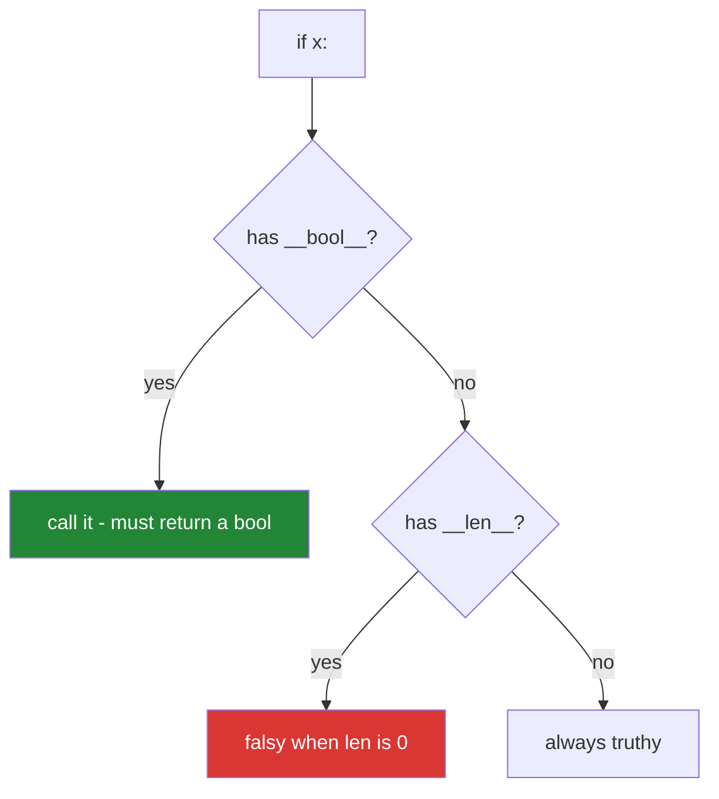

# 3.5 — `__len__` and `__bool__`: the empty thing that was false

## One-line answer

`__len__` answers `len(x)` and, because Python asks `__len__` when there is no `__bool__`, it also
silently answers `if x:` — so adding one method to make counting work can make an empty object
disappear from an existence check.

---

## The story

A new phone, set up this morning, no contacts saved yet.

Open the contacts app and it says **"No contacts"**, with a button to add one. That is right. There is a
contacts list; it has nothing in it.

Now imagine the app instead said **"Contacts app not installed"**.

Both statements are about the same situation, and only one of them is true. The app exists. It is
working. It is even telling you what to do next. It simply has nothing in it yet, and *"has nothing in
it"* and *"is not there"* are different facts about the world that happen to look similar from a
distance.

Everybody agrees about this until they are writing a check quickly, and then *"is there a contacts
list?"* and *"are there any contacts?"* get written the same way, and the difference only shows up on a
phone that is empty — which is to say, on the first day, before anybody has any data.

---

## The idea in plain language

Python has a rule for deciding whether an object is truthy
([Day 5, 2.2](../../../day-05-operators-and-conditionals/parts/02-conditionals/2.2-truthiness.md)), and
it goes in a specific order:

1. If the type has `__bool__`, call it. The result must be `True` or `False`.
2. Otherwise, if the type has `__len__`, call it — **and the object is falsy when the length is zero.**
3. Otherwise, the object is truthy. Always.

Step 3 is why a plain object of your class is always truthy: no `__bool__`, no `__len__`, so `if
contact:` is `True` for every contact including a completely blank one.

Step 2 is the surprise. **Adding `__len__` so that `len(book)` works also changes what `if book:`
means**, and nothing about writing `__len__` announces that. An empty address book becomes falsy, and
every `if book:` in the codebase — written by somebody asking *"do we have a book?"* — now means *"does
the book have anything in it?"*.

Sometimes that is exactly right. A list, a string and a dictionary are all falsy when empty, and Python
programmers expect containers to behave that way. If your object is a container, inheriting that
behaviour is a feature.

Sometimes it is wrong. An object that *is* a thing and happens to hold items — a database connection
with no rows fetched, an address book, a search result set that a caller wants to distinguish from
`None` — should exist regardless of how full it is. For those, write `__bool__` explicitly:

```text
def __bool__(self):
    return True
```

Two lines, and now `if book:` means *"is there a book"* and `if len(book):` means *"does it hold
anything"*, and the two questions have two spellings.

The rule that avoids the whole problem: **when a type has both a size and a meaningful existence, say
which one truthiness means.** Writing `__bool__` even when it agrees with `__len__` is not wasted; it
documents the decision.

---

## Why Setu needs it

- **The plan names `__len__` on `Paper` for `PY-18`** — really on a collection of papers, since a single
  paper has no natural length — and the moment it exists, every `if results:` in the codebase changes
  meaning.
- **[Day 5, 2.3](../../../day-05-operators-and-conditionals/parts/02-conditionals/2.3-if-df-raises.md)
  showed `if df:` raising** on a pandas dataframe. That is a third option — a `__bool__` that refuses to
  answer — and it exists because pandas found this exact ambiguity too dangerous to guess at.
- **[Day 5, 3.1](../../../day-05-operators-and-conditionals/parts/03-the-or-trap/3.1-the-or-default-and-falsy-zero.md)'s
  `or`-default trap gets a new victim.** `book = maybe_book() or default_book()` silently replaces an
  empty-but-real book with the default.
- **Day 233's eval suite distinguishes "the retriever returned nothing" from "the retriever was not
  called."** Those are different failures and the difference is exactly this.

---

## The mechanism

```python
"""__len__ answers len(), and quietly answers `if` too."""


class Plain:
    def __init__(self, contacts):
        self.contacts = contacts


class Sized(Plain):
    def __len__(self):
        return len(self.contacts)


class SizedAndTruthy(Sized):
    def __bool__(self):
        """An address book EXISTS even when it is empty."""
        return True


for cls in (Plain, Sized, SizedAndTruthy):
    empty = cls([])
    full = cls(["Mum", "Sam", "the dentist"])
    length = len(full) if hasattr(full, "__len__") else "no len()"
    print(f"{cls.__name__:16} len(full)={length:<12} bool(empty)={bool(empty)}")
```

Run on Python 3.12.12 on 2026-09-01:

```
Plain            len(full)=no len()     bool(empty)=True
Sized            len(full)=3            bool(empty)=False
SizedAndTruthy   len(full)=3            bool(empty)=True
```

**Line by line:**

- `class Plain` has neither dunder. `len()` fails and `bool(empty)` is `True` — **step 3 of the rule**, and
  the default for every object you have written so far.
- `class Sized(Plain)` adds **one method**, `__len__`, and two things changed: `len()` started working,
  and `bool(empty)` became `False`. Only one of those was asked for.
- `class SizedAndTruthy(Sized)` adds `__bool__` returning `True`, and `bool(empty)` goes back to `True`
  while `len()` keeps working. **Both questions now have honest answers**, and the docstring says which
  decision was made.
- `hasattr(full, "__len__")` guards the `len()` call so the loop can include `Plain` without raising. In
  ordinary code this guard would be a smell
  ([Day 13, 2.2](../../../day-13-inheritance-and-abstraction/parts/02-polymorphism/2.2-duck-typing-and-isinstance.md));
  here it exists so all three classes can be compared in one table.
- `f"{length:<12}"` left-aligns in a twelve-character field
  ([Day 7, 3.2](../../../day-07-strings/parts/03-formatting/3.2-the-format-spec.md)), which is why the
  columns line up despite one value being a word and two being numbers.
- The three classes inherit from each other so that the only difference between rows is the one method
  named on that line. **Read the table as one column changing at a time.**
- `__bool__` returns a real `bool`, not a truthy value. Returning `1` or `"yes"` raises, which is the
  second failure below.

The order Python asks in:



---

## When it breaks

**The existence check that became an emptiness check:**

```text
$ uv run python -c "
class Book:
    def __init__(self, contacts): self.contacts = contacts
    def __len__(self): return len(self.contacts)

def show(book):
    if not book:
        return 'no address book configured'
    return f'{len(book)} contacts'

print('new phone :', show(Book([])))
print('none at all:', show(None))
"
new phone : no address book configured
none at all: no address book configured
```

**What it means.** A real, working, empty address book and a missing one produce the same message, so
the user is told to configure something that is already configured. `if not book` was written to catch
`None` and now catches both. **The fix at the call site is `if book is None:`**, which asks the question
that was meant; the fix at the class is `__bool__`.

**A `__bool__` that returns something truthy but not a `bool`:**

```text
$ uv run python -c "
class Book:
    def __init__(self, contacts): self.contacts = contacts
    def __bool__(self): return len(self.contacts)

print(bool(Book(['Mum'])))
"
Traceback (most recent call last):
  File "<string>", line 5, in <module>
TypeError: __bool__ should return bool, returned int
```

**What it means. `__bool__` is one of the dunders with a return-type rule**
([3.1](3.1-what-a-dunder-method-is.md)), and Python checks it at the call. Returning an integer is a
`TypeError` even though the integer would have been perfectly truthy. `return len(self.contacts) > 0`,
or `return bool(...)`, is the fix — and note that if that is all `__bool__` does, it is doing exactly
what `__len__` would have done for free.

**`or` supplying a default over a real empty object:**

```text
$ uv run python -c "
class Book:
    def __init__(self, contacts): self.contacts = contacts
    def __len__(self): return len(self.contacts)
    def __repr__(self): return f'Book({self.contacts!r})'

def load_user_book(): return Book([])
def default_book(): return Book(['the office'])

book = load_user_book() or default_book()
print('the user gets:', book)
"
the user gets: Book(['the office'])
```

**What it means.** The user's own address book was silently replaced by the default because it was
empty — [Day 5, 3.1](../../../day-05-operators-and-conditionals/parts/03-the-or-trap/3.1-the-or-default-and-falsy-zero.md)'s
falsy-zero trap, arriving through a class you wrote. `or` tests truthiness, truthiness fell through to
`__len__`, and a legitimately empty result looked like no result. The fix is
`book = load_user_book(); if book is None: book = default_book()`, which is longer and correct.

**A `__len__` that costs something, called by an `if`:**

```text
$ uv run python -c "
CALLS = {'n': 0}
class Book:
    def __init__(self, source): self.source = source
    def __len__(self):
        CALLS['n'] += 1
        return len(list(self.source))

book = Book(['Mum', 'Sam'])
if book:
    pass
if book:
    pass
print('__len__ calls from two ifs and no len():', CALLS['n'])
"
__len__ calls from two ifs and no len(): 2
```

**What it means.** Neither line says `len`, and `__len__` ran twice. If it counts rows in a database or
drains a generator, every truthiness test pays for it — and a generator drained by an `if` is then empty
for the code that follows
([Day 11, 1.3](../../../day-11-iterators-and-generators/parts/01-iterators/1.3-exhaustion.md)). **`__len__`
must be cheap and must have no side effects**, for the same reason a property must
([2.3](../02-property/2.3-the-property-that-did-real-work.md)): callers cannot see that it is being
called.

---

## In production

**The professional habit is that `__len__` goes on things that genuinely are collections, and anything
else that has both a size and an identity gets an explicit `__bool__`.** Library authors are careful
here because the cost lands on their users: pandas refuses to guess and raises on `if df:`
([Day 5, 2.3](../../../day-05-operators-and-conditionals/parts/02-conditionals/2.3-if-df-raises.md)),
which is unfriendly on first contact and has prevented an enormous number of silent bugs. The general
lesson is that **when two reasonable meanings exist, refusing is better than picking one quietly.**

**What changes at scale is that `__len__` stops being free.** A collection backed by a database, a file
or a paged API cannot answer "how many" without work, and truthiness tests are scattered everywhere and
invisible. Real implementations either keep a cheap count alongside the data, or define `__bool__` to
answer with a much cheaper question — *is there at least one?* — so an `if` costs one row rather than a
full count.

**The failure that only appears with real data is the empty result on the first run.** Every test
fixture has three contacts in it, so every `if book:` is `True` throughout development. The empty case
arrives on a new deployment, a new user or a query that legitimately matched nothing — and then a
message about a missing configuration appears where "no results" was meant. This is the reason to write
one test with an empty collection for every class that has a `__len__`.

**The review comment a senior engineer leaves.** *"`SearchResults` has `__len__`, so `if results:` means
'did we find anything', but the caller in `handler.py` is using it to check the search ran at all. Add
`__bool__` returning `True` and change that call site to `is None` — right now a search with no hits is
reported as a service failure."*

**The interview question.** *"What happens when you write `if x:` on an object of your own class?"* The
three-step rule is the answer — `__bool__`, then `__len__`, then always true — and the point that lands
is the consequence: adding `__len__` for counting silently changes the meaning of every truthiness test
on that type, and an object that exists but is empty starts reading as absent. Adding that `__bool__`
must return an actual `bool`, and that both must be cheap because callers cannot see them being called,
finishes it.

---

## Check yourself

```bash
uv run python -c "
class Book:
    def __init__(self, contacts): self.contacts = contacts
    def __len__(self): return len(self.contacts)

class RealBook(Book):
    def __bool__(self): return True

for cls in (Book, RealBook):
    empty, full = cls([]), cls(['Mum'])
    print(f'{cls.__name__:9} len(empty)={len(empty)} bool(empty)={bool(empty)} bool(full)={bool(full)}')
"
```

Both report a length of zero for the empty one and they disagree about whether it is true. Say which of
the two you would want for a search-results object, and why.

**Answer out loud, without scrolling up:**

> Name the three steps Python takes to decide whether an object is truthy. Then say what else changes
> when you add `__len__` to a class purely so that `len()` works.

---

**Next:** section 4 begins at
[4.1 — ordering, and `total_ordering`](../04-the-paper-api/4.1-ordering-and-total-ordering.md), where
`sorted()` starts working on objects of your own.
