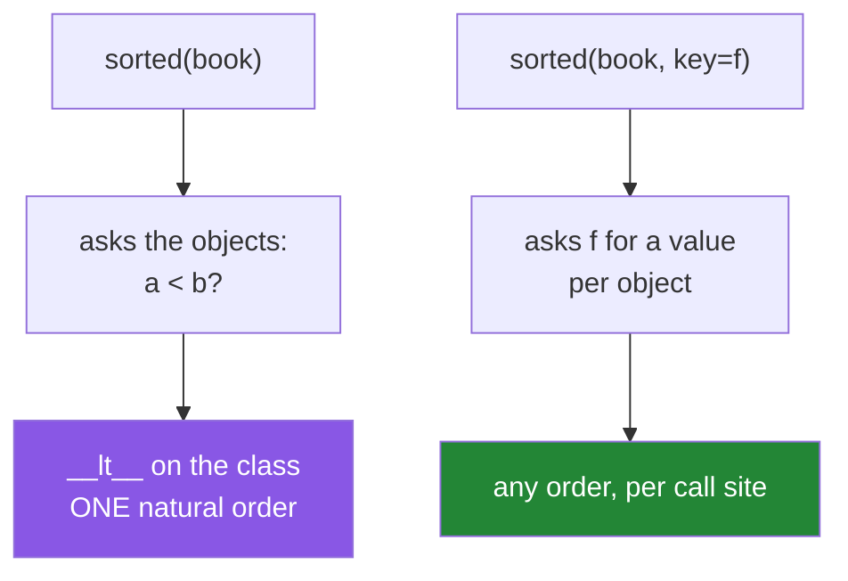

# 4.1 — Ordering: `__lt__`, `total_ordering`, and sorting objects of your own

## One-line answer

`sorted()`, `min()` and `max()` need only one comparison — `__lt__` — so defining "less than" is enough
to sort your objects, and `functools.total_ordering` fills in the other three operators from it and
`__eq__`.

---

## The story

The contacts app grows a **sort by** menu, and it has three options: by name, by how recently you spoke,
and by how often.

Nobody argues about the first one. Alphabetical order is agreed on in advance and nobody has an opinion
about it.

The second and third are different, because they are asking a question about people. *Is Mum "before" or
"after" the dentist?* There is no fact about the world that answers that. It depends entirely on what
you asked to sort by, and if you asked to sort by "most recently spoken to" then the answer is a fact
about the messages, not about the people.

So the menu exists because the app cannot know. What it can do is offer to sort — the machinery of
putting things in order is the same however the comparison is made — as long as **somebody says what
"before" means**.

---

## The idea in plain language

Sorting has two halves, and they are done by different people.

The **algorithm** — repeatedly asking "does this one come before that one?" and rearranging accordingly
— is written once, in the language, and you never touch it. Python's is a stable, adaptive merge sort,
and it is very good.

The **comparison** is yours. Python asks your object one question, `a < b`, which is
`type(a).__lt__(a, b)` ([3.1](../03-the-dunders/3.1-what-a-dunder-method-is.md)). That is genuinely all
`sorted`, `min`, `max` and `heapq` need. Nothing calls `>` on your behalf; the algorithm is written
entirely in terms of `<`.

So there are two ways to sort objects, and they answer different questions:

- **`sorted(book, key=lambda c: c.name)`** — sorting *this list*, *this time*, by a rule written at the
  call site ([Day 8, 1.5](../../../day-08-containers/parts/01-sequences/1.5-sort-sorted-and-key.md)).
  It needs no dunders at all.
- **`__lt__` on the class** — declaring that objects of this type have a **natural order**, everywhere,
  for everybody.

The second is a much stronger claim, and it should only be made when it is true. A `Paper` has no
obviously natural order; a `Version` does, and a `date` does. When in doubt, `key=` at the call site is
the honest choice, and it is what most real code uses.

If you do declare a natural order, the other three operators do not come for free. Defining `__lt__`
gives you `<` and, by reflection, `>` between two objects of the same class — but not `<=` or `>=`.
Writing all four by hand is four nearly-identical methods and four chances to get one backwards.

`functools.total_ordering` is a class decorator that fills them in:

> Define `__eq__` and **one** of `__lt__`, `__le__`, `__gt__`, `__ge__`, put `@functools.total_ordering`
> on the class, and it supplies the rest.

It is documented at
<https://docs.python.org/3/library/functools.html#functools.total_ordering>, and the documentation is
honest about the cost: the generated methods are slower than hand-written ones, because each is defined
in terms of the one you wrote. For sorting a few thousand objects that is irrelevant; in a hot loop it is
worth writing them out.

Two rules that keep an ordering sane:

**It must agree with `__eq__`.** If `a == b` then neither `a < b` nor `b < a` may be true. Sorting code,
`bisect` and `heapq` all assume this.

**It must be a real ordering.** If `a < b` and `b < c` then `a < c`, and `a < b` means `not (b < a)`.
An inconsistent comparison does not raise — it produces an arbitrary order, differently on different
inputs.

---

## Why Setu needs it

- **Papers get ranked constantly.** Phase 19's retrieval returns them by score, Day 233's eval sorts by
  relevance, and every notebook from Phase 3 onward sorts something.
- **[Day 8, 1.5](../../../day-08-containers/parts/01-sequences/1.5-sort-sorted-and-key.md) taught `key=`,
  and this document is where you learn when *not* to reach for the alternative.** Most Setu sorting
  should stay `key=`, because "most cited" and "most recent" are two orders and a class can only have one
  natural one.
- **Phase 18's vector search returns `(score, document)` pairs**, and sorting tuples compares the first
  item then the second — which quietly requires the *document* to be orderable when two scores tie. That
  is a `TypeError` in the middle of a retrieval, and it is the third failure below.
- **`heapq` is how a top-k is done without sorting everything**, and Phase 3's `argsort` work leans on the
  same idea. Both need `<`.

---

## The mechanism

```python
"""__lt__ is the one sorted() needs; total_ordering supplies the rest."""

import functools


@functools.total_ordering
class Contact:
    def __init__(self, name, last_contacted):
        self.name = name
        self.last_contacted = last_contacted

    def __repr__(self):
        return f"{self.name}({self.last_contacted})"

    def __eq__(self, other):
        if not isinstance(other, Contact):
            return NotImplemented
        return self.last_contacted == other.last_contacted

    def __lt__(self, other):
        if not isinstance(other, Contact):
            return NotImplemented
        return self.last_contacted < other.last_contacted


book = [Contact("Mum", 3), Contact("Sam", 31), Contact("the dentist", 400)]

print("sorted        :", sorted(book))
print("max           :", max(book))
print("a < b         :", book[0] < book[1])
print("a >= b, free  :", book[0] >= book[1])
print("sorted by key :", sorted(book, key=lambda c: c.name))
```

Run on Python 3.12.12 on 2026-09-01:

```
sorted        : [Mum(3), Sam(31), the dentist(400)]
max           : the dentist(400)
a < b         : True
a >= b, free  : False
sorted by key : [Mum(3), Sam(31), the dentist(400)]
```

**Line by line:**

- `@functools.total_ordering` sits **on the class**, not on a method. It is a class decorator: it takes
  the class, adds methods to it, and hands it back —
  [Day 14, 1.4](../../../day-14-decorators/parts/01-functions-as-values/1.4-the-at-sign-is-two-lines.md)'s
  rule with a class in place of a function.
- `last_contacted` is a plain number of days, so the example stays about ordering rather than about
  dates.
- `__eq__` compares `last_contacted`, and `__lt__` compares the **same field**. That is the "must agree"
  rule: two contacts equal on that number are neither before nor after each other.
- `if not isinstance(other, Contact): return NotImplemented` in both — the same guard as
  [3.3](../03-the-dunders/3.3-eq-and-the-duplicate.md), for the same reason. `Contact(3) < 5` then raises
  a clear `TypeError` rather than comparing a contact to a number.
- `sorted(book)` — **no `key=`.** Python asked the objects, and the objects answered. Nothing here is
  aware that a contact has a name.
- `max(book)` works from the same one method. So do `min`, `sorted(reverse=True)`, `heapq.nlargest` and
  `bisect`.
- `book[0] >= book[1]` is `False`, and **`__ge__` was never written.** `total_ordering` built it from
  `__lt__` and `__eq__`. Remove the decorator and this line raises `TypeError: '>=' not supported`.
- `sorted(book, key=lambda c: c.name)` — the other way, still available, and it happens to give the same
  order here because the names sort the same as the numbers. **The natural order and a `key=` order are
  independent**, and defining one does not stop you using the other.
- The output shows `Mum(3)` first because 3 days is *fewer* days: the field is "days since we spoke", so
  smallest is most recent. That is a real design trap — if the menu says "most recent first", somebody
  has to notice the field counts the other way.

The two ways to sort:



---

## When it breaks

**Sorting objects with no ordering:**

```text
$ uv run python -c "
class Contact:
    def __init__(self, name): self.name = name
print(sorted([Contact('Mum'), Contact('Sam')]))
"
Traceback (most recent call last):
  File "<string>", line 4, in <module>
TypeError: '<' not supported between instances of 'Contact' and 'Contact'
```

**What it means. The message names `<` even though you wrote `sorted`**, which is the clearest statement
in the language that sorting is built on one comparison. Either write `__lt__` or pass `key=`. Note that
sorting a **one-item** list raises nothing, because no comparison is needed — so a test with one object
passes and production fails.

**`__lt__` without `total_ordering`:**

```text
$ uv run python -c "
class Contact:
    def __init__(self, days): self.days = days
    def __lt__(self, other): return self.days < other.days

a, b = Contact(3), Contact(31)
print('a < b :', a < b)
print('a > b :', a > b)
print('a >= b:', a >= b)
"
a < b : True
a > b : False
Traceback (most recent call last):
  File "<string>", line 9, in <module>
TypeError: '>=' not supported between instances of 'Contact' and 'Contact'
```

**What it means.** Read the output: `<` printed, `>` printed, and the third line never printed at all — the comparison is evaluated before `print` gets it. `a > b` works
because Python **reflects** it — with no `__gt__`, it tries `b.__lt__(a)` — but there is no reflection
that produces `>=` from `<`. So the class supports three of the four comparisons, and the missing one
fails only where somebody happens to write it. `@functools.total_ordering` is the two-word fix.

**Sorting tuples where the second item is not orderable:**

```text
$ uv run python -c "
class Paper:
    def __init__(self, title): self.title = title
    def __repr__(self): return f'Paper({self.title!r})'

hits = [(0.9, Paper('A')), (0.7, Paper('B')), (0.9, Paper('C'))]
print(sorted(hits, reverse=True))
"
Traceback (most recent call last):
  File "<string>", line 6, in <module>
TypeError: '<' not supported between instances of 'Paper' and 'Paper'
```

**What it means.** Tuples compare item by item: two scores of `0.9` tie, so the comparison **falls through
to the papers**, which have no ordering. The failure depends on the *data* — change one score and it
sorts fine — so this is a bug that appears the first time two results tie, which on a real scorer is
immediately and in testing is never. The fix is `key=lambda pair: pair[0]`, which stops the comparison at
the score.

**An ordering that disagrees with equality:**

```text
$ uv run python -c "
import functools

@functools.total_ordering
class Contact:
    def __init__(self, name, days): self.name, self.days = name, days
    def __repr__(self): return f'{self.name}({self.days})'
    def __eq__(self, other): return self.name == other.name
    def __lt__(self, other): return self.days < other.days

a, b = Contact('Mum', 3), Contact('Mum', 400)
print('a == b:', a == b)
print('a < b :', a < b)
print('a <= b:', a <= b)
print('sorted:', sorted([b, a]))
"
a == b: True
a < b : True
a <= b: True
sorted: [Mum(3), Mum(400)]
```

**What it means.** `a == b` and `a < b` are **both true**, which is incoherent: two things cannot be
equal and one of them be smaller. Nothing raised, and `sorted` produced an order — an order that depends
on the input order, since the algorithm's decisions rest on a comparison that contradicts itself. Equality
looks at the name and ordering looks at the days, and the two disagree. **`__eq__` and `__lt__` must be
about the same fields**, or one of them is wrong.

---

## In production

**The professional default is `key=` at the call site, and a natural order only for types that genuinely
have one.** Version numbers, dates, money, priority levels — those have one order everybody agrees on. A
`Paper`, a `User`, an `Order` do not: they have several useful orders, and picking one to be *the* order
means every reader has to remember which. A useful review test: if the class needs a comment explaining
what `<` means, it should not have a `<`.

**What changes at scale is that `key=` also gets faster.** `sorted(items, key=f)` calls `f` once per
item — *n* calls — and then compares the extracted values, which are usually numbers or strings compared
in C. Sorting by `__lt__` calls a Python method on every comparison, which is about *n log n* calls into
the interpreter. On a million items that difference is large, and it is why the decorate-sort-undecorate
pattern that `key=` implements is the standard advice.

**The failure that only appears with real data is the tie.** Two equal scores, two equal dates, two
equal priorities — and the comparison falls through to whatever is next in the tuple, or the order comes
out non-deterministic between runs and a test that compares whole lists fails intermittently. The
professional habit is to make the sort key total: `key=lambda p: (-p.score, p.id)`, so ties are broken by
something unique and the output is reproducible, which is
[Principle 4](../../../../docs/00_MASTER_PLAN_DS_GENAI.md) applied to ordering.

**The review comment a senior engineer leaves.** *"`Paper.__lt__` sorts by citation count, so
`sorted(papers)` silently means 'least cited first' and two call sites already assume the opposite. Drop
the dunder and use an explicit `key=` — and make it `(-citations, arxiv_id)` so ties are stable across
runs."*

**The interview question.** *"How do you make your class sortable?"* One method, `__lt__`, is the answer,
and the follow-up is when you should. Saying that `sorted`, `min`, `max` and `heapq` are all written in
terms of `<`; that `total_ordering` generates the rest from `__lt__` plus `__eq__` at some run-time cost;
that `>` works by reflection but `>=` does not; and that for most domain objects an explicit `key=` is
better because there is no single natural order — that is the answer of somebody who has maintained one.

---

## Check yourself

```bash
uv run python -c "
import functools

@functools.total_ordering
class Contact:
    def __init__(self, name, days): self.name, self.days = name, days
    def __repr__(self): return f'{self.name}({self.days})'
    def __eq__(self, o):
        return isinstance(o, Contact) and self.days == o.days
    def __lt__(self, o):
        if not isinstance(o, Contact): return NotImplemented
        return self.days < o.days

book = [Contact('the dentist', 400), Contact('Mum', 3), Contact('Sam', 31)]
print(sorted(book), max(book), book[0] >= book[1])
print(sorted(book, key=lambda c: c.name))
"
```

Now remove `@functools.total_ordering` and find which of the printed comparisons stops working.

**Answer out loud, without scrolling up:**

> Which single comparison does `sorted()` need, and which operators does `total_ordering` give you from
> it? Then say when you would use `key=` instead of defining an order on the class.

---

**Next:** [4.2 — the container protocol](4.2-the-container-protocol.md), where three more dunders make an
object of yours behave like a built-in collection.
