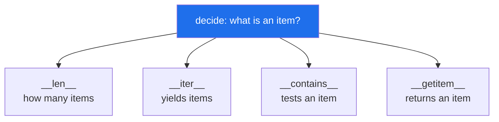

# 4.2 — The container protocol: `__len__`, `__iter__`, `__contains__`, `__getitem__`

## One-line answer

Four dunders make an object of yours behave like a built-in collection — `len(x)`, `for i in x`,
`k in x` and `x[k]` — and they are four promises that must agree with each other, not four independent
methods.

---

## The story

The contacts list is not a list of contacts.

It is a list with a search box at the top, a letter index down the side, a count under the title, and a
tap that opens one entry. Nobody who uses it thinks of those as four features. They think of it as **the
contacts**, and the four things are just what you can do with a group of things: count them, go through
them, check whether somebody is in there, and pick one out.

The thing that makes it feel like one object rather than four is that they all agree. The count matches
what you get scrolling. Searching for a name that is in the list finds it. The entry you tap is the entry
you tapped.

You would notice immediately if they did not. A count of 12 over a list you can scroll through 9 of is
not a small inconsistency — it makes the whole screen untrustworthy, because now you do not know which of
the four to believe.

---

## The idea in plain language

Python has no `Collection` base class you must inherit from. Instead there are names, and defining them
opts your object into the corresponding syntax
([3.1](../03-the-dunders/3.1-what-a-dunder-method-is.md)). That is what *protocol* means here — an
agreement about names, checked by nothing except whether the syntax works.

The four:

| Dunder | Gives you | Returns |
|---|---|---|
| `__len__` | `len(x)` | a non-negative integer |
| `__iter__` | `for i in x`, `list(x)`, unpacking, comprehensions | an **iterator** |
| `__contains__` | `k in x` | a bool |
| `__getitem__` | `x[k]` | the item, or raises `KeyError`/`IndexError` |

Two fallbacks are worth knowing, because they mean you often need fewer than four:

**`in` falls back to iteration.** With no `__contains__`, `k in x` walks `__iter__` comparing each item
with `==`. Correct, and linear — so `__contains__` is what you write when the underlying store can
answer faster, which for a dictionary-backed container it can.

**`__getitem__` alone gives you iteration.** If a class has `__getitem__` but no `__iter__`, Python will
call it with `0`, `1`, `2`, … until `IndexError`. This is the *old* iteration protocol, kept for
compatibility, and it means a class with only `__getitem__` is unexpectedly iterable —
[Day 11, 1.1](../../../day-11-iterators-and-generators/parts/01-iterators/1.1-iterable-and-iterator.md)'s
protocol has a back door.

The part that needs deciding rather than looking up is **what "an item" means**, and the four must
agree on it. For a container mapping names to numbers there are two defensible answers:

- **Like a dictionary**: `len` counts entries, `in` tests names, `x[name]` gives the number, and
  iteration yields **names**.
- **Like a list of contacts**: iteration yields whole contacts, `in` tests contacts, and `x[i]` gives the
  contact at position `i`.

Both are fine. What is not fine is mixing them — iterating names while `in` tests contacts — because
then `for c in book: assert c in book` fails, and every reader has to check each method separately to
know what the object holds.

`collections.abc` offers base classes (`Sequence`, `Mapping`, `Set`) that supply the derived methods and
document the choice; the full table of what each one requires is at
<https://docs.python.org/3/library/collections.abc.html>. Inheriting from one is the professional answer
once a container is more than a wrapper — and it is an abstract base class, which
[Day 13, 4.1](../../../day-13-inheritance-and-abstraction/parts/04-abstraction/4.1-abc-and-abstractmethod.md)
already covered.

---

## Why Setu needs it

- **Phase 19's retrieval returns a result set**, and every caller wants to count it, loop over it and
  index the top hit. Doing that with `.items` everywhere works and reads worse than `len(results)` and
  `results[0]`.
- **Phase 4's dataframes are the reference implementation**: `len(df)` is rows, `for c in df` yields
  *column names*, and `df["title"]` gives a column. That mix surprises everybody once, and it is
  internally consistent — which is the standard your own containers are held to.
- **[Day 11, 1.1](../../../day-11-iterators-and-generators/parts/01-iterators/1.1-iterable-and-iterator.md)
  taught the iterable/iterator distinction**, and this is where you are on the other side of it: your
  `__iter__` must return a **fresh** iterator each time, or the second loop sees nothing.
- **Day 233's eval suite does set arithmetic on retrieved and expected documents.** A container that
  supports `in` and iteration drops straight into that; one that does not needs unwrapping at every call
  site.

---

## The mechanism

```python
"""Three dunders that make your own collection feel built in."""


class AddressBook:
    def __init__(self, contacts):
        self._contacts = dict(contacts)

    def __len__(self):
        return len(self._contacts)

    def __iter__(self):
        return iter(self._contacts.values())

    def __contains__(self, name):
        return name in self._contacts

    def __getitem__(self, name):
        return self._contacts[name]


book = AddressBook({"Mum": "07700900111", "Sam": "07700900222"})

print("len()      :", len(book))
print("in         :", "Mum" in book, "|", "the dentist" in book)
print("[]         :", book["Sam"])
print("for loop   :", [n for n in book])
print("list()     :", list(book))
a, b = book
print("unpacking  :", a, b)
```

Run on Python 3.12.12 on 2026-09-01:

```
len()      : 2
in         : True | False
[]         : 07700900222
for loop   : ['07700900111', '07700900222']
list()     : ['07700900111', '07700900222']
unpacking  : 07700900111 07700900222
```

**Line by line:**

- `self._contacts = dict(contacts)` — the real store, with one leading underscore meaning *internal*
  ([Day 13, 3.1](../../../day-13-inheritance-and-abstraction/parts/03-encapsulation/3.1-public-protected-private.md)).
  **`dict(contacts)` copies**, so the caller's dictionary cannot be changed underneath the book later —
  [Day 4, 2.3](../../../day-04-objects/parts/02-containers/2.3-aliasing-two-names-one-object.md)'s aliasing
  problem, closed at the constructor.
- `def __len__(self): return len(self._contacts)` — a one-line forward. Note this also makes an empty
  book falsy ([3.5](../03-the-dunders/3.5-len-and-bool.md)), which for a container is the behaviour you
  want.
- `def __iter__(self): return iter(self._contacts.values())` — **`iter(...)` and not the dictionary
  view itself.** `__iter__` must return an *iterator*, and calling `iter()` on the view produces a fresh
  one every time, so two loops both work
  ([Day 11, 1.3](../../../day-11-iterators-and-generators/parts/01-iterators/1.3-exhaustion.md)).
- `.values()` is the decision: **this book iterates numbers, not names.** That is stated here and it is
  what `__contains__` below has to agree with — and, as the failure section shows, it does not.
- `def __contains__(self, name)` — `name in self._contacts` tests **keys**, because that is what `in` on a
  dictionary means. It is a constant-time lookup rather than the linear scan `in` would do by falling
  back to iteration.
- `def __getitem__(self, name): return self._contacts[name]` — indexing by name. `book["nobody"]` raises
  `KeyError`, which is what a caller expects from something that indexes by key.
- `[n for n in book]` and `list(book)` give the same thing, because both use `__iter__`. Comprehensions,
  `list`, `tuple`, `sum`, `max`, `sorted` and the `for` statement are all one protocol
  ([Day 6, 1.1](../../../day-06-loops/parts/01-iteration/1.1-what-a-for-loop-actually-does.md)).
- `a, b = book` — **unpacking works too**, and nothing was written for it. Unpacking is iteration with a
  count check.
- **Now read the output as a whole.** `"Mum" in book` is `True`, and `"Mum"` is not in `list(book)`. The
  four methods do not agree about what this book contains, and that is the design flaw the next section
  is about.

The four, and what each one needs to agree on:



---

## When it breaks

**`in` and iteration disagreeing — the flaw in the mechanism above:**

```text
$ uv run python -c "
class AddressBook:
    def __init__(self, contacts): self._contacts = dict(contacts)
    def __iter__(self): return iter(self._contacts.values())
    def __contains__(self, name): return name in self._contacts

book = AddressBook({'Mum': '07700900111'})
for item in book:
    print('iterating gives:', item)
    print('and is it in the book?', item in book)
"
iterating gives: 07700900111
and is it in the book? False
```

**What it means.** Every item you get by iterating reports that it is not in the container. **`for x in
c: assert x in c` is the single best test of a container's consistency**, and it fails here. Nothing
raised, and either method alone is defensible: iterate values *or* test values, iterate keys *or* test
keys. Mixing them means no reader can predict what the object does without reading both.

**`__iter__` returning the same iterator every time:**

```text
$ uv run python -c "
class Book:
    def __init__(self, names):
        self._it = iter(names)
    def __iter__(self): return self._it

book = Book(['Mum', 'Sam'])
print('first pass :', list(book))
print('second pass:', list(book))
"
first pass : ['Mum', 'Sam']
second pass: []
```

**What it means.** The second loop got nothing, because `__iter__` handed back an iterator that had
already been used up
([Day 11, 1.3](../../../day-11-iterators-and-generators/parts/01-iterators/1.3-exhaustion.md)). This
passes every test that loops once and fails the moment somebody loops twice — or calls `len(list(book))`
and then iterates. **`__iter__` must build a fresh iterator on every call**, which is why the mechanism
writes `iter(...)` rather than storing one.

**`__getitem__` without `__iter__`, iterating anyway:**

```text
$ uv run python -c "
class OldStyle:
    def __init__(self, items): self._items = items
    def __getitem__(self, i): return self._items[i]

b = OldStyle(['Mum', 'Sam'])
print('for loop works:', [x for x in b])
print('in works      :', 'Sam' in b)
print('has __iter__? :', hasattr(b, '__iter__'))
"
for loop works: ['Mum', 'Sam']
in works      : True
has __iter__? : False
```

**What it means.** The object is iterable with no `__iter__` at all, because Python fell back to calling
`__getitem__` with `0, 1, 2, …` until `IndexError`. Convenient, and a trap: if `__getitem__` takes a
**name** rather than an index, this fallback calls it with `0` and raises `KeyError` — which is not
`IndexError`, so the loop does not stop cleanly and the error surfaces from inside a `for` statement
nobody suspected. **A key-based `__getitem__` should be paired with an explicit `__iter__`.**

**A `__len__` that does not agree with iteration:**

```text
$ uv run python -c "
class Book:
    def __init__(self, contacts): self._contacts = contacts
    def __len__(self): return len(self._contacts)
    def __iter__(self): return (c for c in self._contacts if c is not None)

book = Book(['Mum', None, 'Sam'])
print('len()      :', len(book))
print('list()     :', list(book))
print('len(list()):', len(list(book)))
"
len()      : 3
list()     : ['Mum', 'Sam']
len(list()): 2
```

**What it means.** The count says three and looping gives two, because `__iter__` filters and `__len__`
does not. Every caller that pre-allocates from `len`, shows a count in a UI, or asserts on a length is now
wrong. **`len(x)` and `len(list(x))` must agree**, and that is the second one-line test worth having for
any container you write.

---

## In production

**The professional habit is to inherit from `collections.abc`** — `Sequence`, `Mapping` or `Set` — rather
than assemble dunders by hand. You supply two or three methods and the base class fills in the rest
consistently: `Mapping` gives you `keys`, `values`, `items`, `get`, `__contains__` and `__eq__` from
`__getitem__`, `__iter__` and `__len__`. That guarantees the agreement this document is about, and it
also makes `isinstance(x, Mapping)` true, which is how other libraries decide how to treat your object.

**What changes at scale is that `__len__` and `__contains__` stop being free.** A container backed by a
database cannot count without a query, and `in` cannot answer without one either — and both are called
in places that look like they cost nothing
([3.5](../03-the-dunders/3.5-len-and-bool.md)). The professional shapes are to keep a cheap count
alongside the data, to make `__contains__` a targeted lookup rather than a scan, and — where neither is
possible — to not implement the dunder at all, so callers must use a method whose name says it does work.

**The failure that only appears with real data is the container that is iterated twice.** A results
object wrapping a generator or a database cursor works perfectly in a test that loops once, and in
production somebody counts the results and then displays them. The second pass is empty, the page shows
nothing, and the log shows a successful query returning rows. **Any container that wraps a one-shot
source must either materialise it in `__init__` or refuse to pretend it is a collection.**

**The review comment a senior engineer leaves.** *"`SearchResults.__iter__` yields documents but
`__contains__` takes a document id, so `for d in results: assert d in results` is false. Pick one — I
would iterate documents and have `__contains__` accept a document — and add the two consistency tests:
`len(list(x)) == len(x)`, and every iterated item is `in` it."*

**The interview question.** *"How do you make a class work with `for` and `in` and `len`?"* Naming the
four dunders is the start; the answer that lands adds the two fallbacks — `in` falls back to iteration,
and `__getitem__` alone makes an object iterable through the legacy protocol — and then the real point:
they are one set of promises about what an item is, not four independent methods, so the tests worth
writing are that iteration and `in` agree and that `len` matches the number of items yielded.

---

## Check yourself

```bash
uv run python -c "
class AddressBook:
    def __init__(self, contacts): self._contacts = dict(contacts)
    def __len__(self): return len(self._contacts)
    def __iter__(self): return iter(self._contacts)
    def __contains__(self, name): return name in self._contacts
    def __getitem__(self, name): return self._contacts[name]

book = AddressBook({'Mum': '07700900111', 'Sam': '07700900222'})
print(len(book), list(book), 'Mum' in book, book['Mum'])
print('consistent  :', all(item in book for item in book))
print('len agrees  :', len(list(book)) == len(book))
"
```

This version iterates **keys**, so both consistency checks pass. Change `__iter__` back to
`.values()` and watch the first one fail.

**Answer out loud, without scrolling up:**

> Name the four container dunders and what each one gives you. Then give the two one-line tests that
> catch a container whose methods disagree with each other.

---

**Next:** [4.3 — which dunders to implement, and when to stop](4.3-which-dunders-and-when-to-stop.md),
the last document of the day.
