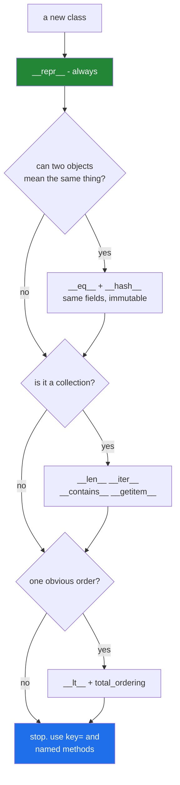

# 4.3 — Which dunders to implement, and when to stop

## One-line answer

Write `__repr__` for every class, `__eq__` and `__hash__` together when two objects can mean the same
thing, the container four only when the object really is a collection — and stop there, because every
further dunder is syntax a reader has to look up before they can read a line of your code.

---

## The story

Somebody has added a **gestures** setting to the contacts app.

Swipe left on a contact to call. Swipe right to message. Long press to add to favourites. Two fingers
down to merge duplicates. Pinch to archive. Shake the phone to undo.

Each one was somebody's good idea, and each one saves a tap. Together they mean nobody can hand the
phone to another person and have them use it. Not because any single gesture is bad, but because the
screen no longer tells you what it does — you have to have been told.

The contrast is the swipe that everybody kept: **swipe down to refresh**. Nobody had to learn it,
because it already meant that everywhere else. It is not a good gesture because it is clever; it is a
good gesture because it is the one people already knew.

---

## The idea in plain language

The data model lists over eighty special method names
(<https://docs.python.org/3/reference/datamodel.html#special-method-names>). Almost all of them exist so
that a *specific kind* of object — a number, a container, a context manager, a proxy — can behave the way
that kind of object is expected to. Very few of them belong on an ordinary domain class.

A practical order to work in:

**Always: `__repr__`.** One line, and it pays for itself in the first debugging session
([3.2](../03-the-dunders/3.2-repr-and-str.md)). There is no class for which the default is better.

**When two objects can describe the same thing: `__eq__` and `__hash__`, together.**
[3.3](../03-the-dunders/3.3-eq-and-the-duplicate.md) and
[3.4](../03-the-dunders/3.4-hash-and-the-broken-set.md) are one decision, over the same tuple of fields,
and those fields should be immutable.

**When the object genuinely is a collection: `__len__`, `__iter__`, `__contains__`, `__getitem__`** —
agreeing with each other ([4.2](4.2-the-container-protocol.md)), and preferably by inheriting from
`collections.abc`.

**When there is one order everybody would agree on: `__lt__`, plus `total_ordering`**
([4.1](4.1-ordering-and-total-ordering.md)). Usually there is not, and `key=` is better.

**When the object manages something that must be released: `__enter__` and `__exit__`** — which is
tomorrow.

**Rarely, and only when the meaning is universally understood: the arithmetic ones.** `__add__` on a
`Money`, a `Vector` or a `Duration` is clear. `__add__` on a `Paper`, a `User` or a `Request` is a
puzzle, because nobody knows what adding two of those means.

Two tests to apply before adding one:

**The stranger test.** Could somebody who has never seen this class predict what the operator does? If
`a + b` needs the class opened to be understood, a method named `merge_with` is better — it is one word
longer at the call site and needs no lookup.

**The single-meaning test.** Is there exactly one obvious meaning? "Adding" two shopping lists could
mean concatenating them or summing their totals. Where two meanings exist, name the method after the one
you meant.

What is being weighed is real. A well-chosen dunder makes your object work with `sorted`, `set`, `in`,
`for`, `len` and every library that uses those — an enormous amount of behaviour for one method. A
badly-chosen one makes ordinary-looking code do something surprising, and the surprise is invisible in a
diff. **Dunders are how your class joins the language; they are also how your class stops being
readable.**

---

## Why Setu needs it

- **Today handed you a large toolbox and the usual next mistake is emptying it onto one class.** A
  `Paper` with fourteen dunders is harder to read than one with three.
- **`src/setu/paper.py` gets exactly four today** — `__repr__`, `__eq__`, `__hash__` and, if you decide
  there is a natural order, `__lt__`. Everything else you were tempted by is the subject here.
- **[Day 12, 3.4](../../../day-12-classes/parts/03-the-paper-object/3.4-when-not-to-write-a-class.md)
  asked when not to write a class.** This is the same question one level in: when not to add a method to
  the class you have already decided to write.
- **Day 19's dataclasses and Pydantic generate `__repr__`, `__eq__` and optionally `__hash__` and
  ordering for you** from the field list. Knowing which four you would have written by hand is what
  makes the generated set reviewable rather than accepted.

---

## The mechanism

The whole day, on one small class, and nothing else:

```python
"""Paper: four dunders, and a documented reason for each."""

from __future__ import annotations

import functools


class Paper:
    """A paper. Equality and hashing are by identifier; fields are set once."""

    def __init__(self, title: str, year: int, paper_id: str) -> None:
        self._title = title.strip()
        self._year = year
        self._paper_id = paper_id

    @classmethod
    def from_row(cls, row: dict) -> Paper:
        """One door per input shape (part 1.2); cls, so subclasses work (part 1.4)."""
        return cls(row["title"], int(row["year"]), row["id"])

    @property
    def title(self) -> str:
        """Read-only: the fields that decide equality must not move (part 3.4)."""
        return self._title

    @functools.cached_property
    def slug(self) -> str:
        """Derived, expensive enough to keep, safe because this object is frozen."""
        return "-".join(self._title.lower().split())

    def __repr__(self) -> str:
        """Always. Identifying fields only, never the abstract (part 3.2)."""
        return f"{type(self).__name__}(title={self._title!r}, year={self._year}, id={self._paper_id!r})"

    def __eq__(self, other: object) -> bool:
        """Two rows from two sources are one paper if the id matches (part 3.3)."""
        if not isinstance(other, Paper):
            return NotImplemented
        return self._paper_id == other._paper_id

    def __hash__(self) -> int:
        """Same field as __eq__, no more and no fewer (part 3.4)."""
        return hash((self._paper_id,))


a = Paper.from_row({"title": " The Kitchen Table ", "year": "2019", "id": "10.1000/x"})
b = Paper.from_row({"title": "the kitchen table", "year": "2019", "id": "10.1000/x"})

print("repr    :", a)
print("equal   :", a == b)
print("set     :", len({a, b}))
print("slug    :", a.slug)
print("stored  :", sorted(vars(a)))
```

Run on Python 3.12.12 on 2026-09-01:

```
repr    : Paper(title='The Kitchen Table', year=2019, id='10.1000/x')
equal   : True
set     : 1
slug    : the-kitchen-table
stored  : ['_paper_id', '_title', '_year', 'slug']
```

**Line by line:**

- `from __future__ import annotations` — lets `-> Paper` be written inside the class body, where the name
  does not exist yet. Without it the annotation has to be the string `"Paper"`.
- `def __init__` stores into **underscore names**, so the public surface is properties and nobody
  overwrites `_paper_id` by accident
  ([Day 13, 3.1](../../../day-13-inheritance-and-abstraction/parts/03-encapsulation/3.1-public-protected-private.md)).
- `from_row` uses `cls(...)` and `int(row["year"])`. **The parsing lives here**, in the door that knows
  what a row looks like, and `__init__` keeps one shape
  ([1.2](../01-three-kinds-of-method/1.2-from-message-the-second-door-in.md),
  [1.4](../01-three-kinds-of-method/1.4-cls-and-inheritance.md)).
- `@property def title` with **no setter** — read-only, which is what makes the `__hash__` below safe
  ([2.2](../02-property/2.2-the-setter-and-validation.md),
  [3.4](../03-the-dunders/3.4-hash-and-the-broken-set.md)).
- `@functools.cached_property def slug` — computed once and stored. Legal here **only because the title
  cannot change** ([2.4](../02-property/2.4-cached-property-and-the-stale-cache.md)); on a mutable paper
  this would be a stale-value bug.
- `__repr__` uses `type(self).__name__` so a subclass names itself, and includes three short fields. **No
  abstract**, because a repr goes into every log line ([3.2](../03-the-dunders/3.2-repr-and-str.md)).
- `__eq__` returns `NotImplemented` for other types and compares the identifier — one field, and the
  domain decision written down ([3.3](../03-the-dunders/3.3-eq-and-the-duplicate.md)).
- `__hash__` hashes **the same one field**. Read the two methods together; that is the invariant
  ([3.4](../03-the-dunders/3.4-hash-and-the-broken-set.md)).
- `equal : True` from two rows whose titles differ in case and spacing — because equality is the
  identifier, and the identifier is the same paper.
- `set : 1` — deduplication now works, in constant time, which is the whole reason `__hash__` is there.
- `stored : ['_paper_id', '_title', '_year', 'slug']` — `slug` is in the instance dictionary because it
  has been read once; the properties are not, because properties live on the class
  ([2.1](../02-property/2.1-a-property-is-worked-out.md)).
- **What is not here:** no `__lt__` (papers have no single natural order), no `__len__` (a paper is not a
  collection), no `__add__` (nobody knows what two papers add up to), no `__str__` (the repr is already
  the right thing to show). Four dunders, and each one has a reason in its docstring.

What to reach for, and when:



---

## When it breaks

**An operator whose meaning nobody can guess:**

```text
$ uv run python -c "
class Paper:
    def __init__(self, refs): self.refs = refs
    def __add__(self, other): return Paper(self.refs + other.refs)
    def __repr__(self): return f'Paper({self.refs!r})'

a, b = Paper(['x']), Paper(['y'])
print('a + b :', a + b)
"
a + b : Paper(['x', 'y'])
```

**What it means.** It works, and that is the problem. A reader meeting `paper_a + paper_b` in a codebase
has no way to know whether it merges references, concatenates abstracts, sums citation counts or
produces a combined record — so they open the class. **A method called `with_references_of` needs no
lookup**, and costs eleven characters at the call site. The dunder saved typing and spent attention,
which is the wrong trade in code that is read more than it is written.

**`__getattr__` used to make everything work:**

```text
$ uv run python -c "
class Paper:
    def __init__(self, data): self._data = data
    def __getattr__(self, name): return self._data.get(name)

p = Paper({'title': 'The Kitchen Table'})
print('title  :', p.title)
print('yaer   :', p.yaer)
print('authr  :', p.authr)
"
title  : The Kitchen Table
yaer   : None
authr  : None
```

**What it means.** `__getattr__` catches every attribute that is not found and answered `None` for two
typos. **Every misspelling in the codebase is now a silent `None`** instead of an `AttributeError`, and
that `None` travels until something tries to use it. `__getattr__` is a real tool for proxies and lazy
loading, and using it to avoid declaring fields removes the one safety net attribute access had.

**A `__bool__` or `__len__` added for convenience, changing an unrelated check:**

```text
$ uv run python -c "
class Paper:
    def __init__(self, refs): self.refs = refs
    def __len__(self): return len(self.refs)

def cite(paper):
    if not paper:
        return 'no paper supplied'
    return f'cited, {len(paper)} references'

print('a paper with refs:', cite(Paper(['x'])))
print('a paper with none:', cite(Paper([])))
"
a paper with refs: cited, 1 references
a paper with none: no paper supplied
```

**What it means.** `__len__` was added so `len(paper)` would count references, and it silently changed
what `if not paper:` means ([3.5](../03-the-dunders/3.5-len-and-bool.md)). A real paper with no
references is now reported as no paper at all. **A paper is not a collection**, and the honest fix is to
delete `__len__` and write `len(paper.refs)` — one word longer, and it says what it counts.

**Dunders that disagree, on a class with too many:**

```text
$ uv run python -c "
import functools

@functools.total_ordering
class Paper:
    def __init__(self, title, year): self.title, self.year = title, year
    def __repr__(self): return f'P({self.title!r},{self.year})'
    def __eq__(self, o): return self.title == o.title
    def __lt__(self, o): return self.year < o.year
    def __hash__(self): return hash(self.year)

a, b = Paper('A', 2019), Paper('A', 2024)
print('a == b        :', a == b)
print('a < b         :', a < b)
print('hashes equal  :', hash(a) == hash(b))
print('set of both   :', {a, b})
"
a == b        : True
a < b         : True
hashes equal  : False
set of both   : {P('A',2024), P('A',2019)}
```

**What it means.** Three bugs at once and not one exception. Equality uses the title, ordering uses the
year, hashing uses the year — so two objects are equal *and* one is less than the other, and a set holds
both despite them being equal. **Each method is reasonable alone.** The class has five dunders and no
single answer to "what makes two papers the same", which is what makes it incoherent. The fix is to pick
the deciding fields once and use them in `__eq__`, `__hash__` and `__lt__` alike.

---

## In production

**The professional habit is that the four generated dunders come from a decorator, and anything beyond
them is argued for in review.** `@dataclass(frozen=True)` gives `__init__`, `__repr__`, `__eq__` and
`__hash__` from the field list, with `order=True` adding comparisons — consistent by construction,
because one field list drives all of them. That is the shape almost every modern Python domain object
takes, and Day 19 is where this curriculum adopts it.

**What changes at scale is that dunders become an interface other people depend on.** Once your class is
hashable, somebody puts it in a set; once it is orderable, somebody sorts a list of them; once it is
iterable, somebody writes `list(x)` in code you will never see. Removing a dunder later is a breaking
change with no deprecation path, because the call sites are `in`, `sorted` and `for` rather than named
methods you could grep for. Adding one is cheap and removing one is not, which argues for starting small.

**The failure that only appears with real data is the operator that is correct on the examples the author
tried.** `__add__` on a `Money` that ignores currency, `__eq__` on a `Paper` that compares raw titles,
`__lt__` on a version string that sorts `"10"` before `"9"` — all fine on the fixture, all wrong on the
corpus. Because the call site is an operator rather than a named method, nobody reviewing the calling
code has a reason to check.

**The review comment a senior engineer leaves.** *"This class has `__add__`, `__sub__`, `__or__` and
`__call__`, and I cannot tell what any of them do without opening it. Keep `__repr__`, `__eq__` and
`__hash__`; give the other four ordinary names — `merged_with`, `without`, `combined`, `run` — and the
call sites become readable without any of this context."*

**The interview question.** *"Which dunder methods do you implement on a typical class?"* The answer that
lands is short and reasoned: `__repr__` always; `__eq__` and `__hash__` together, over the same immutable
fields, when two objects can mean the same thing; the container four only if the object is genuinely a
collection and only if they agree; and ordering only where one natural order exists. What makes it a good
answer is the reason for stopping — that operators are syntax the reader must already understand, so a
dunder that needs the class opened has cost more than it saved, and that in practice a frozen dataclass
generates the first four consistently and is where most classes should start.

---

## Check yourself

```bash
uv run python -c "
import functools

class Paper:
    def __init__(self, title, year, paper_id):
        self._title, self._year, self._paper_id = title.strip(), year, paper_id
    @property
    def title(self): return self._title
    @functools.cached_property
    def slug(self): return '-'.join(self._title.lower().split())
    def __repr__(self):
        return f'{type(self).__name__}(title={self._title!r}, id={self._paper_id!r})'
    def __eq__(self, other):
        if not isinstance(other, Paper): return NotImplemented
        return self._paper_id == other._paper_id
    def __hash__(self): return hash((self._paper_id,))

a = Paper(' The Kitchen Table ', 2019, '10.1000/x')
b = Paper('the kitchen table', 2019, '10.1000/x')
print(a, '|', a == b, '|', len({a, b}), '|', a.slug)
print(sorted(vars(a)))
"
```

Four dunders, two properties, one classmethod's worth of discipline. Now add `__lt__` comparing years
and say what a reader of `sorted(papers)` elsewhere in the codebase would assume it meant.

**Answer out loud, without scrolling up:**

> Which dunder goes on every class, which two are always written together, and what question do you ask
> before adding any of the rest? Then say why removing a dunder later is harder than removing a method.

---

**That is the last document of Day 15.** Back to the hub — [`../../LESSON.md`](../../LESSON.md) §4 — to
give `src/setu/paper.py` its alternative constructor, its properties and its four dunders, and to write
the tests in §5 that go red before any of them exist.
