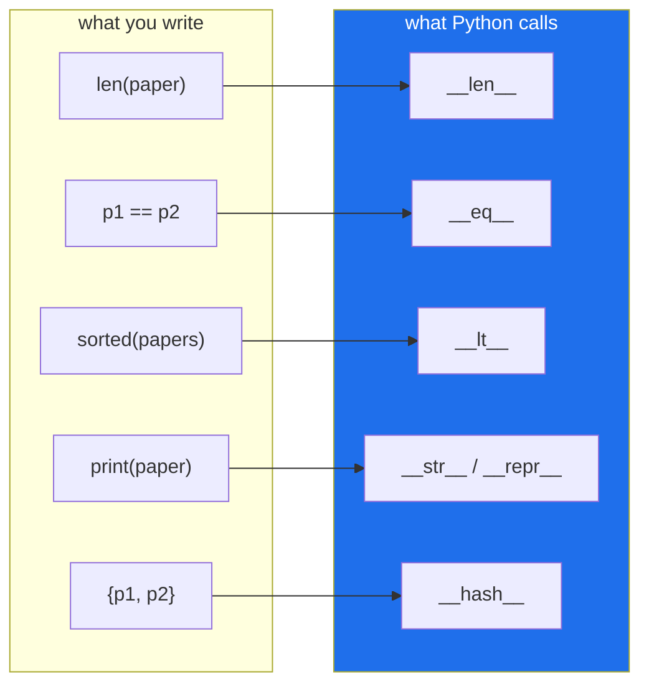

# Day 15 — `classmethod`, `staticmethod`, `property`, and dunder methods

**Phase 2 · Module 2** · IDs: **PY-17** (decorators on methods), **PY-18** (magic/dunder methods)

> **Yesterday:** you built decorators. Today you use three that ship with Python and change what a
> method *is*.
> **Today:** `Paper` gets an alternative constructor, a validated attribute, and the dunders that make
> it sort, compare, print and deduplicate correctly.
> **Tomorrow:** files, `pathlib`, and context managers.

```bash
./m start 15 && ./m scaffold 15
```

**Time:** 100 minutes. **Request budget:** 0 model calls.

---

## §1 The story

Two problems left over from Day 12, and both have a standard answer.

**First: `__init__` is a bottleneck.** A `Paper` can be built from arguments, but on Day 227 you will
also build one from an arXiv API response, from a database row, and from a CSV line. You cannot have
four `__init__`s. You can have one `__init__` and three **classmethods** that each shape their input
and delegate to it. That is the *alternative constructor* pattern, and `pd.read_csv` is the same
idea — a classmethod-ish factory sitting in front of one real initialiser.

**Second: attributes have no gate.** On Day 12 you wrote `c.value = -999` and nothing objected. A
`@property` turns attribute access into a method call *without changing how callers write it*, so
validation can appear later without breaking a single call site.

Then **dunder methods** — the double-underscore names Python calls on your behalf. You have already
relied on several: `len(x)` calls `x.__len__()`, `a + b` calls `a.__add__(b)`, `for x in y` calls
`y.__iter__()`. Implementing them is how your class stops being a bag of data and starts behaving
like a built-in type.



The one that pays for itself fastest is `__repr__`. Every debug print, every failed assertion, every
list you dump in a REPL becomes readable. It takes one line and saves hours.

---

## §2 Setup — run this

```bash
mkdir -p days/day-15/lab
touch days/day-15/lab/dunders.py
```

`src/setu/papers.py` grows today. No new packages.

---

## §3 PY-17 — the three method decorators

`days/day-15/lab/dunders.py`:

```python
"""PY-17 / PY-18: method decorators and the dunder protocol."""

from __future__ import annotations


class Temperature:
    def __init__(self, celsius: float) -> None:
        self.celsius = celsius            # goes through the property setter below

    # --- alternative constructors -------------------------------------------
    @classmethod
    def from_fahrenheit(cls, f: float) -> Temperature:
        return cls((f - 32) * 5 / 9)      # cls, not Temperature - subclass-safe

    @classmethod
    def freezing(cls) -> Temperature:
        return cls(0)

    # --- a helper that needs no state ---------------------------------------
    @staticmethod
    def is_plausible(celsius: float) -> bool:
        return -273.15 <= celsius <= 1000

    # --- a validated, computed attribute ------------------------------------
    @property
    def celsius(self) -> float:
        return self._celsius

    @celsius.setter
    def celsius(self, value: float) -> None:
        if not self.is_plausible(value):
            raise ValueError(f"{value} is not a plausible temperature")
        self._celsius = float(value)

    @property
    def fahrenheit(self) -> float:
        return self._celsius * 9 / 5 + 32   # computed, read-only: no setter defined


def method_decorators() -> None:
    print(f"\n{Temperature.from_fahrenheit(212).celsius=}")
    print(f"{Temperature.freezing().celsius=}")
    print(f"{Temperature.is_plausible(-500)=}   <- callable without an instance")

    t = Temperature(20)
    print(f"\n{t.celsius=} {t.fahrenheit=}   <- reads like plain attributes")
    try:
        t.celsius = -400
    except ValueError as exc:
        print(f"  setter refused: {exc}")
    try:
        t.fahrenheit = 100
    except AttributeError as exc:
        print(f"  read-only:      {exc}")


def cls_is_subclass_safe() -> None:
    class Kelvinish(Temperature):
        pass

    made = Kelvinish.from_fahrenheit(32)
    print(f"\n{type(made).__name__=}   <- Kelvinish, because the classmethod used cls")
```

**Line by line:**

- `@classmethod` — the first argument is the **class**, not the instance, and is called `cls`. Use it
  for alternative constructors and anything that needs to know which class it was called on.
- `cls((f - 32) * 5 / 9)` — **`cls`, never `Temperature`.** Hard-coding the class name breaks
  subclasses: `Kelvinish.from_fahrenheit(...)` would silently return a `Temperature`. §3's last
  function proves it.
- `@staticmethod` — no `self`, no `cls`. It is a plain function that lives in the class's namespace
  for discoverability. If it does not reference the class *or* the instance, it is a staticmethod —
  or, honestly, it is a module-level function and often should be one.
- `self.celsius = celsius` inside `__init__` — this **goes through the setter**, so validation applies
  at construction too. That is why `__init__` assigns to the public name and not to `_celsius`.
- `@property def celsius` — the getter. Now `t.celsius` is a method call that *looks* like an
  attribute. No call site changes.
- `@celsius.setter` — the setter, named after the property. Note the decorator is `@celsius.setter`,
  not `@property.setter`; the property object owns it.
- `self._celsius` — the actual storage. The underscore signals "the property is the interface".
- `fahrenheit` with **no setter** — assignment raises `AttributeError`. Read-only computed attributes
  are free.

---

## §4 PY-18 — the dunders worth implementing

Add to the same file:

```python
class Version:
    def __init__(self, major: int, minor: int) -> None:
        self.major, self.minor = major, minor

    def __repr__(self) -> str:
        return f"Version(major={self.major}, minor={self.minor})"

    def __str__(self) -> str:
        return f"{self.major}.{self.minor}"

    def __eq__(self, other: object) -> bool:
        if not isinstance(other, Version):
            return NotImplemented
        return (self.major, self.minor) == (other.major, other.minor)

    def __lt__(self, other: Version) -> bool:
        return (self.major, self.minor) < (other.major, other.minor)

    def __hash__(self) -> int:
        return hash((self.major, self.minor))


def dunders() -> None:
    a, b, c = Version(1, 2), Version(1, 2), Version(2, 0)

    print(f"\nrepr: {a!r}")
    print(f"str:  {a}")
    print(f"in a list: {[a, c]}   <- lists use repr, not str")

    print(f"\n{a == b=}   <- value equality, not identity")
    print(f"{a is b=}")
    print(f"{sorted([c, a])=}   <- __lt__ is all sorted() needs")
    print(f"{ {a, b, c} =}   <- __hash__ + __eq__ make dedupe work: two items, not three")
    print(f"{a == 'Version(1, 2)'=}   <- NotImplemented -> Python falls back to False")


class Corpus:
    def __init__(self, docs: list[str]) -> None:
        self._docs = list(docs)

    def __len__(self) -> int:
        return len(self._docs)

    def __getitem__(self, index: int) -> str:
        return self._docs[index]

    def __iter__(self):
        return iter(self._docs)

    def __contains__(self, item: str) -> bool:
        return item in self._docs

    def __bool__(self) -> bool:
        return bool(self._docs)


def container_protocol() -> None:
    corpus = Corpus(["a", "b", "c"])
    print(f"\n{len(corpus)=} {corpus[1]=} {'b' in corpus=}")
    print(f"{[d.upper() for d in corpus]=}   <- __iter__ makes it loopable")
    print(f"{bool(Corpus([]))=}   <- empty is falsy, like a list (Day 5)")


if __name__ == "__main__":
    method_decorators()
    cls_is_subclass_safe()
    dunders()
    container_protocol()
```

**Line by line:**

- `__repr__` — the **unambiguous** form, for developers. The convention is that it looks like the code
  that would recreate the object. `[a, c]` prints reprs, which is why a class without one shows
  `<Version object at 0x7f...>` in every list you ever print. **Write this one always.**
- `__str__` — the **readable** form, for users. `print(x)` uses it, falling back to `__repr__` if
  absent. If you only write one, write `__repr__`.
- `return NotImplemented` — not `False`, and not `NotImplementedError`. It is a sentinel telling
  Python *"I don't know how to compare with that; try the other operand's `__eq__`."* If nobody
  knows, Python falls back to identity, giving `False`. Returning `False` directly would break
  comparison with a future class that *does* know how to compare with yours.
- `__lt__` — implement just this one and `sorted()`, `min()` and `max()` all work.
  (`functools.total_ordering` fills in `>`, `<=`, `>=` from `__eq__` plus `__lt__`.)
- `(self.major, self.minor) < (...)` — tuple comparison is lexicographic: compare the first elements,
  and only if equal move to the second. This is Day 11's tuple sort key, as an operator.
- `__hash__` over a **tuple of the same fields used by `__eq__`** — the contract is: *equal objects
  must have equal hashes.* Break it and your objects vanish from sets and dicts intermittently.
  ⚠️ **Defining `__eq__` sets `__hash__` to `None`**, making the class unhashable, unless you define
  `__hash__` too. That is a deliberate safety default and it surprises everyone once.
- `__len__`, `__getitem__`, `__iter__`, `__contains__`, `__bool__` — the container protocol. Implement
  them and your class works with `len()`, indexing, `for`, `in`, and `if`. Note `__bool__` connects
  straight back to Day 5's truthiness rules.

---

## §5 Build brief — `Paper` grows up

Extend `src/setu/papers.py`:

```python
    # --- alternative constructors -------------------------------------------
    @classmethod
    def from_row(cls, row: dict[str, object]) -> Paper:
        """TODO(me): build from a dict with keys id|paper_id, title, year, authors?, venue?.

        Use cls(...), never Paper(...). Coerce year from str if needed.
        Raise InvalidPaper (not KeyError) when a required key is missing.
        """
        raise NotImplementedError

    @classmethod
    def from_line(cls, line: str, sep: str = "\t") -> Paper:
        """TODO(me): build from 'id<sep>title<sep>year'. Raise InvalidPaper on the wrong field count."""
        raise NotImplementedError

    # --- validated attribute -------------------------------------------------
    @property
    def year(self) -> int:
        """TODO(me): return the stored year."""
        raise NotImplementedError

    @year.setter
    def year(self, value: int) -> None:
        """TODO(me): validate MIN_YEAR..MAX_YEAR, raise InvalidPaper, store on self._year.

        __init__ must assign to self.year (public) so construction is validated too.
        """
        raise NotImplementedError

    @property
    def age(self) -> int:
        """TODO(me): 2026 - year. Read-only: define NO setter."""
        raise NotImplementedError

    @staticmethod
    def is_plausible_year(value: object) -> bool:
        """TODO(me): True if value is an int in range. No self, no cls."""
        raise NotImplementedError

    # --- dunders -------------------------------------------------------------
    def __repr__(self) -> str:
        """TODO(me): Paper(paper_id='p1', title='...', year=2017)"""
        raise NotImplementedError

    def __str__(self) -> str:
        """TODO(me): 'Title (year)'"""
        raise NotImplementedError

    def __eq__(self, other: object) -> bool:
        """TODO(me): equal iff same paper_id. Return NotImplemented for other types."""
        raise NotImplementedError

    def __hash__(self) -> int:
        """TODO(me): consistent with __eq__ - hash the paper_id."""
        raise NotImplementedError

    def __lt__(self, other: Paper) -> bool:
        """TODO(me): sort by (-year, title) so newest-first, then A-Z."""
        raise NotImplementedError

    def __len__(self) -> int:
        """TODO(me): number of authors."""
        raise NotImplementedError
```

Then **simplify `newest`** to use `sorted(papers)[:n]`, because `__lt__` now encodes the order.
Day 12's explicit key function becomes a property of the type.

---

## §6 The eval that must be able to fail

Add to `tests/test_papers.py`:

```python
def test_from_row_uses_cls_so_subclasses_work():
    class Preprint(Paper):
        pass

    made = Preprint.from_row({"id": "p1", "title": "A", "year": 2017})
    assert type(made) is Preprint, "from_row hard-coded Paper instead of using cls"


def test_from_row_coerces_year_from_string():
    assert Paper.from_row({"id": "p1", "title": "A", "year": "2017"}).year == 2017


def test_from_row_missing_key_raises_invalid_paper():
    with pytest.raises(InvalidPaper):
        Paper.from_row({"id": "p1", "title": "A"})


def test_from_line_wrong_field_count():
    with pytest.raises(InvalidPaper):
        Paper.from_line("p1\tA")


def test_year_setter_validates_after_construction():
    paper = Paper("p1", "A", 2017)
    with pytest.raises(InvalidPaper):
        paper.year = 3000
    assert paper.year == 2017, "the invalid value was stored before validation"


def test_age_is_read_only():
    paper = Paper("p1", "A", 2017)
    assert paper.age == 2026 - 2017
    with pytest.raises(AttributeError):
        paper.age = 5


def test_is_plausible_year_needs_no_instance():
    assert Paper.is_plausible_year(2017) is True
    assert Paper.is_plausible_year("2017") is False


def test_repr_is_unambiguous_and_str_is_readable():
    paper = Paper("p1", "Attention", 2017)
    assert "p1" in repr(paper) and "Paper(" in repr(paper)
    assert str(paper) == "Attention (2017)"


def test_equality_is_by_id_and_hash_agrees():
    a = Paper("p1", "One title", 2017)
    b = Paper("p1", "A different title", 2020)
    assert a == b
    assert hash(a) == hash(b), "equal objects must have equal hashes"
    assert len({a, b}) == 1


def test_equality_with_another_type_is_false_not_an_error():
    assert (Paper("p1", "A", 2017) == "p1") is False


def test_sorting_is_newest_first_then_alphabetical():
    papers = [Paper("1", "Zebra", 2018), Paper("2", "Alpha", 2018), Paper("3", "New", 2020)]
    assert [p.title for p in sorted(papers)] == ["New", "Alpha", "Zebra"]


def test_len_is_the_author_count():
    assert len(Paper("p1", "A", 2017, authors=["X", "Y"])) == 2
```

**Line by line:**

- `test_from_row_uses_cls_so_subclasses_work` — `type(made) is Preprint`, using `is` for an **exact
  type** check (this is the rare case where `isinstance` is wrong, because a `Paper` would pass it).
  Hard-code `Paper(...)` in the classmethod and this is the only test that notices.
- `test_year_setter_validates_after_construction` — two assertions: it raised **and** the old value
  survived. A setter that stores first and validates second passes the first and fails the second.
- `test_age_is_read_only` — asserts the *absence* of a setter.
- `test_equality_is_by_id_and_hash_agrees` — the `__eq__`/`__hash__` contract. Omit `__hash__`
  entirely and `hash(a)` raises `TypeError: unhashable type` — Python's deliberate default.
- `test_equality_with_another_type_is_false_not_an_error` — `NotImplemented` doing its job. Return
  `False` from `__eq__` directly and this still passes, which is why the day's §4 explanation matters
  more than the test here.
- `test_sorting_is_newest_first_then_alphabetical` — `sorted()` with no `key`. If it works, `__lt__`
  is right.

```bash
uv run python -m pytest tests/test_papers.py -v
```

---

## §7 Request budget

| Resource | Spent today |
|---|---|
| LLM calls | **0** |

---

## §8 Traps

- **Hard-coding the class name in a `classmethod`.** Use `cls`, or subclasses silently return the parent.
- **A property that recurses.** `self.year = value` inside the `year` setter calls the setter again
  forever. Store on `self._year`.
- **Validating after storing.** The bad value is already in the object.
- **Defining `__eq__` without `__hash__`.** Python sets `__hash__ = None`; your objects become
  unhashable and vanish from sets.
- **A `__hash__` over mutable fields.** Change the field and the object is lost in its own dict.
- **Returning `False` from `__eq__` for unknown types.** Return `NotImplemented`.
- **Writing `__str__` but not `__repr__`.** Lists, dicts and debuggers all use `repr`.
- **`@staticmethod` for something that never mentions the class.** It probably wanted to be a module
  function.
- **Heavy work in a property getter.** Callers expect attribute access to be cheap. Make it a method
  if it is not.

---

## §9 Verify before you code

Written **2026-08-21**:

- <https://docs.python.org/3/library/functions.html#property> — getter/setter/deleter forms.
- <https://docs.python.org/3/reference/datamodel.html#special-method-names> — the full dunder list.
- <https://docs.python.org/3/reference/datamodel.html#object.__hash__> — the `__eq__`/`__hash__`
  contract and the `__hash__ = None` rule.
- <https://docs.python.org/3/library/functools.html#functools.total_ordering> — filling in the other
  comparisons from `__lt__`.

---

## §10 Say it in an interview

> "Alternative constructors are classmethods that shape their input and delegate to one `__init__`,
> and they use `cls` rather than the class name so subclasses don't silently come back as the parent —
> I have a test for exactly that. Properties let me add validation to an attribute without touching a
> single call site, which matters when the class is already used in forty places. And the pair I always
> check in review is `__eq__` and `__hash__`: defining `__eq__` alone sets `__hash__` to `None` and
> your objects quietly stop working in sets, so they get written together and hashed over the same
> fields. If I only had time for one dunder it'd be `__repr__` — one line, and every traceback and
> debug print gets readable."

---

## §11 Done when

Tick [`CHECKLIST.md`](CHECKLIST.md), then `./m check && ./m done 15`.
