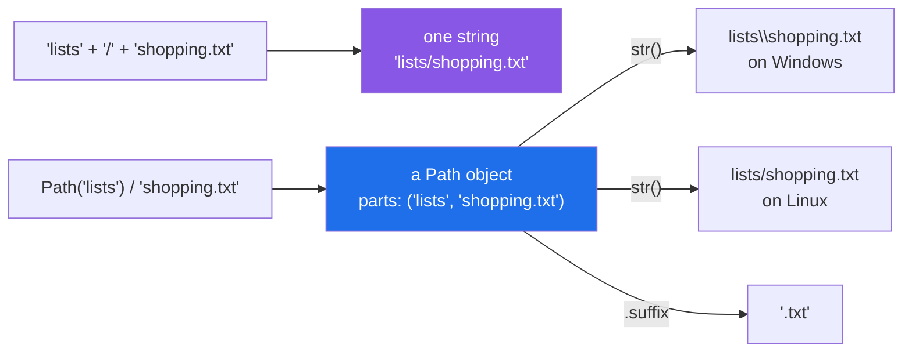

# 1.1 — A path is not a string

## One-line answer

A file's location looks like text but behaves like a small structured thing with parts, and
`pathlib.Path` treats it that way — so joining with `/` produces the right separator on every machine
and asking for the file extension is one word instead of a slice.

---

## The story

You keep a shopping list on the computer. Three lines in it: milk, bread, eggs.

Somebody asks where it is, and you say: *"it's in Documents, in the folder called lists, and the file is
shopping."*

That sentence has four pieces in it, and you said them in order without thinking: which drive or home
folder, then a folder, then another folder, then the file. Nobody says *"it's at
Documents-slash-lists-slash-shopping-dot-txt"*. The slashes are how it gets **written down**, and the
pieces are what it actually is.

The difference matters the first time you write it down for somebody else. You type
`Documents/lists/shopping.txt` in a message; they are on a different kind of computer, where the same
four pieces are written with backslashes, and the thing you sent them is not a location — it is a
sentence about a location, in the wrong dialect.

---

## The idea in plain language

A **path** is the answer to "where is this file". It is made of pieces: some folder names and a file
name, in order.

A path can be written down as text, and for a long time in Python that is all anybody did — a path was
a `str`, and you built one by gluing strings together with `"/"`. That works, and it has three costs:

**The separator is not the same everywhere.** Windows writes `\` between the pieces; macOS and Linux
write `/`. Code that hard-codes one is code that runs on one kind of machine.

**Taking it apart means slicing strings.** "What is the file extension?" becomes
`name[name.rfind("."):]`, with an edge case for a name with no dot and another for a folder with a dot
in it. Every one of those is a bug somebody has shipped.

**Nothing checks anything.** `"lists" + "shopping.txt"` is a perfectly good string —
`listsshopping.txt` — and the mistake shows up later as a file that does not exist.

`pathlib` is the standard library's answer. `Path("lists") / "shopping.txt"` builds a **`Path` object**
that knows it has pieces, prints itself with whatever separator the machine uses, and answers questions
like `.name` and `.suffix` directly. It arrived through *PEP 428 — The pathlib module — object-oriented
filesystem paths* (2012, <https://peps.python.org/pep-0428/>), and every part of the standard library
that takes a filename accepts one.

The one surprise, and it is worth meeting immediately: **`/` between two paths is not division.** It is
`__truediv__` on the `Path` class — an operator that is a method call, which is
[Day 5, 1.1](../../../day-05-operators-and-conditionals/parts/01-operators/1.1-an-operator-is-a-method-call.md)'s
point and [Day 15, 4.3](../../../day-15-constructors-and-dunders/parts/04-the-paper-api/4.3-which-dunders-and-when-to-stop.md)'s
warning about clever operators, used well because "join these path pieces" has exactly one meaning.

---

## Why Setu needs it

- **Every day from here writes something to disk.** Phase 4 reads CSVs, Phase 18 writes a vector index,
  Day 227's scraper writes JSONL, and each of those needs a location built in code.
- **This project is developed on Windows and its CI runs on Linux**
  ([Day 2, 5.2](../../../day-02-quality-gate/parts/05-ci/5.2-the-workflow-file-block-by-block.md)). A
  hard-coded `\` passes locally and fails in CI, which is the slowest possible way to find out.
- **Principle 9 gives every dataset a `SOURCE.md` beside it**, so code has to build "the folder this file
  is in, plus `SOURCE.md`" — one line with `.parent /` and a fiddly slice without.
- **`tmp_path` in `pytest` hands you a `Path`**
  ([Day 2, 3.2](../../../day-02-quality-gate/parts/03-pytest/3.2-fixtures-and-tmp-path.md)), so every
  test that touches a file is already using one.

---

## The mechanism

```python
"""A path is not a string, and joining is not adding."""

from pathlib import Path

as_string = "lists" + "/" + "shopping.txt"
as_path = Path("lists") / "shopping.txt"

print("string :", repr(as_string))
print("path   :", repr(as_path))
print("printed:", as_path)
print("as text:", repr(str(as_path)))
print("type   :", type(as_path).__name__)
print("equal? :", str(as_path) == as_string)
```

Run on Python 3.12.12 on Windows on 2026-09-01. **On macOS or Linux the last four lines differ**, and
that difference is the whole point:

```
string : 'lists/shopping.txt'
path   : WindowsPath('lists/shopping.txt')
printed: lists\shopping.txt
as text: 'lists\\shopping.txt'
type   : WindowsPath
equal? : False
```

**Line by line:**

- `from pathlib import Path` — `Path` is the only name you import. It is the standard entry point and it
  is in the standard library, so there is nothing to install.
- `"lists" + "/" + "shopping.txt"` — the old way. It is a `str` and it will contain a forward slash
  whatever machine it runs on.
- `Path("lists") / "shopping.txt"` — the `/` operator joins path pieces. **The right-hand side is a plain
  string and that is fine**; `Path` converts it. Only the left-hand side has to be a `Path`.
- `repr(as_path)` shows `WindowsPath('lists/shopping.txt')` — the repr uses forward slashes because that
  form is portable, and Python's own `__repr__` conventions
  ([Day 15, 3.2](../../../day-15-constructors-and-dunders/parts/03-the-dunders/3.2-repr-and-str.md))
  favour something you could paste back in.
- `print(as_path)` shows `lists\shopping.txt` — **the `str` form uses this machine's separator**, because
  that is what the operating system wants. Two different strings from one object, for two different
  audiences.
- `type(as_path).__name__` is `WindowsPath`. You never write that name: `Path(...)` looks at the machine
  and builds `WindowsPath` or `PosixPath`. The class you use is the same everywhere.
- `str(as_path) == as_string` is **`False` on Windows and `True` on Linux.** That single line is the bug
  that hard-coded separators produce, and the reason to compare `Path` objects with `Path` objects rather
  than comparing strings.
- Nothing here touched the disk. **A `Path` is a piece of text with structure**; whether the file exists
  is a separate question ([1.4](1.4-exists-mkdir-and-the-race.md)).

The same location, two ways of holding it:



---

## When it breaks

**Gluing without a separator:**

```text
$ uv run python -c "
from pathlib import Path
p = 'lists' + 'shopping.txt'
print('the string  :', p)
print('does it exist?', Path(p).exists())
"
the string  : listsshopping.txt
does it exist? False
```

**What it means.** No error at either line. String concatenation is perfectly happy to run two pieces
together, and the result is a valid filename that happens to be wrong. The failure arrives later, as
"file not found", pointing at a name nobody typed. `Path("lists") / "shopping.txt"` cannot make this
mistake, because `/` means *join as path pieces* and inserts the separator itself.

**A backslash in a string literal:**

```text
$ uv run python -c "
print('lists\shopping.txt')
print(len('lists\shopping.txt'))
print('lists\new\file.txt')
"
<string>:2: SyntaxWarning: invalid escape sequence '\s'
<string>:3: SyntaxWarning: invalid escape sequence '\s'
lists\shopping.txt
18
lists
ewile.txt
```

**What it means.** The first path survived — with a warning — because `\s` is not an escape sequence, so
Python left the backslash alone and told you it was unhappy about it. The third fell apart, because
`\n` **is** a newline and `\f` is a form feed
([Day 7, 1.3](../../../day-07-strings/parts/01-text/1.3-escapes-and-raw-strings.md)): the output broke
after `lists`, and the form feed between `ew` and `ile` printed as nothing visible at all. **A Windows
path typed into a string literal is a minefield that only explodes for certain folder names** — `\new`,
`\table`, `\reports`, `\v2` all begin with an escape sequence and `\shopping` does not, so the bug
depends on what somebody called a folder. `Path` with forward slashes, or a raw string, avoids the whole
category.

**Passing a `Path` where a string is compared:**

```text
$ uv run python -c "
from pathlib import Path
p = Path('lists') / 'shopping.txt'
print('endswith .txt?', str(p).endswith('.txt'))
print('is it this one?', p == 'lists/shopping.txt')
print('compare properly:', p == Path('lists/shopping.txt'))
"
endswith .txt? True
is it this one? False
compare properly: True
```

**What it means.** `p == 'lists/shopping.txt'` is `False`, and no error. A `Path` is never equal to a
`str`, whatever they look like — which is
[Day 15, 3.3](../../../day-15-constructors-and-dunders/parts/03-the-dunders/3.3-eq-and-the-duplicate.md)'s
`__eq__` returning `NotImplemented` for a type it does not know, doing exactly the right thing. Compare
paths with paths, and use `.suffix == ".txt"` rather than `str(p).endswith(".txt")`.

**Assuming a `Path` means the file is there:**

```text
$ uv run python -c "
from pathlib import Path
p = Path('lists') / 'nothing-here.txt'
print('built it  :', p)
print('exists?   :', p.exists())
print('read it   :')
print(p.read_text(encoding='utf-8'))
"
built it  : lists\nothing-here.txt
exists?   : False
read it   :
Traceback (most recent call last):
  File "<string>", line 7, in <module>
  File "...\Lib\pathlib.py", line 1013, in open
    return io.open(self, mode, buffering, encoding, errors, newline)
FileNotFoundError: [Errno 2] No such file or directory: 'lists\\nothing-here.txt'
```

**What it means.** Building a `Path` is pure string work and never fails. The disk is only consulted when
you *do* something — read, write, `exists()`, `stat()`. That separation is a feature: paths can be built,
passed around and tested without any filesystem at all, which is what makes
[Day 10, 3.3](../../../day-10-functions/parts/03-the-module/3.3-pure-functions-and-the-seam.md)'s pure
functions possible for path logic.

---

## In production

**The professional habit is that `Path` is the type at every boundary and `str` appears only when
something old demands it.** A function that takes `path: str | Path` and starts with `path =
Path(path)` accepts either and works with one — and `Path(existing_path)` is free, so the conversion is
safe to do unconditionally. The alternative, threading strings through and converting at the last
moment, means every function on the way has to know which convention it is holding.

**What changes at scale is that paths come from configuration and from users, not from literals.** A
path read from a config file is a string, a path from a web request is attacker-controlled, and a path
built by joining a base folder with a user-supplied name is the *path traversal* vulnerability: a name of
`../../etc/passwd` walks out of the folder you meant. `Path` does not prevent it — `Path("data") /
"../../secret"` is a perfectly valid path. The defence is to `resolve()` the result and check it is still
inside the base ([1.3](1.3-relative-absolute-and-the-cwd.md)), and it is
[Principle 11](../../../../docs/00_MASTER_PLAN_DS_GENAI.md)'s blast radius applied to the filesystem.

**The failure that only appears with real data is the filename that is not the same on two machines.**
Windows filenames are case-insensitive and macOS usually is; Linux is not. `Path("Data/Papers.csv")`
opens `data/papers.csv` on two of those three and raises on the third — so a repository that works
locally fails in CI, and the diff shows nothing wrong. The rule is that filenames in code are lower-case
and match the file exactly.

**The review comment a senior engineer leaves.** *"`OUTPUT_DIR + '/' + name` hard-codes a forward slash
and breaks the moment somebody runs this on Windows — and if `name` comes from the request, it also lets
a caller write outside the directory. Use `OUTPUT_DIR / name`, then `resolve()` and assert the result is
relative to `OUTPUT_DIR`."*

**The interview question.** *"Why `pathlib` rather than string paths?"* The portable-separator answer is
the obvious one and the weakest. What makes it a good answer is the rest: a path has structure, so
`.name`, `.stem`, `.suffix` and `.parent` replace slicing code with edge cases; building a path never
touches the disk, so path logic is pure and testable; and `Path` objects compare as paths rather than as
text, which stops two spellings of one location looking different. Adding that `Path` does not protect
against traversal, and that user-supplied components need `resolve()` and a containment check, shows you
have used it on something exposed.

---

## Check yourself

```bash
uv run python -c "
from pathlib import Path

p = Path('lists') / 'shopping.txt'
print(repr(p))
print(str(p))
print(p == Path('lists/shopping.txt'), '|', p == 'lists/shopping.txt')
print('exists:', p.exists())
"
```

The `repr` and the `str` disagree, and one of the two equality checks is `False`. Say why each is right.

**Answer out loud, without scrolling up:**

> What does `/` do between two paths, and why is it not the same as `+` between two strings? Then say
> whether building a `Path` touches the disk.

---

**Next:** [1.2 — taking a path apart](1.2-taking-a-path-apart.md), where the structure a `Path` has
starts paying for itself.
