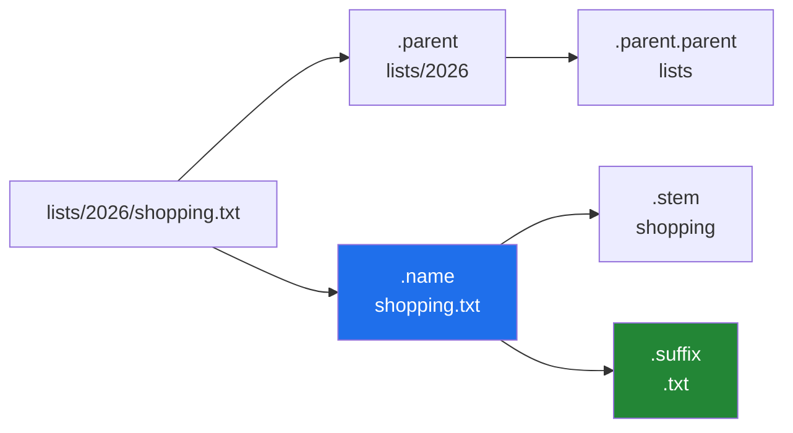

# 1.2 — Taking a path apart: `name`, `stem`, `suffix`, `parent`

## One-line answer

A `Path` answers questions about its own pieces — `.name` for the file, `.stem` for the file without its
extension, `.suffix` for the extension, `.parent` for the folder — so the string slicing that used to do
that work, with all of its edge cases, disappears.

---

## The story

You want to keep last year's shopping list as well as this year's, so the one file becomes a small
arrangement:

```text
lists/
  2025/
    shopping.txt
  2026/
    shopping.txt
```

Now somebody asks four questions about the same location, and notice that they are four different
questions:

*What is the file called?* — `shopping.txt`.
*What is it called without the bit on the end?* — `shopping`.
*What kind of file is it?* — a `.txt`.
*Which folder is it in?* — `lists/2026`.

You answered all four without effort, from one sentence, because the location has parts and you can see
them. Nothing about that felt like a calculation.

Writing it as one run of text takes the parts away, and then getting them back is a small puzzle every
time: find the last slash, take everything after it, find the last dot in *that*, but only if there is
one, and remember that a folder can have a dot in its name too.

---

## The idea in plain language

`Path` keeps the pieces, so the four questions are four attributes.

| Attribute | On `lists/2026/shopping.txt` | What it is |
|---|---|---|
| `.name` | `shopping.txt` | the last piece |
| `.stem` | `shopping` | the last piece without its final suffix |
| `.suffix` | `.txt` | the final extension, **with the dot** |
| `.suffixes` | `['.txt']` | every extension, for `archive.tar.gz` |
| `.parent` | `lists/2026` | everything but the last piece, as a `Path` |
| `.parts` | `('lists', '2026', 'shopping.txt')` | all the pieces, as a tuple |

Two more that build a *new* path rather than reading the old one:

- `.with_suffix(".jsonl")` — same location, different extension.
- `.with_name("receipts.txt")` — same folder, different file.

Three things are worth having straight.

**These are all pure string work.** None of them touches the disk, so they work on a path to a file that
does not exist, and they cannot fail because of a permission or a missing folder. That is what makes path
logic testable without a filesystem
([Day 10, 3.3](../../../day-10-functions/parts/03-the-module/3.3-pure-functions-and-the-seam.md)).

**Nothing is modified.** `Path` objects are immutable, like strings
([Day 4, 1.4](../../../day-04-objects/parts/01-objects/1.4-strings-are-immutable.md)). `with_suffix`
returns a new path and leaves the original alone, which is why you have to use the result.

**`.parent` is a `Path`, so it chains.** `p.parent / "SOURCE.md"` is the file beside this one, and
`p.parent.parent` is the folder above. This is the single most useful expression in the whole module and
it is what Principle 9's provenance file needs.

The `.suffix` definition has one sharp edge worth knowing now: it is the **last** extension only. For
`archive.tar.gz`, `.suffix` is `.gz` and `.stem` is `archive.tar`. When you want the whole tail, that is
`.suffixes`.

---

## Why Setu needs it

- **Day 13's loader registry dispatches on the extension.** `LOADERS[path.suffix]` is one lookup where
  `LOADERS[name[name.rfind("."):]]` is a slice with two edge cases
  ([Day 13, 4.2](../../../day-13-inheritance-and-abstraction/parts/04-abstraction/4.2-the-loader-family.md)).
- **Principle 9 puts a `SOURCE.md` beside every dataset**, and `dataset.parent / "SOURCE.md"` is how code
  finds it whatever the dataset is called.
- **Phase 18 writes one index file per collection**, named from the input — `corpus.jsonl` becoming
  `corpus.index`, which is `with_suffix` and nothing else.
- **Day 233's eval suite names outputs after inputs.** `.stem` is what turns `questions-v3.jsonl` into
  `questions-v3-results.jsonl` without a `replace` that would also hit a `.jsonl` in a folder name.

---

## The mechanism

```python
"""Taking a path apart, without touching the disk."""

from pathlib import Path

p = Path("lists") / "2026" / "shopping.txt"

print("the whole thing :", p)
print("name            :", p.name)
print("stem            :", p.stem)
print("suffix          :", p.suffix)
print("parent          :", p.parent)
print("parent.parent   :", p.parent.parent)
print("parts           :", p.parts)
print("with_suffix     :", p.with_suffix(".jsonl"))
print("with_name       :", p.with_name("receipts.txt"))
print("does it exist?  :", p.exists())
```

Run on Python 3.12.12 on Windows on 2026-09-01:

```
the whole thing : lists\2026\shopping.txt
name            : shopping.txt
stem            : shopping
suffix          : .txt
parent          : lists\2026
parent.parent   : lists
parts           : ('lists', '2026', 'shopping.txt')
with_suffix     : lists\2026\shopping.jsonl
with_name       : lists\2026\receipts.txt
does it exist?  : False
```

**Line by line:**

- `Path("lists") / "2026" / "shopping.txt"` — `/` chains, because each join returns a `Path` and a `Path`
  can be joined again ([1.1](1.1-a-path-is-not-a-string.md)).
- `p.name` is `shopping.txt` — a **string**, not a `Path`, because the last piece is just a name.
- `p.stem` is `shopping` and `p.suffix` is `.txt`. **The dot belongs to the suffix**, which catches
  people: comparing against `"txt"` is always `False` and comparing against `".txt"` works.
- `p.parent` is `lists\2026` and prints as a path — it **is** a `Path`, so `p.parent / "SOURCE.md"` works
  straight away and `p.parent.parent` is `lists`.
- `p.parts` is a tuple of strings, and note that the separators are gone entirely. This is the honest
  internal shape: a path is a sequence of pieces
  ([Day 8, 1.3](../../../day-08-containers/parts/01-sequences/1.3-a-tuple-is-a-record.md)).
- `p.with_suffix(".jsonl")` returns a **new** path with the same folder and stem. `p` is unchanged, which
  the next line proves by still printing `lists\2026\receipts.txt` from the original `p`.
- `p.with_name("receipts.txt")` replaces the whole last piece, extension included.
- `p.exists()` is `False`, and **every line above it worked anyway**. Nine questions answered about a file
  that is not there — because taking a path apart is text work, and only `exists()` asked the disk.

The pieces, drawn:



---

## When it breaks

**Comparing a suffix without its dot:**

```text
$ uv run python -c "
from pathlib import Path
p = Path('lists/shopping.txt')
print('suffix       :', repr(p.suffix))
print('== txt       :', p.suffix == 'txt')
print('== .txt      :', p.suffix == '.txt')
print('a dispatch   :', {'txt': 'text loader'}.get(p.suffix, 'NOTHING MATCHED'))
"
suffix       : '.txt'
== txt       : False
== .txt      : True
a dispatch   : NOTHING MATCHED
```

**What it means.** No error, and a registry that never matches anything
([Day 13, 4.2](../../../day-13-inheritance-and-abstraction/parts/04-abstraction/4.2-the-loader-family.md)'s
`LOADERS` dictionary is keyed `".txt"` for exactly this reason). The `.get(..., default)` here turned a
`KeyError` into a silent fallback, which is worse — the failure would at least have named the key.

**A file with two extensions:**

```text
$ uv run python -c "
from pathlib import Path
p = Path('corpus.tar.gz')
print('suffix   :', p.suffix)
print('stem     :', p.stem)
print('suffixes :', p.suffixes)
print('with_suffix(.jsonl):', p.with_suffix('.jsonl'))
"
suffix   : .gz
stem     : corpus.tar
suffixes : ['.tar', '.gz']
with_suffix(.jsonl): corpus.tar.jsonl
```

**What it means.** `.suffix` gave `.gz` and `.stem` kept `.tar`, so `with_suffix` produced
`corpus.tar.jsonl` rather than `corpus.jsonl`. That is documented behaviour and it is almost never what
somebody wanted. Use `.suffixes` when you care about the whole tail, and build the new name explicitly:
`p.with_name(p.name.removesuffix("".join(p.suffixes)) + ".jsonl")`.

**A folder with a dot in its name:**

```text
$ uv run python -c "
from pathlib import Path
p = Path('runs/v1.2/results')
print('name   :', p.name)
print('suffix :', repr(p.suffix))
q = Path('runs/v1.2')
print('folder suffix:', repr(q.suffix))
print('folder stem  :', q.stem)
"
name   : results
suffix : ''
folder suffix: '.2'
folder stem  : v1
```

**What it means.** `Path` has no idea whether a piece is a folder or a file — that is a question for the
disk, not for the text. So `runs/v1.2` has a "suffix" of `.2`, and code that decides "is this a data
file?" by checking the suffix will treat a version folder as a `.2` file. The check that actually answers
the question is `p.is_file()`, and it costs a look at the disk.

**Expecting `with_suffix` to change the original:**

```text
$ uv run python -c "
from pathlib import Path
p = Path('lists/shopping.txt')
p.with_suffix('.jsonl')
print('p is still  :', p)
q = p.with_suffix('.jsonl')
print('q is the new:', q)
"
p is still  : lists\shopping.txt
q is the new: lists\shopping.jsonl
```

**What it means.** The first call did the work and threw it away, silently, because `Path` is immutable
and every one of these methods returns a new object
([Day 4, 1.4](../../../day-04-objects/parts/01-objects/1.4-strings-are-immutable.md)). It is the same
mistake as calling `"MILK".lower()` without using the result, and it produces a program that writes to
the file it meant to leave alone.

---

## In production

**The professional habit is that path arithmetic happens in one place and the results are passed
around.** A function that takes `output_dir: Path` and computes `output_dir / f"{source.stem}.jsonl"` is
readable; the same expression repeated in six call sites means six places to change when the naming
convention does. Naming conventions in a pipeline — input, intermediate, output — belong in one small
module of functions that take a `Path` and return a `Path`, and those functions need no filesystem to
test.

**What changes at scale is that names carry meaning and become a schema.** Once there are ten thousand
files, `.stem` is how a run id, a date or a shard number is recovered, and the naming convention is
effectively a database index. That makes it worth being strict: one separator, fields in a fixed order,
no spaces, and a parser that raises loudly on a name that does not fit rather than silently returning
something plausible.

**The failure that only appears with real data is the filename you did not choose.** Files from users and
from other systems have spaces, non-ASCII characters, multiple dots, trailing dots and, on Windows, a
short list of reserved names — `CON`, `PRN`, `AUX`, `NUL`, `COM1` — which cannot be used at all. Code
that builds a filename from a title needs a slug function
([Day 7, 4.1](../../../day-07-strings/parts/04-normalising/4.1-the-title-normaliser.md)) and a length
cap, because most filesystems stop at 255 bytes for one component and a long paper title goes past that.

**The review comment a senior engineer leaves.** *"`out = str(src).replace('.jsonl', '-results.jsonl')`
also rewrites the folder if anything on the path contains `.jsonl`, and it does nothing if the extension
is `.JSONL`. Use `src.with_name(f'{src.stem}-results.jsonl')`, which only touches the last piece."*

**The interview question.** *"How do you change a file's extension in Python?"* `with_suffix` is the
answer, and the follow-up worth volunteering is where it does not do what you expect: on a name with two
extensions it replaces only the last, so `corpus.tar.gz` becomes `corpus.tar.jsonl`; and on a folder with
a dot in its name `.suffix` returns something meaningless, because `Path` works on text and does not know
what is a folder. Adding that `Path` is immutable so the result must be used, is the detail that shows you
have written the bug.

---

## Check yourself

```bash
uv run python -c "
from pathlib import Path

p = Path('lists') / '2026' / 'shopping.txt'
for attr in ('name', 'stem', 'suffix', 'parent', 'parts'):
    print(f'{attr:8}', getattr(p, attr))
print('beside it:', p.parent / 'SOURCE.md')
print('renamed  :', p.with_suffix('.jsonl'))
print('original :', p)
"
```

Now do the same for `Path('corpus.tar.gz')` and say which two lines surprise you.

**Answer out loud, without scrolling up:**

> What is the difference between `.name`, `.stem` and `.suffix`, and which of them includes the dot? Then
> say whether any of these attributes look at the disk.

---

**Next:** [1.3 — relative, absolute, and the working directory that moved](1.3-relative-absolute-and-the-cwd.md),
where the same path stops meaning the same place.
