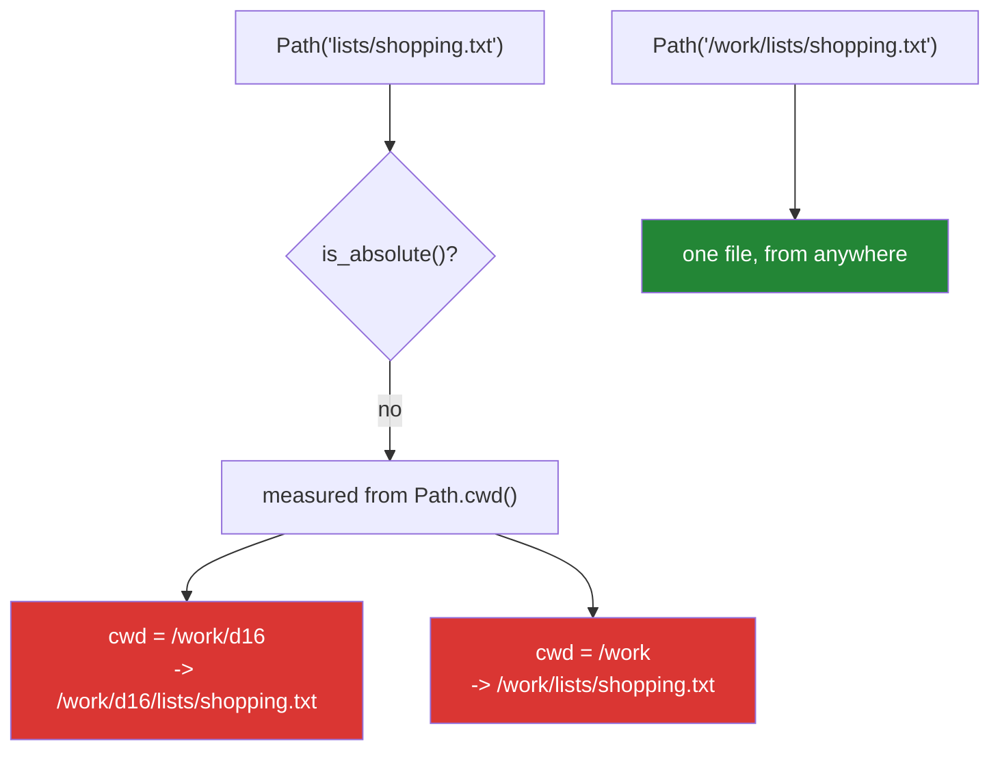

# 1.3 — Relative, absolute, and the working directory that moved

## One-line answer

A relative path means *"from where the program happens to be standing"*, and where it is standing —
the working directory — is set by whoever launched it, so the same path can point at two different
files depending on which folder you were in when you pressed enter.

---

## The story

*"It's in the folder called lists."*

That is a perfectly good sentence, and it means two different places depending on who says it. If you
are standing in the kitchen with the laptop, "the folder called lists" is the one inside Documents. If
somebody else is standing somewhere else, it is the one wherever they are.

Everybody has been on both sides of this. Somebody sends a screenshot with a filename in the title bar,
you type the name into your own machine, and get *"file not found"* — or worse, you get a completely
different file that happens to have the same name.

The unambiguous version of the sentence is longer and nobody says it out loud: *"on the C drive, in
Users, in your home folder, in Documents, in lists."* It works from anywhere, and it is longer for
exactly that reason — it does not depend on where anybody is standing.

The trap is that the short version **works**. It works every time you try it, because you are always in
the same place when you try it. It stops working the day somebody else runs it, or the day it is run
from a scheduler, and nothing about the code changed.

---

## The idea in plain language

Every running program has a **current working directory**: one folder, chosen when it started, which
relative paths are measured from. It is set by whoever launched the program — your shell's `cd`, an
editor's run button, a scheduler, a container's `WORKDIR` — and it has nothing to do with where your
code file is.

That last sentence is the one that catches everybody. `Path("data/papers.csv")` is not *"beside the
script"*. It is *"inside `data`, inside whatever folder the process was started in"*, and those coincide
only because you usually run things from the project root.

Two kinds of path:

- **Relative** — `lists/shopping.txt`. Measured from the working directory. `p.is_absolute()` is `False`.
- **Absolute** — `C:\Users\you\Documents\lists\shopping.txt` or `/home/you/lists/shopping.txt`. Complete
  on its own.

And three tools:

- **`Path.cwd()`** — the working directory right now.
- **`p.resolve()`** — turn a relative path into an absolute one, using the working directory, and clean
  up any `..` and symbolic links on the way.
- **`Path(__file__).parent`** — the folder **the code file** is in, which is what people usually mean
  when they say "beside the script". This one does not depend on the working directory at all.

The rule that avoids nearly all of the trouble: **turn paths into absolute ones at the edge of the
program, once, and pass `Path` objects inward.** Read the base folder from a command-line argument, a
configuration value or `Path(__file__).parent`, resolve it, and let every function below take a `Path`
that is already unambiguous. A relative path that lives on for the whole run is a bug waiting for
somebody to change directory.

One more, mostly to know that it exists and to avoid it: `os.chdir()` changes the working directory
of the whole process. It is global mutable state
([Day 10, 2.3](../../../day-10-functions/parts/02-scope/2.3-global-and-nonlocal.md)) at the operating
system level, and in a program with threads it changes the meaning of every relative path in every
thread at once.

---

## Why Setu needs it

- **`./m` runs everything from the repository root**
  ([Day 0, 3.2](../../../day-00-setup/parts/03-m-script/3.2-the-case-dispatcher.md)), so every relative
  path in this project silently assumes that. It is a real convention and it is worth knowing that it is
  a convention rather than a fact.
- **`pytest` and your editor may start from different folders.** A test that reads `data/papers.csv`
  passes under `./m check` and fails when you press run in the editor, and nothing in the code changed.
- **Day 235's GitHub Actions and Day 236's Docker both set their own working directory.** A path that
  depends on yours is a path that breaks in CI and in the container, at two different times.
- **Principle 11's blast radius applies to writes.** A relative output path plus an unexpected working
  directory means writing files into somebody's home folder, or over a repository, instead of into the
  place you meant.

---

## The mechanism

```python
"""Where a relative path actually points."""

import os
from pathlib import Path

rel = Path("lists/shopping.txt")


def show(label):
    """Print the last three parts of where `rel` resolves to."""
    print(f"{label:22}", "/".join(rel.resolve().parts[-3:]))


print("relative        :", rel)
print("is it absolute? :", rel.is_absolute())
print("cwd right now   :", Path.cwd().name)
show("resolves to")

os.chdir("..")
print("after chdir, cwd:", Path.cwd().name)
show("the SAME path now")
```

Run on Python 3.12.12 on 2026-09-01, from a scratch folder called `d16` inside one called `scratchpad`:

```
relative        : lists\shopping.txt
is it absolute? : False
cwd right now   : d16
resolves to            d16/lists/shopping.txt
after chdir, cwd: scratchpad
the SAME path now      scratchpad/lists/shopping.txt
```

**Line by line:**

- `rel = Path("lists/shopping.txt")` — built **once**, at the top, and never changed. Everything below
  reads the same object.
- `def show(label)` prints `rel.resolve().parts[-3:]` — the last three pieces of the absolute path
  ([1.2](1.2-taking-a-path-apart.md)), so the output fits on the page without hiding the part that
  changes.
- `rel.is_absolute()` is `False` — the honest description of what this path is: an instruction relative
  to something that has not been named.
- `Path.cwd()` is the working directory as a `Path`; `.name` is its last piece.
- The first `show` gives `d16/lists/shopping.txt`.
- `os.chdir("..")` moves the whole process up one folder. **Nothing about `rel` changed** — it is the
  same immutable object, holding the same two pieces.
- The second `show` gives `scratchpad/lists/shopping.txt`. **One path object, two different files.**
- That is the entire lesson, and note what it is not: `resolve()` is not the villain. `resolve()` is the
  only line that made the ambiguity visible. Without it the program would have opened one file, then the
  other, and never mentioned it.

Two paths, two meanings:



---

## When it breaks

**"Beside the script" that is nothing of the kind:**

```text
$ uv run python -c "
from pathlib import Path
print('cwd            :', Path.cwd().name)
print('data/x.csv is  :', (Path('data/x.csv')).resolve().parent.name)
print('__file__ based :', '<no __file__ in -c mode>')
"
cwd            : setu
data/x.csv is  : data
```

**What it means.** The relative path resolved against the working directory — the folder the command was
run from — and not against any source file. In `-c` mode there is no `__file__` at all, which is itself
the point: **the code has no idea where it lives unless it asks.** A module that needs a file shipped
beside it must use `Path(__file__).parent / "name"`, and a module that needs the project's data must be
told where the project is.

**The same command, run from two folders:**

```text
$ uv run python -c "from pathlib import Path; print('cwd:', Path.cwd().name, '| data/ visible?', Path('data').exists())"
cwd: setu | data/ visible? True

$ cd tests
$ uv run python -c "from pathlib import Path; print('cwd:', Path.cwd().name, '| data/ visible?', Path('data').exists())"
cwd: tests | data/ visible? False
```

**What it means.** Identical code, one `cd` between them, and `data/` went from existing to not
existing. `pytest` sets the working directory to where it was invoked, which under `./m check`
is always the repository root
([Day 2, 4.1](../../../day-02-quality-gate/parts/04-the-gate/4.1-what-m-check-actually-runs.md)) and
under an editor's "run this test" button is often the test file's own folder. The test code is identical
in both; only the invisible starting point differs, so the failure reads as *"this test is flaky"*. The
fix is that tests never use relative paths: `tmp_path` for files they create
([Day 2, 3.2](../../../day-02-quality-gate/parts/03-pytest/3.2-fixtures-and-tmp-path.md)) and
`Path(__file__).parent / "fixtures" / name` for files they read.

**A user-supplied name escaping its folder:**

```text
$ uv run python -c "
from pathlib import Path
base = Path('data').resolve()
name = '../../secrets.env'
target = base / name
print('looks like  :', target)
print('resolves to :', target.resolve().name)
print('inside base?:', target.resolve().is_relative_to(base))
"
looks like  : C:\Users\you\setu\data\..\..\secrets.env
resolves to : secrets.env
inside base?: False
```

**What it means.** Joining a base folder with a name somebody else chose does **not** keep the result
inside the base — `..` walks out, and the path still looks reassuring until it is resolved. This is
*path traversal*, and it is one of the oldest ways to read a file a program never meant to expose. The
defence is the last line: resolve, then `is_relative_to(base)`, and refuse if it is `False`.

**`resolve()` on a path that does not exist:**

```text
$ uv run python -c "
from pathlib import Path
p = Path('nothing/here.txt')
print('resolved  :', p.resolve().name)
print('exists    :', p.resolve().exists())
print('strict    :')
print(p.resolve(strict=True))
"
resolved  : here.txt
exists    : False
strict    :
Traceback (most recent call last):
  File "<string>", line 7, in <module>
  File "...\Lib\pathlib.py", line 1240, in resolve
    s = self._flavour.realpath(self, strict=strict)
  File "<frozen ntpath>", line 739, in realpath
FileNotFoundError: [WinError 3] The system cannot find the path specified: 'C:\\Users\\you\\setu\\nothing\\here.txt'
```

**What it means.** By default `resolve()` is happy to produce an absolute path for a file that is not
there, which is exactly what you want when computing where to *write* something. `strict=True` refuses
instead, which is what you want when you have been handed a path that is supposed to exist and you would
rather fail at the boundary than three functions later.

---

## In production

**The professional shape is: resolve once, at the entry point, and pass absolute `Path` objects
inward.** The `main` function reads a base directory from an argument or an environment variable,
resolves it, and hands it to everything below; no function further in ever calls `Path.cwd()` or builds a
relative path. That makes the whole program independent of how it was launched, which is the property
that lets it run identically from a shell, a scheduler, a container and a test.

**What changes at scale is that the working directory stops being yours.** A container sets `WORKDIR`; a
systemd unit sets its own; a CI runner starts in a checkout directory with a generated name; a serverless
function has a read-only filesystem with one writable temporary folder. Code that assumed the working
directory works in exactly one of those. This is also why writing output to a relative path is a real
hazard: at best the files land somewhere nobody looks, and at worst the process has permission to
overwrite something.

**The failure that only appears with real data is the traversal in a filename.** Names arrive from
uploads, from archives, from scraped URLs and from other people's exports, and some of them contain `..`,
a leading `/`, or a Windows drive letter — all of which make a "join" produce a path outside the base.
`Path` will build any of them without complaint. A real ingestion path sanitises the name to a slug
([Day 7, 4.1](../../../day-07-strings/parts/04-normalising/4.1-the-title-normaliser.md)), joins, resolves
and checks containment, and that is three lines you write once and reuse.

**The review comment a senior engineer leaves.** *"`open('config/settings.toml')` assumes the process
was started in the repo root, which is true for `./m` and not for the editor's test runner or the Docker
image. Take the config path as an argument with a default of `Path(__file__).parent.parent /
'config/settings.toml'`, and resolve it in `main`."*

**The interview question.** *"What is the current working directory and why does it cause bugs?"* The
definition is easy; what makes it a good answer is naming who sets it — the shell, the editor, the
scheduler, the container — and pointing out that it has nothing to do with where the source file lives,
so `Path("data/x.csv")` is not "beside the script". Adding the two fixes — `Path(__file__).parent` for
files shipped with the code, resolving at the entry point for everything else — and the security angle,
that joining a base with a user-supplied name needs `resolve()` plus `is_relative_to`, is the answer of
somebody who has shipped this.

---

## Check yourself

```bash
uv run python -c "
from pathlib import Path
rel = Path('lists/shopping.txt')
print('relative   :', rel, '| absolute?', rel.is_absolute())
print('cwd        :', Path.cwd().name)
print('resolves to:', '/'.join(rel.resolve().parts[-2:]))
base = Path('data').resolve()
print('traversal  :', (base / '../../x').resolve().is_relative_to(base))
"
```

Run the same command from a different folder and watch the third line change. The fourth is `False`, and
that is the check a real ingestion path must make.

**Answer out loud, without scrolling up:**

> What decides where a relative path points, and who sets it? Then say why `Path("data/x.csv")` is not
> "the file beside my script", and what is.

---

**Next:** [1.4 — `exists()`, `mkdir()`, and the race](1.4-exists-mkdir-and-the-race.md), where the code
finally starts touching the disk.
