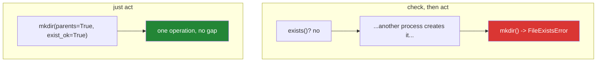

# 1.4 — `exists()`, `mkdir()`, and the check that did not help

## One-line answer

`exists()` tells you what was true a moment ago, not what is true now — so the professional shape is
not *check then act* but *act and handle the failure*, which is what `mkdir(parents=True,
exist_ok=True)` and `unlink(missing_ok=True)` are for.

---

## The story

You go to put the shopping list in a folder called `lists`, and the folder is not there yet, so you make
it.

Next week you run the same thing again. The folder is there now, and making it again is an error — so
you add a check: *if the folder is not there, make it.* Fine. It works, and it goes on working for
months.

Then two things run at once. A scheduled job and you, by hand, at the same moment. Both look, both see
no folder, both go to make it, and one of them gets an error about a folder that did not exist when it
looked.

Nothing was wrong with the check. The check was accurate. It was accurate **at the moment it ran**, and
by the time the next line executed the world had moved on — which is a thing checks about the outside
world simply cannot fix, however carefully they are written.

The version that never has this problem is shorter than the version with the check: *make the folder,
and if it is already there, that is fine.* One instruction, one answer, no gap in the middle for anything
to change.

---

## The idea in plain language

`Path` has a set of methods that ask the disk a question:

| Method | Answers |
|---|---|
| `p.exists()` | is there anything at this path? |
| `p.is_file()` | is there a *file* there? |
| `p.is_dir()` | is there a *folder* there? |
| `p.stat()` | size, timestamps, permissions — raises if it is not there |

Each one is a snapshot. Between the question and whatever you do next, another program — or another
thread, or the user — can create, delete or replace the thing. That gap has a name, **time of check to
time of use**, and the bug pattern it produces is called a *race condition*: two things racing, and the
outcome depending on which got there first.

For most file work this is not a theoretical concern. It is why the standard library gives you the
"just do it" versions:

- **`p.mkdir(parents=True, exist_ok=True)`** — make the folder and any missing folders above it, and do
  not complain if it is already there.
- **`p.unlink(missing_ok=True)`** — delete it, and do not complain if it was already gone.
- **`open(p, "x")`** — create it *only* if it does not exist, as one atomic operation
  ([2.1](../02-reading-and-writing/2.1-open-and-the-mode-string.md)).

The two `mkdir` flags do different jobs and both are usually wanted:

- **`parents=True`** — make the missing folders above it too. Without it, `lists/2026/receipts` fails
  with `FileNotFoundError` when `lists/2026` does not exist.
- **`exist_ok=True`** — succeed quietly if it is already there. Without it, the second run raises
  `FileExistsError`.

None of that means `exists()` is useless. It is right for a *report* — "here is what I found" — and for
a decision where being slightly out of date is harmless. It is wrong as a guard immediately before an
action, because the action can check for itself and the action's check has no gap.

The general principle, and it is worth carrying beyond files: **prefer asking forgiveness to asking
permission.** Do the thing, catch the specific failure. It is shorter, it is correct under concurrency,
and it is one round trip instead of two — which matters a great deal more when "the disk" is a network
filesystem or an object store.

---

## Why Setu needs it

- **Every output folder in this project is created by code**: `data/`, `notebooks/`, Phase 18's index
  directory, Day 227's scraper output. All of them run more than once.
- **`./m check` runs in CI on a clean machine and locally on a dirty one**
  ([Day 2, 4.2](../../../day-02-quality-gate/parts/04-the-gate/4.2-local-gate-versus-remote-gate.md)), so
  every setup step must be correct both when the folder is missing and when it is not.
- **Day 227's scraper is resumable**, which means it runs repeatedly over the same output folder, and
  Day 232's checkpoints are written by a graph that may be restarted at any point.
- **Principle 11's blast radius.** `unlink` and `rmtree` on a computed path are the two most dangerous
  lines in any codebase, and a check that says "yes, that exists" is not the safety you think it is.

---

## The mechanism

```python
"""Making a folder, twice, and the flags that make it safe."""

from pathlib import Path

box = Path("boxes") / "2026" / "lists"

box.mkdir(parents=True, exist_ok=True)
print("made        :", box.exists(), box.is_dir())

box.mkdir(parents=True, exist_ok=True)
print("made again  : no error")

try:
    box.mkdir(parents=True)
except FileExistsError as error:
    print("without the flag:", type(error).__name__, "-", error.filename)

try:
    (Path("boxes") / "2027" / "lists").mkdir()
except FileNotFoundError as error:
    print("without parents :", type(error).__name__, "-", error.filename)
```

Run on Python 3.12.12 on Windows on 2026-09-01, in an empty folder:

```
made        : True True
made again  : no error
without the flag: FileExistsError - boxes\2026\lists
without parents : FileNotFoundError - boxes\2027\lists
```

**Line by line:**

- `Path("boxes") / "2026" / "lists"` — three levels, and **none of them exist yet**. Building the path
  did not need them to ([1.1](1.1-a-path-is-not-a-string.md)).
- `box.mkdir(parents=True, exist_ok=True)` — one call creates all three folders. `parents=True` is what
  makes it create `boxes` and `boxes/2026` on the way.
- `box.exists()` and `box.is_dir()` are both `True`. They differ for a *file* at that path, where
  `exists()` is `True` and `is_dir()` is `False` — and that difference is what stops a stray file
  masquerading as your output folder.
- The **second** identical call does nothing and raises nothing. That is `exist_ok=True`, and it is what
  makes the line safe to run on every start-up.
- `box.mkdir(parents=True)` without `exist_ok` raises `FileExistsError`. **This is the second-run
  failure**, and it is why a setup step that worked in development fails the first time somebody restarts
  the process.
- `(Path("boxes") / "2027" / "lists").mkdir()` without `parents` raises `FileNotFoundError`, naming the
  path it could not make. Read that message carefully: it says *not found* about the thing you asked it
  to **create**, because what was not found is the parent.
- `error.filename` is the path the operating system complained about — every `OSError` carries it, and it
  is more useful in a log than the message.
- Note what is **not** in this code: no `if not box.exists():`. The flags did the checking, atomically.

Check-then-act against just-act:



---

## When it breaks

**The check that does not help:**

```text
$ uv run python -c "
from pathlib import Path
import os

box = Path('gap')
if not box.exists():
    os.mkdir(box)          # imagine another process got here first
    os.mkdir(box)          # the same call, one instant later
"
Traceback (most recent call last):
  File "<string>", line 8, in <module>
FileExistsError: [WinError 183] Cannot create a file when that file already exists: 'gap'
```

**What it means.** The two `mkdir` calls stand in for two processes: the check passed, and by the time
the second create ran the folder was there. **A real race looks exactly like this and happens rarely
enough to be dismissed as a fluke.** `exist_ok=True` removes the gap entirely, because the check and the
creation are one operation inside the operating system.

**`exists()` on something that is not a folder:**

```text
$ uv run python -c "
from pathlib import Path
p = Path('surprise')
p.write_text('I am a file\n', encoding='utf-8')
print('exists  :', p.exists())
print('is_dir  :', p.is_dir())
p.mkdir(exist_ok=True)
"
exists  : True
is_dir  : False
Traceback (most recent call last):
  File "<string>", line 7, in <module>
  File "...\Lib\pathlib.py", line 1311, in mkdir
    os.mkdir(self, mode)
FileExistsError: [WinError 183] Cannot create a file when that file already exists: 'surprise'
```

**What it means.** `exist_ok=True` means *"a directory already being there is fine"* — it does not mean
*"anything already being there is fine"*. A **file** in the way still raises, which is correct: silently
carrying on would leave the program writing into a folder that does not exist. If you genuinely need to
tell the two apart, `is_dir()` is the question, and the answer is still a snapshot.

**Deleting something that has already gone:**

```text
$ uv run python -c "
from pathlib import Path
p = Path('temp.txt')
p.write_text('x', encoding='utf-8')
p.unlink()
print('gone once')
p.unlink()
"
gone once
Traceback (most recent call last):
  File "<string>", line 7, in <module>
  File "...\Lib\pathlib.py", line 1342, in unlink
    os.unlink(self)
FileNotFoundError: [WinError 2] The system cannot find the file specified: 'temp.txt'
```

**What it means.** The same shape in the other direction, and it is the one that bites in cleanup code —
a `finally` block that deletes a temporary file will raise if an earlier step already removed it, and
that second exception replaces the first one you actually wanted to see. `p.unlink(missing_ok=True)` is
the fix, and it exists precisely because cleanup must not fail.

**A `stat()` on a path that is not there:**

```text
$ uv run python -c "
from pathlib import Path
p = Path('never-existed.txt')
print('exists:', p.exists())
print(p.stat().st_size)
"
exists: False
Traceback (most recent call last):
  File "<string>", line 5, in <module>
  File "...\Lib\pathlib.py", line 840, in stat
    return os.stat(self, follow_symlinks=follow_symlinks)
FileNotFoundError: [WinError 2] The system cannot find the file specified: 'never-existed.txt'
```

**What it means.** `exists()` is itself implemented as a `stat()` that catches the error, so calling
both is asking the disk the same question twice. When you want the size and you are prepared for it not
to be there, one `try` around `stat()` is both shorter and free of the gap between the two calls.

---

## In production

**The professional habit is that filesystem code catches `OSError` and its subclasses rather than
checking first.** `FileNotFoundError`, `FileExistsError`, `PermissionError` and `IsADirectoryError` are
all `OSError`, they all carry `.filename` and `.errno`, and catching the specific one you can handle —
while letting the rest travel — is the same discipline as
[Day 14, 3.2](../../../day-14-decorators/parts/03-decorators-with-arguments/3.2-backoff-jitter-and-which-errors.md)'s
`catching=` parameter. A bare `except OSError: pass` around a write hides a full disk.

**What changes at scale is that "the disk" stops being local.** On a network filesystem or an object
store, every `exists()` is a network round trip with real latency and a real failure mode, so
check-then-act doubles the cost of every operation and widens the race from microseconds to hundreds of
milliseconds. Some object stores do not even offer a folder to create — the "folder" is a prefix on a
key — so code that insists on `mkdir` has to be rewritten rather than ported.

**The failure that only appears with real data is the partially written output.** A process that creates
the output file, writes half of it and dies leaves a file that `exists()` reports as present, so the next
run skips the work and the pipeline carries a truncated result forward
([3.1](../03-buffering/3.1-the-write-that-had-not-happened.md) is why "half" is the likely outcome).
The standard defence is to write to a temporary name in the same folder and rename at the end: a rename
within one filesystem is atomic, so the final name either does not exist or is complete, and there is no
partial state for anybody to observe.

**The review comment a senior engineer leaves.** *"`if not out.exists(): out.mkdir()` races with the
worker that starts alongside this one — we saw it in the logs last month. Use `out.mkdir(parents=True,
exist_ok=True)`. And the completion check below should look for the marker file we write at the end, not
for the output file, which exists as soon as the first byte lands."*

**The interview question.** *"What is a TOCTOU bug?"* The definition — a check about the outside world
and the action based on it are two operations, and the world can change in between — is the start. What
makes it a good answer is the fix: prefer one atomic operation that does its own checking, catch the
specific `OSError` rather than pre-checking, and where atomicity is genuinely needed, write to a
temporary name and rename. Adding that `exist_ok=True` does not tolerate a *file* in the way, and that
this is the correct behaviour rather than an oversight, shows you have read the flag rather than copied
it.

---

## Check yourself

```bash
uv run python -c "
from pathlib import Path

box = Path('boxes/2026/lists')
box.mkdir(parents=True, exist_ok=True)
box.mkdir(parents=True, exist_ok=True)
print('twice, no error:', box.is_dir())

try:
    box.mkdir(parents=True)
except FileExistsError as e:
    print('without exist_ok:', type(e).__name__, e.filename)

f = box / 'shopping.txt'
f.write_text('milk\n', encoding='utf-8')
f.unlink(missing_ok=True)
f.unlink(missing_ok=True)
print('deleted twice, no error:', f.exists())
"
```

Two creates and two deletes, no `exists()` anywhere, no errors. Now remove `exist_ok=True` from the
first `mkdir` and run the whole thing twice.

**Answer out loud, without scrolling up:**

> What does `exists()` actually tell you, and what does it not? Then say what `parents=True` and
> `exist_ok=True` each do, and which failure each one prevents.

---

**Next:** [1.5 — globbing](1.5-globbing.md), which is how you find files when you do not know their
names.
