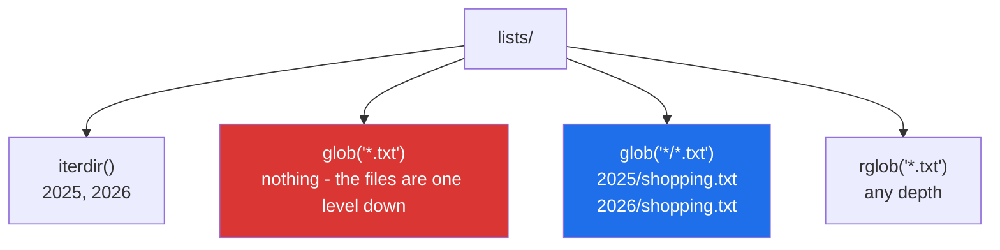

# 1.5 — Globbing: finding files without listing them by hand

## One-line answer

`p.glob("*.txt")` describes the files you want by pattern instead of naming them, `p.rglob(...)` does
the same through every folder underneath, and both hand back a lazy generator rather than a list — so
finding files scales the same way reading them does.

---

## The story

There is one shopping list per year now, and there are receipts as well:

```text
lists/
  2025/
    shopping.txt
    receipts.csv
  2026/
    shopping.txt
    receipts.csv
```

Somebody asks for all the shopping lists.

You do not answer by reading out every file in the house. You answer by describing them: *"the ones
called shopping-dot-txt, in each year folder."* That description is shorter than the list, and — this is
the useful part — **it stays correct next year**, when there is a 2027 folder that nobody has told you
about.

Describing what you want rather than enumerating it is the whole idea, and it is why the description
survives changes to the thing being described.

---

## The idea in plain language

A **glob** is a small pattern language for filenames. It is much older and much simpler than a regular
expression, and it has four pieces worth knowing:

| Pattern | Matches |
|---|---|
| `*` | any run of characters, **not crossing a folder boundary** |
| `?` | exactly one character |
| `[abc]` | one character from the set |
| `**` | any number of folders, in `rglob` or when written explicitly |

Two methods on a `Path`:

- **`p.glob("*/*.txt")`** — match relative to `p`, with each `*` covering exactly one level.
- **`p.rglob("*.txt")`** — the same as `p.glob("**/*.txt")`: search this folder and everything under it,
  however deep.

And one more that is not a pattern at all: **`p.iterdir()`** yields the immediate children of a folder,
which is the right tool when you want everything and will decide for yourself.

Three properties decide how you use them.

**They are lazy.** `glob` returns a generator
([Day 11, 2.1](../../../day-11-iterators-and-generators/parts/02-generators/2.1-yield-the-function-that-pauses.md)),
so nothing is read until you loop, and a folder with a million files does not become a million-item list
in memory. It also means `if p.glob("*.txt"):` is **always true** — a generator object is truthy whether
or not it will yield anything, which is the first failure below and one of the sharpest traps in the
module.

**They yield `Path` objects.** So `.stem`, `.suffix` and `.parent` are all available straight away
([1.2](1.2-taking-a-path-apart.md)), and the results can be passed anywhere a path is wanted.

**The order is not defined.** The operating system decides, and it differs between Windows, Linux and
network filesystems. Any output that has to be reproducible — a manifest, a test assertion, a batch
numbering — must be `sorted()` explicitly. That is
[Principle 4](../../../../docs/00_MASTER_PLAN_DS_GENAI.md)'s "nothing floats" applied to a directory
listing.

One difference from a shell worth knowing: in the shell, `*` is expanded by the shell before your
program sees it. `Path.glob` does it in Python, so quoting rules do not apply and a pattern in a variable
works exactly the same as a literal one.

---

## Why Setu needs it

- **Day 227's scraper writes one file per source** and the next stage has to find them all without a
  hard-coded list, because the set changes every run.
- **Day 233's eval suite reads every fixture in a folder.** Adding a test case must mean adding a file,
  not adding a file *and* editing a list.
- **`./m depth` walks `days/*/parts/*/*.md`**
  ([Day 0, 3.3](../../../day-00-setup/parts/03-m-script/3.3-the-done-gate.md)) — the same pattern you are
  learning here is what checks the document you are reading.
- **Principle 9 pairs each dataset with a `SOURCE.md`.** "Find every dataset without one" is one `rglob`
  and a set difference, and it is the kind of check worth having in `./m check`.

---

## The mechanism

```python
"""Finding files by pattern instead of by name."""

from pathlib import Path

root = Path("lists")
(root / "2025").mkdir(parents=True, exist_ok=True)
(root / "2026").mkdir(parents=True, exist_ok=True)
for name in ("shopping.txt", "receipts.csv"):
    (root / "2025" / name).write_text("milk\n", encoding="utf-8")
    (root / "2026" / name).write_text("milk\n", encoding="utf-8")

print("iterdir      :", sorted(p.name for p in root.iterdir()))
print("glob one deep:", sorted(str(p) for p in root.glob("*/*.txt")))
print("rglob any    :", sorted(str(p) for p in root.rglob("*.txt")))
print("glob is lazy :", type(root.glob("*")).__name__)
print("no match     :", list(root.glob("*.json")))
```

Run on Python 3.12.12 on Windows on 2026-09-01:

```
iterdir      : ['2025', '2026']
glob one deep: ['lists\\2025\\shopping.txt', 'lists\\2026\\shopping.txt']
rglob any    : ['lists\\2025\\shopping.txt', 'lists\\2026\\shopping.txt']
glob is lazy : generator
no match     : []
```

**Line by line:**

- `mkdir(parents=True, exist_ok=True)` — the safe form from [1.4](1.4-exists-mkdir-and-the-race.md), so
  this example can be run twice.
- `write_text("milk\n", encoding="utf-8")` — a one-line write that opens, writes and closes.
  **`encoding=` is not optional**, and [2.2](../02-reading-and-writing/2.2-encoding.md) is why.
- `root.iterdir()` yields the immediate children only — the two **year folders**, not the four files. It
  does not recurse and it takes no pattern.
- `root.glob("*/*.txt")` — one `*` per level, so this means *"one folder down, ending in `.txt`"*. It
  found the two shopping lists and skipped the two `.csv` files.
- `root.rglob("*.txt")` gives the same two here **because the tree is two deep**. On a deeper tree the
  first pattern would miss files and this one would not. Reaching for `rglob` by default is a habit worth
  resisting: on a large tree it walks everything.
- `sorted(...)` around both. **Remove it and the order is whatever the filesystem hands back**, which is
  usually stable on one machine and not guaranteed anywhere.
- `type(root.glob("*")).__name__` is `generator`. Nothing was read to produce that object. This is the
  line to remember when you next write `if p.glob(...)`.
- `list(root.glob("*.json"))` is `[]` — an empty list, and **no exception**. A pattern matching nothing
  is not an error, which is right and is also why a typo in a pattern is silent.

Where each one looks:



---

## When it breaks

**Testing a generator for truth:**

```text
$ uv run python -c "
from pathlib import Path
root = Path('lists')
if root.glob('*.json'):
    print('found some JSON files!')
print('actually found:', list(root.glob('*.json')))
"
found some JSON files!
actually found: []
```

**What it means.** The `if` passed on a folder with no JSON in it, because `glob` returned a generator
object and **every generator is truthy** — it has no `__len__` and no `__bool__`, so Python falls through
to "always true" ([Day 15, 3.5](../../../day-15-constructors-and-dunders/parts/03-the-dunders/3.5-len-and-bool.md)).
This is the same class of bug as
[Day 11, 3.2](../../../day-11-iterators-and-generators/parts/03-lambda-and-map/3.2-map-and-filter-are-lazy.md)'s
printed `map` object. The fix is `if any(root.glob(...)):`, or materialise with `list(...)` when you
need it twice.

**A pattern that does not cross folders:**

```text
$ uv run python -c "
from pathlib import Path
root = Path('lists')
print('*.txt      :', [str(p) for p in root.glob('*.txt')])
print('*/*.txt    :', len(list(root.glob('*/*.txt'))))
print('**/*.txt   :', len(list(root.glob('**/*.txt'))))
"
*.txt      : []
*/*.txt    : 2
**/*.txt   : 2
```

**What it means.** `*.txt` found nothing even though there are two `.txt` files under `lists`, because a
single `*` never crosses a separator. **An empty result from a glob is much more often a wrong pattern
than an empty folder**, and since it raises nothing the mistake reaches production as "the job processed
zero files and reported success".

**Consuming the generator twice:**

```text
$ uv run python -c "
from pathlib import Path
found = Path('lists').rglob('*.txt')
print('count:', sum(1 for _ in found))
print('names:', [p.name for p in found])
"
count: 2
names: []
```

**What it means.** The first line drained the generator and the second saw nothing left
([Day 11, 1.3](../../../day-11-iterators-and-generators/parts/01-iterators/1.3-exhaustion.md)). Counting
then listing is an extremely natural thing to write, and the second answer is empty rather than wrong-
looking, so it reads as "there were no files" rather than as a bug. `found = sorted(...)` at the top
fixes it and gives a defined order at the same time.

**Modifying the folder while walking it:**

```text
$ uv run python -c "
from pathlib import Path
root = Path('churn')
root.mkdir(exist_ok=True)
for n in range(3):
    (root / f'{n}.txt').write_text('x', encoding='utf-8')

for p in root.glob('*.txt'):
    p.unlink()
    (root / (p.stem + '-done.txt')).write_text('x', encoding='utf-8')

print('left behind:', sorted(q.name for q in root.iterdir()))
"
left behind: ['0-done.txt', '1-done.txt', '2-done.txt']
```

**What it means.** This one *happened* to work, and that is the warning. `glob` reads the directory
lazily as it goes, so creating files that also match the pattern while iterating it is undefined —
depending on the filesystem, the new files may be visited too, giving `0-done-done.txt` and, in the worst
case, a loop that does not end. It is
[Day 6, 2.4](../../../day-06-loops/parts/02-control-flow/2.4-mutating-while-iterating.md)'s rule with the
directory as the container. **Materialise first — `for p in sorted(root.glob("*.txt")):` — whenever the
loop body writes into the folder it is reading.**

---

## In production

**The professional habit is `sorted(...)` around every glob whose results are used in order or
compared.** Batch numbering, a manifest, a test assertion, a resumable job's "where did I get to" — all
of them depend on a stable order that the filesystem does not promise. It costs one function call and it
turns a class of "works on my machine" bugs into nothing.

**What changes at scale is that `rglob` becomes a full tree walk.** On a repository or a data directory
with hundreds of thousands of entries, `rglob("*.jsonl")` visits every folder, including
`.git`, `node_modules` and `.venv`, and there is no way to prune from inside it. That is what
`os.walk` is for — it hands you the subfolder list at each level and lets you remove entries from it in
place, which skips whole subtrees. The rule of thumb: `glob` for a shallow, known shape; `rglob` for a
small tree; `os.walk` when the tree is big or has parts you must not descend into.

**The failure that only appears with real data is the file that is still being written.** A glob over a
folder another process is filling will happily return a half-written file, and the reader gets a
truncated JSON line or a zero-byte CSV
([3.1](../03-buffering/3.1-the-write-that-had-not-happened.md)). The standard patterns are to write with
a temporary name and rename into place, or to glob for a marker file that only appears when the real one
is complete — never to trust that a name existing means the bytes are all there.

**The review comment a senior engineer leaves.** *"`glob('*.jsonl')` here returns files in filesystem
order, and the batch ids are assigned from that order, so two runs on two machines number the same data
differently. Wrap it in `sorted()`. And take the `if files:` check out — that is a generator and it is
always true; use `any()` or materialise."*

**The interview question.** *"How do you find all the files of a type under a directory?"* `rglob` is the
answer, and the follow-ups that show experience are the three properties: it is lazy, so `if
p.glob(...)` is always true and the result can only be consumed once; the order is undefined, so anything
reproducible needs `sorted`; and on a large tree it descends into everything, which is when `os.walk`
earns its extra verbosity because it can prune.

---

## Check yourself

```bash
uv run python -c "
from pathlib import Path

root = Path('lists')
(root / '2026').mkdir(parents=True, exist_ok=True)
(root / '2026' / 'shopping.txt').write_text('milk\n', encoding='utf-8')

print('iterdir   :', sorted(p.name for p in root.iterdir()))
print('*.txt     :', sorted(str(p) for p in root.glob('*.txt')))
print('*/*.txt   :', sorted(p.name for p in root.glob('*/*.txt')))
print('truthy?   :', bool(root.glob('*.nothing')), '| any()?', any(root.glob('*.nothing')))
"
```

The third line finds the file and the second does not. The last line has two different answers to the
same question — say which one you meant.

**Answer out loud, without scrolling up:**

> What does a single `*` not match, and what does `rglob` do that `glob` does not? Then say why
> `if folder.glob('*.csv'):` is always true.

---

**Next:** section 2 opens with [2.1 — `open()` and the mode string](../02-reading-and-writing/2.1-open-and-the-mode-string.md),
where the code stops describing files and starts reading them.
